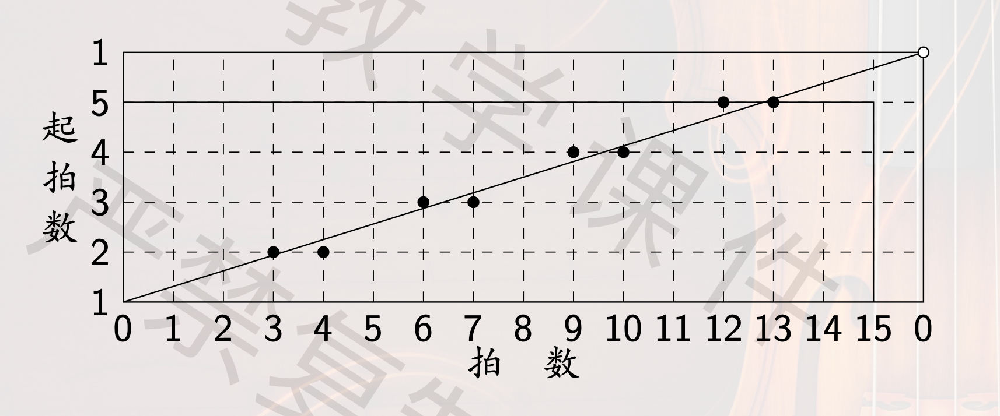

临时抱佛脚。

---

## 节拍与节奏

### 拍子 beat

> 基本律动

### 节拍 meter

> 若干拍子按照一定强弱规律组合成**节拍**

- **单拍子** 二拍子，三拍子
- **复拍子** 由**相同的**单拍子结合而成的

素数拍只能是单拍子

### 拍号 time signature

> 表示节拍

:::info 特别提醒
$\textbf{C}=\frac{\textbf{4}}{\textbf{4}}$
:::

### 节奏 rhythm

> 由音符的不同时值组合构成的模式

::: info 古巴颂乐

```
[..X.X...|X..X..X.] (2-3 形式)
or
[X..X..X.|..X.X...] (3-2 形式)
```

:::

#### 极大均衡原则 maximal evenness

> 将起拍尽可能均匀分布

16 拍节奏性包含 5 个起拍，平均间隔 $16/5 = 3.2$



第一个起拍位于第 0 拍，可以得到 $2^4 = 16$ 种

#### 相位 phase

> 同一节奏型选取不同起点形成不同相位

#### 节奏奇性 rythmic oddity

> 不包含对径的起拍对（起拍的对径点不是起拍）

古巴颂乐的节奏型具有节奏奇性

#### 距离序列

```
[X..X..X.|..X.X...]
[ 3  3   4   2  4 ] 距离序列
[ 0  +   -   +  - ] 轮廓 contour
```

#### 轮廓

`contour[i]` 表示 **下一个** 相对 **这一个** 是增加、相等还是减小

轮廓同构：B 的轮廓循环移位得到 A 的轮廓

#### 影子节奏

> 拍点位置在原节奏两个拍点中间

```
[X..X..X.|..X.X...]
[ 3  3   4   2  4 ][ 3  3   4  ... 距离序列
[ 0  +   -   +  - ]                轮廓
..[3  3.5  3   3 3.5][3  3.5  3... 影子节奏的距离序列
  [+   -   0   +  - ]              影子节奏的轮廓
```

古巴颂乐和它的影子节奏轮廓同构

## 音乐基础知识

- 声波是 **纵波**
- 振动频率决定音乐中的 **音高（pitch）**
- 振动幅度决定音乐中的 **力度（dynamics）**
  - 听到声音的 **响度（loudness）** 是由传入空气的 **压力** 决定的
- 声音持续时间长度对应音乐中的 **时值（duration）**
- 振动 **波形（waveform）** 决定音乐中的 **音色（timbre）**

**音乐会音高** 中央 C 上方 A 定义为 400Hz

### 声音的物理属性

#### 声压 - 力度

> 空气压力

#### 声压水平 - 分贝

人对声音强弱感觉不是线性的，用声压水平度量

$$
L_p = 20 \log_{10}{\frac{p}{p_0}}
$$

$p_0$ 是 1000Hz 听觉下限阈值 $20\mu Pa$，此时单位为分贝 dB

:::info
人对不同频率的声音有着不同的听觉下限阈值
:::

#### 波形面面观 - 振幅包络 envelope

**ADSR**

```plaintext
振幅
|
|------/\---------------- 极大振幅
|     /  \
|    /    \
|   /      ---------
|  /                \
| /                  \
|/                    \
|------------------------- 时间
|<  A  ><D><   S   ><R>
```

- **A**ttack 起音
- **D**ecay 衰减
- **S**ustain 持续
- **R**elease 释放

#### 频谱图

> 描述声音的各个频率成分随时间变化的图形

#### 泛音列

> 把声音的各个频率成分从低到高排列起来的序列

#### 傅立叶级数

两种视角

- 把一个振动（函数）描绘成随时间变化的图形，显示 **时域（time domain）** 上的特性
- 把该振动在不同频率上的振幅描绘出来，显示 **频域（frequency domain）** 上的特性

### 打击乐器 - 噪音

- **固定音高** 木琴、定音鼓
- **无固定音高** 小军鼓、大镲

### 乐音体系

> 音乐中所使用的、具有固定音高的全体乐音构成的集合

- **音级** 乐音体系中的元素
- **音列** 全体音级从低到高排列
- **半音**、**全音**
- **音名**
- **基本音级** C D E F G A B + **变音记号** → **变化音级**

::: warning 特别注意

#### 异名同音

**一个音级可以有不同的音名**，相同音高**不同音名**称为**等音（enharmonic）**
:::

#### 唱名

- 固定唱名法 fixed do
  - do = $\mathrm{C}$
  - re = $\mathrm{D}$
  - mi = $\mathrm{E}$
  - ...
- 首调唱名法 movable do
  - 按照 mi fa 和 si do 半音，其余全音规则排列

#### 记谱法

音符代表的时值是 **相对长度**，以四分音符为一拍，全音符的时值为 4 拍。

全休止符在上、二分休止符在下

- 高音谱号（$\mathrm{G}$ 谱号）
  - 大圆圈位于二线，指明中央 $\mathrm{C}$ 上方纯五度 $\mathrm{G_4}$ 的位置
- 中音谱号（$\mathrm{C}$ 谱号）
  - 中心位于三线，指明中央 $\mathrm{C}$，即 $\mathrm{C_4}$ 的位置
  - 若将中心置于四线，称之为次中音谱号
- 低音谱号（$\mathrm{F}$ 谱号）
  - 冒号中心位于四线，指明中央 $\mathrm{C}$ 下方纯五度 $\mathrm{F_4}$ 的位置

#### 谱表

> 记有谱号的五线谱

- 单谱表
- 联合谱表
  - 用 **连谱号** 联结起来的若干单谱表
  - **大谱表** = 高音谱表 + 低音谱表

### 音程

> 两个音级之间的距离
>
> 音程中高的音称为**上方音/冠音**，低的音称为**下方音/根音**

- 旋律音程
  - 两个音先后发声
- 和声音程
  - 两个音同时发声

音程的名称由 **度数** 和 **半音数** 共同决定

<table>
<tr>
  <th>度数</th>
  <th>半音数</th>
  <th>名称</th>
</tr>
<tr>
  <td>一</td>
  <td>0</td>
  <td>纯一度</td>
</tr>
<tr>
  <td rowspan="2">二</td>
  <td>1</td>
  <td>小二度</td>
</tr>
<tr>
  <td>2</td>
  <td>大二度</td>
</tr>
<tr>
  <td rowspan="2">三</td>
  <td>3</td>
  <td>小三度</td>
</tr>
<tr>
  <td>4</td>
  <td>大三度</td>
</tr>
<tr>
  <td rowspan="2">四</td>
  <td>5</td>
  <td>纯四度</td>
</tr>
<tr>
  <td>6</td>
  <td>增四度</td>
</tr>
<tr>
  <td rowspan="2">五</td>
  <td>6</td>
  <td>减五度</td>
</tr>
<tr>
  <td>7</td>
  <td>纯五度</td>
</tr>
<tr>
  <td rowspan="2">六</td>
  <td>8</td>
  <td>小六度</td>
</tr>
<tr>
  <td>9</td>
  <td>大六度</td>
</tr>
<tr>
  <td rowspan="2">七</td>
  <td>10</td>
  <td>小七度</td>
</tr>
<tr>
  <td>11</td>
  <td>大七度</td>
</tr>
<tr>
  <td>八</td>
  <td>12</td>
  <td>纯八度</td>
</tr>
</table>

:::warning 特别注意

- 基本音级上的四度不全是纯四度 F-B 是增四度
- 基本音级上的五度不全是纯五度 B-F' 是减五度

:::

```
        （二、三、六、七）
        大音程    小音程
减音程                    增音程
            纯音程
        （一、四、五、八）
```

### 协和音程与不协和音程

- 协和音程
  - 完全协和音程 纯四度、纯五度、纯八度
  - 不完全协和音程 大小三度、大小六度
- 不协和音程
  - 二度、七度、所有增减音程

#### 毕达哥拉斯理论

> 频率之比越简单，音程越和谐

- 纯五度 $3:2$
- 纯四度 $4:3$
- 大六度 $5:3$
- 大三度 $5:4$
- 小三度 $6:5$
- 小六度 $8:5$
- 小七度 $9:5$
- 大二度 $9:8$
- 大七度 $15:8$
- 小二度 $16:15$
- 增四度 $45:32$（三全音）

#### 拍音理论

频率 $\omega_1$ 和 $\omega_2$ 的两个声音叠加，拍音频率

$$
\delta = |\omega_1 - \omega_2 |
$$

不含拍音的为协和音程，含有拍音的为不协和音程

实际中，拍音频率小于 6 或者大于 120 的也算作协和音程，而 33 时最不协和

**缺陷**：相同音程在不同音区会发生变化

## 振动方程与泛音

### 一维振动方程

对弦上微元 $\Delta x$ 作牛顿第二定律分析可得

$$
\begin{gather}
  \frac{\partial^2u}{\partial t^2} = c^2 \frac{\partial^2u}{\partial x^2} \\
  u(0,t) = u(L,t) = 0, \forall t \ge 0 \\
\end{gather}
$$

其中 $c = \sqrt{\frac{T}{\rho}}$

$(2)$ 式为弦两端固定的边值条件

方程的完整解为

$$
\begin{aligned}
u(x,t) &= \sum_{n=1}^{\infty}u_n(x,t) \\
       &= \sum_{n=1}^{\infty}\left(a_n\cos\left(\frac{n \pi c}{L} t\right) + b_n \sin\left(\frac{n \pi}{L}x\right)\right) \\
       &= \sum_{n=1}^{\infty}\left(\sqrt{a_n^2+b_n^2}\sin\left(\omega_nt + \theta_n\right)\sin\left(\frac{n \pi}{L}x\right)\right)
\end{aligned}
$$

称 $u_n(x,t)$ 为弦振动的第 $n$ 个振动模态

$$
u_n(x,t) = \sqrt{a_n^2+b_n^2}\sin\left(\omega_nt + \theta_n\right)\sin\left(\frac{n \pi}{L}x\right)
$$

$$
\omega_n = \frac{n \pi c}{L}
$$

频率 $f_n$ 为 $u_n(x,t)$ 的振动频率

$$
\begin{aligned}
f_n = \frac{n}{2L}c &= \frac{n}{2L}\sqrt{\frac{T}{\rho}}, \space n = 1,2,3, \dots \\
f_1 &= \frac{1}{2L}\sqrt{\frac{T}{\rho}}
\end{aligned}
$$

#### 梅森定律

- 弦的固有频率
  - 振动频率组成的序列 $\left\{f_n\right\}$
- $f_1$ 称为**基频**，相应的声音称为**基音**
- $f_n\space(n>1)$ 对应的声音统称为**泛音**
- $f_2$ 对应**第一泛音**，$f_3$ 对应**第二泛音**...
- 泛音列
  - 记基频 $f_1 = f$，则固有频率序列为 $f, 2f, 3f, 4f, \dots$，这个序列称为泛音列

#### 波节与波腹

$$
u_n(x,t) = \sqrt{a_n^2+b_n^2}\sin\left(\omega_nt + \theta_n\right)\sin\left(\frac{n \pi}{L}x\right)
$$

振幅为

$$
\sqrt{a_n^2+b_n^2}\sin\left(\frac{n \pi}{L}x\right)
$$

令 $n\pi x/L = k\pi, \space k=1,2,3,\dots$，可解得波节 $x = kL/n$，类似可解波腹

### 拨弦

拨弦给定了振动方程的另外两个边值条件：初始形状和初始速度

初始形状可以表示为一个折线函数 $\phi(x)$，同时满足

$$
\phi(x) = u(x,0) = \sum_{n=1}^\infty a_n \sin\left(\frac{n \pi}{L}x \right)
$$

这是折线函数作奇延拓后的正弦展开

对初始速度方程 $\psi(x)$，满足

$$
\begin{aligned}
  \psi(x) &= \left. \frac{\partial u}{\partial t} \right|_{t=0} \\
          &= \sum_{n=1}^\infty b_n \frac{n \pi c}{L} \sin \left(\frac{n \pi}{L}x \right)
\end{aligned}
$$

**假定**松手时弦静止，即 $\psi(x) \equiv 0, \space \forall x \in \left[0, L \right]$，则 $b_n = 0$

#### 最终结果（在弦的中央拨弦）

$$
u(x,t) = \sum_{n=1}^\infty(-1)^k\frac{8}{(2k+1)^2\pi^2}\cos\left(\frac{(2k+1)\pi c}{L}t\right)\sin\left(\frac{(2k+1)\pi}{L}x\right)
$$

振动频率为 $(2k+1)c/2L$，为基频的奇数倍，即在固有频率中只出现 $f_1, f_3, f_5, \dots$

#### 几何解释

在 $L/2$ 处拨弦，弦的振动应当始终关于 $L/2$ 对称，只有基频奇数倍的频率的振动模态波形满足此条件

### 管乐器

管乐器空气柱振动的边值条件与弦振动不同

振动的空气柱会超过管的端口，需要进行**端口校正**

声速 $v$，频率 $f$，波长 $\lambda$，有关系式

$$
f = \frac{v}{\lambda}
$$

若**不计端口校正**，则管的开口位置总是处于振动的波腹，闭口位置只能处于波节，这给出了边值条件。通过这两个条件可以得到管长 $L$ 与波长 $\lambda$ 的关系

对于开管乐器，最长的波长 $\lambda_1$ 满足 $L = \lambda_1 / 2$，记 $f = f_1 = v/2L$ 为基频，则泛音列为

$$
f, 2f, 3f, 4f, \dots
$$

对于闭管乐器，最长的波长 $\lambda_1$ 满足 $L = \lambda_1 / 4$，记 $f = f_1 = v/4L$ 为基频，则泛音列为

$$
f, 3f, 5f, 7f, \dots
$$

即闭管只有**偶次**泛音

**超吹**：产生泛音列中第二个频率

- 长笛是开管乐器，超吹产生的是高八度的音 $2f$
- 单簧管是闭管乐器，超吹产生的是高十二度的音 $3f$

## 律学

### 三分损益

假设 $宫$ 的**弦长**为 $3^4 = 81$，从此开始，向上 $\times \frac43$（纯四度）得到 $徵 = 108$，从 $徵$ 向下 $\times \frac23$（纯五度） 得到 $商 = 72$，再向上得到 $羽 = 96$，再向下得到 $角 = 64$

线长与频率成反比，将 $徵 = 108$ 和 $羽 = 96$ 除以 2，得到高八度的两个音级（**数字表示弦长**）

| 徵  | 羽  | 宫  | 商  | 角  | 徵  | 羽  |
| :-: | :-: | :-: | :-: | :-: | :-: | :-: |
| 108 | 96  | 81  | 72  | 64  | 54  | 48  |

假定宫音对应中央 C，由此产生五声音阶

| 徵  | 羽  | 宫  | 商  | 角  | 徵  | 羽  |
| :-: | :-: | :-: | :-: | :-: | :-: | :-: |
|  G  |  A  |  C  |  D  |  E  |  G  |  A  |

**问题**：音程 **宫-角** 比例不是理想大三度的整数比 $5:4$，而是 $\frac{81}{64}$

从 $角 = 64$ 继续出发，向上得到 $变宫 = \frac{256}3 \approx 85$，向下得到 $变徵 = \frac{512}9 \approx 57$，形成七声音阶（古音阶）

通过三分损益不停作 $\times \frac43$ 和 $\times \frac23$ 可以得到十二律，得到的高八度音比清宫 C' 略高，形成 **旋宫不归** 问题

### 五度相生

假设音名 $\mathrm{C}$ 对应频率为 $1$，用纯五度 $3:2$ 作为生律元素，不停向上 $\times \frac32$，超出八度则多 $\times \frac12$ 将其降低八度，直到产生全部十二个音名

**问题**：音程 **C-E** 比例不是理想大三度的整数比 $5:4$，与 **宫-角** 相同。

#### 毕达哥拉斯音差

在得到 #E 后，继续向上构建应当得到与 C' 等音的 #B
但是在降低一个八度后，这个音的频率是

$$
\frac{3^{12}}{2^{19}} = \frac{531441}{524288} \approx 1.013643
$$

这个略大于 $1$ 的数便是 **毕达哥拉斯音差**

$$
\frac{3^{12}}{2^{19}} = \left(\frac32\right)^{12} \times \left(\frac12\right)^7
$$

即从 $\mathrm{C}$ 出发连续向上构建 $12$ 次纯五度（$7$ 个半音），然后降低 $7$ 个八度（$12$ 个半音），回到了比 $\mathrm{C}$ 略高的位置

### 音乐的类型

- 单声音乐
  - 单一曲调构成的音乐
  - 例如 没有伴奏的独唱、独奏、曲调作同度或八度重叠的齐唱、齐奏
- 多声部音乐
  - 复调音乐
    - 不同声部具有各自的相对独立性，按照 **对位法** 结合在一起
    - 例如 里切卡尔（Ricercar，无插部赋格）
  - 主调音乐
    - 以一个声部为主要旋律声部，其余声部相对缺少独立性，对主要旋律声部起伴奏、烘托作用

### 纯律

- $\mathrm{C} = 1$
- 纯八度 $2:1$
- 纯五度 $3:2$
- 纯四度 $4:3$
- 大三度 $5:4$

由此可以得到

- $\mathrm{C} = 1$
- $\mathrm{D} = ?$
- $\mathrm{E} = \frac54$
- $\mathrm{F} = \frac43$
- $\mathrm{G} = \frac32$
- $\mathrm{A} = \frac53$
- $\mathrm{B} = ?$
- $\mathrm{C'} = 2$

纯五度 $\mathrm{E}-\mathrm{B}$ 得到 $\mathrm{B}=\frac{15}8$，纯五度 $\mathrm{G}-\mathrm{D'}$ 得到 $\mathrm{D'}=\frac94$，进而 $\mathrm{D}=\frac98$

纯率中的正三和弦 $\mathrm{C}-\mathrm{E}-\mathrm{G}$，$\mathrm{F}-\mathrm{A}-\mathrm{C'}$，$\mathrm{G}-\mathrm{B}-\mathrm{D'}$ 都符合简单整数比 $4:5:6$

**问题**

- 五度音程 $\mathrm{D}-\mathrm{A}$ 不协和，比例 $\frac53:\frac98 = \frac{40}{27} = \frac{80}{54} \lt \frac{81}{54} = 3:2$
- 有两种不同的大二度（全音）：$\mathrm{C}-\mathrm{D}$，$\mathrm{F}-\mathrm{G}$，$\mathrm{A}-\mathrm{B}$ 为 $9/8$，而 $\mathrm{D}-\mathrm{E}$，$\mathrm{G}-\mathrm{A}$ 为 $10/9$
- 谐调音差
- 转调问题（是由于五度音程 $\mathrm{D}-\mathrm{A}$ 不协和引起的）

#### 谐调音差

从 $\mathrm{C}$ 出发升高 $4$ 个纯五度（$7 \times 4 = 28$），再降低 $2$ 个八度和 $1$ 个大三度（$12 \times 2 + 4 = 28$），得到

$$
\left(\frac32\right)^4 \times \left(\frac12\right)^2 \times \frac45 = \frac{81}{80}
$$

即回到比 $\mathrm{C}$ 略高的地方。数值 $81/80 = 1.0125$ 被称为 **谐调音差**

### 十二平均律

$$
\sqrt[12]{2} \approx 1.059\dots
$$

#### 音分

两个频率分别为 $f_1, \space f_2 \space \space (f_1 \lt f_2)$ 的声音之间的音分数等于

$$
1200log_2\left(\frac{f_2}{f_1}\right)
$$

**对于平均律**，半音之间差 $100$ 音分

各种换算...

**音乐会音高** $\mathrm{A} = 440\mathrm{Hz}$
