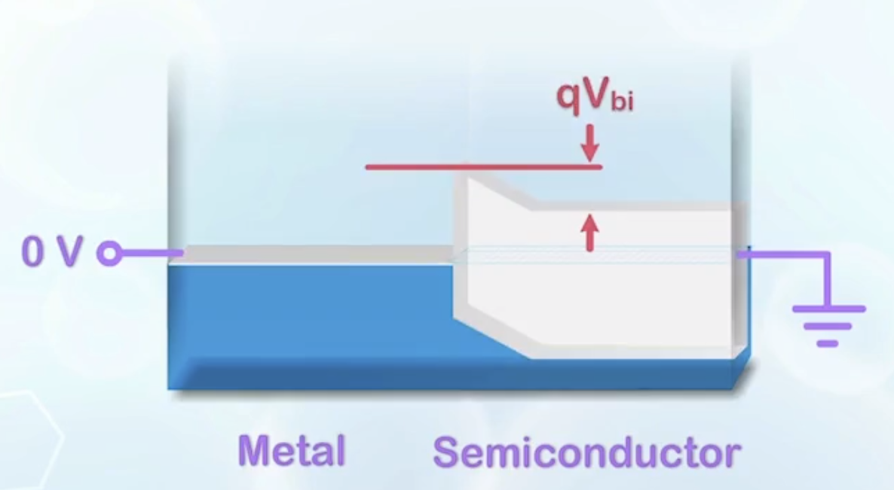
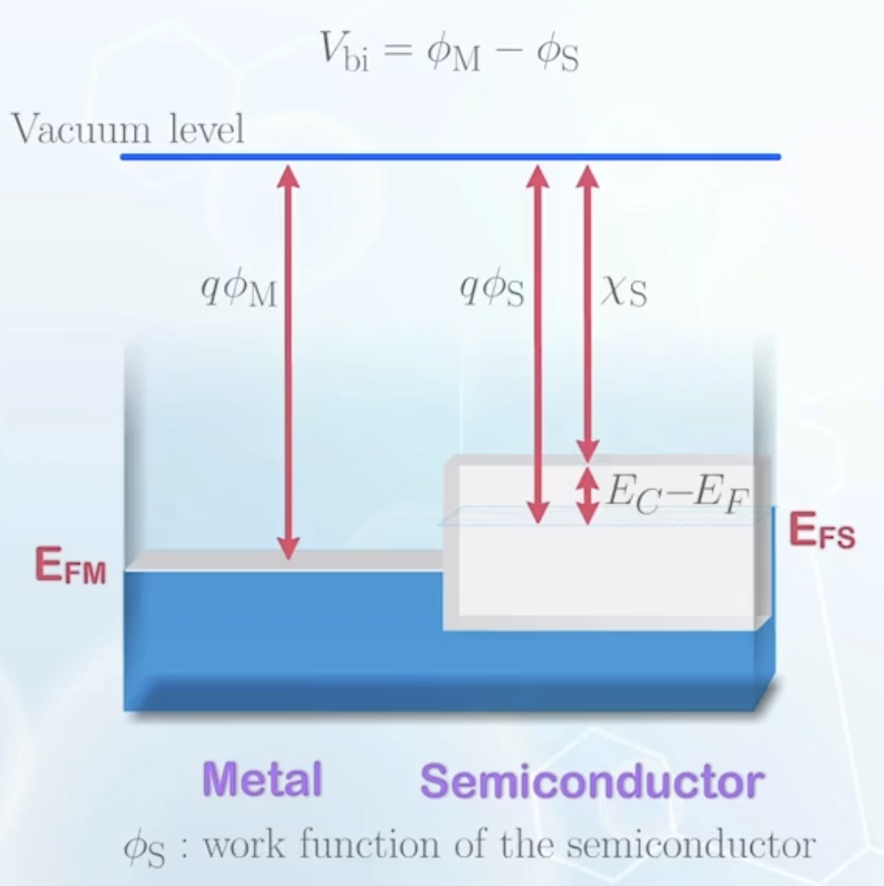
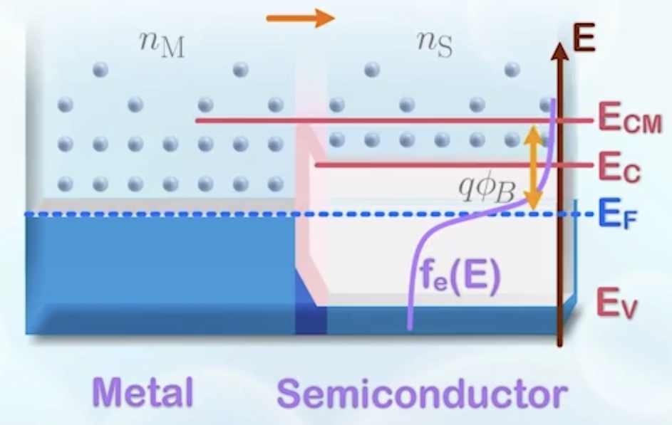
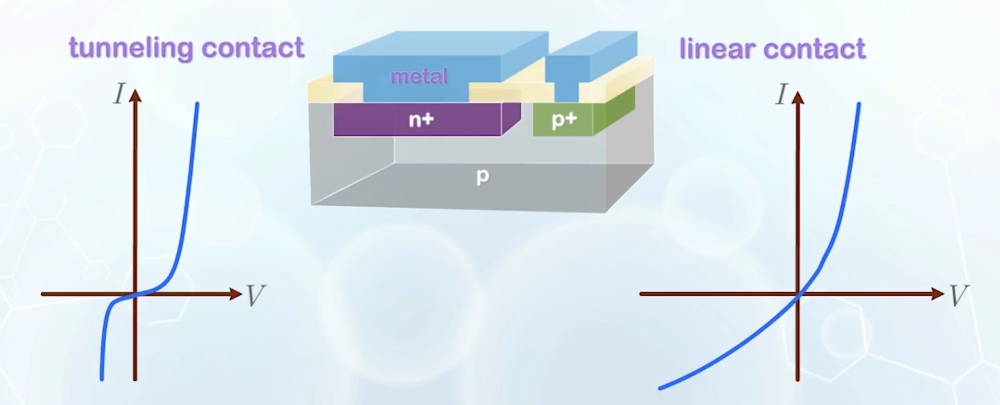

About work function, metal-semiconductor contacts (Schottky contacts and ohmic contacts), derivation of Schottky diode I-V characteristics, and comparison between Schottky diodes and PN junction diodes.

---

<style scoped>
.spin-group {
  display: inline-block;
  animation: spin 5s linear infinite;
}

.reversed {
  display: inline-block;
  transform: rotate(180deg);
}

@keyframes spin {
  from {
    transform: rotate(0deg);
  }
  to {
    transform: rotate(360deg);
  }
}
</style>

## Work Function of a Material

- When metal and semiconductor contacts, how to draw the band diagram for such a heterogeneous system, as the metal and semiconductor have very different band structures?
  - Bandgap of **semiconductor**: Valence band, bandgap, conduction band
  - Bandgap of **metal**: Partially filled band, electrons fill the states up to **Fermi level**
    - Normally represent the band diagram only by its Fermi level
    - States above Fermi level are mostly empty, states below Fermi level are mostly filled
  - Electron energy is related to the electronic potential which is relative, a **common reference** is needed to align the two systems in contact
    - Electrons moving in vacuum (free space) without any influence of any charged body are considered to have the same electronic potential, and defined as **zero** potential energy
    - When they are brought **closer** to a charged body (e.g., the nucleus of an atom), they lose electronic potential, and are considered to have **negative** potential energy
    - For metal, the Fermi level is the highest electronic potential energy with a high chance of finding an electron in a state
    - **Work-function $\boldsymbol{q\phi_\text{M}}$**: The required energy to bring an electron from the Fermi level of the metal to set it free
      - **$\boldsymbol{\phi_\text{M}}$**: the corresponding voltage of the metal work-function
      - A well-defined material property for a **metal**
    - **Vacuum (Energy) Level**: The energy level at which electrons are free from the attraction of the atom
    - For **semiconductor**, the work-function is not a fixed value, but depends on doping
      - **Electron Affinity $\boldsymbol{\chi}$**: The energy difference between the vacuum level and the conduction band edge
      - For silicon
        $$\chi_\text{Si} \approx 4.05 \, \text{eV}$$
      - Metal may be considered as a semiconductor with zero bandgap, thus the work-function or electron affinity carries similar meanings
        $$q\phi_\text{M} = \chi$$
  - When two materials are put together, the vacuum level is taken is the common reference to align the two materials
    - Electrons at vacuum level can move freely between the two materials without a sudden change in energy
    - At the interface, the two materials are fused together, with an abrupt change in the band structure
      - Most electrons at the metal are located below the Fermi level, they must gain enough energy to overcome the barrier at the interface before moving to the conduction band of the semiconductor
      - The barrier height is an important parameter to determine the properties of the metal-semiconductor contact
    - **Schottky barrier $\boldsymbol{q\phi_B}$**: The energy barrier formed at the metal-semiconductor interface
    - **Schottky diode**: A two terminal device that consists of a metal and a semiconductor, forming a Schottky barrier
      - An electron from the metal can enter the valence band of the semiconductor only if there are spaces (holes) available, equivalent to have a hole moving from the semiconductor to the metal
      - Holes moving from metal to the semiconductor must also overcome the barrier between the metal Fermi level and the semiconductor valence band edge

## Formation of a Schottky Contact

Case study - Assume the metal Fermi level is close to the middle of the N type silicon bandgap

```plaintext
           |
    E_CM --|------ E_C
           |------ E_FS
E_FM ------|
           |
           |----- E_V
           |
  Metal    | Semicond.
```

- $\boldsymbol{E_{CM}}$: The energy level at the conduction band edge of the semiconductor at the **metal interface**

<!-- new paragraph -->

- Under this condition, $E_{FS} > E_{FM}$, the semiconductor has a higher electron concentration at energy above $E_{CM}$
  - Electrons will flow from the semiconductor to the metal
  - Metal will absorb any amount of electrons from the semiconductor without changing its Fermi level
  - Moved electrons from the semiconductor leave behind positively charged ions, a **depletion region** is formed
  - Charge in the depletion region will attract carriers in the metal with opposite charge to accumulate at the surface to achieve charge neutrality
  - Once depletion region is formed, it is more difficult for electrons to move from semiconductor to metal
  - Finally, **thermal equilibrium** is achieved with a fixed depletion width
- At thermal equilibrium, the system is subject to external potential, like connecting a battery with $0 \, \text{V}$ at the two ends of the Schottky diode
  - The Fermi level must align with external voltage
  - $qV_\text{bi}$ is formed to balance out the tendency of electron flow from the semiconductor to the metal
  - Similar to a P+/N junction, except that the P+ region is formed by a material with almost zero bandgap and a very large number of carriers
    

## Band Diagram of a Schottky Contact at Thermal Equilibrium

- To find out the **built-in potential $\boldsymbol{V_\text{bi}}$** and the **depletion region width**
  - Built-in potential is equal to the difference in Fermi levels

    $$
      qV_\text{bi} = E_{FS} - E_{FM}
    $$
    - When locating the Fermi levels, we cannot make reference to the conduction band or the valence band, unlike a PN junction
    - Taking the **vacuum level** as the common reference
      
      $$
        \begin{aligned}
          qV_\text{bi} &= q\phi_\text{M} - q\phi_\text{S} \\
          &= q\phi_\text{M} - (\chi_\text{S} + (E_C - E_F)) \\
          &= q\phi_\text{M} - (\chi_\text{S} + \frac{E_G}{2} - (E_F - E_i)) \\
        \end{aligned}
      $$
      For silicon
      $$
      \phi_\text{S} = 4.08 \, \text{V} + 0.55 \, \text{V} - \frac{kT}{q} \ln{\frac{N_D}{n_i}}
      $$
      Thus
      $$
      V_\text{bi} = \phi_\text{M} - 4.63 \, \text{V} + \frac{kT}{q} \ln{\frac{N_D}{n_i}}
      $$

  - To calculate the depletion region width
    - Similar to a PN junction, but on the metal side, the charge is given by a $\delta$ function, representing crowding of carriers at the surface
    - Or, the metal side can be treated as a super doped P type silicon, with infinite carrier supply and infinitely small depletion region width
    - Using the same method as PN junction, we have
      $$
      x_n = \sqrt{\frac{2\varepsilon_\text{Si} V_\text{bi}}{q N_D}}
      $$
      It is the same as PN junction, with the P side depletion width assumed to be zero

## Carrier Motion of a Schottky Contact at Thermal Equilibrium

- On the metal side, the current conduction takes place in **one single energy band**, and we count either electrons **or** holes, and resistance for both is very small
- On the semiconductor side, current conduction takes place in **both conduction band and valence band**
  - Assume the semiconductor is N type
  - Hole concentration in the valence band is very small, therefore the hole resistance is very large, unfavorable for hole current conduction
  - Electron concentration in the conduction band is relatively large, except for a small region near the junction
  - The current conduction is mainly through electrons (or **majority** carriers of the semiconductor)
    - Metal-semiconductor contact is usually referred to as a **majority carrier device/unipolar device**, as current conduction is only contributed by either electrons **or** holes, but not both
- By replacing the P side of a PN junction with a metal, it removes the high resistance region in the conduction band for electrons
  - Once the carriers gain enough energy to overcome the potential barrier, they can be easily on the metal side
  - Encourages smoother current flow, but makes calculation more difficult
    - In a PN junction, we rely on the diffusion in the high resistance region that limits the carrier motion to count the carriers
    - Without the high resistance region, calculation will become more complex as there are lots of carriers moving very fast at all locations in the conduction band
    - We cannot find a very obvious mechanism that controls the current flow
    - We have to calculate the current with some **probabilistic** methods
- To calculate the current
  - Assume the electrons are moving at some thermal velocity $v_\text{th}$, and we only consider the lateral component of the velocity $v_{\text{th}x}$
  - Assume the depletion region width is small and can be ignored, or the neutral region is directly connected to the metal
  - Electrons above energy level $E_{CM}$ are free to move in any directions
    - Consider electrons on the metal side near the interface with energy above $E_{CM}$
    - Assume half of them are moving towards the semiconductor, and half of them are moving away from the semiconductor
      - **$\boldsymbol{n_\text{M}}$**: the number of electrons above $E_{CM}$ on the metal side
      - **Current flow from the metal side to the semiconductor side**
        $$
        I_\text{M} = -q A (\frac{n_\text{M}}{2}) v_{\text{th}x}
        $$
    - Similarly, for electrons on the semiconductor side near the interface with energy above $E_{CM}$
      - **$\boldsymbol{n_\text{S}}$**: the number of electrons above $E_{CM}$ on the semiconductor side
      - **Current flow from the semiconductor side to the metal side**
        $$
        I_\text{S} = q A (\frac{n_\text{S}}{2}) v_{\text{th}x}
        $$
    - The total current
      $$
      \begin{aligned}
        I_\text{MS} &= I_\text{M} + I_\text{S} \\
        &= q A \frac{n_\text{S} - n_\text{M}}{2} v_{\text{th}x} \\
      \end{aligned}
      $$
  - At thermal equilibrium
    $$
    \begin{aligned}
      I_\text{MS} &= 0 \\
      n_\text{S0} &= n_\text{M0} \\
      n_\text{S0} &= N_C e^{-\frac{q\phi_B}{kT}} \\
      &= n_\text{M0}
    \end{aligned}
    $$
    where $\phi_B$ is the Schottky barrier height
    

## Schottky Diode Current-Voltage Characteristics

- Under reverse bias
  - On the metal side, the Fermi level is raised, but $n_\text{M}$ remains unchanged, because the barrier height $\phi_B$ is not affected by the bias
  - On the semiconductor side, $n_\text{S}$ decreases as $E_{CM}$ is moved further away from the Fermi level
    $$
    n_\text{S} = n_\text{S0} e^{\frac{q V_A}{kT}} < n_\text{S0} \quad (V_A < 0)
    $$
  - The total current
    $$
    \begin{aligned}
      I_\text{MS} &= I_\text{M} + I_\text{S} \\
      &= \frac{1}{2} q A v_{\text{th}x} (n_\text{S} - n_\text{M}) \\
      &= \frac{1}{2} q A v_{\text{th}x} n_\text{S0} \left(e^{\frac{q V_A}{kT}}- 1 \right) \\
      &= \frac{1}{2} q A v_{\text{th}x} N_C e^{-\frac{q \phi_B}{kT}} \left(e^{\frac{q V_A}{kT}}- 1 \right) \\
      &= K T^2 e^{-\frac{q \phi_B}{kT}} \left(e^{\frac{q V_A}{kT}}- 1 \right) \\
    \end{aligned}
    $$
    where
    $$
    K T^2 = \frac{1}{2} q A v_{\text{th}x} N_C
    $$
    - The temperature dependence comes from both $N_C$ and $v_{\text{th}x}$
    - $K$ is the Richardson constant. For silicon
      $$
      K \approx 120 \, \text{A} \cdot \text{cm}^{-2} \cdot \text{K}^{-2}
      $$
  - Grouping all the bias independent terms, we have
    $$
    I_\text{MS} = I_0 \left(e^{\frac{q V_A}{kT}}- 1 \right)
    $$
    which is similar to the PN junction diode equation, except that $I_0$ is not dependent on the doping concentration, but the Schottky barrier height
    $$
    \begin{aligned}
      I_0 &= K T^2 e^{-\frac{q \phi_B}{kT}} \\
      &= \frac{1}{2} q A v_{\text{th}x} N_C e^{-\frac{q \phi_B}{kT}}
    \end{aligned}
    $$
  - When the reverse bias further increases, the Schottky diode may enter the **breakdown region**
    - It is easier for electrons to tunnel through the bandgap in the depletion region as the Schottky diode only consists of half of the depletion region of a PN junction
    - The breakdown voltage of a Schottky diode is usually **lower** than that of a PN junction diode, and the breakdown mechanism is usually **Zener breakdown**
- Under forward bias, the analysis is similar
  - The built-in potential is reduced, but the Schottky barrier height remains unchanged
  - $E_{CM}$ is moved closer to the Fermi level on the semiconductor side, thus increasing $n_\text{S}$
  - The current
    $$
    \begin{aligned}
    n_\text{M} &= n_\text{M0} = n_\text{S0} \\
    n_\text{S} &= n_\text{S0} e^{\frac{q V_A}{kT}} > n_\text{S0} \quad (V_A > 0) \\
    I_\text{MS} &= I_\text{M} + I_\text{S} \\
    &= \frac{1}{2} q A v_{\text{th}x} (n_\text{S} - n_\text{M}) \\
    &= \frac{1}{2} q A v_{\text{th}x} n_\text{S0} \left(e^{\frac{q V_A}{kT}}- 1 \right) \\
    &= \frac{1}{2} q A v_{\text{th}x} N_C e^{-\frac{q \phi_B}{kT}} \left(e^{\frac{q V_A}{kT}}- 1 \right) \\
    &= K T^2 e^{-\frac{q \phi_B}{kT}} \left(e^{\frac{q V_A}{kT}}- 1 \right) \\
    &= I_0 \left(e^{\frac{q V_A}{kT}}- 1 \right)
    \end{aligned}
    $$
    is exactly the same as the reverse bias case, and very similar to the PN junction diode equation, except for the expression of pre-exponential term $I_0$

## <span class="spin-group">Schottky v.s.<span class="reversed">PN Junction Diode</span></span>

There are some significant differences in performance between Schottky diodes and PN junction diodes

- In a PN junction, the turn-on and turn-off requires the increase or decrease of carriers in the neutral region, represented by the diffusion capacitance $C_\text{diff}$
- In a Schottky diode, the electrons moving from the semiconductor to the metal are simply absorbed, without the need of storage of carriers
  - $C_\text{diff}$ is eliminated
  - **Very fast turn-on/turn-off**
- The built-in potential of Schottky diodes is usually lower than that of PN junction diodes, as it only consists of half of the PN junction depletion region
- Metal can absorb any amount of electrons
  - **No high-level injection** is observed in a Schottky diode
- Schottky diodes in general has lower series resistance, as metal is used as one of the terminals
- The common turn-on voltage for silicon Schottky diodes is around $0.3 \, \text{V}$, **lower** than the $0.7 \, \text{V}$ of silicon PN junction diodes
  - More suitable for **very high-speed circuits**
  - Also used when **a lower turn-on voltage is desired**, such as the clamping device in a bipolar junction transistor
- **However**, the low breakdown voltage makes Schottky diodes unsuitable for rectifier circuits to block high voltage input sources

## Ohmic Metal Semiconductor Contacts

Schottky contacts only allow current flow in one direction, which may be a problem when using metal to connect different devices

- **Ohmic contact**: A metal-semiconductor contact that allows current to flow in both directions
- To allow bi-directional current flow, we want to increase the reverse current, making the characteristics more symmetrical about the origin of zero applied voltage
- Two different methods
  1. **Linear ohmic contact**: Allows electrons to move freely across the barrier and significantly increase the reverse current
     - Metal with Fermi level close to the **conduction band** edge of an **N type** semiconductor
     - Metal with Fermi level close to the **valence band** edge of a **P type** semiconductor
     - **Limitations**: Using a single metal, we can only make ohmic contact to either N type or P type semiconductor, but not both, as the metal having a small barrier to the conduction band will have a large barrier to the valence band, and vice versa
  2. **Tunneling contact**: Lowering the breakdown voltage to a very small value, by doping the semiconductor very heavily. At the same time, the metal Fermi level should be very close to the **valence band edge of an N type** semiconductor, or the **conduction band edge of a P type** semiconductor
     - Causes a very large built-in potential
     - The depletion region width is extremely small due to heavy doping
     - Electrons can easily tunnel through the very thin barrier even under a small reverse bias
     - **Less linear** than the linear contact
- With both linear and tunneling contacts, **a single metal** can be used to form ohmic contact to **both N type and P type** semiconductors
  - Using metal with work-function close to the valence band edge of the semiconductor
    - Forms linear ohmic contact with a P type semiconductor
    - Forms tunneling contact with a heavily doped N type semiconductor
  - To ensure ohmic contact, the semiconductor to be placed in contact with the metal is usually doped heavily, for both tunneling and reduction of resistance
    

The internal built-in potential of a PN junction will be balanced out by the band bending at the metal-semiconductor contacts, thus the built-in potential cannot be measured.
