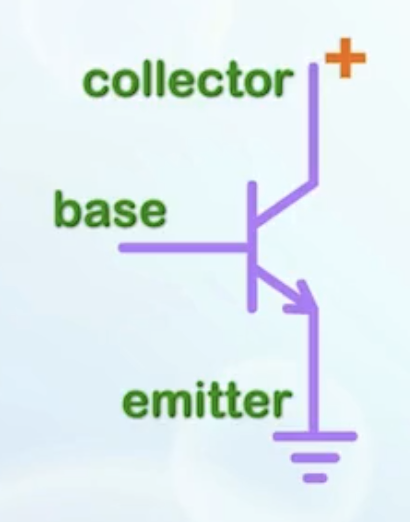
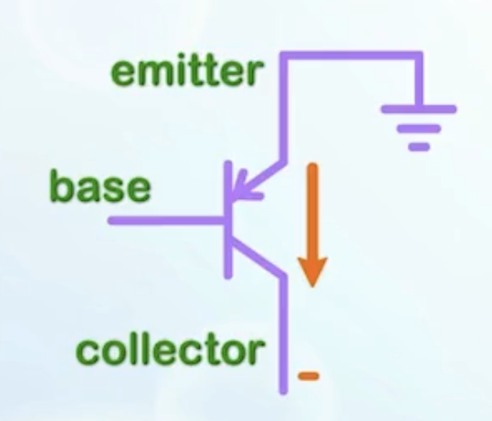
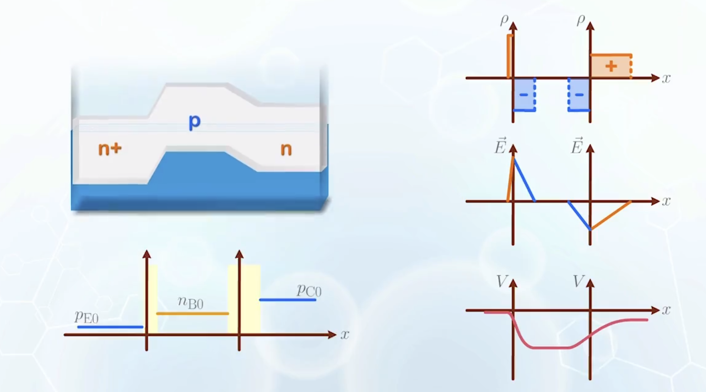
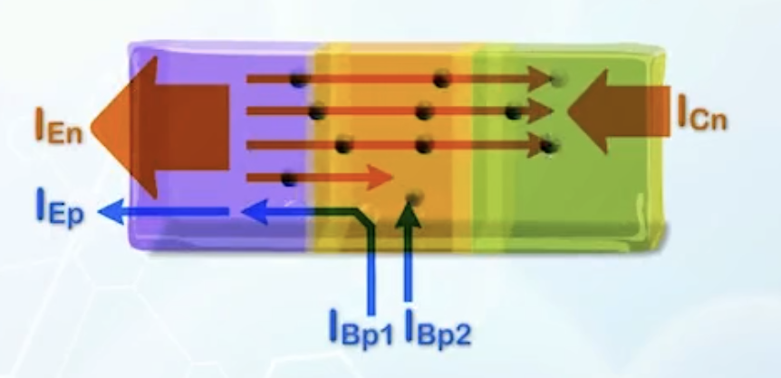
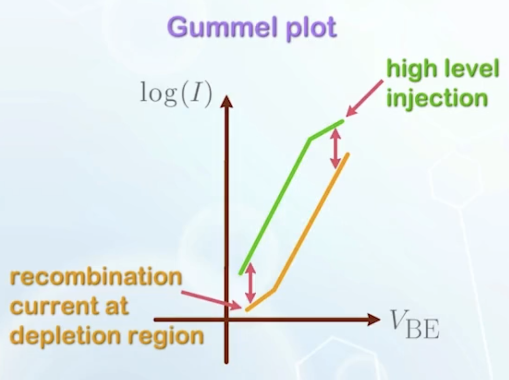

About the formation of bipolar junction transistors (BJT), their operation principles, and discussions on current components, current-voltage characteristics, and design considerations in the forward active mode.

---

## Formation of the Bipolar Junction Transistor (BJT)

The most important elements in modern circuits are switches and amplifiers, both of which can be constructed by extending the fundamental PN junction structure.

- Adding another N region on the other side of a P region, we have two N regions separated by a P region, with a lot of free moving electrons separated by the P region
  - When the barrier is lowered by applying **positive voltage** to the P region, electrons able to move across the barrier increases exponentially
  - Forms a three terminal device with electron flow between the two outer terminals controlled by the middle terminal
  - This is a **bipolar junction transistor (BJT)**, specifically an NPN transistor
  - **Base(B)**: the middle P region
  - Different voltages are usually applied to the two N regions
    - **Emitter(E)**: the N region from where the carriers enter the base
    - **Collector\(C\)**: the N region receiving the carriers from the base
    - The emitter differs from the collector by **having a much heavier doping**
      
  - Similarly, a PNP transistor can be formed by adding a N region between two P regions
    
  - In both symbols, the arrow indicates the direction of the current flow between the **base** and the **emitter**
  - :::info From now on...
    We will be using NPN transistors for the following analysis, unless otherwise specified.
    :::

The emitter is usually the most heavily doped region, while the collector is the most lightly doped region.

## Basic Operation Principles in the Forward Active Mode

Different voltages are applied to the three terminals to operate a BJT. The voltages can forward bias or reverse bias the PN junctions. Four possible operation modes are possible, as there are two PN junctions.

| Base-Emitter Junction | Base-Collector Junction | Operation Mode |
| :-------------------: | :---------------------: | :------------: |
|    Forward Biased     |     Reverse Biased      | Forward Active |
|    Reverse Biased     |     Forward Biased      | Reverse Active |
|    Forward Biased     |     Forward Biased      |   Saturation   |
|    Reverse Biased     |     Reverse Biased      |     Cutoff     |

The case with the base-emitter junction forward biased, and the base-collector junction reverse biased, is the most important operation mode, called the **forward active operation region**. It is the most common way to connect a BJT in a circuit.

- In forward active mode
  - Apply a positive voltage to the base and collector, taking the emitter as the reference ground
  - Apply a more positive voltage to the collector to reverse bias the base-collector junction
  - The amount the electrons that can flow from the emitter to the collector is controlled by the base-emitter voltage [as described earlier](#formation-of-the-bipolar-junction-transistor-bjt)
  - The minority carrier concentrations
    - The base-emitter junction is forward biased, so the number of carriers on the two sides of the base-emitter depletion region increases
    - The base-collector junction is reverse biased, so the number of carriers on the two sides of the base-collector depletion region decreases
    - In a properly designed BJT, the base width is usually **very small**, we have to use the **short-diode** carrier distribution in the neutral region of the base, drawing a straight line
  - Ideally, when a positive voltage is applied to forward bias the base-emitter junction, all the electron current from the emitter should flow to the collector without leaking to the base
    - This is not possible, as the base contact forms part of the PN junction terminal, and some current always flows to the base when a forward bias voltage is applied to it
    - Both base current and the collector current comes from the emitter, we want to **maximize** the collector current and **minimize** the base current
      - Based on the geometry, it can be achieved by making the base contact small, making the collector contact large
      - By putting the base contact sideways, the momentum of the electrons also favor electron motion to the collector region
      - By isolating the **collector** voltage, so that it will not affect the voltage at the base
        - The reverse biased collector to base contact serves this purpose, as any voltage applied to the collector will be dropped across the base to collector depletion region without changing the base voltage
    - The collector will passively receive electrons reaching it, and sweep them away with the electric field in the base to collector depletion region
  - In terms of current, the BJT can also be used as an amplifier as a small base current can lead to a large collector current

## Current Components in the Forward Active Mode

- The entire operation of the BJT is governed by the base-emitter junction
  - At the emitter
    - $I_{\text{E}p}$: the hole current due to diffusion at the emitter, where $_\text{E}$ for emitter, and $_{p}$ for holes
    - $I_{\text{E}n}$: the majority carrier electron current at the emitter that supplies electrons moving to the base, where $_{n}$ for electrons
  - In the base region
    - $I_{\text{B}p1}$: the majority carrier hole current that supplies the emitter hole current $I_{\text{E}p}$
      - $I_{\text{B}p1}$ and $I_{\text{E}p}$ are the same current that are named differently at different locations
  - In the collector region
    - $I_{\text{C}n}$: most electrons entering the base from the emitter will enter the collector
  - A small amount of electrons will recombine with holes in the base region, causing an extra hole current to enter the base to replenish the recombined holes, marked as $I_{\text{B}p2}$
  - There is another reverse bias current between the collector and the base, but it is very small and will be ignored
  - 
- With current components identified, we can define some performance related parameters
  - **Emitter injection efficiency $\boldsymbol{\gamma}$**: measures the ratio of the useful portion of the total emitter current
    $$
    \gamma = \frac{\text{useful emitter current}}{\text{total emitter current}}
    $$
    - Among the emitter current, $I_\text{En}$ is the useful portion that contributes to the collector current, while $I_{\text{E}p}$ is just part of the leakage current $I_{\text{B}p1}$ to the base
    - Therefore,
      $$
      \gamma = \frac{I_{\text{E}n}}{I_{\text{E}n} + I_{\text{E}p}}
      $$
      Ideally, $\gamma$ is 1, and typically achievable value is 0.999
  - **Base transport factor $\boldsymbol{\alpha_T}$**: measures the portion of electrons injected from the emitter that reaches the collector
    - In reality, some electrons will recombine with holes at the base, forming $I_{\text{B}p2}$ and leak away instead of reaching the collector
      $$
      \alpha_T = \frac{I_{\text{C}n}}{I_{\text{E}n}}
      $$
    - Ideally, $\alpha_T$ is 1, and typically achievable value is 0.99
  - **Common-base current gain $\boldsymbol{\alpha}$**: measures the ratio between the collector current and the emitter current with the base voltage referenced to be the ground
    - It is given by
      $$
        \alpha = \frac{I_\text{C}}{I_\text{E}} = \frac{I_{\text{C}n}}{I_{\text{E}n} + I_{\text{E}p}} = \gamma \alpha_T
      $$
    - Ideally, $\alpha$ is 1, meaning all emitter current becomes collector current without leakage to the base. Its typically achievable value is 0.99, mainly limited by $\alpha_T$
  - **Common-emitter current gain $\boldsymbol{\beta}$**: measures the ratio between the collector current and the base current
    - It is given by
      $$
      \beta = \frac{I_\text{C}}{I_\text{B}} = \frac{I_{\text{C}n}}{I_{\text{B}p1} + I_{\text{B}p2}} = \frac{\alpha}{1 - \alpha}
      $$
    - Ideally, $\beta = \infty$. Typically, it is around 100 to 200

## Current-Voltage Characteristics in the Forward Active Mode

The emitter is usually used as the ground reference. The change in the collector current and the base current can be derived as a function of the collector and the base voltages.

- For $V_\text{BE}$, the current flowing through the base-emitter junction is just the PN junction diode current
  $$
  I_\text{E} = I_{\text{E}0} \left(e^{\frac{qV_\text{BE}}{kT}} - 1 \right)
  $$
- The collector current and the base current are just the partition of the emitter current
  $$
  \begin{aligned}
    I_\text{C} &= \alpha I_\text{E} = \alpha I_{\text{E}0} \left(e^{\frac{qV_\text{BE}}{kT}} - 1 \right) \\
    I_\text{B} &= (1 - \alpha) I_\text{E} = (1 - \alpha) I_{\text{E}0} \left(e^{\frac{qV_\text{BE}}{kT}} - 1 \right) \\
    \frac{I_\text{C}}{I_\text{B}} &= \frac{\alpha}{(1 - \alpha)} = \beta
  \end{aligned}
  $$
  - Both currents have an exponential dependence on the base-emitter voltage $V_\text{BE}$
  - Plotting the current in log scale, we obtain the Gummel plot
    - The vertical distance between the two lines indicates the current gain $\beta$, which is constant over a wide range of the curves
    - At very small $V_\text{BE}$, recombination current in the depletion region becomes dominant, affecting the base current first as it is smaller
    - At very large $V_\text{BE}$, high-level injection effects takes place, leading to a slower increase in the collector current
    - These two effects lead to a reduction in $\beta$ at both ends of the voltage range
      
    - Using $V_\text{BE}$ as the independent variable, the range of operation is very small and limited to $V_\text{bi}$
    - In analog circuits, we often need to fix some biasing value so that the transistor will be operating in a known condition
    - If we fix $V_\text{BE}$ to provide the operation condition of a BJT, a small noise can cause a large fluctuation in the current due to the exponential relationship
    - Thus the **current** of a BJT is usually fixed by a known current source
    - Plotting $\beta$ as a function of $\log{I_\text{C}}$, it will be a constant over many orders of magnitude of the collector current
- For $V_\text{CE}$, as the collector voltage is isolated from the base-emitter junction, it has no effect on the collector current
  - The collector current is constant versus $V_\text{CE}$ except at very small $V_\text{CE}$, where the base-collector junction may no longer be reverse biased
  - The collector current will only change when the base current or $V_\text{BE}$ is changed
  - The change in the collector current is proportional to the base current, with $\beta$ as the multiplier. But if $V_\text{CE}$ is used to change the current, the spacing of the current will be very non-uniform

## Emitter and Base Design of the BJT

The basic criteria of a BJT are simply maximizing the collector current while minimizing the base current for a given emitter current. For an ideal switch, $I_{\text{B}p1}$ and $I_{\text{B}p2}$ should be zero. This is equivalent to maximizing the emitter injection efficiency $\gamma$ and the base transport factor $\alpha_T$.

- For $\gamma$
  $$
  \gamma = \frac{I_{\text{E}n}}{I_{\text{E}n} + I_{\text{E}p}} = \frac{1}{1 + \frac{I_{\text{E}p}}{I_{\text{E}n}}}
  $$
  - To maximize $\gamma$, we need to minimize the ratio $\frac{I_{\text{E}p}}{I_{\text{E}n}}$
  - $I_{\text{E}n}$ and $I_{\text{E}p}$ are just electron and hole current of the PN junction
    $$
      \frac{I_{\text{E}p}}{I_{\text{E}n}} = \frac{D_{\text{E}p} p_{n0} L_n}{D_{\text{B}n} n_{p0} L_p}
    $$
    - Replace the diffusion length with the length of the emitter and the base, as the emitter and base regions of a BJT are usually short
    - Substitute $p_{n0}$ and $n_{p0}$
    - Finally we have
      $$
        \frac{I_{\text{E}p}}{I_{\text{E}n}} = \frac{D_{\text{E}p} N_{\text{B}A} W_\text{B}}{D_{\text{B}n} N_{\text{E}D} W_\text{E}}
      $$
    - Among all the components, the one with the largest tuning range is the doping concentrations
    - To minimize $\frac{I_{\text{E}p}}{I_{\text{E}n}}$, the emitter doping can be designed to be three or more orders of magnitude larger than the base doping
      $$
      1000 N_{\text{B}A} < N_{\text{E}D} \Rightarrow \gamma \approx 0.999
      $$
  - For $\alpha_T$
    $$
    \alpha_T = \frac{I_{\text{C}n}}{I_{\text{E}n}} = 1 - \frac{I_{\text{B}p2}}{I_{\text{E}n}}
    $$
    - $I_{\text{E}n}$ is the PN junction diffusion current, given by the slope of the electron distribution in the base region
      - Assuming $n_\text{BC} \ll n_\text{BE}$
        $$
        I_{\text{E}n} \approx q D_{\text{B}n} \frac{n_\text{BE}}{x_\text{B}}
        $$
        where $n_\text{BE}$ is the electron concentration of the base near the edge of the depletion region of the base-emitter diode, and $x_\text{B}$ is the width of neutral region at the base
      - We can substitute $x_\text{B}$ with $W_\text{B}$ when the depletion region is small compared with the base width
    - To calculate $I_{\text{B}p2}$
      - **Base recombination lifetime $\boldsymbol{\tau_\text{B}}$**: the average time a carrier will stay in the base region before recombining
      - The combination current is given by
        $$
        \begin{aligned}
          I_{\text{B}p2} &= q \times (\text{number of carriers recombined per second}) \\
          &= q \times \frac{\text{number of carriers}}{\tau_\text{B}} \\
          &\approx q \frac{n_\text{B}}{\tau_\text{B}} \\
          &\approx q \frac{n_\text{BE} W_\text{B}}{2\tau_\text{B}} \quad \text{(number of carriers given by area under the line)}
        \end{aligned}
        $$
    - Putting everything together, we have
      $$
      \alpha_T = 1 - \frac{W_\text{B}^2}{2 D_{\text{B}n} \tau_\text{B}}
      $$
    - All terms are difficult to adjust except for $W_\text{B}$, therefore the most effective way to maximize $\alpha_T$ is to make the base width small
    - Crystal quality in the base region should be good enough to minimize carrier recombination, increasing $\tau_\text{B}$
    - Typically $\alpha_T$ is only about 0.99, making it more critical than $\gamma$ to achieve a high transistor gain
  - With $\gamma \sim 0.999$, and $\alpha_T \sim 0.99$, we have $\alpha \sim 0.99$ and $\beta \sim 100$
