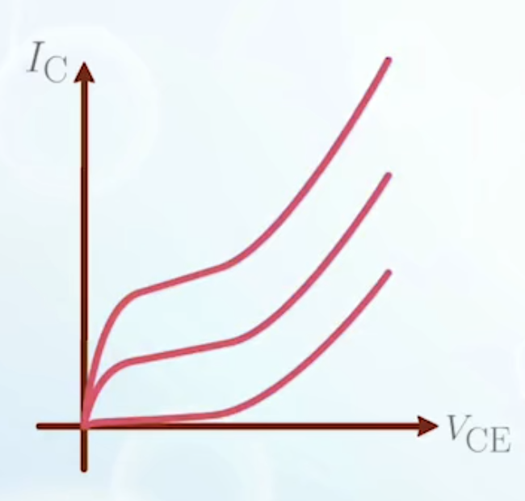
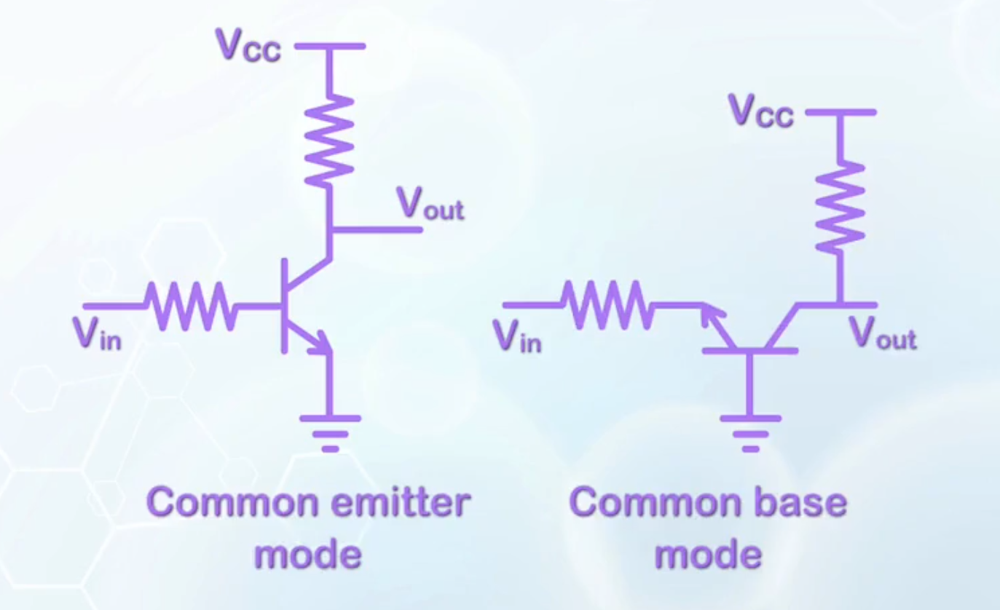

About the other three operation modes of BJT, and some non-ideal effects, including the Early effect, base punchthrough, and breakdown.

---

## Reverse Active/Cutoff/Saturation Modes

- **Reverse active mode**: when the base-emitter junction is reverse biased and the base-collector junction is forward biased, electrons are injected from the collector to the base, then to the emitter. Operation is similar to forward active mode
  - The BJT still functions as a switch, which is controlled by the base-collector voltage
  - But the doping is not optimized for this mode, electron injection from the collector to the base has to be accomplished by a large hole current from the base to the collector
  - $\gamma$ is very small and $\beta$ is usually less than 1
  - Like using a large amount of running water to control the water flow in a small pipe
- **Cutoff mode**: when both the base-emitter junction and the base-collector junction are reverse biased, no current can flow through the junction. The connection between any two terminals of the BJT can be considered as open circuit
- **Saturation mode**: when both the base-emitter junction and the base-collector junction are forward biased, both emitter and collector inject electrons into the base
  - The minority carrier concentration in the base represents the superposition of the forward active and the reverse active cases, and its slope indicates the net current flow
  - We can calculate the carrier concentrations at the edges of the depletion regions of the base near the emitter and collector as:
    $$
    \begin{aligned}
      n_\text{BE} &= n_{\text{B}0} e^{\frac{q V_\text{BE}}{kT}} \\
      n_\text{BC} &= n_{\text{B}0} e^{\frac{q V_\text{BC}}{kT}}
    \end{aligned}
    $$
  - If $V_\text{C} = V_\text{E}$, then $n_\text{BC} = n_\text{BE}$, the electron injections from the two sides balance out, no current flow through the device
    - Excess electrons at the base will recombine with holes, resulting a base hole current $I_{\text{B}p2}$
    - The base hole current will flow to both the emitter and collector, given by the slope of the minority carrier concentration at the emitter and the collector
    - The currents are mainly hole currents from the base to both the emitter and collector
    - When $n_\text{BE} \neq n_\text{BC}$, a net electron current flow will be observed in addition to the hole current from the base

## Current-Voltage Characteristics in the Saturation Mode

- From the forward active mode, we decrease $V_\text{CE}$ until it reaches the same as the base voltage, entering the saturation mode
- Further reduction of $V_\text{CE}$ will cause electrons to be injected from the collector to the base, balancing out some of the electron injection from the emitter to the base, leading to a decrease in the collector current $I_\text{C}$
- The hole current from the base to the collector increases, and contributes to a negative collector current that subtracts from the original collector current
- The collector current in the $I_\text{C}-V_\text{CE}$ curve is expected to drop when $V_\text{CE}$ is reduced below $V_\text{BE}$
- From the device perspective, the boundary between the forward active mode and the saturation mode is the point where $V_\text{CE} = V_\text{BE}$, which is called the saturation voltage $V_\text{CEsat}$
- Measurement results show that $I_\text{C}$ stays more or less constant after entering the saturation mode, until a much lower value than $V_\text{BE}$
  - Because carrier injection follows exponential scale instead of linear scale
  - For example
    $$
    \begin{aligned}
      V_\text{BE} &= 0.5 \, \text{V} \\
      V_\text{CE} &= 0.2 \, \text{V} \\
      \Rightarrow V_\text{BC} &= 0.3 \, \text{V} \\
      \Rightarrow \frac{n_\text{BE}}{n_\text{BC}} &= e^{\frac{q (V_\text{BE} - V_\text{BC})}{kT}} = e^{\frac{0.3 q}{kT}} \\
    \end{aligned}
    $$
    $$
    \begin{aligned}
    e^\frac{qV}{kT} \space & \text{increases by } 10 \times \text{when } \\
    V \space & \text{increases by } 60 \, \text{mV} \\
    \Rightarrow & \frac{n_\text{BE}}{n_\text{BC}}> 1000
    \end{aligned}
    $$
  - The electron injection from the collector to the base can be considered minimal, and the characteristics still follow those of the forward active mode
  - The drop in $I_\text{C}$ will not be noticeable until $V_\text{CE}$ drops to a very small value (e.g., $0.1 \, \text{V}$)
- Based on the observed data, $V_\text{CEsat}$ is usually assigned a fixed value of $0.2 \, \text{V}$, instead of a dependent value determined by $V_\text{BE}$.

:::warning Difference between BJT and MOSFET Saturation Regions
The saturation region of BJT is different from that of MOSFET. The saturation region of BJT corresponds to the linear region of MOSFET, while the saturation region of MOSFET corresponds to the forward active region of BJT.
:::

## The Early Effect

Ideally, the collector voltage does not affect the collector current, thus $I_\text{C}$ is a flat line in the $I_\text{C}-V_\text{CE}$ curve in the forward active mode. But in reality, the collector voltage does have an effect on the collector current

- The collector current is given by the slope of minority carrier concentration at the base

  $$
  \begin{aligned}
    I_\text{C} &\approx q D_{n\text{B}} \frac{n_\text{BE}}{x_\text{B}} \\
    x_\text{B} &= W_\text{B} - x_{d\text{BE}} - x_{d\text{BC}}
  \end{aligned}
  $$
  - When the collector voltage increases
    $$
    \begin{aligned}
        V_\text{CB} \uparrow \space &\Rightarrow \space x_{d\text{BC}} \uparrow \\
        &\Rightarrow \space x_\text{B} \downarrow \\
        &\Rightarrow \space I_\text{C} \uparrow
    \end{aligned}
    $$
    leading to a finite slope in the $I_\text{C}-V_\text{CE}$ curve
  - The characteristics are similar to the superposition of a BJT and a resistor in parallel, creating a permanent collector to emitter leakage path, hurting the gain of the transistor
  - The resistor is called the output resistance $r_O$
    $$
    \begin{aligned}
      r_O &= \frac{1}{\text{slope}} \\
      &= \left( \frac{\mathrm{d} I_\text{C}}{\mathrm{d} V_\text{CE}} \right)^{-1} \\
      \\
      \frac{\mathrm{d} I_\text{C}}{\mathrm{d} V_\text{CE}}
      &= \frac{\mathrm{d} I_\text{C}}{\mathrm{d} x_\text{B}} \cdot \frac{\mathrm{d} x_\text{B}}{\mathrm{d} V_\text{CE}} \\
      \\
      x_\text{B} &= W_\text{B} - x_{d\text{BE}} - x_{d\text{BC}} \\
      \\
      \frac{\mathrm{d} I_\text{C}}{\mathrm{d} x_\text{B}} &\approx -q D_{n\text{B}} \frac{n_\text{BE}}{x_\text{B}^2} \\
      &=-\frac{I_\text{C}}{x_\text{B}} \\
      &\approx -\frac{I_\text{C}}{W_\text{B}} \\
      &\text{(because } x_\text{B} \text{ is no longer in differential,} \\
      &\text{ we can safely approximate it with } W_\text{B} \text{)} \\
      \\
      x_{d\text{BC}} &= \sqrt{\frac{2 \varepsilon_\text{Si}(V_\text{bi} + V_\text{CE})}{q} \frac{N_{\text{C}D}}{N_{\text{B}A} (N_{\text{C}D} + N_{\text{B}A})}} \\
      &= \sqrt{\frac{2 \varepsilon_\text{Si}}{q} \frac{N_{\text{C}D}}{N_{\text{B}A} (N_{\text{C}D} + N_{\text{B}A})}} \left( \sqrt{V_\text{bi}} + \frac{V_\text{CE}}{2 \sqrt{V_\text{bi}}} \right)
      \\
      \frac{\mathrm{d} x_\text{B}}{\mathrm{d} V_\text{CE}}
      &= -\frac{\mathrm{d} x_{d\text{BC}}}{\mathrm{d} V_\text{CE}} \\
      &= - \sqrt{\frac{\varepsilon_\text{Si}}{2 q V_\text{bi}} \frac{N_{\text{C}D}}{N_{\text{B}A} (N_{\text{C}D} + N_{\text{B}A})}} \\
      \\
      \frac{\mathrm{d} I_\text{C}}{\mathrm{d} V_\text{CE}}
      &= \frac{I_\text{C}}{W_\text{B}} \sqrt{\frac{\varepsilon_\text{Si}}{2 q V_\text{bi}} \frac{N_{\text{C}D}}{N_{\text{B}A} (N_{\text{C}D} + N_{\text{B}A})}} \\
      &= \frac{I_\text{C}}{V_{EA}} \\

      \Rightarrow I_\text{C} &= I_{\text{C}0} \exp\left(\frac{V_\text{CE}}{V_{EA}} \right) \\
      &\approx I_{\text{C}0} \left( 1 + \frac{V_\text{CE}}{V_{EA}} \right) \\
    \end{aligned}
    $$
  - If all collector current at different $I_\text{B}$ are extrapolated back to the negative $V_\text{CE}$ axis, they will intersect at the same point $-V_{EA}$. $V_{EA}$ is called the **Early voltage**
  - The slope is given by
    $$
    \frac{\mathrm{d} I_\text{C}}{\mathrm{d} V_\text{CE}} = \frac{I_\text{C}}{V_{EA} + V_\text{CE}}
    $$
    Because $V_{EA}$ is usually very large with typical value of $300 \, \text{V}$, the $V_\text{CE}$ in the denominator can be ignored for low voltage transistor applications
  - The output resistance can be expressed as
    $$
    r_O = \frac{V_{EA}}{I_\text{C}}
    $$
  - $V_{EA}$ of a BJT is not calculated, but measured or supplied by the device specifications

## Base Punchthrough

The early effect reduces the gain of the BJT, and should be minimized. This can be done if the change in $x_\text{B}$ is small compared to the original $x_\text{B}$, or to minimize $\frac{\Delta x_\text{B}}{x_\text{B}}$

- Easiest way: increase the base width $W_\text{B}$
  - Not applicable, because it will increase more recombination in the base, reducing $\alpha_T$
- Another choice: minimize the change
  - $x_{d\text{BC}}$ is give by
    $$
    \begin{aligned}
    x_{d\text{BC}} &= \sqrt{\frac{2 \varepsilon_\text{Si}(V_\text{bi} + V_\text{CE})}{q} \frac{N_{\text{C}D}}{N_{\text{B}A} (N_{\text{C}D} + N_{\text{B}A})}} \\
    &= \sqrt{\frac{2 \varepsilon_\text{Si}(V_\text{bi} + V_\text{CE})}{q} \frac{1}{N_{\text{B}A} (1 + \frac{N_{\text{B}A}}{N_{\text{C}D}})}}
    \end{aligned}
    $$
  - This can be achieved by heavy base doping and light collector doping
  - This is why the collector is usually doped more lightly than the base
- For a BJT with extremely small base region, the depletion region at the base-emitter junction and the base-collector junction can touch each other
  - **Base punchthrough**: in extreme case of Early effect, the base start to lose control of the electron flow, and is unable to stop the current flow
  - Once the depletion regions touch, $V_\text{CE}$ can directly lower the barrier height, and the current show an exponential dependency on $V_\text{CE}$
    
  - Base punchthrough limits the minimum base width of a BJT
  - To avoid base punchthrough, the same method used to reduce Early effect can be applied
    - Large base width
    - Heavy base doping and light collector doping

## BJT breakdown

When a BJT is used as a switch, it is usually placed between two high voltage nodes to control the current flow. The highest voltage the BJT can withstand is limited by the breakdown voltage of the BJT.

- There are two ways to connect a BJT as a switch
  
  - In common base mode
    - When a high voltage is applied to the emitter, the BJT is in cutoff mode, and no current flows
    - When a negative voltage is applied, a current will flow through the load
    - The maximum voltage the BJT can withstand is determined by the breakdown voltage of the reverse biased **base-collector junction**
    - But the breakdown voltage **also** depends on the **input**, which can be high, low, or open
      - In most cases, the worst case with lowest breakdown voltage is when the input is open
      - This lowest breakdown voltage is denoted as $BV_{\text{CBO}}$: **breakdown voltage in common-base configuration with emitter open**
      - In this case, the BJT just has the base-collector junction reverse biased, and the breakdown voltage is the same as that of a PN junction
      - To increase breakdown voltage, the most effective way is to reduce doping on the lightly doped side (the collector side)
  - In common emitter mode
    - Again, the breakdown voltage is the lowest when the input is open
    - The breakdown voltage is denoted as $BV_{\text{CEO}}$: **breakdown voltage in common-emitter configuration with base open**
    - $BV_\text{CEO} < BV_\text{CBO}$ due to a possible feedback mechanism
      - Assume the base-collector junction is reverse biased at a particular voltage such that for every 10 electrons entering the base-collector diode, there is a probability of generating one electron/hole pair
      - Under normal condition, this voltage is not high enough to cause breakdown
      - But in common-emitter configuration, the hole generated in the impact ionization process will enter the base
      - As the base is open, the hole can only enter the emitter
      - To allow the hole to enter the emitter, an associated voltage results at the floating base
      - The ratio of the electron to hole current when the base emitter junction is lowered, is related to $\beta$
      - Assume $\beta = 100$, a single hole entering the emitter will cause 100 electrons to be injected from the emitter to the base
      - These 100 electrons will enter the collector, causing 10 more electron/hole pairs to be generated
      - This positive feedback will cause a very high collector current, even though the initial voltage is not high enough to cause breakdown
    - To increase the breakdown voltage
      - Reduce the chance to generate the first electron/hole pair by reducing the electric field, achievable by reducing the collector doping
      - Reduce $\beta$ to trade off between gain and breakdown voltage

## Summary of BJT Design

- Very high emitter doping relative to base, to increase $\gamma$
- Very small base width, to increase $\alpha_T$
  - So that the BJT behaves more like an ideal switch with high gain
- Base width cannot be too small, limited by the Early effect and base punchthrough
- Collector doping should be low to reduce Early effect and increase breakdown voltage
