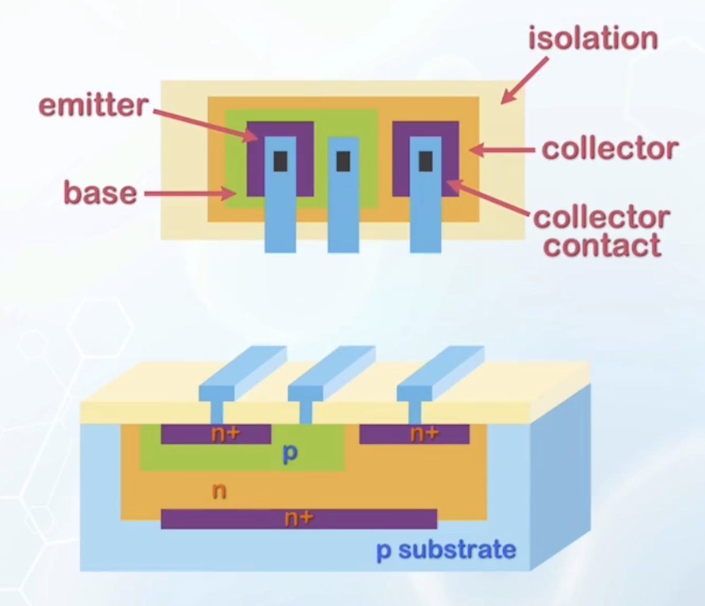
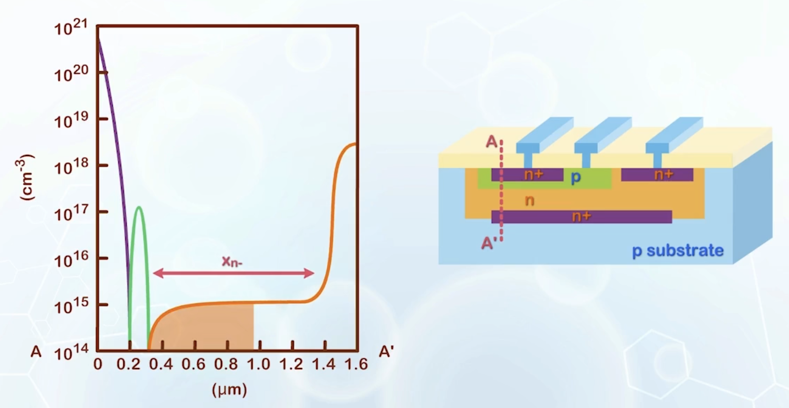
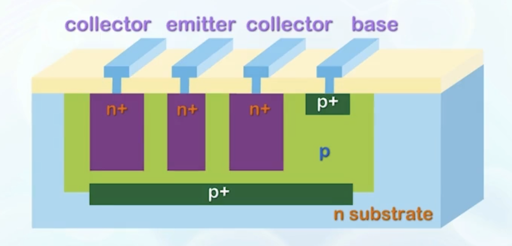
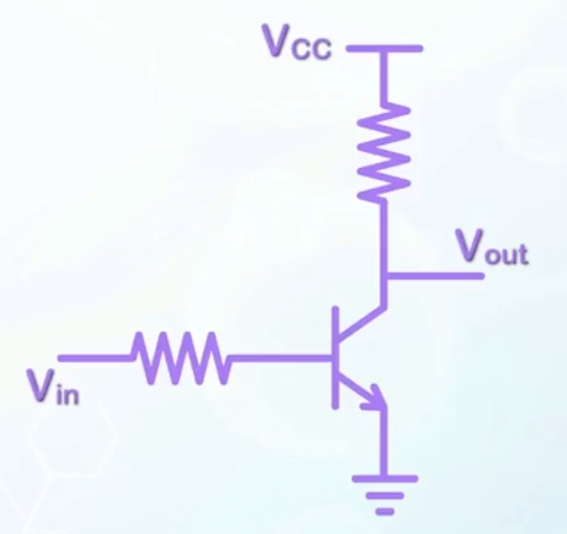
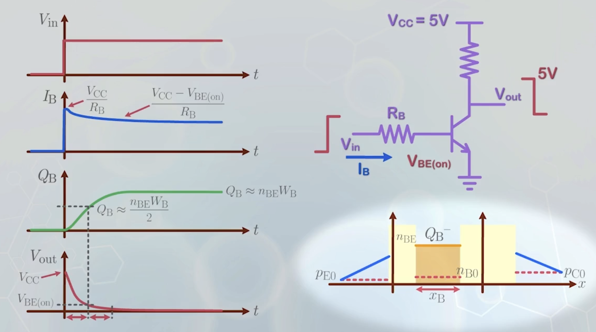
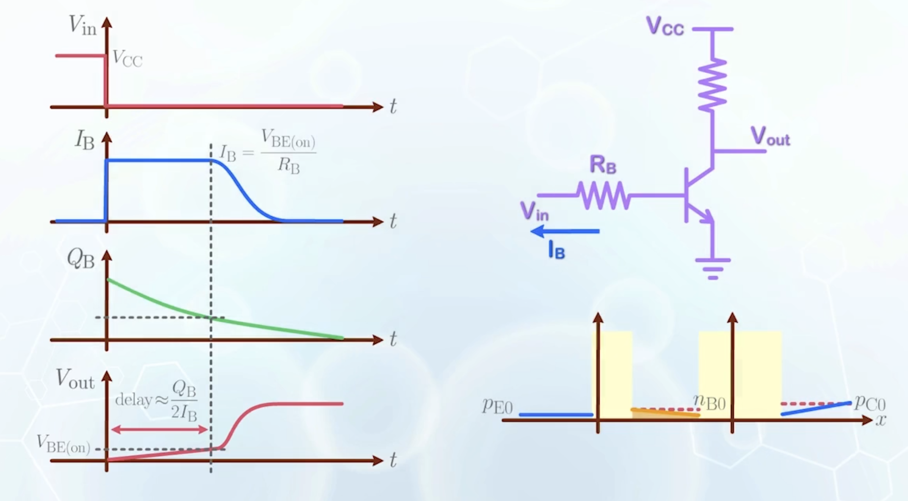
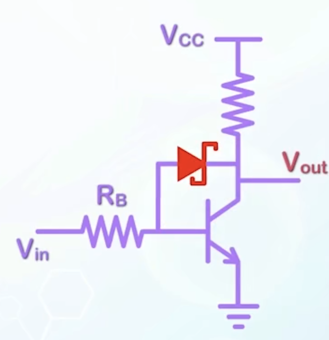

About the physical structure of BJTs, and the switching transient behavior.

---

## Physical BJT Design

On a physical wafer, BJTs can be placed horizontally or vertically. The latter is more common in integrated circuits, as doping is usually performed by ion implantation from the front side of the wafer, and it is easier to form heavily doped region near the surface.

- The emitter is usually placed on the top, followed by the base, and the lightly doped collector at the bottom
- The emitter can be directly connected from the top of the wafer
- The base must extend to the surface for external connection
- Similarly, the collector must also extend to the surface for external connection
  - The collector resistance will be very high because it is lightly doped
  - To reduce the resistance, a buried N+ layer is used, and an N+ region at the top of the collector region is formed during the emitter doping to provide an ohmic contact between the metal and the N- silicon collector
- Isolate BJT from other devices with a P region, usually the silicon substrate itself

- The BJT only takes up a small area of the entire structure, and a large portion of area is used for device isolation and contacts
- Plot the doping concentration along the vertical cutline
  - The curve:
    
  - The emitter is doped as heavily as possible ($10^{20} \, \text{cm}^{-3}$) to maximize $\gamma$
  - The base is narrow to reduce $\alpha_T$, but not too narrow to avoid punchthrough
  - The collector is lightly doped to reduce the Early effect, to avoid base punchthrough, and to increase the breakdown voltage, usually limited by the fabrication process ($10^{15} \, \text{cm}^{-3}$)
  - The base doping should be selected carefully to trade off between $\gamma$ and $r_O$, typically around $10^{17} \, \text{cm}^{-3}$
  - At the end of the collector is the heavily doped N+ region to reduce collector resistance
    - It is another trade off:
      - When the reverse bias voltage of the base-collector junction is increased, the depletion region width $x_{d\text{C}}$ expands,
      - If the N- region is too short, the depletion region will touch the N+ region before the maximum operation voltage, the depletion region will stop expanding, forcing the reverse voltage to drop across a smaller depletion width, increasing the electric field and reducing the breakdown voltage. The average effective doping in the depletion region also increases
      - If the N- region is too long, electrons still have to travel a long distance in the lightly doped region, increasing the collector resistance
  - Besides the collector resistance, there is also a base resistance, and the holes need to travel a long distance to recombine with electrons in the emitter
    - The resistance may be very high because the base is very thin
    - To reduce the base resistance, the lateral dimension of the base should be kept small, to minimize the distance between the base contact and all locations at the base
    - Adding another base contact to the left may also help, but that requires extra area
    - In terms of layout, a long emitter is preferred to reduce the base resistance
      

## Lateral BJT

BJTs can also be laid out laterally on the wafer surface, as a lateral BJT.

- The region at the bottom of the structure must be P type, otherwise the N regions will be shorted without any barriers in between
- But if the substrate is P type, all the bases of lateral BJTs on the substrate will be shorted together
- Therefore, we have the P region forming the base **extended** to the region below the emitter and the collector, and build the whole device on an **N substrate**
- If breakdown voltage is not a concern, the collector can also be heavily doped to N+, and is formed together with the emitter, to simplify the fabrication process
- The separation between the emitter and the collector is kept small to reduce recombination at the base. This can be achieved by placing the base contact **outside** the main BJT structure
- Electrons can be injected to the base through the bottom of the N+ region. These electrons have to travel a much longer distance to reach the collector, and is easily lost to recombination
  - Thus the base transport factor $\alpha_T$ is usually very small in lateral BJTs
  - To improve the gain, the side wall area of the emitter should be increased relative to the bottom area, by making both the emitter and collector junctions deep, and the lateral dimension of the emitter small. An additional collector region can also be added to the other side of the emitter
  - The depth of the base region is no longer restricted by the collector region, as in the vertical BJT, a P+ region can be introduced at the bottom of the base to reduce the base resistance

The vertical dimension can be more precisely controlled relative to the lateral dimension in IC processing, the BJT technology is still dominated by vertical BJTs.

## Turn on Transient

Consider BJT connected as an inverter.

- When a BJT is switched, it will switch between different operation modes, and has to be companied by the change in the amount of minority carrier charge
- Assume $V_\text{CC} = 5 \, \text{V}$, $V_\text{in}$ is negative, the BJT is in cutoff
  - The BJT is behaving like an open-circuit, $V_\text{out}$ is the same as $V_\text{CC}$
  - When the base voltage is switched to a logic high at time $t = 0$, the base terminal is initially held at $0 \, \text{V}$ by the capacitance
  - The initial base current is $I_\text{B} = \frac{V_\text{CC}}{R_\text{B}}$
    :::info Why VCC instead of Vin?
    The logic high of $V_\text{in}$ is usually just $V_\text{CC}$
    :::
  - Over a short period of time, the BJT will enter the forward active region
    - The voltage across the base-emitter junction will be equal to $V_\text{BE(on)}$, typically assumed to be $0.7 \, \text{V}$
    - All voltage beyond the value will be dropped across the resistor $R_\text{B}$, thus
      $$
      I_\text{B} = \frac{V_\text{CC} - V_\text{BE(on)}}{R_\text{B}}
      $$
  - Now there are excess negatively charge electrons (the part below the minority carrier concentration distribution line) stored temporarily in the base region, and a base current is needed to supply holes to the base
  - The amount of accumulated holes at the base $Q_\text{B}^+$ will be the same as the amount of accumulated electrons $Q_\text{B}^-$. $Q_\text{B}$ is called the **base charge**
  - Supplying electrons from the emitter is fast due to the large electron current
  - Supplying holes from the base contact is slow due to the small base current
  - Insufficient $Q_\text{B}^+$ will slow down electron motion due to electrostatic repulsion, thus the overall $Q_\text{B}$ will increase gradually over time
  - To calculate $Q_\text{B}$ at steady state condition, we use the electron concentration, or $Q_\text{B}^-$ at the base, but **the speed is really limited by $Q_\text{B}^+$**
  - Over time, $I_\text{C}$ increases, causing $V_\text{out}$ to decrease
  - Assume $V_\text{out}$ will drop to $0$
    - The base current continues to supply the base charge $Q_\text{B}$, and saturates at
      $$
      Q_\text{B} = n_\text{BE} x_\text{B} \approx n_\text{BE} W_\text{B}
      $$
    - The time at which the BTJ switches from forward active to saturation is marked in the timing diagram when the base charge is half of its saturation value
    - At this point, $V_\text{out}$ will drop to $V_\text{BE(on)}$, and takes about the same amount of time to drop the remaining voltage to achieve full saturation, determined by the time to fully charge the base with a constant base current
  - The supply of the base charge is usually used as a measure for the speed of BJT switching

## Turn off Transient

Similar to turn on, the delay for turn off is caused by the time to remove the accumulated base charge. It is actually more significant than the turn on delay.

- $V_\text{in}$ becomes $0$ at time $t = 0$
- The charge at the base has to be removed before the BJT can enter forward active, then cutoff
- The removal of the accumulated holes is achieved by the base current passing through the base resistor to ground
  - The minority carrier charge in the neutral base region near the base-emitter junction sustains the junction in forward bias, and junction voltage remains at $V_\text{BE(on)}$, and this voltage is the driving force for the base current
  - The base current is given by
    $$
    I_\text{B} = \frac{V_\text{BE(on)}}{R_\text{B}}
    $$
    - $V_\text{BE(on)}$ is much smaller than $V_\text{CC}$, thus it takes a longer time to remove the base charge
  - The base current will remain constant for a long period of time, until the BJT enters forward active
  - After that, $I_\text{B}$ will decrease, while $Q_\text{B}$ continues to decrease
  - $V_\text{out}$ starts at $0$ at saturation, and increases to about $V_\text{BE(on)}$ when the BJT enters forward active, then rise to $V_\text{CC}$ when the BJT enters cutoff
    - There is a long delay before the output voltage rises
    - The approximation delay to reach the forward active mode is given by
      $$
      \text{delay} \approx \frac{Q_\text{B}}{2 I_\text{B}}
      $$
    - The overall speed of a BJT when connected in the common-emitter configuration is usually limited by turn off

## Schottky BJT

Compared to switching from cutoff to forward active, switching from forward active to cutoff only increases the output voltage range by $0.7 \, \text{V}$, but requires removing or accumulating the same amount of base charge.

By limiting the minimum voltage to $0.2 \, \text{V}$ instead of ground, the long delay can be eliminated.

Due to the exponential dependence, $0.2 \, \text{V}$ can create more than $10^3$ times difference between $n_\text{BE}$ and $n_\text{BC}$, enough to eliminate most of the base charge.

A Schottky diode can be connected between the base and collector to prevent the base-collector junction from going into deep saturation.

- When $V_\text{out} > V_\text{BE(on)}$, the Schottky diode is open circuited, and the BJT operates normally in forward active
- The turn on voltage for the Schottky diode is about $0.3 \, \text{V}$, lower than that of a silicon PN junction
- When the BJT enters shallow saturation, $V_\text{out}$ drops to $0.4 \, \text{V}$, the Schottky diode turns on, and shorts the base to the collector, with $0.3 \, \text{V}$ offset
- The collector voltage will be maintained at $0.4 \, \text{V}$, preventing deep saturation
- The amount of base charge is kept about half of that without the Schottky diode
- The initial delay in turn off will be eliminated, and the overall switching speed is improved, and the trade off is the reduced output voltage swing
- To physically implement the Schottky diode, place a metal with Fermi level close to the valence band edge of Silicon at the base-collector junction
  - It will form a Ohmic contact with the base, and a Schottky barrier with the collector
  - Most commonly used metal for this structure is gold
