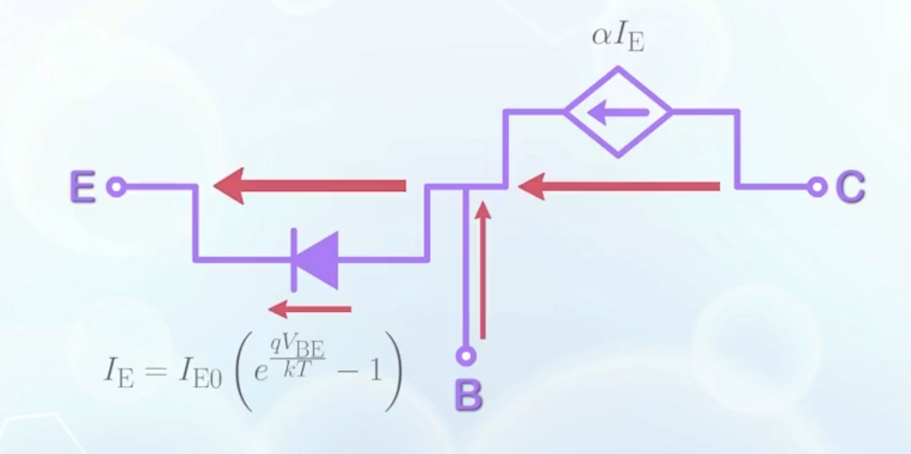
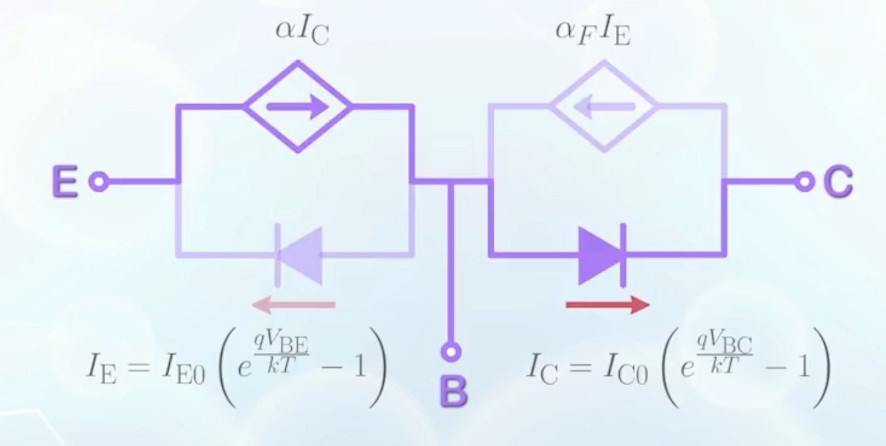
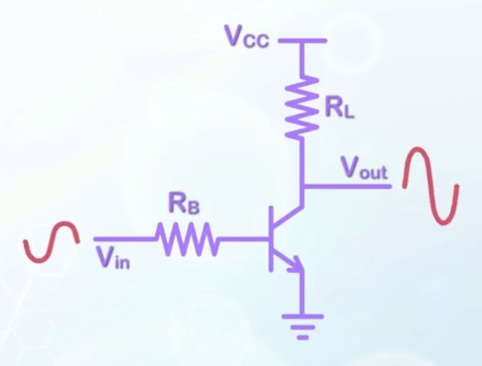
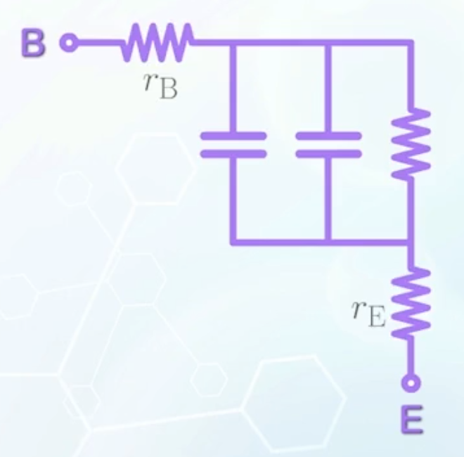
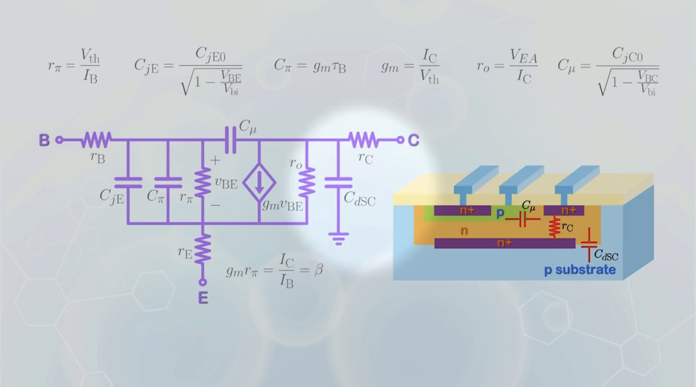
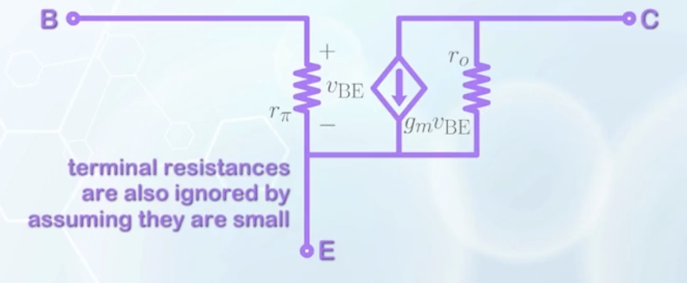
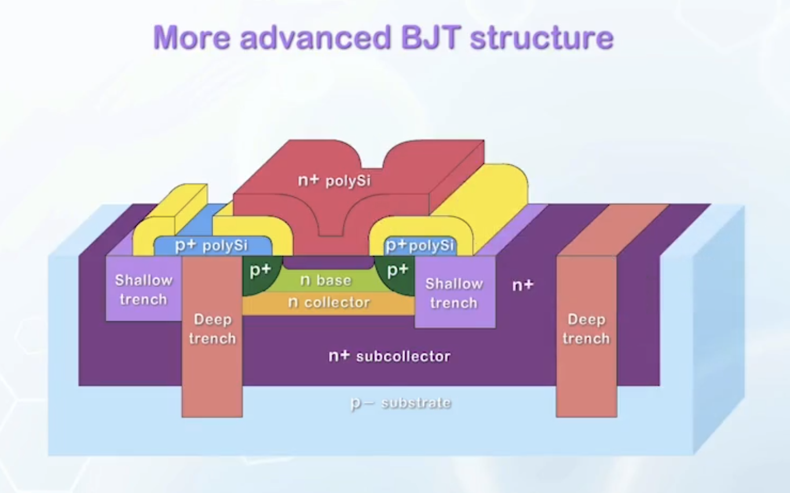

## The Ebers-Moll Model

- To describe a BJT in **forward active mode** in steady state:
  - The operation of a BJT is mainly based on the PN junction diode between the base and emitter, we place a diode between the base and emitter in the model
  - The emitter current is just the diode current given by
    $$
    I_\text{E} = I_{\text{E}0} \left( e^{\frac{q V_\text{BE}}{kT}} - 1 \right)
    $$
  - A current controlled current source is placed between the collector and emitter, to represent $\alpha$ part of the emitter current that reaches the collector
  - The difference between $I_\text{E}$ and $I_\text{C}$ is the base current
  - The model describes exactly the BJT operation in forward active mode in steady state
    
- In **reverse active mode**:
  - The transistor actions come from the base-collector junction, which is another PN junction diode
  - The collector current is again given by the ideal diode equation
    $$
    I_\text{C} = I_{\text{C}0} \left( e^{\frac{q V_\text{BC}}{kT}} - 1 \right)
    $$
  - A current controlled current source is placed between the emitter and collector, to represent $\alpha_\text{R}$ part of the collector current that reaches the emitter
    - The $\alpha$ in reverse active mode is different from that in forward active mode
    - To distinguish the two, we denote the reverse active mode one as $\alpha_R$, and the forward active mode one as $\alpha_F$
  - The model for BJT under reverse active mode:
    
  - In forward active mode, the base-collector diode is in reverse bias, and can be regarded as an open circuit, $I_\text{C} \approx 0$. Thus, components related to the reverse active mode can be ignored
  - The same applies to reverse active mode, where the forward-active-mode-related components can be ignored
- In **cutoff mode**, all diodes are considered as open circuits, and no current flows
- In **saturation mode**, both diodes are forward biased, and injects current to the base
  - The net current is determined by the relative magnitudes of the injection currents
- The model now can describe the BJT operation in all four modes
- It should be noted that the diodes in the model only represent the function of the voltage-controlled current source in the diode model
- To capture the dynamic behavior, the **full model of the diode**, as discussed in [the PN junction section](../8/#large-signal-pn-junction-model) should be included
- The currents though the base, emitter and the collector terminals are different in the case of BJT, the base, emitter and collector resistances have to be associated with the respective terminals
  
- This is still an over-simplified situation, as it assumes **the diodes operate independently**
- More detailed models should be able to capture the interaction between the two junctions

## The Small Signal Model

Besides digital switches, BJTs can also be used as amplifiers, common in signal processing circuits.

- A very small varying voltage can be applied to the input
- Based on the exponential relationship between $I_\text{C}$ and $V_\text{BE}$, a small change in $V_\text{BE}$ can cause a large change in $I_\text{C}$
- The collector current change will be converted to the output voltage, multiplied by the load resistance $R_\text{L}$
  $$
  \Delta V_\text{out} = - \Delta I_\text{C} R_\text{L}
  $$
  A small input voltage change can lead to a large, inverted output voltage change
- The input signal is assumed to be small, or it will saturate the waveform, leading to clipping
- For a very small signal input, we can linearize the circuit around a particular biasing point, usually in the forward active mode

<!-- new paragraph -->

- To construct the small signal model
  - Start from the PN junction between the base and emitter
    - Copy the small signal diode model from [the PN junction section](../8/#small-signal-pn-junction-model)
      
    - With the emitter assumed to be grounded, the resistance $r_\pi$ measures the reciprocal of the slope of the $I_\text{B}$-$V_\text{BE}$ curve at the biasing point
      $$
      \begin{aligned}
      r_\pi &= \left(\frac{\mathrm{d} I_\text{B}}{\mathrm{d} V_\text{BE}} \right)^{-1} \\
      &\approx \left(\frac{\mathrm{d}}{\mathrm{d} V_\text{BE}} I_{\text{B}0} e^{\frac{q V_\text{BE}}{kT}} \right)^{-1} \\
      &= \left(\frac{q}{kT} I_{\text{B}0} e^{\frac{q V_\text{BE}}{kT}} \right)^{-1} \\
      &= \frac{V_\text{th}}{I_\text{B}}
      \end{aligned}
      $$
    - $C_{j\text{E}}$ is the base-emitter junction capacitance at the biasing point
      $$
      C_{j\text{E}} = \frac{C_{j\text{E}0}}{\sqrt{1 - \frac{V_\text{BE}}{V_\text{bi}}}}
      $$
    - $C_\pi$ is the diffusion capacitance due to the modulation of charge at the base
      $$
      C_\pi = \frac{\mathrm{d} Q_\text{B}}{\mathrm{d} V_\text{BE}} = \frac{Q_\text{B}}{V_\text{th}}
      $$
      - In BJT, we prefer to express $C_\pi$ in terms of $I_\text{C}$ instead of $Q_\text{B}$
        $$
        \begin{aligned}
          Q_\text{B} &\approx q \frac{n_\text{BE} W_\text{B}}{2} \\
          I_\text{C} &\approx q D_{n\text{B}} \frac{n_\text{BE}}{W_\text{B}} \\
          \Rightarrow \frac{Q_\text{B}}{I_\text{C}} &\approx \frac{W_\text{B}^2}{2 D_{n\text{B}}} && \text{(with a unit of time)} \\
          &= \tau_\text{B} && \text{(base transit time)} \\
        \end{aligned}
        $$
      - Physically, $\tau_\text{B}$ measures how long the carriers are stored in the base, or equivalently, how long it takes for the carriers to move from the emitter to the collector through the base, and its usually in the $10 \, \text{ps} $ range
      - Now back to $C_\pi$:
        $$
        C_\pi = \frac{Q_\text{B}}{V_\text{th}} = \tau_\text{B} \frac{\mathrm{d} I_\text{C}}{\mathrm{d} V_\text{BE}} = \tau_\text{B} \frac{I_\text{C}}{V_\text{th}}
        $$
      - The value $\frac{\mathrm{d} I_\text{C}}{\mathrm{d} V_\text{BE}}$ measures the change in the collector current with respect to the base-emitter voltage, and is called the **transconductance $\boldsymbol{g_m}$** because it has the unit of conductance, but its value is determined by the voltage of other terminals that it is **not connected to**
        $$
        \begin{aligned}
        g_m &= \frac{I_\text{C}}{V_\text{th}} \\
        C_\pi &= g_m \tau_\text{B}
        \end{aligned}
        $$
      - Transconductance represents the slope of the linearized characteristics of BJT: $\text{slope} = g_m$
  - Between the collector and the emitter, the current is controlled by the signal at the base-emitter junction
    - It can be represented by a current controlled current source
      $$
      I_\text{C} = \beta I_\text{B}
      $$
    - Or with a voltage controlled current source
      $$
      I_\text{C} = g_m v_\text{BE}
      $$
      where a lowercase $v$ is used to represent the small change in voltage
    - It should be noted that
      $$
      \begin{aligned}
      r_\pi &= \frac{V_\text{th}}{I_\text{B}} \\
      g_m &= \frac{I_\text{C}}{V_\text{th}} \\
      \Rightarrow g_m r_\pi &= \frac{I_\text{C}}{I_\text{B}} = \beta
      \end{aligned}
      $$
    - In addition to the current source, that gives the collector current, the Early effect contributes a resistor $r_O$ in parallel, connecting between the collector and emitter
  - Between the base and collector, there is a reverse bias junction capacitance $C_\mu$
    - It is the depletion capacitance between the base-collector junction
      $$
      C_\mu = \frac{C_{j\text{C}0}}{\sqrt{1 - \frac{V_\text{BC}}{V_\text{bi}}}}
      $$
    - $C_\mu$ may also include the change of $Q_\text{B}$ as a function of $V_\text{C}$ due to the reduction of base neutral region width, which is usually small enough to be ignored
  - There is another series resistance for the collector $r_\text{C}$ between the collector and metal contact
  - The collector is surrounded by a P substrate for isolation, introducing a reverse bias junction capacitance $C_{d\text{SC}}$ between the collector and the substrate

## Frequency Response

For a transistor used as an amplifier, the output can follow input when the input frequency is low enough. In such case, the capacitors in the small signal model can be considered as open circuits, and removed from the model. The gain of the transistor becomes constant.

When frequency increases, it is possible that before a carrier can reach the collector, the signal has already been reversed. In such case, the collector current does not respond to the change of the input signal.

The gain of the amplifier **drops** when the input frequency becomes higher than a certain value, due to the **capacitance**, limiting the frequency range a BJT can function properly.

- The speed of a BJT, in terms of the highest frequency it can handle, is usually characterized by the **transit frequency $\boldsymbol{f_T}$** of the transistor
  - $f_T$ is defined as the frequency at which the current gain $\beta$ drops to unity (1x)
  - In the $\beta - \log(f)$ graph, $\beta$ is supposed to be flat over a wide range of low frequency operation, and starts to drop at some high frequency (corner frequency)
  - The drop in beta is linear with the log of frequency
  - Extending the linear drop line to the frequency at which $\beta = 1$, we get the transit frequency $f_T$
  - At $f_T$, the collector current becomes the same as the base current, and the amplifier is no longer amplifying the input signal
  - $f_T$ can be calculated using the [small signal model](#the-small-signal-model) in the Fourier domain ($C$ -> $j \omega C$), and $\beta = \frac{I_\text{C}}{I_\text{B}}$ becomes a function of $\omega$
  - Skipping the math details, the final result is
    $$
    \begin{aligned}
    f_T &= \frac{g_m}{2 \pi C_\text{in}} \\
    &= \frac{g_m}{2 \pi (C_{j\text{E}} + C_\mu + C_\pi)} \\
    &= \frac{g_m}{2 \pi (C_{j\text{E}} + C_\mu + g_m \tau_\text{B})} \\
    \end{aligned}
    $$
    $C_\text{in}$ is the input capacitance, and $C_{j\text{E}}$ and $C_\mu$ does not very that much
  - We care about how $f_T$ varies with $I_\text{C}$
    - $g_m$ is related to $I_\text{C}$
      $$
      g_m = \frac{I_\text{C}}{V_\text{th}}
      $$
    -  At very small $I_\text{C}$, $g_m$ is very small, thus $f_T$ is more or less proportional to $g_m$, or $I_\text{C}$, because the denominator is dominated by $C_{j\text{E}} + C_\mu$
    - When $g_m \tau_\text{B}$ becomes comparable, or larger than the junction capacitances, $C_{j\text{E}} + C_\mu$ may be ignored, and
      $$
      f_T \approx \frac{1}{2 \pi \tau_\text{B}}
      $$
    - The maximum $f_T$ is limited by the base transit time $\tau_\text{B}$, which is natural because the collector cannot experience any change in current if the carriers have not reached the collector before the input signal changes, even though the electrons are moving back and forth at the base-emitter junction
    - With $\tau_\text{B}$ in the picosecond range, usual values of $f_T$ is in the range of $50 - 100 \, \text{GHz}$
    - Further increasing $I_\text{C}$ will cause $f_T$ to drop, because $\beta$ is shown to decrease when BJT enters high-injection region

## Structural Optimization

Compared to MOSFET, BJTs are more commonly used to make discrete devices instead of integrated circuits.

The advantages of BJTs include
- High current drive capability
- Sustains high voltage

However, we usually have either NPN or PNP BJTs, but not both, on a single wafer, compared to the complementary MOSFET pairs. Possible complementary BJT structures are complex and not a popular choice.

To improve the performance of a BJT circuit, it is important to reduce the parasitic elements.

- The emitter is extended by adding an N+ polysilicon layer, giving a long emitter length to reduce the diffusion hole current from the base to the emitter
- A P+ region is added to the base outside the transistor region to reduce the base resistance
- The P+ polysilicon layer is used to contact the P+ base, to avoid including contact that consumes large area in the transistor structure
- Trench isolation filled with insulator is used to isolate different regions instead of just a reverse junction, to avoid the parasitic junction capacitance