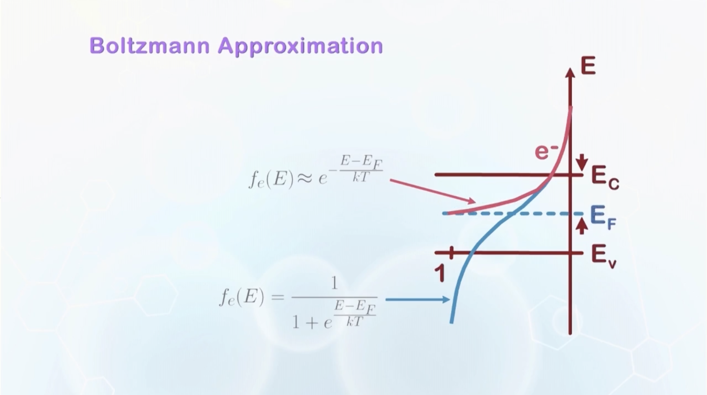
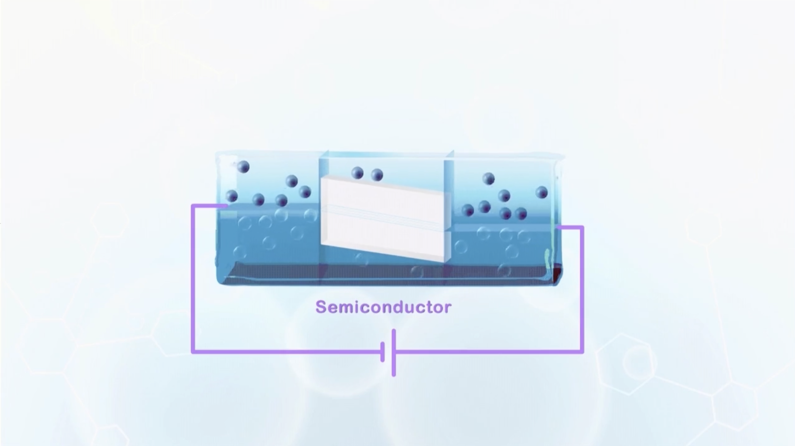

About density of states, Fermi-Dirac distribution, carrier density calculation, effective density of states, Boltzmann approximation, and water analogy for the bandgap.

---

- The density of carriers in a solid semiconductor depends on three factors:
  - density of state available in an energy band
  - size of band gap
  - temperature of the operation environment

## Density of States

- **State**: a space to hold one electron, becomes a hole without an electron.
- Density of states are not uniformly distributed in an energy band.
  - Fewer states closer to the band gap
  - More states further away from the band gap
- $D(E)$: Distribution of states as a function of energy (density of states)
- $E_C$: lowest energy in the conduction band
- $E_V$: highest energy in the valence band
- $E_g = E_C - E_V$: band gap energy
  - Exact value of $E_C$ and $E_V$ does not matter, only the difference matters.
  - $E_g \approx 1.1\,\mathrm{eV}$ for silicon

## Fermi-Dirac Distribution

- Without energy supplied (absolute zero temperature), all electrons stay at lowest energy states.
- With energy supplied:
  - The distribution of carriers in the states of a band is governed by the Fermi-Dirac distribution function:
    $$f_e(E) = \frac{1}{1 + e^{\frac{E - E_F}{kT}}}$$
    the probability that an electron state at energy $E$ is occupied by an electron.
  - $E_F$: Fermi energy level, a reference energy level
  - $k$: Boltzmann's constant
  - $T$: absolute temperature in Kelvin

:::info More on Fermi-Dirac Distribution
When $T = 0\,\mathrm{K}$

$$
f_e(E) = \begin{cases}
1, & E < E_F \\
0, & E > E_F
\end{cases}
$$

It is an abrupt function.

When $T > 0\,\mathrm{K}$, the transition of $f_e(E)$ from 1 to 0 is smoothened.

Thus, $E_F$ is **defined** as the energy level at which the probability of occupancy is 1/2, regardless of $T$.
:::

- **Materials with a band gap**: $E_F$ lies within the band gap, due to the symmetry of the probability distribution. ($\frac{1}{1 + e^x} + \frac{1}{1 + e^{-x}} = 1$)
- **In the valence band**: the probability of holes occupying a state
  $$ f_h(E) = 1 - f_e(E) = \frac{1}{1 + e^{\frac{E_F - E}{kT}}} $$

## Calculating Carrier Density

- $n(E) = D(E) \cdot f_e(E)$: density of electrons at energy $E$, usually for conduction band
- $p(E) = D(E) \cdot f_h(E)$: density of holes at energy $E$, usually for valence band
- Total number:
  $$
  \begin{aligned}
  n &= \int D(E) \cdot f_e(E) \\
  p &= \int D(E) \cdot f_h(E) \\
  \end{aligned}
  $$
  $p = n$ because every electron excited to the conduction band leaves a hole in the valence band (electron-hole pair generation).
  - For pure or intrinsic silicon, $n = p = n_i$

## Equivalent (Effective) Density of States

- We do not care about $D(E)$, we only care about the total number of carriers.
- Simplify:
  - Assume energy band is narrow, all states are at $E_C$ or $E_V$.
  - Define an equivalent density of states $N_C$ (total number of states if they are all located at $E_C$) and $N_V$ (similar for valence band).
  - Then:
    $$
    \begin{aligned}
    n &= N_C \cdot f_e(E_C) \\
    p &= N_V \cdot f_h(E_V) \\
    \end{aligned}
    $$
  - $$
    \begin{aligned}
      N_C = 2 \left( \frac{2 \pi m_e k T}{h^2} \right)^{3/2} \\
      N_V = 2 \left( \frac{2 \pi m_h k T}{h^2} \right)^{3/2} \\
    \end{aligned}
    $$
    - $m_e$: effective mass of electrons
    - $m_h$: effective mass of holes
    - $h$: Planck's constant
- For silicon at room temperature ($T = 25 \,^\circ \mathrm{C}$):
  $$
  N_C = 2.8 \times 10^{19} \, \mathrm{cm}^{-3}, N_V = 1.09 \times 10^{19} \,\mathrm{cm}^{-3}
  $$

## Boltzmann Approximation

- $kT \approx 0.026 \,\mathrm{eV} \text{ at } 25 \, ^\circ\mathrm{C}$, $E - E_F \gg kT$
- Thus,
  $$
  f_e(E) = \frac{1}{1 + e^{\frac{E - E_F}{kT}}} \approx e^{-\frac{E - E_F}{kT}}
  $$
  for conduction band when $E_F$ is not too close to the conduction band.
  
- After the approximation, $f_h(E) = 1 - f_e(E)$ is no longer valid, and
  $$
  f_h(E) \approx e^{-\frac{E_F - E}{kT}}
  $$
- Finally, the intrinsic electron concentration and the intrinsic hole concentration:
  $$
  \begin{aligned}
  n = N_C \times f_c(E_C) = N_C \times e^{- \frac{E_C - E_F}{kT}} = n_i \\
  p = N_V \times f_h(E_V) = N_V \times e^{- \frac{E_F - E_V}{kT}} = p_i \\
  \end{aligned}
  $$
- Multiplying the two equations:
  $$
  np = n_i^2 = N_C N_V e^{-\frac{E_g}{kT}}
  $$
  This shows that the number of carriers increases with temperature, and decreases with band gap.
- Number of carriers of silicon at room temperature:
  $$
  n_i = 1.45 \times 10^{10} \, \mathrm{cm}^{-3} \sim 10^{10} \, \mathrm{cm}^{-3}
  $$

## Water Analogy for the bandgap

- A light, hollow, closed box partially filled with water.
- At the water to air interface, the probability to find a water molecule is $0.5$. This is the Fermi level of the box.
- Uniform external potential -> placing the box in a larger water tank where the water level represents the external potential.
- The box will float, aligning the water level inside the box with the water level outside -> The Fermi level is a reference energy level with respect to the surrounding.
- The band gap is a solid box without water molecules dropped inside the box, it will float in water, and the plane separating the floating part and sinking part is the Fermi level.
- The solid box has cracks, water molecules can jump above through the box through the cracks -> electrons excited from valence band to conduction band.
- External voltage applied -> external water level changes -> Fermi level at the two ends of the semiconductor changes -> current flows.
  
- Battery only controls the two ends, inside the semiconductor, the Fermi level is subject to the properties of the material.
