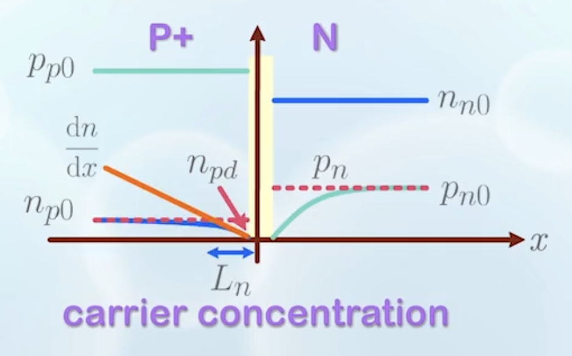

About carrier statistics with respect to locations, external voltages, and the diffusion current with applied voltage.

---

## Carrier Statistics with Respect to Locations

- In a P+/N junction:
  - Carrier concentration
    - $p_{p0} \cong N_A$
    - $n_{p0} \cong n_i^2 / N_A$
    - $n_{n0} \cong N_D$
    - $p_{n0} \cong n_i^2 / N_D$
    - Denotations: $\text{CarrierType}_{\text{Region}}$, and 0 means thermal equilibrium
    - We draw the graph in log scale as carrier concentration varies a lot
  - $p_{p0} \gt n_{n0}$ because of heavier doping on the P side
- Carrier concentration in the depletion region is not a constant, but varies with location
  - It is difficult to calculate, so we simply ignore it, assuming it is very small compared to the neutral regions

## Carrier Motion at Thermal Equilibrium

:::warning Discussing only electrons
We will only be discussing electrons from now on, but the discussion applies to holes as well.
:::

- No net current flow at thermal equilibrium, but carriers are not stationary
- In the conduction band
  - On the N side, higher electron concentration pushes electrons to **diffuse** to the P side
  - Some of the electrons are driven back by **drift**
  - There are many electrons on the N side, but most with energy lower than $E_{Cp0}$ ($E_C$ of the P side at thermal equilibrium). These electrons cannot move to the P side
  - Electrons that can move freely across the two sides are those with energy higher than $E_{Cp0}$
  - On the P side, concentration of these high-energy electrons are $n_{p0}$
  - On the N side, concentration of electrons is governed by the Fermi-Dirac distribution, where $E_{Cp0} - E_F$ is identical to that of the P side, so the concentration is also $n_{p0}$

## Fermi-Level Under External Voltage

- The PN junction symbol
  
- **Positive Bias/Forward Bias**: Positive voltage $V_A$ on the P side with respect to the N side
- **Negative Bias/Reverse Bias**: Negative voltage $V_A$ on the P side with respect to the N side
- At **reverse bias**, alignment of the Fermi levels on the two sides is broken
  - Fermi level on the P side is raised by $q|V_A|$ with respect to the N side
  - Fermi level is the same across the neutral regions, but there is a discontinuity across the depletion region
  - In the depletion region, there are externally injected carriers, so the equilibrium cannot be assumed. Simple Fermi-Dirac distribution with one Fermi level does not apply
  - Must be handled with some advanced concepts of quasi-Fermi levels
  - For now, we will ignore the depletion region and focus on the neutral regions

## Energy Band Bending Under Reverse Bias

- When a reverse bias is applied, we need to find the new barrier height and the new depletion region width
- For the barrier height:
  - At thermal equilibrium, the barrier height is $qV_{bi}$
  - Under reverse bias, the barrier height is raised by $q|V_A|$
  - New barrier height: $V_{Bh} = q(V_{bi} - V_A)$ as $V_A$ is negative
    :::info Why negative?
    $V_A$ is the potential of the P side with respect to the N side, so it is negative under reverse bias
    :::
- For the depletion region width:
  - Charge neutrality still holds
    $$
      N_A x_p = N_D x_n
    $$
  - The second equation becomes
    $$
      V_{Bh} = V_{bi} - V_A = \frac{q N_A x_p^2}{2 \varepsilon_{\text{Si}}} + \frac{q N_D x_n^2}{2 \varepsilon_{\text{Si}}}
    $$
  - Solving the two equations, we get
    $$
      x_d = \sqrt{\frac{2\varepsilon_{\text{Si}}(V_{bi} - V_A)}{q}\left(\frac{1}{N_A} + \frac{1}{N_D} \right)}
    $$
  - Assuming $N_A \gg N_D$ (P+/N junction), we have
    $$
      x_d \approx \sqrt{\frac{2\varepsilon_{\text{Si}}(V_{bi} - V_A)}{q N_D}}
    $$

## Carrier Concentration at Reverse Bias

- When an electron enters the edge of the depletion region from the P side, it moves to the N side due to the slope in the band diagram (caused mainly by **drift**)
  - Electron concentration at the edge of the depletion region on the P side is lower
  - More electrons from the rest of the P side **diffuse** to the edge of the depletion region
- When we draw the graph of carrier concentration
  - The concentration on the P side becomes lower as $x$ moves to the depletion region
  - The concentration on the N side remains the same ($n_{n0}$) as the concentration is much higher than that caused by the few electrons coming from the P side
  - Similarly for holes, the concentration on the N side becomes lower as $x$ moves to the depletion region, while the concentration on the P side remains the same ($p_{p0}$)

## Diffusion Current Under Reverse Bias

- Current calculation is achieved by counting the number of electrons crossing a particular location per unit time
- It is much easier to do so at locations with lower carrier concentration
- For electrons, we calculate the current on the P side near the edge of the depletion region
  - The driving force is mainly **diffusion**
  - Current density for electrons (current per unit area):
    $$
      J_{n,\text{diff}} = q D_n \frac{\mathrm{d}n}{\mathrm{d}x}
    $$
    where $D_n$ is the diffusion coefficient of electrons, indicating how mobile electrons are in the medium
    - When $\mathrm{d}n/\mathrm{d}x$ is large, it means carrier concentration differs a lot, so more carriers are moving across
  - The corresponding current for holes is
    $$
      J_{p,\text{diff}} = - q D_p \frac{\mathrm{d}p}{\mathrm{d}x}
    $$
    where $D_p$ is the diffusion coefficient of holes
    - The negative sign is because holes move in the opposite direction to electrons
- In the graph, $\mathrm{d}n/\mathrm{d}x$ is the slop of electron concentration on the P side near the edge of the depletion region (this marks a straight line)
  - $n_{pd}$: electron concentration at the edge of the depletion region on the P side. It is not a constant, and varies with the applied voltage $V_A$
  - $L_n$: the distance the straight line intersects the $n_{p0}$ line.
    
    It represents the average distance an electron can diffuse before recombining. We can assume it is a known constant at this stage.
  - With these two notations, we have
    $$
      \frac{\mathrm{d}n}{\mathrm{d}x} = \frac{n_{pd} - n_{p0}}{L_n}
    $$
    and
    $$
      J_{n,\text{diff}} = q D_n \frac{n_{pd} - n_{p0}}{L_n}
    $$
    In this equation, all are known constants except $n_{pd}$

## Reverse Bias Current of a PN Junction

- A few more assumptions:
  - The carrier statistics in the neutral **N** region is not affected by the bias voltage, as the number of electrons added is very small compared to the number of electrons already there
  - The depletion region is very small compared to the neutral regions, so we can ignore its thickness
- With these assumptions, $n_{pd}$ equals to the carrier concentration in the neutral N region with energy higher than $E_{Cp}$
  - This is because concentration cannot change abruptly from P side to N side, as we've ignored the depletion region thickness
  - Calculate carrier concentration with Fermi-Dirac distribution
    $$
      n_{pd} = n_{p0} e^{-\frac{E_{Cp} - E_{Cp0}}{kT}} = n_{p0} e^{-\frac{ q|V_A|}{kT}} = n_{p0} e^{\frac{qV_A}{kT}}
    $$
- Finally,
  $$
  \begin{aligned}
    J_{n,\text{diff}} =& q D_n \frac{n_{pd} - n_{p0}}{L_n} \\
    =& q D_n\frac{n_{p0}}{L_n}\left(e^\frac{qV_A}{kT} - 1\right)
  \end{aligned}
  $$
- The same for holes:
  $$
  \begin{aligned}
    J_{p,\text{diff}} =& - q D_p \frac{p_{n0} - p_{nd}}{L_p} \\
    =& q D_p\frac{p_{n0}}{L_p}\left(e^\frac{qV_A}{kT} - 1\right)
  \end{aligned}
  $$
- Combine the two:
  $$
  \begin{aligned}
    J =& J_{n,\text{diff}} + J_{p,\text{diff}} \\
    =& q\left(D_n\frac{n_{p0}}{L_n} + D_p\frac{p_{n0}}{L_p}\right)\left(e^\frac{qV_A}{kT} - 1\right)
  \end{aligned}
  $$

## Conditions Under Forward Bias...

- Everything is the same as reverse bias, except that $V_A$ is now positive
- When $V_A > V_{bi}$, the depletion region disappears, and the PN junction becomes a resistor, all voltage drops across the neutral regions
- We can denote
  $$
    I_0 = q\left(D_n\frac{n_{p0}}{L_n} + D_p\frac{p_{n0}}{L_p}\right)
  $$
  which is a constant for a particular PN junction once the doping concentration is known
- The final equation is
  $$
    I_D = I_0 \left(e^\frac{qV_A}{kT} - 1\right)
  $$
