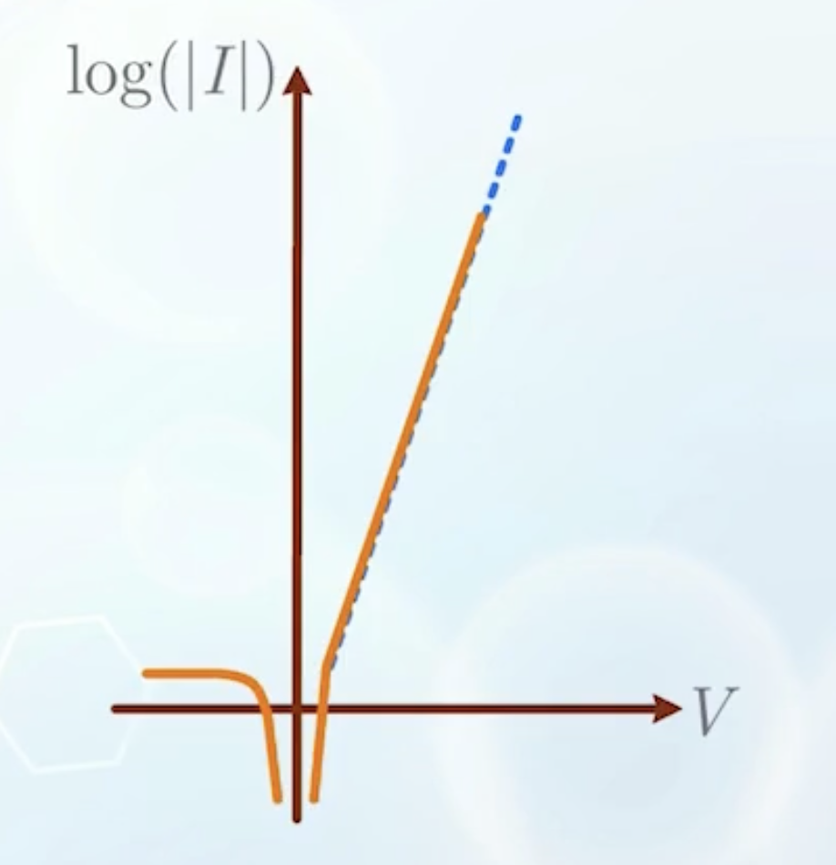
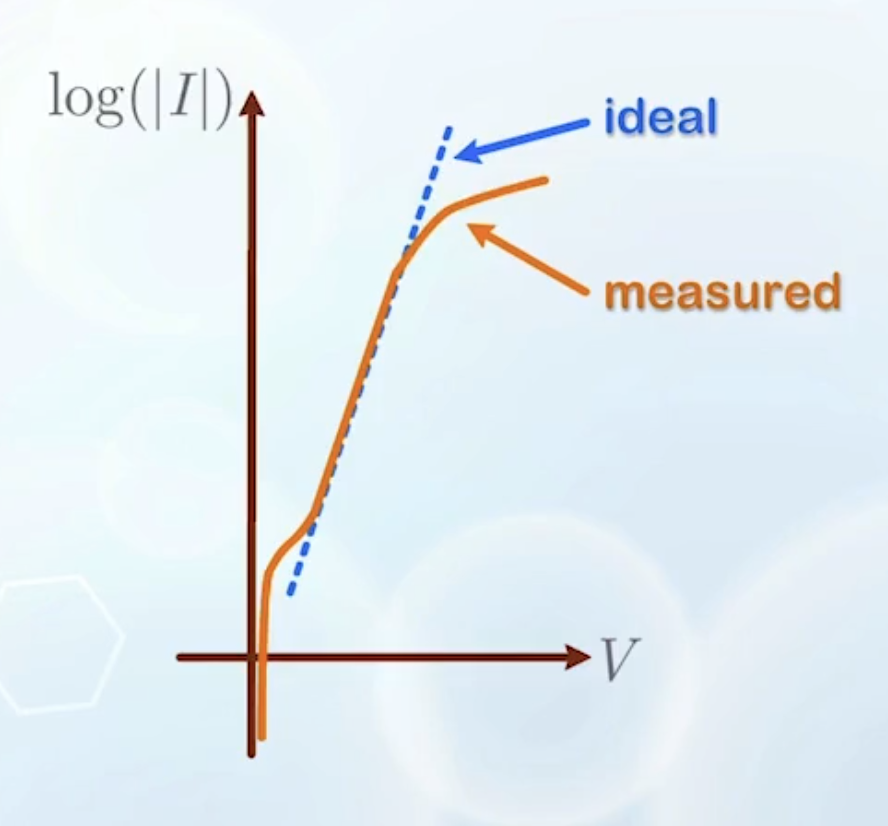
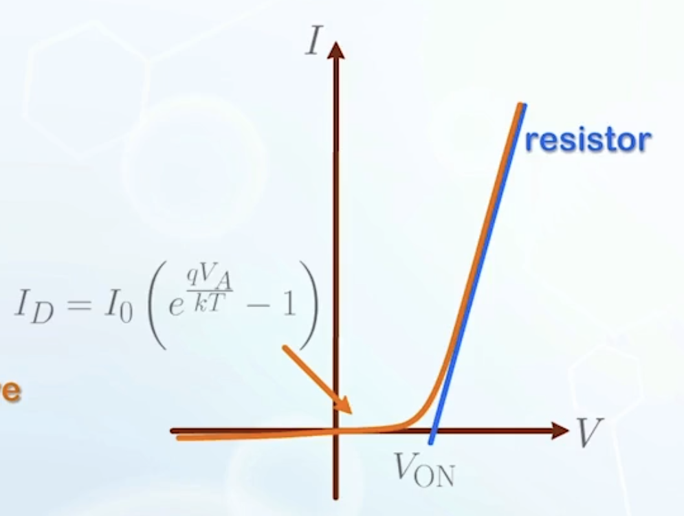
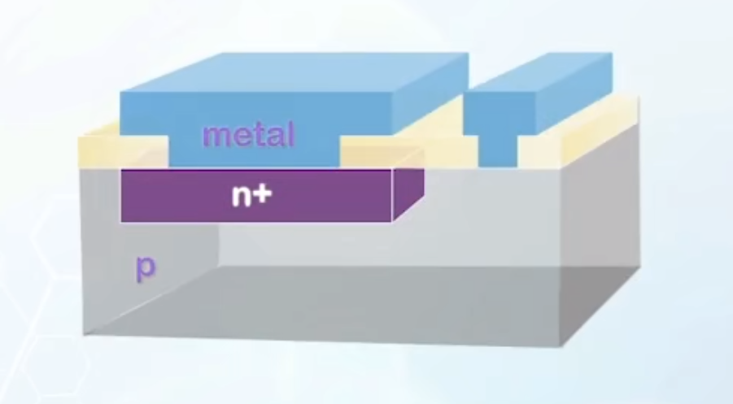
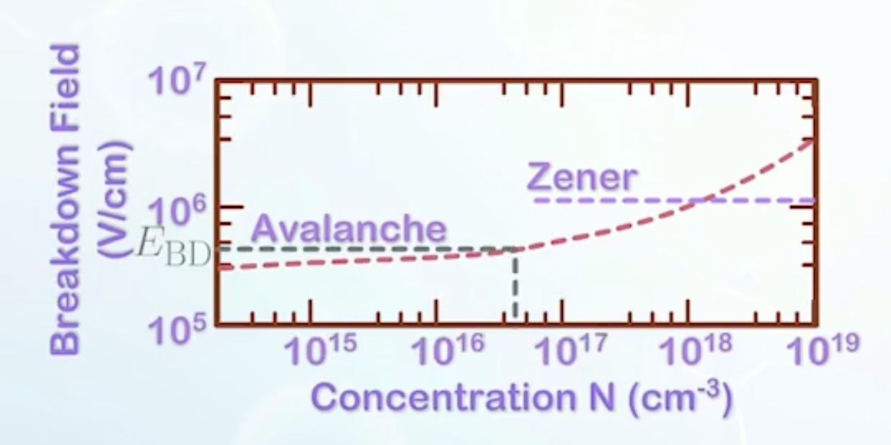
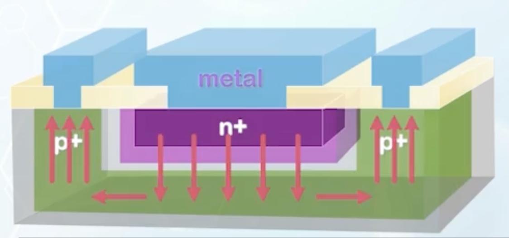

About non-ideal PN junction characteristics, PN junction turn-on, breakdown, temperature effects, and how to design a PN junction.

---

## Ideal Diode Current in Log Scale

$$
I = I_D (e^{\frac{qV_A}{kT}} - 1)
$$

$$
\log (|I|) = \log I_D + \log (|e^{\frac{qV_A}{kT}} - 1|)
$$

- When $V_A$ is small, $-1$ takes dominance, and $I$ decreases quickly in log scale
- When $V_A$ is large, $e^{\frac{qV_A}{kT}}$ takes dominance, and $I$ increases linearly in log scale
- The slope of the linear region can indicate how abruptly we can turn on the diode with applied voltage
  - $$
    \text{slope} = \frac{q}{kT} \log e
    $$
  - The unit of slope in log scale is a bit difficult to express, so we tend to refer
    $$
    \text{swing (}S\text{)} = \frac{1}{\text{slope}} = \frac{kT}{q} \ln {10}
    $$
  - Once $T$ is known, $S$ is fixed
  - :::warning A Very Important Reference
    At room temperature:
    - $S = 60 \, \text{mV/dec}$
      - This means that for every increase of $60 \, \text{mV}$ in the applied voltage $V_A$, the current $I$ increases by 10 times (one decade).
      - **Remember this value**
      - A smaller swing means a steeper slope, which means the diode can be turned on more abruptly with a smaller change in voltage
    - $V_{\text{th}} = \frac{kT}{q} = 25 \, \text{mV}$
      - Or $26 \, \text{mV}$, depending on the round off method
      - The **thermal voltage**
      - With the same unit as voltage

      :::

## Recombination Current in the Depletion Region

- The characteristics of a real diode differs from the real one
  - At low current, measured current is usually higher than the ideal one
  - When $V_A$ increases to close to $V_\text{bi}$, the increase in the measured current slows down
  - 
- The ideal equation assumes no recombination happens in the depletion region
- However, in reality, recombinations happen in the depletion region
- As discussed in the [previous chapter](../6/#carrier-recombination-in-long-diode), recombination is a mechanism that encourages a higher current flow
- Therefore, recombination in the depletion region leads to higher majority carrier current
  - This current can be ignored when $V_A$ is large
  - When $V_A$ is small, this current is observable

## High Level Injection

- The ideal equation assumes the number of injected minority carriers does not effect the majority carrier concentration
- However, when $V_A$ is large, the number of injected minority carriers can be comparable to the majority carrier concentration at equilibrium
- On the P side:
  - Electrons are injected from the N side
  - High level electron injection causes accumulation of negative charges
  - This accumulation of negative charges repels holes, causing holes to accumulate on the P side near the depletion region
  - This creates a diffusion force which drives holes away **against** its motion in the ideal forward bias case
  - This is the high-level injection effect
  - The accumulation of holes is insignificant when $V_A$ is small
  - But can be very significant when $V_A$ is large
- The high-level injection effect always takes place first **at the lightly doped side** (because the majority carrier concentration is lower)

## Complete PN Junction Turn-on

- When we further increase $V_A$ beyond $V_\text{bi}$, the depletion region disappears
- As discussed in [Chapter 1.5](../5/#conditions-under-forward-bias%E2%80%A6), the diode now behaves like a resistor
  - $I$ becomes proportional to $V_A$
  - Gives a straight line in linear scale
  - Shows saturating behavior in log scale

<!--new paragraph-->

- When you see the current increases with voltage, the diode is most likely to be **in the resistive region already**
  - So the ideal diode equation is only valid for the $I-V$ curve **close to zero**, or **before the diode turns on**
- **Fully turn-on region**: the resistive region when the depletion region disappears
- **Turn-on voltage $V_\text{ON}$**: Measured by extending the straight line in $I-V$ curve to cut the $V$ axis
  - 
  - The turn-on voltage for a silicon diode is assumed to be around $0.7 \, \text{V}$

## PN Junction Breakdown

- The ideal equation shows that the current remains small for any negative $V_A$
- However, in reality, when $V_A$ is negative and large enough, the current increases rapidly in the negative direction
- This is called **reverse breakdown**
- Two different mechanisms can cause reverse breakdown
  - **Avalanche breakdown**
    - A high electric field is created in the depletion region when $V_A$ is negative and large
    - This high electric field can accelerate carriers to very high speeds
    - These high-speed carriers can collide with atoms in the crystal lattice and generate electron-hole pairs
    - When the reverse bias is high enough, the additional electron-hole pairs, together with the original carriers, can create more collisions and generate even more electron-hole pairs, resulting in a large reverse current
    - It is like a avalanche caused by a small snowball
  - **Zener breakdown**
    - Recall the equation used to calculate the depletion region width:
      $$
      x_d = \sqrt{\frac{2\varepsilon_\text{Si} V_\text{bi}}{q} \left(\frac{1}{N_A} + \frac{1}{N_D}\right)}
      $$
    - When the doping concentration is very high, the depletion region width can be very small
    - For a narrow junction with high reverse bias voltage, the lateral separation between the conduction band and the valence band can be very small
    - This allows electrons in the valence band to tunnel through the energy barrier to the conduction
    - This tunneling effect can create a large reverse current
- Breakdown may **not** be destructive
  - If the current is limited, the diode can recover after the reverse bias is removed
  - What really destroys the diode is the heat generated by the large current, melting the junction

## Temperature Effects

- At high temperature, the impact of carriers added by doping is less significant
  - Both sides of the junction behave more like intrinsic semiconductors
  - $V_\text{bi}$ and $V_{\text{ON}}$ decreases
  - The junction will be less effective as a rectifier, more like a resistor
  - $I_D$ increases, leading to a higher reverse saturation current
  - The slope of the ideal region decreases, leading to a larger swing $S$, making the diode more conductive, the current becomes less sensitive to voltage change, and is more **difficult** to turn **off**
  - **Rectifying properties are degraded**

## PN Junction Design

- The current follows a more complicated 2D or 3D pattern
- For the heavily doped side, the resistance is relatively low and close to ideal, it can be doped as heavily as possible, subjective to the solid solubility limit
- The lightly doped side controls the properties of the diode
  - If we simply connect metal to the lightly doped side, the series resistance will be very high
  - The metal-semiconductor contact resistance is usually very high
  - And the current may concentrate on a small area, due to the non-uniform resistance distribution
- We wish to decrease the resistance by adopting a higher doping concentration, but this may significantly decrease the breakdown voltage
- Design goal: select a high enough doping concentration to reduce the series resistance, while maintaining a high enough breakdown voltage

---

- The breakdown condition is related to the maximum electric field in the depletion region
- The avalanche breakdown voltage can be plotted against the doping concentration on the lightly doped side
- Once the doping concentration passes a certain value, the Zener breakdown will take over
  - Once the **electric field/slope of the band** is known, the lateral separation between the conduction band and the valence band (tunneling distance) can be calculated
- It is important to understand how the electric field changes with doping concentration

---

- Recall how we calculate the depletion region width
  - $$
    x_{p/n} \approx \sqrt{\frac{2\varepsilon_\text{Si} (V_\text{bi} - V_A)}{q} \frac{1}{N_{A/D}}}
    $$
  - According to Gauss's law, the electric field in the depletion region is
    $$
    \frac{\mathrm{d}E}{\mathrm{d}x} = \frac{\rho}{\varepsilon_\text{Si}}
    $$
    Thus
    $$
    \vec{E}_{\text{max}} = -\frac{q N_{A/D} x_{p/n}}{\varepsilon_\text{Si}}
    $$
  - Now we have
    $$
    \vec{E}_{\text{max}} = -\sqrt{\frac{2q N_{A/D} (V_\text{bi} - V_A)}{\varepsilon_\text{Si}}}
    $$
- Now we have the relationship between the maximum electric field and the doping concentration
- To choose a proper doping concentration, we begin with an arbitrary concentration
- Then we can calculate $|\vec{E}_\text{max}|$
- We compare $|\vec{E}_\text{max}|$ with $E_\text{BD}$, which can be found in the avalanche breakdown curve
- If $|\vec{E}_\text{max}| < E_\text{BD}$, the doping concentration is acceptable
- Else, we need to reduce the doping concentration and repeat the process
- As an engineer, make sure to leave enough margin

---

- Besides the depletion region, a diode also consists of neutral regions
- The neutral regions contribute little to the rectifying properties of the diode, but contribute to the series resistance
  - We can increase the doping concentration to reduce the resistance
- We can also add another P contact to make the resistance more uniform at different locations

