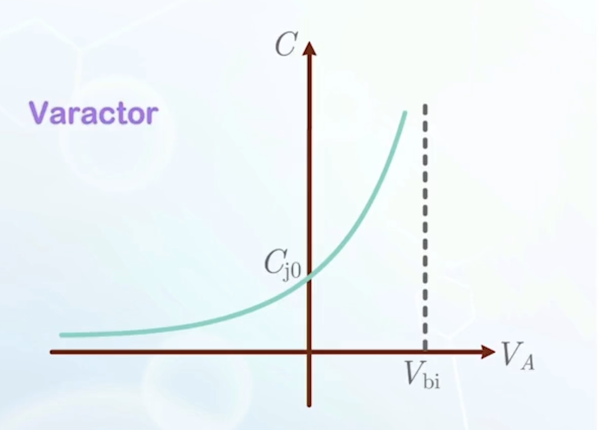
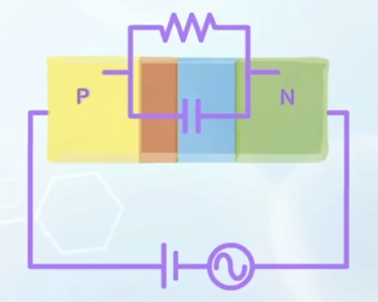
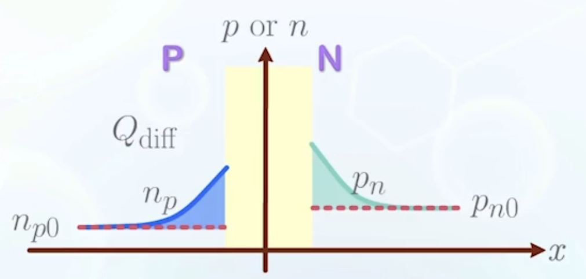
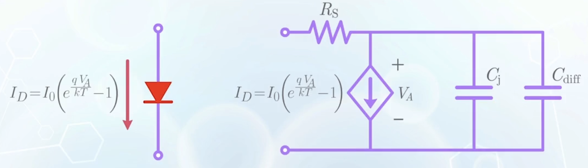
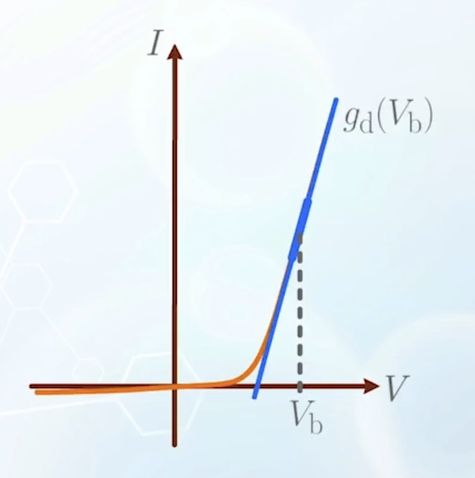
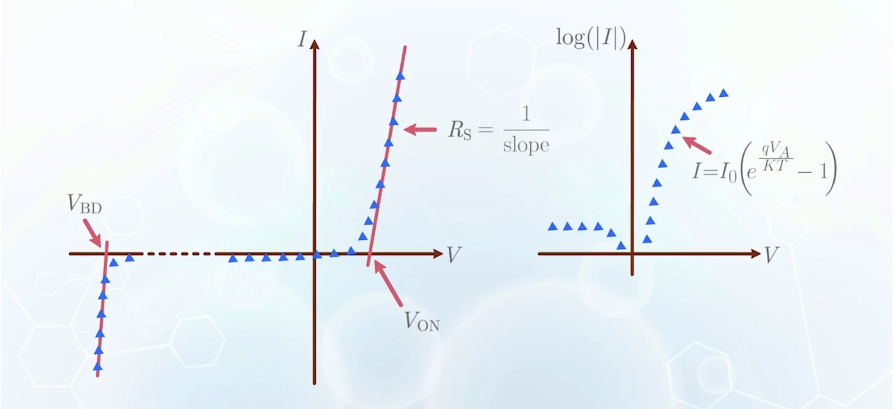

About the charge storage effects, PN junction diode models, and parameter extraction.

---

## Reverse Bias Junction Capacitance

- When switching a diode with time varying voltage, response may be delayed
  - Charges need to be accumulated to reach steady state
  - The delay can be modeled as a **capacitance** within the diode
- Under reverse bias, the diode can be modeled as an insulator sandwiched between two conductors, or a parallel-plate capacitor
  - The depletion region is the insulator
  - The P and N regions are the conductors
  - Its capacitance is denoted as $C_j$
  - $$
    C_j = \frac{\varepsilon_\text{Si} A}{W_d}
    $$
    where $A$ is the cross-sectional area of the junction, and $W_d$ is the width of the depletion region.
  - We normalize it with respect to area so we can drop $A$
  - Substituting $W_d$ from previous section, we have
    $$
    \begin{aligned}
    C_j &= \frac{\varepsilon_\text{Si}}{\sqrt{\frac{2\varepsilon_\text{Si} (V_\text{bi} - V_A)}{q} \left(\frac{1}{N_A} + \frac{1}{N_D}\right)}} \\
    &= \frac{\varepsilon_\text{Si}}{\sqrt{\frac{2 \varepsilon_\text{Si} V_\text{bi}}{q} \left(\frac{1}{N_A} + \frac{1}{N_D}\right)}} \frac{1}{\sqrt{1-\frac{V_A}{V_\text{bi}}}} \\
    &= \frac{C_{j0}}{\sqrt{1- \frac{V_A}{V_\text{bi}}}}
    \end{aligned}
    $$
    $C_{j0}$ is bias voltage independent, representing the junction capacitance at equilibrium (zero bias).
  - The function shows that
    - Lower doping concentration leads to lower junction capacitance, due to wider depletion region
    - Capacitance of a diode can be changed by applying different voltages, making it a **varactor** (variable capacitor), which can select a signal at a specific frequency, but rejecting others.
    - 

## Forward Bias Diffusion Capacitance

- Under forward bias, a current conduction path is established
  - The parallel-plate capacitor model is no longer valid
  - The diode can be modeled as a resistor in parallel with a capacitor
  - 
- For non-linear capacitors (as the case here), capacitance is defined as
  $$
  C = \frac{\mathrm{d}Q}{\mathrm{d}V}
  $$
  where $Q$ is the charge stored in the diode, and $V$ is the applied voltage.
- A PN junction under forward bias stores two kinds of charge
  - The charges in the depletion region, which has already been modeled as $C_j$ in the previous section
  - The charges of excess minority carriers injected from the opposite sides, temporarily stored before leaving (small under reverse bias, so we ignored it)
  - 
  - Carrier concentration at thermal equilibrium is not counted as stored charge since the system is electrically neutral
  - The excess minority carrier charge (**diffusion charge**) in P side is
    $$
      Q_{\text{diff}, n} = \frac{1}{2} q (n_{pd} - n_{p0}) L_n
    $$
    which is the size of the shaded area in the graph approximated as a triangle
    - Assuming injected carriers $\gg$ equilibrium carriers, we can drop $n_{p0}$
      $$
      \begin{aligned}
        Q_{\text{diff}, n} &= \frac{1}{2} q n_{pd} L_n \\
        &= q\frac{L_n}{2} n_{p0} e^{\frac{q V_A}{kT}}
      \end{aligned}
      $$
  - Adding the contribution from N side, we have the total diffusion charge
    $$
    Q_\text{diff} = \frac{q}{2}(L_n n_{p0} + L_p p_{n0}) e^{\frac{q V_A}{kT}}
    $$
  - Differentiating it with respect to $V_A$, we have the diffusion capacitance
    $$
    C_\text{diff} = \frac{\mathrm{d}Q_\text{diff}}{\mathrm{d}V_A} = \frac{q^2}{2kT}(L_n n_{p0} + L_p p_{n0}) e^{\frac{q V_A}{kT}}
    $$
    Or simplified as
    $$
    C_\text{diff} = \frac{q Q_\text{diff}}{kT} = \frac{Q_\text{diff}}{V_\text{th}}
    $$
    where $V_\text{th} = \frac{kT}{q}$ is the thermal voltage

## Large Signal PN Junction Model

- The ideal PN junction current-voltage relationship is
  $$
  I_D = I_0 \left(e^{\frac{q V_A}{kT}} - 1\right)
  $$
  which can be represented as a voltage-controlled current source
- The neutral regions can be represented as resistor $R_S$
- To account for the charge storage effects, we add two capacitors in parallel
  - $C_j$ for junction capacitance
  - $C_\text{diff}$ for diffusion capacitance
  - $C_j$ dominates under reverse bias, while $C_\text{diff}$ dominates under forward bias, so we may only need to calculate one of them depending on the bias condition

## Small Signal PN Junction Model

When PN junction can only be operated over a small region around a bias voltage $V_b$

- The $I-V$ relationship can be approximated as the tangent of curve at that bias point
- The voltage-controlled source can be replaced with a resistor whose conductance is $G = g_d(V_b)$
- $g_d$ can be obtained by differentiating ideal diode equation with respect to voltage
  $$
  \begin{aligned}
  g_d(V_b) &= \left. \frac{\mathrm{d}I_D}{\mathrm{d}V_A} \right|_{V_A = V_b} \\
  &= \left.\frac{\mathrm{d} I_0 \left(e^{\frac{q V_A}{kT}} - 1\right) }{\mathrm{d}V_A} \right|_{V_A = V_b} \\
  &= \frac{q}{kT} I_0 e^{\frac{q V_b}{kT}} \quad \text{(simplified by dropping -1)} \\
  &= \frac{I_D(V_b)}{V_\text{th}}
  \end{aligned}
  $$
- All other components ($R_S$, $C_j$, $C_\text{diff}$) are evaluated at $V_b$ and becomes a fixed value

## PN Junction Diode Parameter Extraction

A sample data sheet provided by diode manufacturer:

**CHARACTERISTICS** 
$T_j = 25 \,{}^\circ \text{C}$ unless otherwise specified$

| SYM.     | PARAMETER                 | CONDITIONS                                                    | MAX. | UNIT        |
| -------- | ------------------------- | ------------------------------------------------------------- | ---- | ----------- |
| $V_F$    | forward voltage           | $I_F = 100\,\text{mA}$                                        | 1    | $\text{V}$  |
| $I_R$    | reverse current           | $V_R = 200\,\text{V},\ T_j = 150\,{}^\circ\text{C}$           | 100  | $\text{nA}$ |
| $C_d$    | diode capacitance         | $f = 1\,\text{MHz},\ V_R = 0$                                 | 2    | $\text{pF}$ |
| $V_{BR}$ | reverse breakdown voltage |                                                               | 300  | $\text{V}$  |
| $R_S$    | series resistance         | $V_F = 2\,\text{V}$                                           | 3    | $\Omega$    |
| $n$      | ideality factor           | $V_F = 0.5\,\text{V}$                                         | 1.05 |             |
| $t_{rr}$ | reverse recovery time     | when switched from $I_F = 300\,\text{mA},\ R_L = 100\,\Omega$ | 50   | $\text{ns}$ |

These values are mesured instead of calculated, and the process is called **parameter extraction**.

It is the process to find the values of these unknown parameters so that the values predicted by the model give the best fit to the experimental data

- $I_0$ can be read from the reverse saturation current in the log scale graph
- In the forward bias region, before the diode fully turns on, the ideal diode equation may not match the experimental data, due to non-ideal effects
  - The ideality factor $n$ is introduced to account for these effects
  - The modified ideal diode equation is
    $$
    I_D = I_0 \left(e^{\frac{q V_A}{\boldsymbol{n} k T}} - 1\right)
    $$
  - For an ideal diode, $n=1$, while for a real diode, $n$ is typically between 1 and 2
