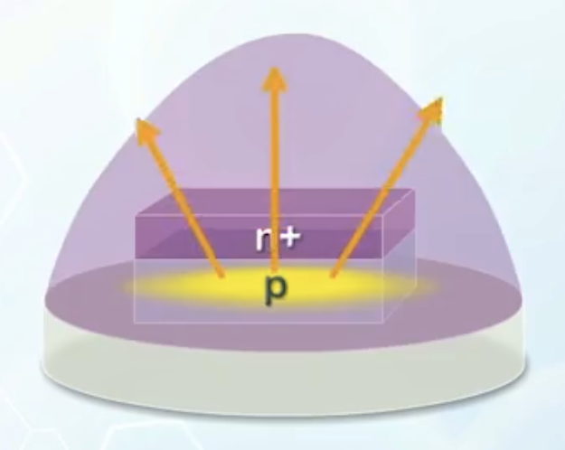

About the optical properties of PN junctions, how to apply them to photo detectors, solar cells, and LEDs, and how to design these devices for better performance.

---

## Optical Properties of Semiconductors

- Electron-hole pairs will be generated when energy is supplied
  - The energy can come from thermal energy
  - But can also come from light (particles called photons)
    - The energy is related to its wavelength
    - $$
      \text{energy} = \frac{hc}{\lambda}
      $$
    - With given units:
      $$
      \text{energy} = \frac{1.24}{\lambda \, (\mu\text{m})} (\text{eV})
      $$
- If the photon energy is higher than the bandgap energy, it will be absorbed and excite an electron from valance band to conduction band
- If the photon energy is lower than the bandgap energy, it will not be absorbed, but transmitted through the material
  - Explains why transparent materials are usually insulators with large bandgap
- Wavelength of visible light is from $0.4$ to $0.7 \, \mu\text{m}$, corresponding bandgap is from $3.1$ to $1.8 \, \text{eV}$
  - Silicon absorbs light from infrared to the entire visible spectrum
- When electron-hole pairs are generated by light absorption, generated carriers tend to move together by diffusion, so **the net current is 0**. They will eventually recombine in a region without light
- But if light is shining on the depletion region of a PN junction, the electric field will cause electrons and holes to move in opposite directions, leading to a current when both sides of junction are shorted, having the same voltage
  - The short-circuit current $I_{\text{SC}}$ or $I_\text{photo}$, proportional to illumination intensity
  - The current flows from N side to P side, so it is **negative** according to the convention of PN junction diode current equation
  - With bias voltage applied, the total current is the sum of **bias-induced** PN junction current and the **photo-induced** optical current:
    $$
    I = I_{D0} \left( e^{\frac{qV_A}{kT}} - 1 \right) - I_{\text{photo}}
    $$
  - In the I-V curve:
    - At higher light density, the curve shifts downwards
    - The curve cuts the $V$ axis at open-circuit voltage $V_{\text{OC}}$
      - Happens when the reverse $I_{\text{photo}}$ is balanced out by the forward diode current at $V_{\text{OC}}$

## Photo Detectors

- A simple photo detector circuit
  
  - A reverse bias is applied, and the diode current is equal to $I_{\text{photo}}$ because the reverse current is very small
  - Without light, the output voltage is $0$ because the diode behaves like an open circuit
  - With light, the output voltage is:
    $$
    V_{\text{out}} = I_{\text{photo}} R
    $$
    This means the output voltage is proportional to $I_{\text{photo}}$, thus proportional to the light intensity

## Solar Cells

- In a photo detector circuit, the PN junction is forced to work in reverse bias mode, or the 3rd quadrant of the I-V curve, where power is consumed (like a resistor)
  - The current flows from P side to N side, **following** the voltage polarity
- In a solar cell, a current is generated to flow from the N side terminal to the P side terminal
  - The current is fed to the resistor and generates a forward bias within the diode
  - The diode now works in the **4th quadrant** of the I-V characteristic, where the direction of current flow is **opposite** to the voltage polarity
  - Converts optical energy to electrical energy, is a solar cell
  - The operation point of the circuit is determined by the I-V curve of the diode, and the resistor load
- Define P -> N to be positive:
  
  - $(V_\text{O}, I_\text{O})$ operation point
  - Shaded area: power
  - Maximum voltage from a solar cell is limited by $V_{\text{bi}}$
    - For silicon based solar cell, usually $< 1\, \text{V}$, as $V_{\text{bi}}$ has to be smaller than bandgap energy
      :::info Why?
      - Fermi level on both side has to be within the bandgap
      - Fermi level must align at equilibrium
      - It is only possible when $qV_{\text{bi}} < E_G$

      :::

    - For higher voltage output, multiple cells are connected in series
    - The current, voltage, and power output provided by a solar cell can vary significantly with the illumination intensity and the load resistance, thus a **voltage regulator** is usually required to stablize the output voltage

## Solar Cell Materials

- Solar cells fabricated using single crystal silicon is still quite expensive
  - As single crystal silicon is produced from molten silicon at very high temperature, which is energy intensive and polluting
- Light can only penetrate to a small depth from the top, on a PN junction on a wafer surface
  - A large portion of substrate material below the penetration depth is only used as mechanical support
- In second generation solar cells, thin film technology is used to form a thin solar cell on a low-cost substrate, usually glass
  - Silicon on the supporting substrate is formed by depositing the material using silicon atom carrying gas, such as Silane ($\text{SiH}_4$), which can be performed at a much lower temperature (400 – 600 °C instead of ~1400 °C)
  - The deposited film will have either polycrystalline or amorphous structure, due to the mismatch of atomic spacing between the supporting substrate and the thin-film material
    - Depositing silicon at low temperature usually leads to amorphous structure, and the grain size increases with temperature
    - At sufficiently high temperature, polycrystalline structure can be formed on the supporting substrate
    - Grain boundaries exist regardless of polycrystalline or amorphous structure, which cause scattering when carriers move from one grain to another, leading to worse performance than single crystal silicon solar cells
  - The thin-film material will also have defects and stability issues
  - But the cost is much lower and can cover a much larger area
- Third generation solar cells
  - Using organic materials
  - Low temperature production
  - Short turnaround time
  - Easy disposal
  - Low efficiency
  - Low reliability inherent to organic materials

## Solar Cell Design

Although solar cells are basically a simple PN junction, some design optimizations are needed to achieve high energy conversion efficiency.

- When light shines on the solar cell, part of the light is absorbed, while part is reflected
  - To increase absorption and reduce reflection, an **anti-reflection coating** is usually applied to the surface
    - This is why solar cells look dull from the light absorbing surface
- To allow maximum amount of light to enter the depletion region, the **top layer of PN junction has to be thin**, so that the depletion region is closer to the top of the wafer
- The depletion region has to extend **deep enough** to absorb all the light entering the diode
  - This can be achieved by using **lightly doping** on one side of the junction
  - But it also decreases $V_\text{bi}$, limiting the maximum possible voltage
  - To achieve both high $V_\text{bi}$ and deep depletion region, an **intrinsic/lightly doped layer** can be inserted between two **heavily doped P+ and N+** regions, forming a **PIN diode**
    - In this structure, the intrinsic layer will be totally depleted, and the thickness of the intrinsic layer can be used to adjust the depletion width
    - On the other hand, $V_\text{bi}$ is determined by the two heavily doped side, and can be adjusted to be close to the bandgap voltage
- Contacts have to be added to the top and bottom layers **without blocking the light**
  - So they are usually arranged into strips to minimize the distance from any location on the top layer of the surface of the junction to the metal line
  - Another approach is to use transparent electrodes to cover the entire surface

## Light Emitting Diodes (LEDs)

- Light is absorbed during electron-hole generation
- The reverse combination process can emit light energy
  - A semiconductor can be used as a light source when substantial recombination occurs
  - For example, light is emitted in a long PN junction under forward bias because of recombination
- We usually cannot see the emitted light
  - Recombination takes place deep inside the silicon crystal
  - The energy of emitted photons is, in general, governed by $E_G$
    - Silicon has a bandgap of $1.1 \, \text{eV}$, corresponding to infrared light, which is invisible to human eyes
    - We need materials with larger bandgap to emit visible light
    - Organic materials can also be used to form OLEDs
  - Due to the use of large bandgap materials, LEDs usually have a larger built-in potential, thus resulting in a larger turn on voltage $V_\text{ON}$
    - Typically, $V_\text{ON}$ is about $3 \, \text{V}$ for a blue LED
- Designing LED structure to achieve high efficiency
  - We want to have all electrons and holes recombine **before reaching the end of the diode** -> **a very long diode**
  - However, a long diode will push the region of light generation deep inside the solid, making it difficult for light to escape to the surface
  - To force more recombination over a shorter neutral region, a **heterogeneous** structure using materials of different bandgaps is often used
    
    - Electrons and holes are injected and trapped by the higher bandgap material, leading to more recombination in a shorter distance
    - All currents are recombination current to ensure efficient conversion from electrical energy to optical emission
  - The shape of LEDs also need to be carefully designed
    - In most LED applications, light emits only in a particular direction
      - Light generated in the LED radiates in all directions
      - The **bottom surface should be reflective** to increase the light intensity in a particular direction of interest
      - At the same time, **reflection from the top surface should be avoided**
      - When light reaches the top surface, total reflection may occur if the incident angle is larger than the critical angle, which will reduce the intensity of emitted light
      - To avoid total internal reflection
        - The semiconductor material may be structured into a **dome shape**, so that most radiating light will be emitted in a direction perpendicular to the top surface
        - Or use some capping material with a similar reflective index to that of the light emitting material, to shape the upper surface
          
      - In case of LED with small light-emitting area, it can be structured like a **trapezoid**, with slope sides to confine the direction of emitted light
        
