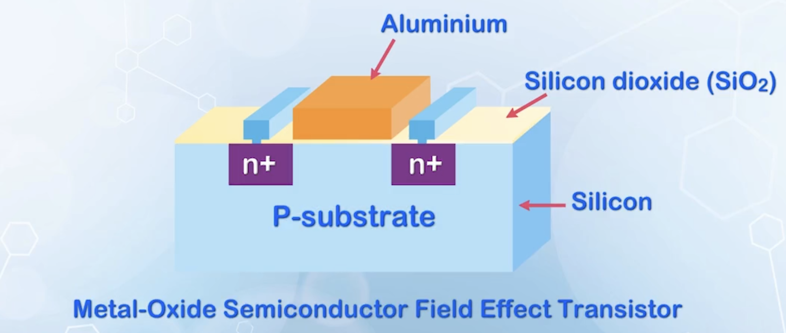
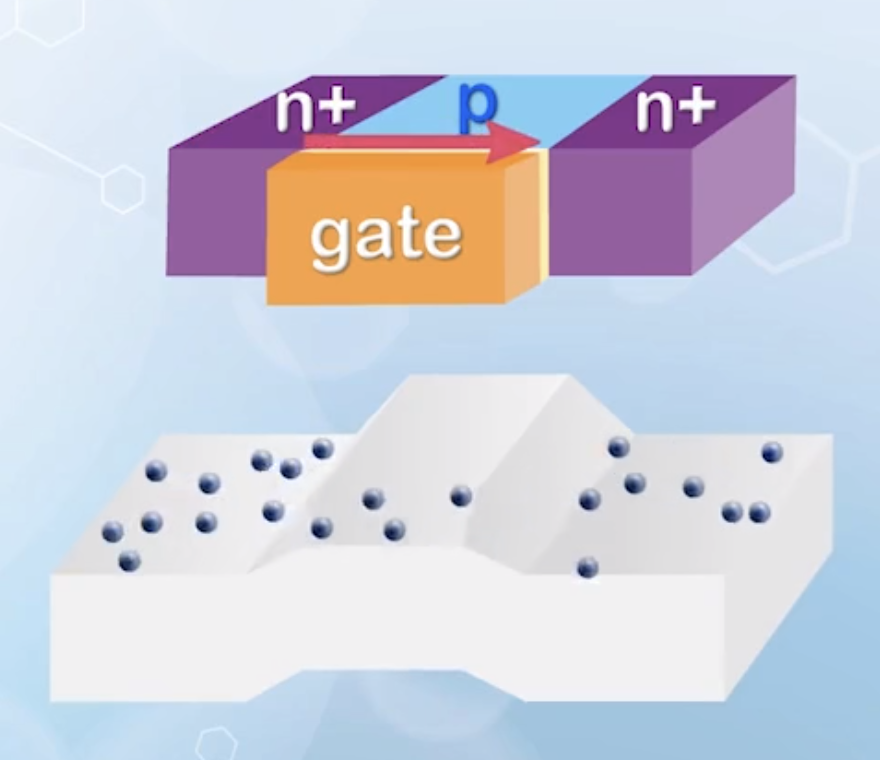
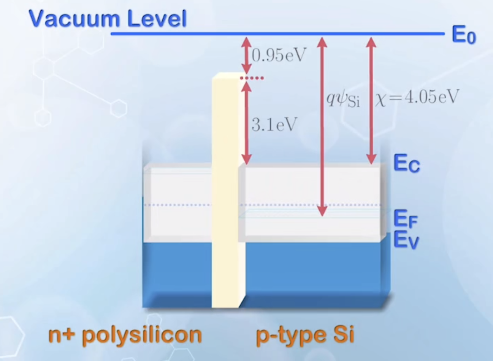
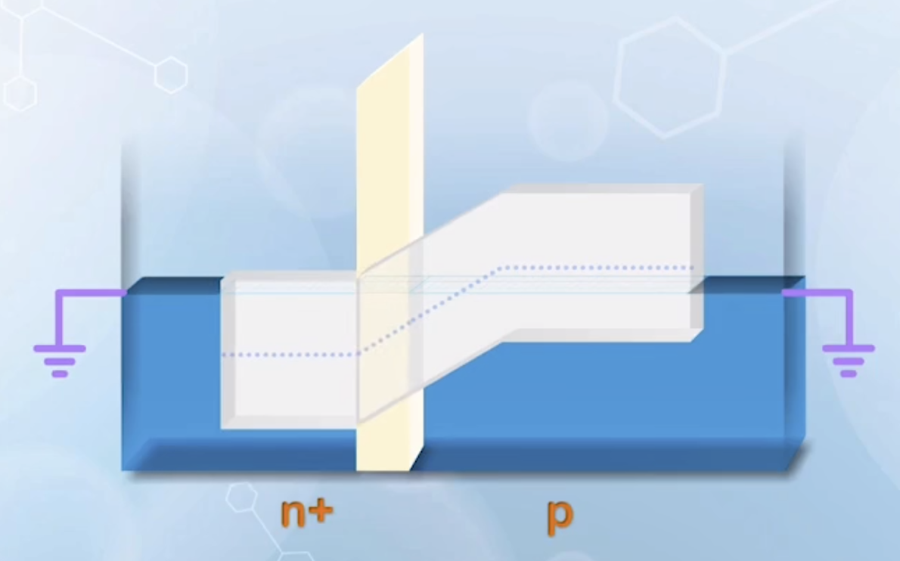
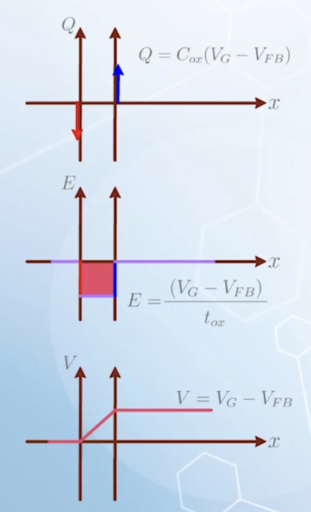
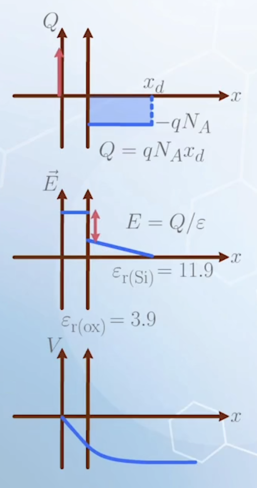
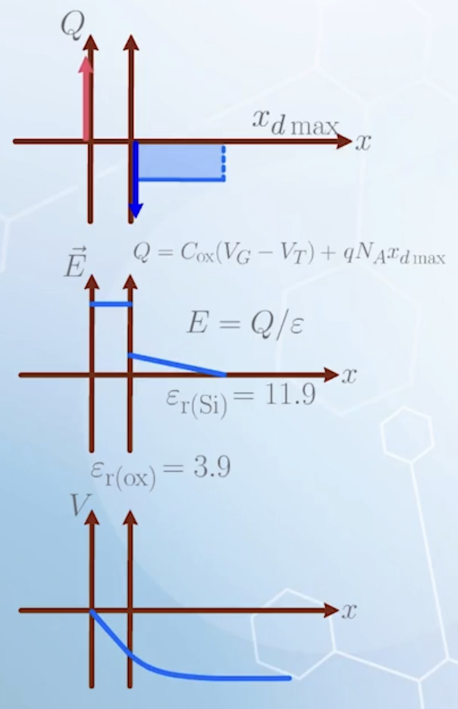

About the structure of MOSFET, MOS capacitor, the charge, electric field and potential distribution in accumulation, depletion and inversion modes.

---

:::info About this series
This is a series of notes based on the video course **_<a href="https://courses.edx.org/courses/course-v1:HKUSTx+ELEC3500.2x+1T2020/course/" color-inherit>Principle of Semiconductor Devices Part II: Field Effect Transistors and MOSFETs</a>_**.

Repost videos with Chinese subtitles is available on <a href="https://www.bilibili.com/video/BV1JE411H7Lp" color-inherit>bilibili</a>.

Images, unless otherwise stated, are taken from the course videos.
:::

## Structure of a MOSFET

When controlling a BJT, we supply a controlled current flow to the P region (NPN). This is equivalent to a electrical connection to the P region through a resistor.

We can also apply a controlled voltage to the P region through a capacitor, forming a **field effect transistor (FET)**, classified similar to BJTs into N-type and P-type FETs.

Actual materials may differ, but we always assume the dielectric is silicon dioxide ($\ce{SiO2}$), and the substrate is silicon ($\ce{Si}$), as they are the most widely used material systems.

The substrate is mainly used for mechanical support, and can be removed for analysis.

The effect of voltage through a capacitor can only penetrate a small distance into the semiconductor, so conduction occurs only in a thin layer near the oxide-semiconductor interface.

With positive voltage applied to one of the N+ terminals relative to the other, electrons will be drained to the terminal.

The terminal with higher voltage is called the **drain**, and the other terminal is called the **source**.

In BJT, the base region is considered as a conductor, and the voltage at two ends of the base region is the same. But in MOSFET, the capacitor drops the voltage from the front to the back, so the voltage must be considered separately. Thus the MOSFET is a **four-terminal device**. The terminal of the controlling capacitor is called the **gate**, and the terminal connected to the opposite end of the gate is called the **substrate** or **body**.

Ignoring the source and drain, the substrate and gate together form a **MOS capacitor**, and it is a **two-terminal device**.

## Structure of a MOS Capacitor

The MOS capacitor is formed by sandwiching silicon dioxide between a metal layer and the silicon substrate.

- About the band diagram:
  - **Metal**: the band structure is just represented by its Fermi level
  - **Oxide**: similar to semiconductor, but with a larger band gap
  - Vacuum level is taken as a common reference
  - Metal work function $q \psi_\text{M}$: from vacuum level to Fermi level in metal
  - Electron affinity of oxide: from vacuum level to conduction band edge in oxide ($\sim 0.95 \, \text{eV}$)
  - Electron affinity of silicon $\chi$: from vacuum level to conduction band edge in silicon ($\chi = 4.09 \, \text{eV}$)
  - Work function of silicon $q \psi_\text{Si}$: from vacuum level to Fermi level in silicon
  - Assuming the work function of metal is the same as that of silicon, and the substrate is **moderately doped p-type silicon**
  - For n-type silicon:
    
- Heavy doped polysilicon has replaced metal as the gate electrode since around 1970, which can withstand high temperature that simplified fabrication process. The properties of polysilicon have been discussed in [part 1](../../part-1/9/#solar-cell-materials)
- More recently, the gate electrode has become a very complex multiple material gate stack, but we will be focusing on the MOS capacitor with **polysilicon gate** in this course.

<!-- new paragraph -->

- **Flat band condition**: all energy bands in the structure are flat
  
- When the two ends are connected to the same potential, or ground, the system is at thermal equilibrium, and the Fermi levels on both sides are aligned
- The band diagram is similar to a PN junction, treating the N+ polysilicon as N+ silicon, except that there is an insulator in the depletion region
  
- The N+ region is much more heavily doped than the P region, so the depletion region in the N+ side can be ignored, and the band diagram for the gate terminal is considered flat
- We only care the Fermi level for the gate terminal, thus the N+ region can be treated as a metal
- The energy difference between two sides are similar to $q V_\text{bi}$, but is dropped across the oxide layer and the silicon substrate
  - **Surface band bending $\boldsymbol{\phi_\text{S}}$**: the potential drop on the substrate side, measures the downward bending of the energy bands at the oxide-semiconductor interface relative to the flat band condition, using $\phi$ instead of $\psi$ to distinguish the reference of voltage to the ground system between that to the vacuum level
  - The amount of voltage drop across the oxide $V_\text{ox}$ is measured by the energy difference $q V_\text{ox}$ at the two ends of the oxide
  - **No external voltage can be measured** between the two ends of the MOS capacitor, and the internal voltage is balanced by the voltage drop at the contacts
  - But **there are charges on the two sides of the oxide layer**
- Two achieve flat band condition, an external voltage $V_\text{G}$ must be applied to the gate terminal to raise the energy band at the gate
  - This voltage is **negative**
  - **Negative voltage moves the energy bands upward, and positive voltage moves the energy bands downward**
  - It is denoted as $V_\text{FB}$ (value is **negative**), the **flat band voltage**, equal to the difference in Fermi levels on the two sides of the capacitor in flat band condition, or the $V_\text{bi}$ of the PN junction with the oxide layer removed
  - For metal gate
    $$
    V_\text{FB} = \psi_\text{M} - \psi_\text{Si}
    $$
    equal to the built-in potential of the metal-semiconductor contact without the oxide layer

## Accumulation Mode

- Same amount of charges with opposite polarity will be accumulated on the two sides of a capacitor when a voltage is applied
- Assume **the gate is metal**
  - The accumulation of charges is achieved by either accumulating or depleting electrons on the metal-insulator interface
  - The electron concentration on the metal side is very high, assuming it is infinite
  - All accumulated or depleted charges only appear in an infinitely thin sheet that the interface, described by a $\delta$ function
- On the semiconductor side, there are two ways to supply the required charges:
  - Through the motion of **conduction band electrons**
  - Through the motion of **valence band holes**
  - One of the two will dominate, depending on the applied voltage
- The flat band is used as a reference, because there are no charges on either side of the oxide layer
  $$
    V_\text{G} = V_\text{FB}
  $$
- When $V_\text{G}$ is more negative than $V_\text{FB}$, or $V_\text{G} < V_\text{FB}$
  - The surface band bending is upward, $\phi_\text{S} < 0$
  - Negative charges are accumulated at the gate terminal, by accumulating electrons on the metal-oxide interface
  - Same amount of positive charges are accumulated on the silicon side
    - By accumulating holes in the valence band, or driving away electrons to leave excess fixed charge from the atom core of the dopants
    - The substrate is p-type, so there are fewer electrons to drive away, but many holes to accumulate on the semiconductor side
    - **Accumulation** dominates (by accumulating majority carriers)
  - All accumulated charges stays within a very thin layer near the oxide interface, we can assume that they behave like sheet charge with a minimal thickness, resembling a parallel plate capacitor
    - The accumulated charge is
      $$
        \begin{aligned}
        Q_\text{acc} &= C_{ox} (V_\text{G} - V_\text{FB}) \\
        C_{ox} &= \frac{\varepsilon_{ox}}{t_{ox}} && \text{normalized with respect to area} \\
        \varepsilon_{ox} &= \varepsilon_0 \varepsilon_{r(ox)} && \varepsilon_{r(ox)} \approx 3.9 \text{ for } \ce{SiO2}
        \end{aligned}
      $$
      where $t_{ox}$ is the oxide thickness
    - $Q$ under flat band is zero, so only a negative voltage beyond $V_\text{FB}$ is used to accumulate charges
    - A negative sign should be added to indicate the correct polarity of positive charges on the semiconductor side
      $$
        Q = - C_{ox} (V_\text{G} - V_\text{FB}) \quad \text{for } V_\text{G} < V_\text{FB}
      $$
      but we usually just use the magnitude of $Q_\text{acc}$, considering the sign of charge separately
  - Integrating the charge density with Poisson's equation will give the electric field
    $$
    \begin{aligned}
        E_{ox} &= \frac{C_{ox} (V_\text{G} - V_\text{FB})}{\varepsilon_{ox}} \\
        &= \frac{V_\text{G} - V_\text{FB}}{t_{ox}}
    \end{aligned}
    $$
    or just voltage over distance
  - Integrating the electric field will give the potential difference
    $$
    V= V_\text{G} - V_\text{FB}
    $$
    corresponding to the shape of the band diagram in the **oxide layer**
  - All the voltage drop in capacitor is **dropped across the oxide**

  

## Depletion Mode

- Starting from the flat band condition, we apply a slightly more positive voltage to the gate, $V_\text{G} > V_\text{FB}$
- The energy band on the silicon side will bend downward, giving a $\phi_\text{S} > 0$
- It will cause positive charges to accumulate on the gate side, by driving away electrons from the metal-oxide interface, or equivalently accumulating holes in metal
- On the semiconductor side, negative charges must accumulate to balance the positive charges on the gate side
  - By accumulating electrons in the conduction band
  - Or driving away holes in the valence band, leaving the negative core dopant ions in the crystal lattice
  - Again, the substrate is p-type, so there are many holes to drive away, but few electrons to accumulate
    - Driving away holes dominates
    - The p-type substrate is usually **moderately doped**, the density of negative core dopant ions contributed by doping $N_A$ is a few orders of magnitudes lower than the carrier concentration at the metal, or N+ polysilicon gate terminal
    - The charge will spread over some distance, similar to the depletion region of a N+/P junction on the lightly doped P side, instead of a thin sheet in the accumulation mode
    - Additionally, the charge cannot move around, as they come from fixed ionized dopant atoms
    - This is called the **depletion mode**
- We cannot use the parallel plate capacitor model here anymore
  - Assume the depletion region width on the silicon side is $x_d$
  - Then the accumulated charge is
    $$
      Q_\text{D} = q N_A x_d \quad \text{normalized with respect to area}
    $$
  - Integrating the charge density with Poisson's equation will give the electric field
    - There will be a discontinuity in electric field at the oxide-semiconductor interface, because of the permittivity factor in the equation
      $$
        E = \frac{Q}{\varepsilon}
      $$
    - At the interface, $Q$ needs to be divided by two different permittivity values
      $$
      \begin{aligned}
        \varepsilon_{r(ox)} &= 3.9 \\
        \varepsilon_{r(\text{Si})} &= 11.9
      \end{aligned}
      $$
      There will be a drop when the electric field leaves the oxide layer and enters the silicon substrate
    - The electric field is similar to a PIN diode mentioned [earlier](../../part-1/9/#solar-cell-design)
  - Integrating the electric field will give the voltage difference
  - When the discontinuity is removed, it still corresponds to the shape of the band diagram
    
- When we continue to increase $V_\text{G}$ to cause more band bending, the mid-gap energy may become lower than the Fermi level at the oxide-semiconductor interface
  - $\phi_\text{S} > \phi_\text{B}$, where $\phi_\text{B}$ is the difference between the Fermi level and the mid-gap energy in the bulk semiconductor away from the interface
    $$
    \phi_\text{B} = \frac{kT}{q} \ln{\frac{N_A}{n_i}}
    $$
  - The Fermi level at the interface is closer to the conduction band than the valence band, meaning that the hole concentration is lower than the electron concentration at the interface
  - In this case, accumulating electrons in the conduction band may be more effective than driving away more holes in the valence band, after many holes have already been depleted
  - But the amount of electrons are still small compared to holes at the end of the depletion region, so the depletion mechanism continues, and the depletion region continues to extend
  - The band diagram, electric field and potential extends in a similar way

## Inversion Mode

- When we continue to increase $V_\text{G}$, the band banding at the interface may cause $\phi_\text{S} > 2 \phi_\text{B}$
- The separation between the conduction band and the Fermi level at the interface will become equal to, or smaller than the separation between the Fermi level and the valence band in the bulk silicon
  :::info Why?
  - The separation between the conduction band and the Fermi level at the interface is
    $$
    \frac{E_G}{2} + q \phi_\text{B} - q \phi_\text{S}
    $$
  - The separation between the Fermi level and the valence band in the bulk silicon is
    $$
    \frac{E_G}{2} - q \phi_\text{B}
    $$
  - When $\phi_\text{S} > 2 \phi_\text{B}$, the first separation is smaller than the second separation
    :::
- The electron concentration at the interface will be higher than the hole concentration anywhere in the bulk
- Now, supplying the required negative charge on tge semiconductor side by accumulating electrons will be more effective
  - The depletion region will stop expanding, and its width reaches a maximum value $x_{d \text{max}}$
- Further increasing $V_\text{G}$ will cause gathering of electrons at the oxide-silicon interface
- Electrons can move around compared to the fixed dopant ions, forming a thin layer of negative charges
- This is called the **inversion mode**, as the surface region is now inverted to N-type
- To calculate the charge density on the silicon side, we have to calculate both the dopant ions and the thin sheet of electrons
  - The accumulated electrons will not become significant until $\phi_\text{S}$ exceeds $2 \phi_\text{B}$
  - Denote the voltage at this point as $V_\text{T}$, and it is a fixed number
  - All extra voltage beyond $V_\text{T}$ will be used to accumulate electrons, similar to the accumulation mode
  - The gathered electrons again behave like a sheet of charges, the equation of parallel plate capacitor can be used again
  - The total charge density on the silicon side is given by
    $$
      Q_\text{total} = C_{ox} (V_\text{G} - V_\text{T}) + q N_A x_{d \text{max}} \quad \text{for } V_\text{G} > V_\text{T}
    $$
    the first term is the charge formed by electrons, denoted as $Q_\text{inv}$
- The majority carrier of the P type silicon at the silicon dioxide interface has changed from holes to electrons, thus the name **inversion**, or **strong inversion**
- $V_\text{T}$ marks the boundary of $V_\text{G}$ between depletion mode and inversion mode
- Again, integrating the charge density with Poisson's equation will give the electric field, and integrating the electric field will give the potential difference, similar to depletion mode
  
- Note that the discontinuity in electric field at the oxide-semiconductor interface will be larger than that in depletion mode, because of the electron sheet charge, regarded as a $\delta$ function, will cause a sudden change after integration

## When the Gate is Polysilicon...

The charge at the gate side formed by metal is much simpler, because it can be regarded as sheet charge for both negative and positive charges, without depletion consideration.

When the gate is N+ polysilicon, the doping is usually a few orders of magnitude higher than the substrate doping.

The depletion region in the heavily doped side is much smaller than that in the lightly doped side, so even the depletion charge on the gate side can be considered as sheet charge to simplify the analysis.

In this case, the behavior of the N+ polysilicon can be treated as metal, so we can focus on the analysis on the behavior of charges on the bulk silicon side, which is more important.