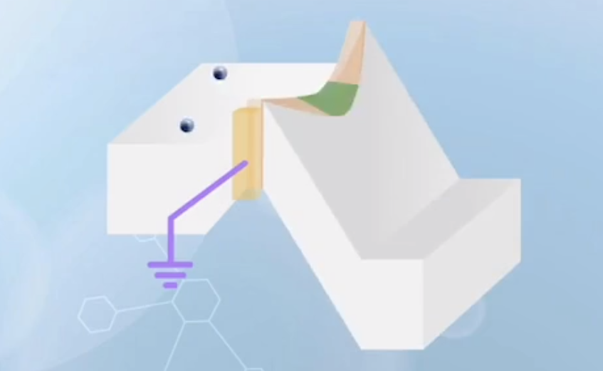
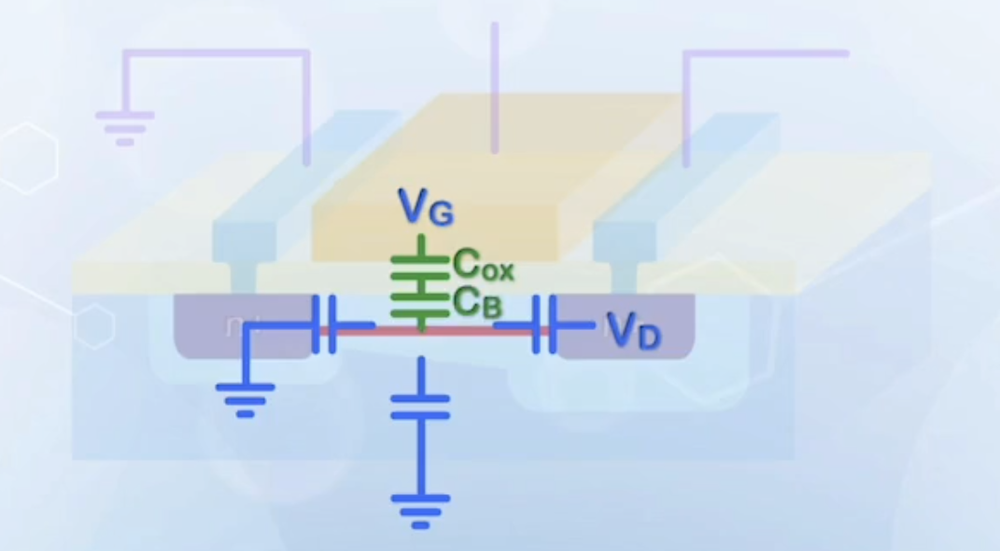
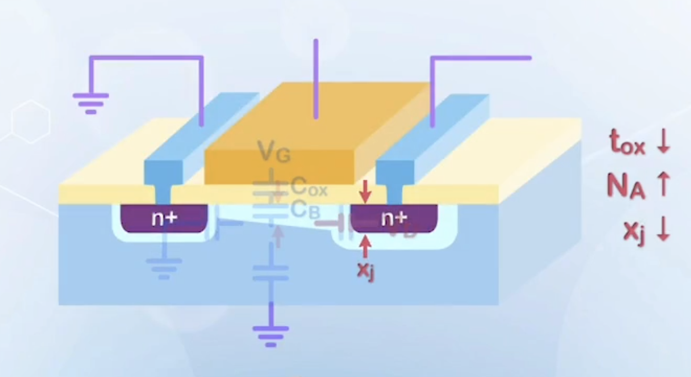
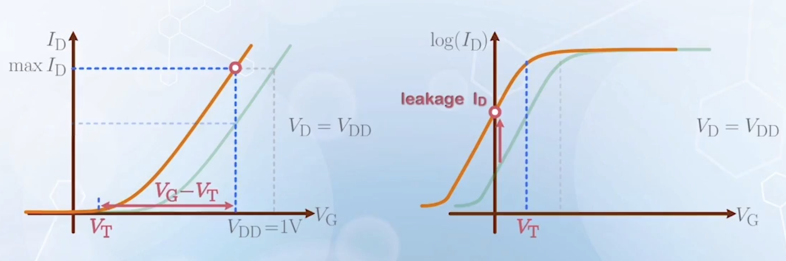
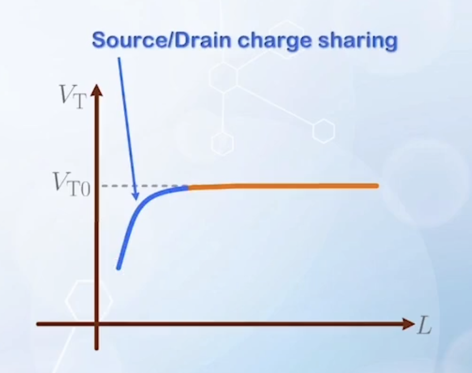
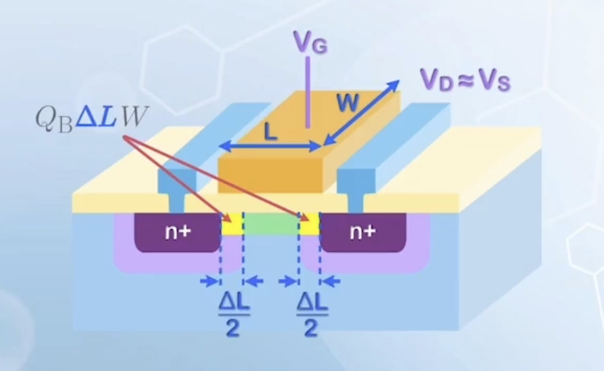
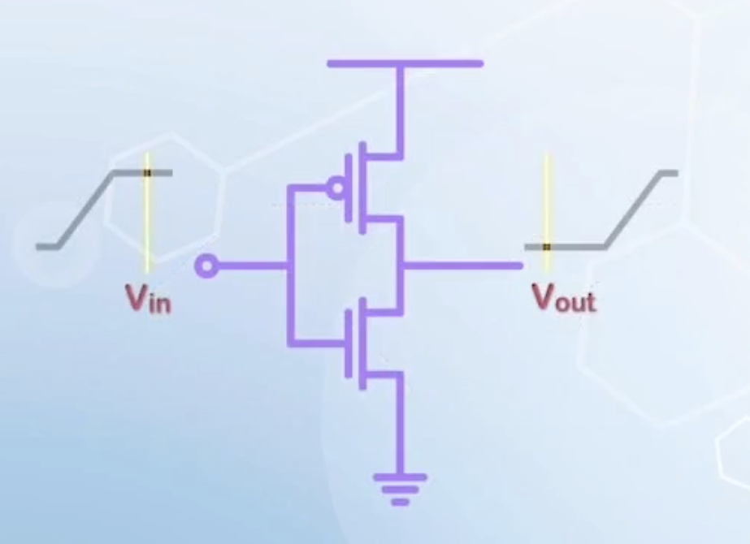
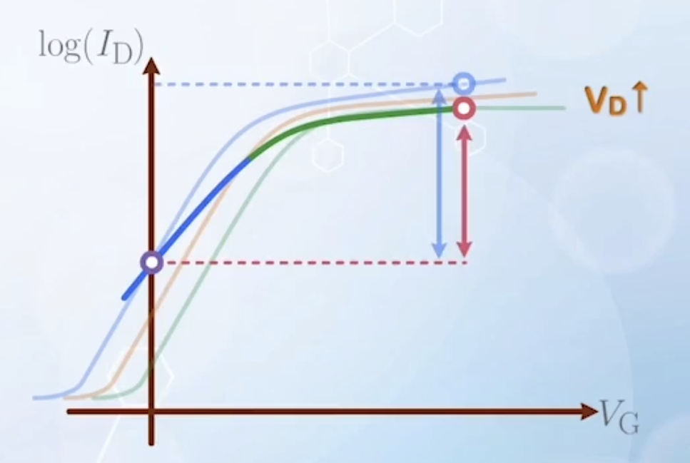
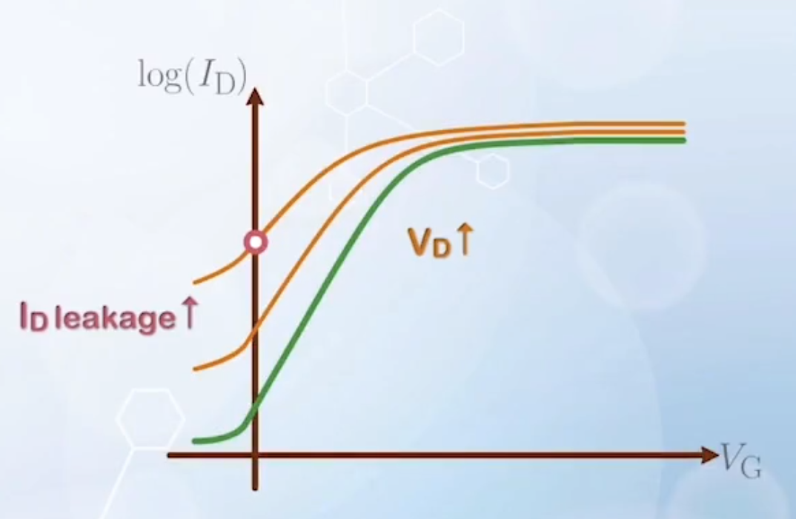
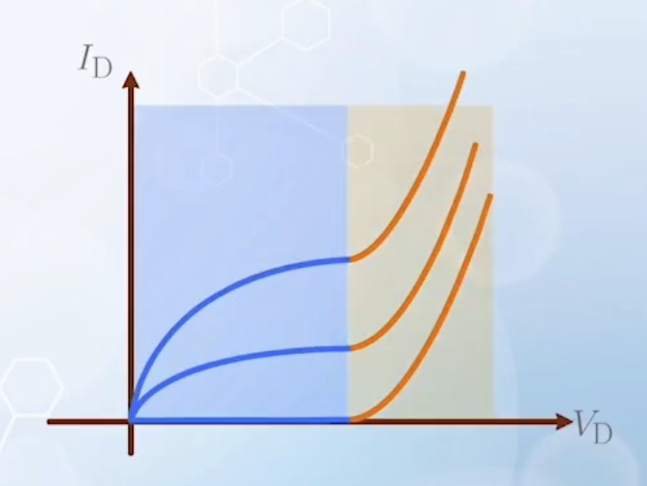

About the challenges and solutions with short channel MOSFET design, including threshold voltage scaling, source / drain charge sharing, drain induced barrier lowering and punchthrough.

---

## Short Channel MOSFET Design

Besides overcoming fabrication challenges, proper device design is needed to achieve desired performance of small MOSFETs.

The main purpose of a transistor is to serve as an switch, and a good switch should have a high current drive when turned on, and zero when turned off.

When channel length is short, giving high current when turned on is not a problem, the problem is how to turn it off completely.

Consider a long MOSFET with the electric potential of the channel controlled by the gate. When the gate is grounded, energy band in the channel is pulled up, with no electrons flowing in the channel. When drain voltage is applied, it pulls down the band through the drain terminal. There is a competition between the gate terminal holding the band high and drain voltage pulling the band down. In a long channel MOSFET, the gate controls most part of the channel, and the effect of the drain voltage on the channel is very small, so the gate can effectively turn off the MOSFET, holding the energy band high.

However, in a short channel MOSFET, the control of gate voltage over the channel is reduced, due to the its smaller area over the channel. Relatively, the effect of drain voltage on the channel energy band increases, causing the source to body energy barrier to be lowered, and introducing an additional leakage current that cannot be stopped by the gate.

When channel is short enough, the gate loses control of the channel. The MOSFET cannot be turned off, and electron will flow once a drain voltage is applied.

Along the depth of the channel, the gate control is still relatively strong near the gate region. At the bottom od the depletion region under the gate, the body terminal also helps to hold the energy band high when grounded. Therefore, the point that is under the strongest influence of the drain voltage is **somewhere between the gate oxide to silicon interface, and the body terminal**. The leakage current will be the highest though this particular point.

In terms of electrostatic control, when the MOSFET is turned off, the region below the gate is depleted, and is considered insulator. The gate, source, drain and body terminals can only control the potential of the region through capacitive coupling. The potential at any point in the depletion region is the weighted sum of the four terminal voltages, and the relative influence of the terminals are determined by the associated capacitances.

At the channel near the gate, the gate capacitance is $C_{ox}$. Moving deeper, the capacitance associated with the gate terminal becomes $C_{ox}$ in series with the depletion region capacitance $C_\text{B}$, and the series capacitance is smaller than $C_{ox}$, weakening the gate control relative to the drain. In this case, the gate terminal may not be able to turn off the MOSFET at that location.

To increase the gate control over the channel

- Increase $C_{ox}$
  - By **reducing oxide thickness**
- Reduce the depletion region width
  - So that the weakest point is closer to the gate
  - Effectively, increases $C_\text{B}$
  - Using **heavy substrate doping**
- Reduce the drain capacitance
  - By **reducing drain junction depth $\boldsymbol{x_j}$**
  - Effective side wall area of the drain capacitance is reduced
    

## Threshold Voltage Scaling

The choice of $V_\text{T}$ has a significant impact of the speed and power tradeoff in CMOS technology. For the same technology node, the CMOS process can be further divided into two types: low power (LP), decreasing leakage current, and high performance (HP), increasing on current. The difference is mainly in the choice of $V_\text{T}$.

The maximum current drive of a MOSFET is determined by $V_\text{G} - V_\text{T}$, or the **gate overdrive voltage**. The reduction of power supply voltage has significantly limited the range of usable $V_\text{G} - V_\text{T}$. Thus, there is a desire to reduce $V_\text{T}$ together with $V_\text{DD}$ scaling to provide more overdrive.

However, reducing $V_\text{T}$ will cause the $\log(I_\text{D}) - V_\text{G}$ curve to shift left, significantly increase the leakage current at $V_\text{G} = 0$.

:::info An Example
Given: $V_\text{DD} = 1 \, \text{V}$, initial threshold voltage $V_\text{T1} = 0.7 \, \text{V}$, reduced threshold voltage $V_\text{T2} = 0.3 \, \text{V}$, subthreshold swing $S = 80 \, \text{mV/decade}$.

The saturation current:

$$
\begin{aligned}
\text{max} (V_\text{G} - V_\text{T1}) &= 0.3 \, \text{V} \quad \Rightarrow  \text{max}(I_\text{D1}) \propto 0.3 \, \text{V} \\
\text{max} (V_\text{G} - V_\text{T2}) &= 0.7 \, \text{V} \quad \Rightarrow \text{max}(I_\text{D2}) \propto 0.7 \, \text{V} \\
&\text{max}(I_\text{D2}) = 2.33 \text{max}(I_\text{D1})
\end{aligned}
$$

The leakage current:

$$
I_\text{leakage} \xrightarrow{V_\text{T2} = V_\text{T1} - 0.4 \, \text{V}} 10^5 I_\text{leakage}
$$

:::

To reduce $V_\text{T}$ without increasing leakage current, the subthreshold swing $S$ must be improved (**lowered**, as the swing is $\frac{1}{\text{slope}}$, and we would like to increase the slope). It is equivalent to reduce the ideality factor $n$.

$$
n = 1 + \frac{C_\text{D}}{C_{ox}}
$$

We can use extremely thin gate oxide to increase $C_{ox}$, but reducing $C_\text{D}$ by reducing substrate doping is not preferred, as it will weaken the gate control over the region under the gate, leading to a even large leakage current under high $V_\text{D}$ due to drain induced barrier lowering and punchthrough.

Ideally, $n = 1$, $S = 60 \, \text{mV/decade}$, and with $V_\text{T} = 0.3 \, \text{V}$, on-off current ratio can be as high as $10^5$.

In the past, when calculating transistor power, we only calculate the dynamic power that charges up the loading capacitors. With the reduction of $V_\text{T}$, the off state leakage current increases exponentially even when MOSFETs are not switching, which can become dominant in modern ICs. Therefore, MOSFETs with multiple $V_\text{T}$ values may be used in an IC to tradeoff between power dissipation and speed. A low $V_\text{T}$ can be used in high speed parts that switch frequently, while a high $V_\text{T}$ can be used for other parts that switch less frequently to reduce leakage current.

## Source / Drain Charge Sharing

When the channel length is short enough, we say the MOSFET is experiencing **short channel effects**. The description of the MOSFET becoming a poor switch is qualitative, a more quantitative way is needed to compare the performance of MOSFETs with short channel length behaves differently from long channel MOSFETs.

The **short channel effect** is the dependence of $V_\text{T}$ with respect to the dimension and voltage for very short channel MOSFETs.

In classic theory, $V_\text{T}$ is a constant, independent of channel length. At very small dimensions, $V_\text{T}$ becomes a function of channel length $L$ and terminal voltages $V$. This behavior was first explained by the **source / drain charge sharing model**.

Without source and drain, the threshold voltage is given by

$$
V_\text{T} = V_\text{FB} + 2\phi_\text{B} + \frac{Q_\text{B}}{C_{ox}}
$$

The last term is normalized with respect to area. Should be $\frac{Q_\text{B} W L}{C_{ox} W L}$ with physical dimensions included.

When source and drain are present, the source and drain depletion region have already depleted some part of the original $Q_\text{B} W L$, even under flat band condition.

Assume $V_\text{D} \approx V_\text{S}$ to avoid the non uniform charge distribution along the channel. With part of the channel already depleted, a smaller gate voltage is needed to reach threshold condition, and $V_\text{T}$. will drop.

The amount of charge depleted by the source and drain is expressed as $Q_\text{B} \Delta L W$, where $\Delta L$ is the effective length of charge provided by the source and drain.

The new threshold voltage is

$$
\begin{aligned}
V_\text{T} &= V_\text{FB} + 2\phi_\text{B} + \frac{Q_\text{B} W L - Q_\text{B} W \Delta L}{C_{ox} W L} \\
&= V_\text{FB} + 2\phi_\text{B} + \frac{Q_\text{B}}{C_{ox}} \left(1 - \frac{\Delta L}{L}\right)
\end{aligned}
$$

To put it simply, the source and drain helps the gate by providing some extra charge to the channel, such that a smaller gate voltage is needed to reach the same threshold condition.

In the expression, $Q_\text{B} \Delta L$ is independent of $L$, and the contribution of source and drain is very small when $L$ is large. However, when $L$ is small, the contribution becomes significant, and $V_\text{T}$ drops noticeably.

Most circuits rely on a stable $V_\text{T}$ to determine the turn-on and turn-off conditions of MOSFETs, and $V_\text{T}$ variations with the MOSFET dimensions are not desired. So when the $V_\text{T}$ drop becomes significant, we consider the MOSFET no longer functioning at that channel length.

To reduce source / drain charge sharing:

- Increase $C_{ox}$ by **reducing oxide thickness**
  - The effect of source / drain contributed charge on $V_\text{T}$ is reduced
- Decrease $\Delta L$ by **heavy substrate doping**
  - Reduces the proportion of source and drain depleted charge relative to the gate depleted charge
- **Make the source and junction shallower**
  - Reduces $x_j$
  - Similar to increasing substrate doping to reduce the charge contributed by source and drain

## Drain Induced Barrier Lowering (DIBL)

The threshold voltage $V_\text{T}$ of short channel MOSFETs also reduces with increasing drain voltage $V_\text{D}$, instead of remaining constant as in long channel MOSFETs. This is due to **drain induced barrier lowering (DIBL)**.

To turn on a MOSFET, a gate voltage is needed to reduce the source to channel barrier to cause conduction. In a long channel MOSFET, the drain voltage has limited penetration through the channel, and will not affect the source to channel barrier. When the channel length is short enough, the drain voltage can lower the source barrier. In this case, the gate voltage needed to reach threshold condition is lowered. The higher the drain voltage, the more reduction in the threshold voltage is observed.

The subthreshold curve of a short channel MOSFET at different $V_\text{D}$ can be plotted.

With increasing $V_\text{D}$, the curve shifts to the left because of the reduction in $V_\text{T}$.

The DIBL effect can also dynamically effect the on-off current ratio.

Consider a common CMOS inverter:

- When input is high, NMOSFET is on, and PMOSFET is off
  - Output is pulled to ground
  - Drain voltage of NMOSFET is close to ground
  - NMOSFET follows the curve with high $V_\text{T}$ when $V_\text{G}$ is high
- When input is low, NMOSFET is off, and PMOSFET is on
  - Output is pulled to $V_\text{DD}$
  - Drain voltage of NMOSFET is high
  - NMOSFET follows the curve with high $V_\text{D}$, and $V_\text{T}$ is reduced by DIBL
  - Off state leakage current takes the higher value
- Overall, the NMOSFET follows the low current curve when high current is needed, and the high current curve when low current is needed
  - Resulting a much smaller on-off current ratio than that predicted under static condition
  - DIBL causes significant degradation in switching performance

To reduce DIBL, it is equivalent to increase the control of gate over the channel
  - Reduce oxide thickness to increase $C_{ox}$
  - Increase substrate doping to reduce depletion region width, increasing $C_\text{B}$
  - Reduce drain junction depth to reduce drain capacitance

### Punchthrough

In DIBL, the drain voltage **does not fully lower** the source to channel barrier, and the gate terminal still controls the energy band of the region under the gate.

When the channel length is further reduced, the drain voltage may overtake the gate voltage in controlling the energy band under the gate. This is called **punchthrough**.

The control of gate over the channel decreases along the depth of the depletion region, as the capacitance associated with the gate terminal decreases. When channel length is short enough, some region below the surface may be fully controlled by the drain voltage instead of the gate voltage. The gate has little effect on the energy band at that location, and the conduction is fully controlled by the drain voltage. 

With punchthrough, the leakage current increases with increasing drain voltage. Subthreshold swing also increases, as punchthrough weakens the gate control over the drain current. The curve may become flat at high $V_\text{D}$, meaning the current becomes independent of gate voltage, and the gate fully loses control of the drain current.

When $V_\text{D}$ is not high enough, the gate still has some control over the channel, and the MOSFET can still be considered functional. However, when $V_\text{D}$ increases beyond a certain value, the depletion region of the source touches the depletion region of the drain, the gate loses control, and the conduction is directly controlled by the drain voltage.

To reduce punchthrough, again the gate control over the energy band should be enhanced, while the drain control should be weakened. In addition, the width of drain depletion region should be reduced with heavier substrate doping.

## Conclusion

Short channel MOSFETs may become poor switches due to difficulties in turning off. The threshold voltage and the subthreshold swing play an important role in determining the on and off state current of MOSFETs.

In short channel MOSFET design, we want to enhance the gate control over the channel, while reducing the drain control. This can be achieved by
- Thin gate oxide thickness
- Heavy substrate doping
- Shallow source / drain junctions