About modern MOSFET design, including source / drain extensions, high-k gate dielectric, metal gate technology, source / drain and channel engineering, and strain engineering.

---

## Modern MOSFET Structure

MOSFETs in the sub-100nm dimensions have many features not found in conventional MOSFETs.

The main features of short channel MOSFETs include:

- Thin oxide
- Heavy substrate doping
- Shallow source and drain junctions

When channel length is reduced, the height of the polysilicon gate is usually maintained to give a large cross sectional area for gate resistance reduction. The gate of a sub-100nm MOSFET usually has a high aspect ratio.

When source and drain junctions are made shallow, the source and drain resistance may increase. As a compromise, the source and drain regions are only made shallow near the channel, and becomes deeper again once further away from the channel region. The shallow regions are called **source / drain extensions**.

The source / drain extensions are usually more lightly doped, as they are formed by ion implantation. The junction depth is determined by the distance where the N doping drops to the background P type doping concentration. A lower doping concentration makes the cross point closer to the surface, resulting in a shallower junction depth.

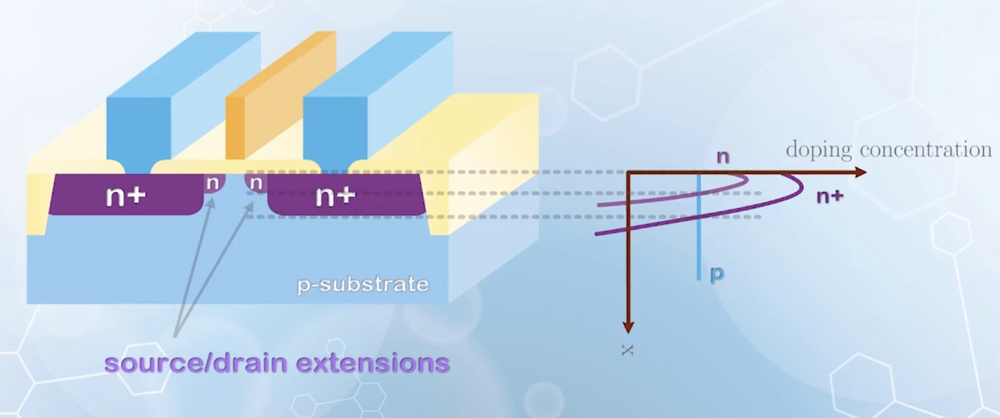

To further reduce the resistance, **silicide technology** was introduced around 250nm technology node. Silicide is a compound formed between silicon and a metal, usually titanium ($\ce{TiSi}$), cobalt ($\ce{CoSi2}$) or nickel ($\ce{NiSi}$). It is a semi-metal with higher conductivity than heavily doped silicon, but slightly higher than that of a metal. Using silicide instead of metal is mainly due to it's process simplicity, as it can be formed selectively on top of silicon.

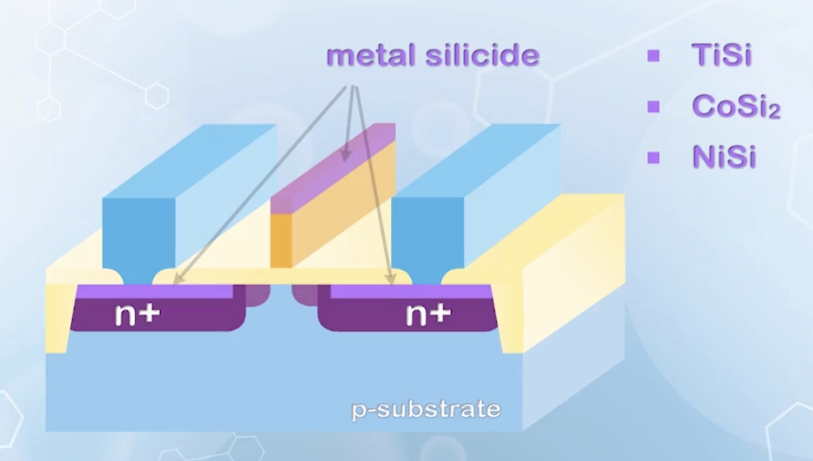

To form the source / drain extension and the silicide, a spacer technology is used, resulting a layer of insulator formed on the sidewall of the gate.

The process is briefly described as follows:

1. The gate is defined first
2. Shallow ion implantation is performed to form the source / drain extensions
3. A thin insulator, usually silicon dioxide or silicon nitride, is deposited conformally over the entire wafer
4. Anisotropic or directional etching is used to move the deposited insulator from top of the wafer
   - Due to the height difference between the insulator next to the gate, an insulator called spacer will be left over next to the gate
     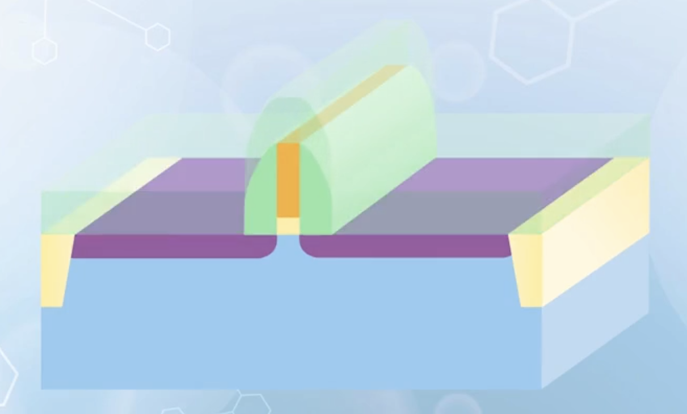
5. Second ion implantation is performed, forming the deep source and drain regions
   - The shallow source / drain extension regions are protected by the spacers
6. Thin metal layer is deposited onto the wafer
7. Place the wafer at elevated temperature, and the metal reacts with the underlying silicon, forming silicide. No reaction takes place in the space region
8. Remaining metal is moved with chemical etching, leaving the silicide on the source, drain and gate regions.

This process which forms silicide on the source, drain and gate regions simultaneously is called **self aligned silicide process (SAlicide process)**

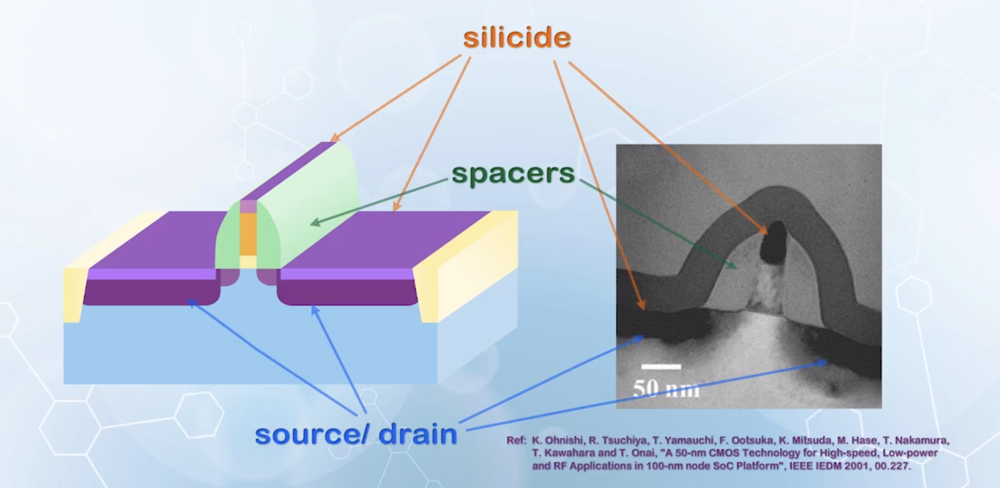

## High-k Gate Dielectric

The traditional approach to CMOS transistor scaling (i.e., reducing gate oxide thickness, increasing substrate doping, decreasing source / drain junction depth) works very well for large devices. But at 45nm technology node, the gate oxide thickness is already reduced to 1.2nm, or about 4 layers of atoms in the oxide layer. Further reduction of gate oxide thickness is extremely difficult. At such thickness, the gate leakage current may become very high, and the gate oxide may not be able to serve as an insulator.

However, if we trace back to the reason why we use a thin oxide layer, it is to increase the gate capacitance for stronger gate control. The normalized gate capacitance is given by

$$
C_{ox} = \frac{\kappa \varepsilon_0}{t_{ox}}
$$

where $\kappa$ is the dielectric constant of the dielectric material.

When reducing the oxide thickness is no longer feasible, we can instead increase the dielectric constant of the gate dielectric material. This leads to the search for another material as an alternative to replace silicon dioxide as the gate dielectric.

The new material should have the following properties:

- The dielectric should have a high barrier for both electrons and holes
  - To prevent charge carriers from jumping over the insulator, an offset larger than $1 \, \text{eV}$ is required for both the conduction band and valence band
    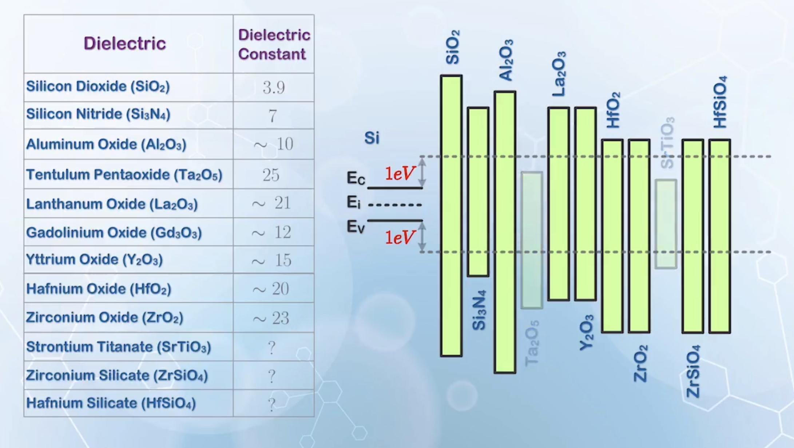
- The material should be able to withstand the high processing temperature without decomposition
- The material should be able to form a smooth and low defect interface with silicon to reduce channel carrier mobility degradation
  - This is very difficult compared to silicon dioxide, which is known to form the best interface with silicon
  - The solution: forming one to two layers of silicon dioxide atoms on the silicon substrate first, before depositing the high-k dielectric material

Among other choices, silicon nitride ($\ce{Si3N4}$) is first used in production, due to its compatibility with the silicon process. But its k value is not high enough.

After another round of elimination, hafnium (HACHIMI) based oxide ($\ce{HfO2}$, $\kappa > 20$) stands out as the most widely used gate dielectric material.

By using thicker hafnium oxide to achive the same gate capacitance as that with thin silicon dioxide, the gate leakage current can be reduced by a factor of $10^4 - 10^5$

The **equivalent oxide thickness (EOT)** is used to compare among different gate dielectric materials. It is the thickness of silicon dioxide required to give the same normalized capacitance as that of the gate capacitor formed by high k materials.

$$
\begin{aligned}
C_\text{G} &= \frac{\kappa \varepsilon_0}{t_\text{g}} = \frac{\kappa_{ox} \varepsilon_0}{\text{EOT}} \\
\Rightarrow \text{EOT} &=\frac{\kappa_{ox}}{\kappa} t_\text{g}
\end{aligned}
$$

While using high k gate dielectric can increase the gate capacitance without causing significant gate leakage current, it is not the same as reducing the gate dielectric thickness.

The capacitance given by $C_\text{G} = \frac{\kappa \varepsilon_0}{t_\text{g}}$ assumes the parallel plates of the capacitor have an infinite area, ignoring the fringing electric field. In nano CMOS, it may not be the case, as the lateral dimension can be comparable to the gate dielectric thickness, and the fringing field can become significant.

When the gate dielectric is thin, the gate blocks most of the electric field from the drain. When the k value increases, the dielectric thickness is also increased to give the same EOT. This causes more electric field from the drain to affect the channel potential, weakening the gate control. Thus using a high k gate dielectric can increase the gate capacitance and reduce the gate leakage, it may not be as effective as what is predicted by the simple model.

## Metal Gate Technology

The overall capacitance from the gate electrode to the channel of the MOSFET not only consists of the capacitance of the gate dielectric, but also includes the capacitance due to the finite thickness of the channel inversion charge $C_\text{inv}$, which we do not have much control over and is simply ignored. The polysilicon gate also contributes to a series capacitance $C_\text{poly}$ due to the polysilicon gate depletion effect.

So far, we have assumed that the polysilicon gate is much more heavily doped than the substrate, and its depletion region width can be ignored. But when the gate oxide thickness is reduced to a few atom layers, the polysilicon gate depletion region thickness can no longer be ignored.

If we only increase $C_{ox}$, but do nothing with $C_\text{poly}$, the effect will not be obvious. To eliminate the polysilicon gate depletion at the gate electrode, metal gates are adopted at around 45nm technology node. As a second benefit, metal gates also reduces the gate resistance of the MOSFET.

Choosing the metal for gate electrode needs more careful consideration. In addition to the gate capacitance, it also affects the threshold voltage of the MOSFET, as the work function of the metal affects the flat band voltage $V_\text{FB}$, which is a component of the threshold voltage $V_\text{T}$.

In conventional CMOS technology, the work function of the polysilicon gate is adjusted by doping, so that we have N+ polysilicon gate for NMOSFET and P+ polysilicon gate for PMOSFET.

If we use a metal with work function similar to that of N+ polysilicon, $V_\text{T}$ of PMOSFET will be too negative, making it difficult to turn on. Similarly, if we use a metal with work function similar to that of P+ polysilicon, $V_\text{T}$ of NMOSFET will be too positive.

To achieve symmetrical $V_\text{T}$ for both NMOSFET and PMOSFET, metal with work function near the middle of the band gap of silicon can be used, but such symmetrical $V_\text{T}$ ($\approx +0.55 \, \text{V}$ for NMOSFET and $\approx -0.55 \, \text{V}$ for PMOSFET) is too high for both types of MOSFETs. With the reduction in supply voltage, $V_\text{T}$ needs to be scaled together to maintain a reasonable on state current, and the increase in $V_\text{T}$ caused by the use of single type metal for the gate electrode is not desirable.

To achieve optimum $V_\text{T}$, two different metals with different work functions are needed. Some choices include:

- Tantalum nitride $\ce{TaN}$ for NMOSFET
  - With **low** work function, and is closer to the **conduction band** of silicon
- Tungsten nitride $\ce{WN}$ for PMOSFET
  - With **high** work function, and is closer to the **valence band** of silicon

While structurally simple, such method significantly increases the fabrication complexity.

If using two different metals is not desirable, **dipoles** can be used to adjust the the threshold voltage.

Dipoles at the oxide-electrode interface can be introduced by some nano-scale capping layers before depositing the metal gate. Some choices include:

- Lanthanum oxide ($\ce{LaOx}$) for NMOSFET
- Aluminum incorporated hafnium oxide ($\ce{Al} + \ce{HfOx}$) for PMOSFET

The gate electrode of the MOSFETs are not formed by a single material, but a complex, multi-material gate stack, together with the high k gate dielectric. Features of such gate stack include:

- A smooth interface to achieve high channel carrier mobility
- A high k gate dielectric layer to achieve high gate capacitance with low gate leakage current
- Proper metal work function to achieve the correct $V_\text{T}$

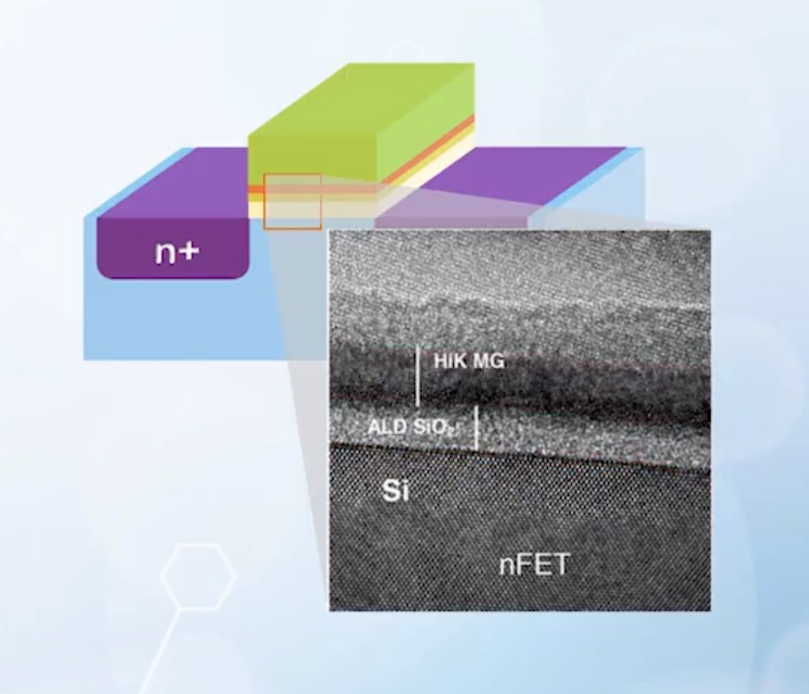

By switching to such high-k / metal gate structure, we can achieve a lower EOT with lower gate leakage current. This is why it becomes the dominant MOSFET technology in spite of its high cost.

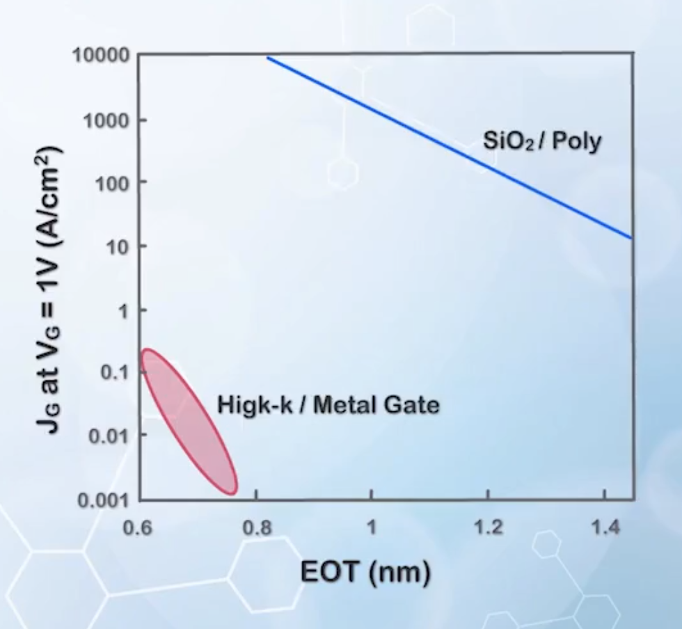

## Source / Drain and Channel Engineering

Controlling the source and drain junction depth is no easy task. As there are many high temperature processing cycles during the formation of the MOSFET, and the dopant ions (especially for small dopant ions like boron $\ce{B}$) tend to diffuse down to the substrate, hence increasing the junction depth.

Dopant diffusion is one of the main issues in forming shallow junctions, and the most straightforward way to reduce the diffusion rate is to use heavier dopant atoms, such as indium $\ce{In}$ as the p-type dopant and antimony $\ce{Sb}$ as the n-type dopant. However, due to the size mismatch between these large dopant atoms and the silicon atoms, the solid solubility of these dopants in silicon is usually only around $10^{19} \, \text{cm}^{-3}$. This results in low doping concentration and high source and drain resistance.

Another approach to reduce junction depth is to raise the background doping concentration, so that the distance for the source and drain doping concentrations to drop to the background level is reduced. But this also increases the $V_\text{T}$ of the MOSFET. To compensate for this, we can increase the doping **only in the region below the channel**, and reduce the doping of the channel near the surface, to maintain the average doping concentration approximately the same. The region or well with lower doping near the surface of the channel, and high doping concentration in the region further below the surface is called the **retrograde well**.

Drawback of this method is the decreased depletion width of the PN junction formed by source / drain and the substrate, will increase the junction capacitance between source / drain and the substrate terminal. Thus, the heavy doping is usually confined to the region **below the source / drain extensions**, and **above the deep source / drain junction depth**.

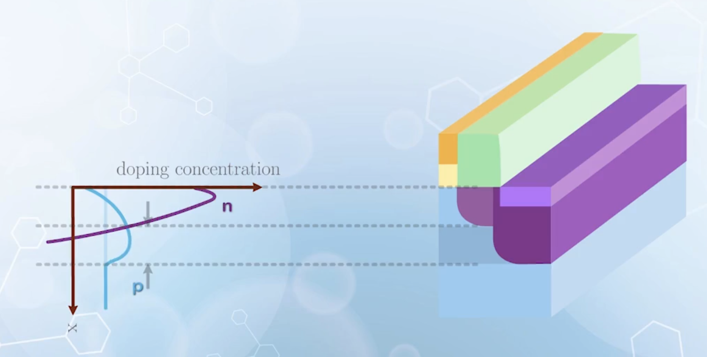

To further optimize the doping profile of the heavily doped region without affecting $V_\text{T}$, heavy doping can be applied only to the region below the source / drain extensions. Such structure with a heavy P doping below the N type source / drain extensions is called **halo structure** or **pocket implanted structure**. Another benefit of the halo structure is, by increasing the doping concentration near the source / drain extensions, the depletion width of the deep source / drain is reduced, allowing the source and drain to be placed closer together without causing punchthrough. We can also use shorter source / drain extensions, and reduce the series resistance of the source and drain.

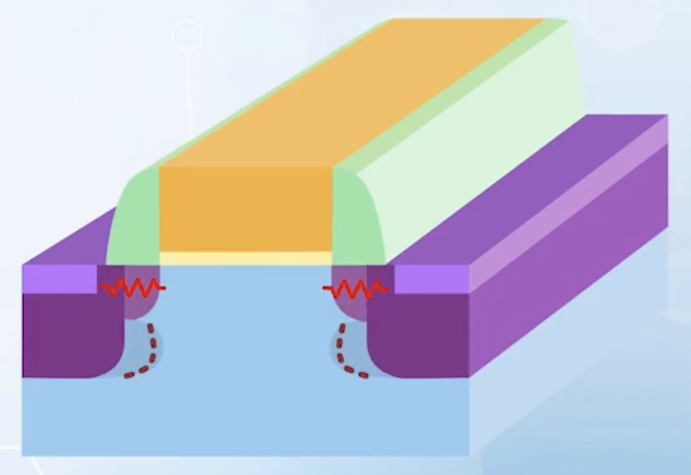

## Strain Engineering

All above methods are used to reduce short channel effects. But it is also important to increase the on state current of extremely scaled MOSFETs.

**Strain engineering** is introduced to increase the channel carrier mobility without changing its structure or using a new material system. Understanding strain engineering requires knowledge of quantum mechanics and the energy momentum ot E-k space, which is not covered in this course. Instead, a more intuitive explanation is given here, which may not be entirely correct in strict physics sense.

When electrons move in silicon crystal, they will experience a stronger attraction at the location of an atom, which slows them down. If spacing between atoms are increased, electrons can move a longer distance before being slowed down by the atoms, resulting in an increase in the average speed of the carriers. When atoms in the silicon crystal are forced to stay at a larger distance apart, the silicon crystal is said to be under **tensile strain**.

This can be achieved by growing a thin layer of silicon on top of a similar lattice structure, but a larger atomic spacing. In early days, silicon germanium ($\ce{SiGe}$) layer, which has a similar structure to silicon, but larger average atomic spacing due to larger germanium atoms, is used to form strained silicon. More recently, tensile strain is achieved with materials with smaller atomic spacings, like silicon nitride, on top of the source and drain region of the MOSFET. By exerting a compressive stress in the source and drain regions, tensile strain is induced in the channel region. This can almost double the mobility.

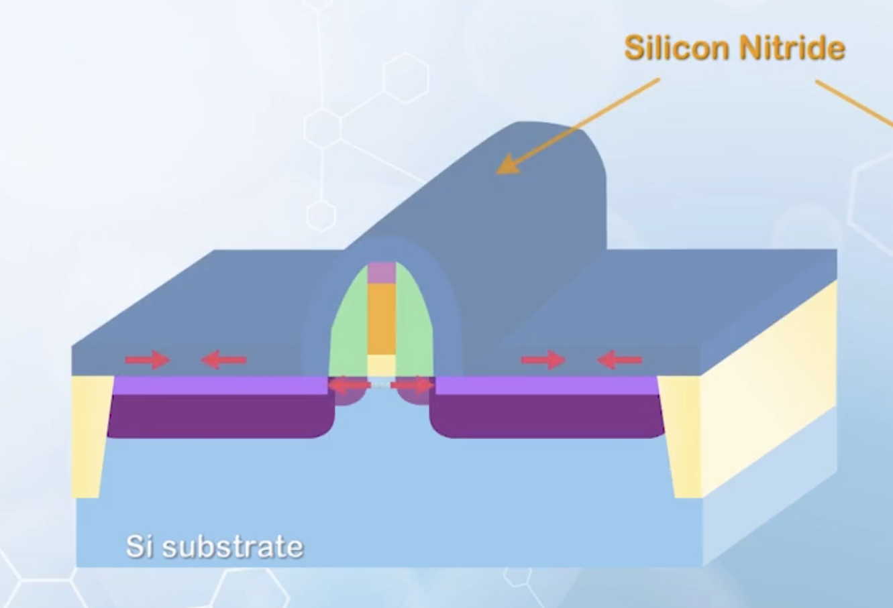

For PMOSFET, the hole mobility can be increased by compressive strain instead of tensile strain, as the nature of hole movement is to move along the bonds between the silicon atoms. It is easier to find an electron to take place of the hole, hence causing the hole to move more smoothly.

Compressive strain can be achieved by implanting germanium to the source and drain regions of the MOSFET, causing a crystal expansion in those regions, which exerts a compressive stress on the channel region. A double increase in carrier mobility is also possible with this method.

## On / off Current Tradeoffs

The current is given by

$$
\begin{aligned}
I_\text{D} &= Q(y) v(y) \\
Q &\propto C_{ox}(V_\text{G} - V_\text{T})
\end{aligned}
$$

Increasing current by increasing $C_{ox}$ has been [discussed before](../8/#mosfet-current-dependence-on-gate-oxide-thickness), but we can also increase $Q$ by decreasing $V_\text{T}$.

However, decreasing $V_\text{T}$ will also increase the off state current $I_\text{D off}$ exponentially, as every reduction of $60n \, \text{mV}$ in $V_\text{T}$ will increase $I_\text{D off}$ by a factor of 10. The on state current increases linearly with $V_\text{T}$ reduction, but the off state current increases exponentially. Thus, this is not desirable.

The velocity $v(y)$ before saturation can be approximated by

$$
v = \mu_\text{eff} \frac{V_\text{D}}{L}
$$

Increasing $v$ by decreasing $L$ has also been [discussed before](../8/#mosfet-current-dependence-on-channel-length), and strain engineering can also increase the effective mobility $\mu_\text{eff}$, hence increasing $v$. This approach is more desirable, as it only increases the off state leakage current linearly instead of exponentially, thus the on-off current ratio is maintained.

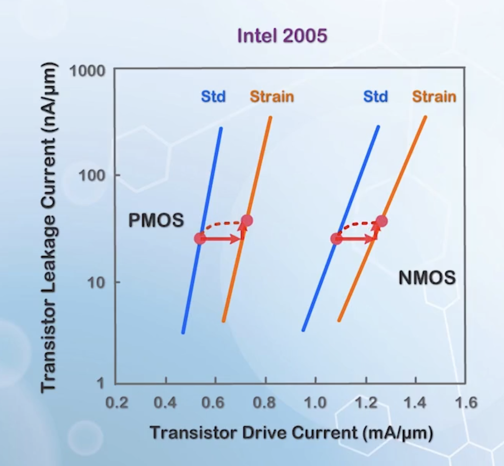

The increase in the on state current is represented by the lateral shift, while the increase in off state current is represented only by a very small vertical shift. It is similar to increasing the width of the MOSFET to increase the current, but without increasing the input capacitance and the footprint taken up by the MOSFET.
