About more advanced nano-CMOS device structures, including silicon-on-insulator MOSFETs, double-gate and multi-gate MOSFETs, tunneling MOSFETs, junctionless transistors, and 2D material based transistors.

---

## Silicon-on-insulator MOSFETs

Conventional planar MOSFET structures has been used till around 32nm technology node. In 22nm technology node, Intel announced the use of a 3D multi gate transistor architecture. Many new device concepts are proposed at the same time to enhance the current CMOS technology. Some entirely new application, such as flexible electronics, also require new device structures.

In a MOSFET, only a thin layer of channel is useful for the switching functionality, and the structure below the channel is only for physical support. Even worse, it provides a leakage path between the source and drain by creating regions under weak gate control and enhances the short channel effects. If the substrate can be removed, the leakage path can be eliminated, and the MOSFET will be more resistant to the short channel effects. This can be achieved by cutting the top part of a MOSFET and placing it on an insulator, usually silicon dioxide. Such structure is called an **silicon-on-insulator (SOI) MOSFET**

Benefits of SOI MOSFETs include:

- Regions with weak gate control are eliminated, leading to stronger gate control over the current path between the source and drain regions
  - The SOI structure can be scaled to very small dimensions when the silicon film is thin enough
- Forming shallow source and drain junctions will be easy, as the junction depth automatically follows the silicon film thickness
- The insulator isolates the transistor from the substrate, leading to smaller junction capacitance between the source / drain and the substrate
  - Smaller parasitic capacitance load, faster speed
- Elimination of the substrate allows the isolation of MOSFETs by dividing them into islands, without the need of wells
  - NMOSFET and PMOSFET can be placed next to each other with closer spacing
  - Chip area can be reduced

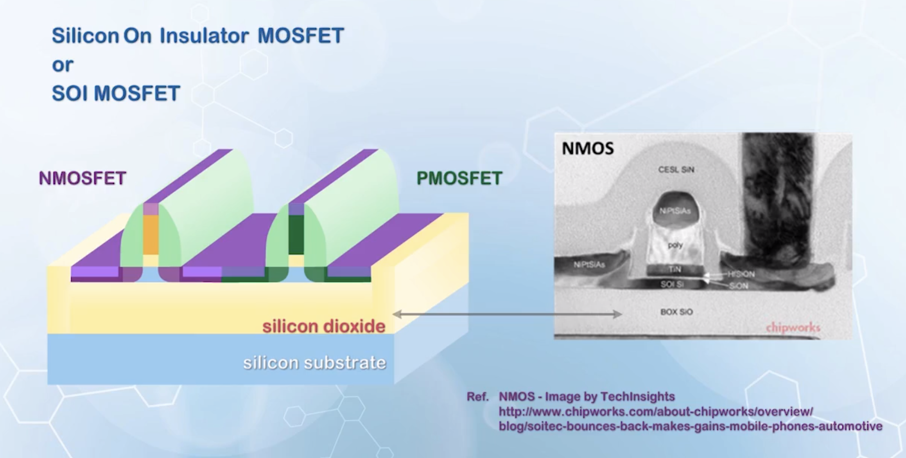

Difficulty: Forming high quality silicon film on insulator is not easy. Depositing silicon onto the insulator to form the silicon film is not applicable, as it gives polycrystalline silicon rather than single crystal silicon.

The most common method is two use two silicon wafers with oxide grown on the surface, than flip one of the wafers over and bond the two wafers together. The top wafer is then thinned down to the desired silicon film thickness. In the process, the oxide surface need to be cleaned to ensure free of particles to avoid the formation of voids. The thinning process also needs to be precise to avoid damaging the remaining silicon film.

As a result, SOI wafers are more expensive than conventional silicon wafers.

The series resistance of SOI MOSFETs is usually high, due to thin silicon film thickness. To reduce the resistance, it is common to increase the height of **source and drain relative to the channel region**, forming a raised source / drain or recessed channel structure.

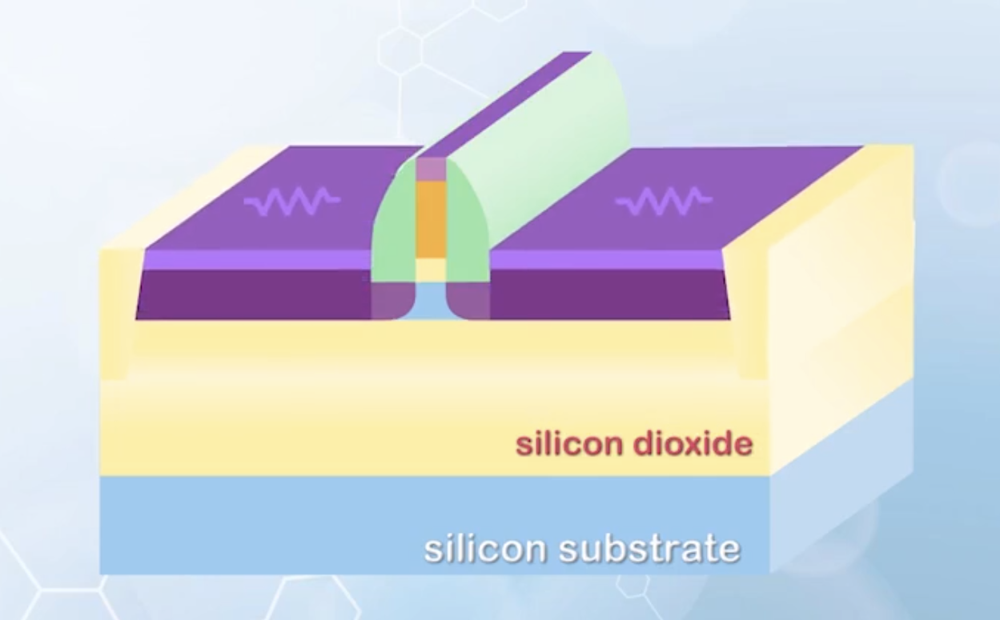

## Double-gate MOSFETs and FinFETs

By adding another gate at the bottom of the silicon channel, we can increase the gate control. This forms a **double-gate MOSFET** structure.

Double-gate MOSFETs have three possible orientations:

- Horizontal channel, with gates on the top and bottom
  - First proposed structure
  - Difficult to connect and align the top and bottom gates precisely
- Vertical channel, with source and drain at the bottom and top, while gates are on the two sides
  - Also difficult to fabricate
  - Is not compatible with existing routing and placement methodology in integrated circuits
- Horizontal channel, with gates on the two sides
  - The dominant approach to implement today

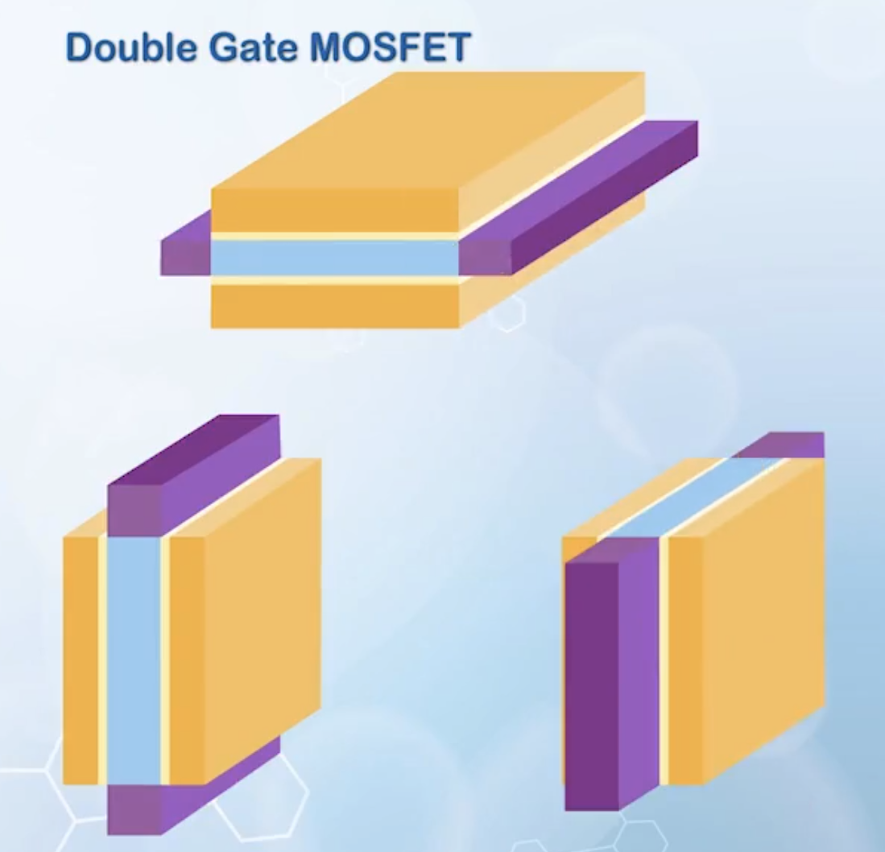

Once of the implementation of the structure is the **FinFET** structure.

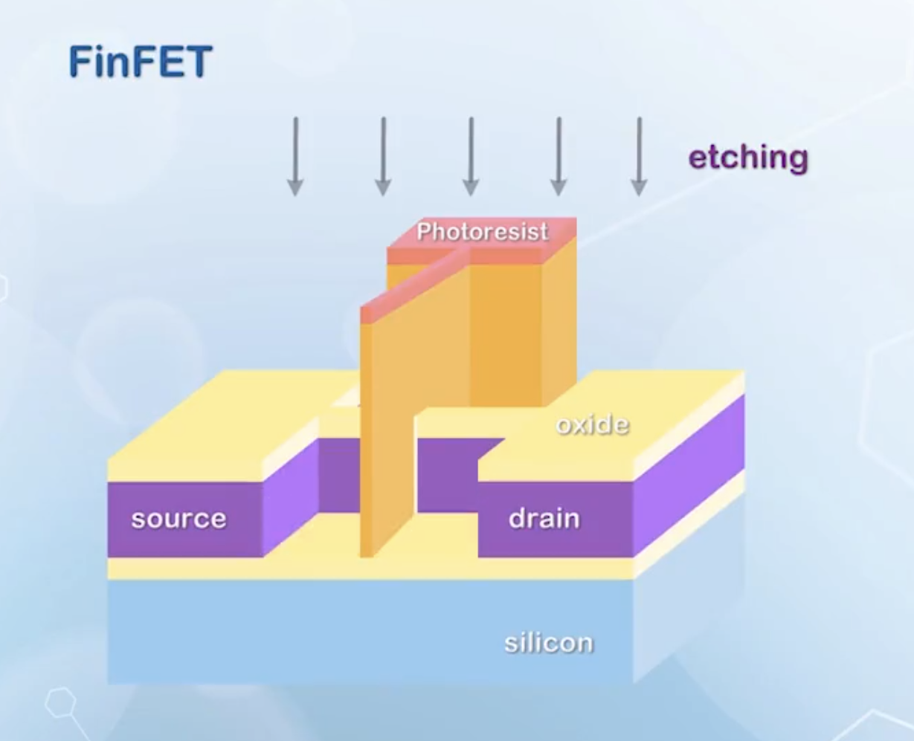

The two gates can be formed together in a single etching process, and the structure is also compatible with existing planar integrated circuit design methodology.

To avoid the expensive SOI technology, the channel region is of a FinFET is formed from the bulk silicon wafer etched down from the surface, with the channel region protected from etching. The resulting fin is connected to the substrate, which is different from the initially proposed structure, with the fin sitting on an insulator.

Channel forms on the two sides of the fin, and the channel width is two times the height of the fin. This cannot be changed by photolithography, and all FinFETs have the same channel width.

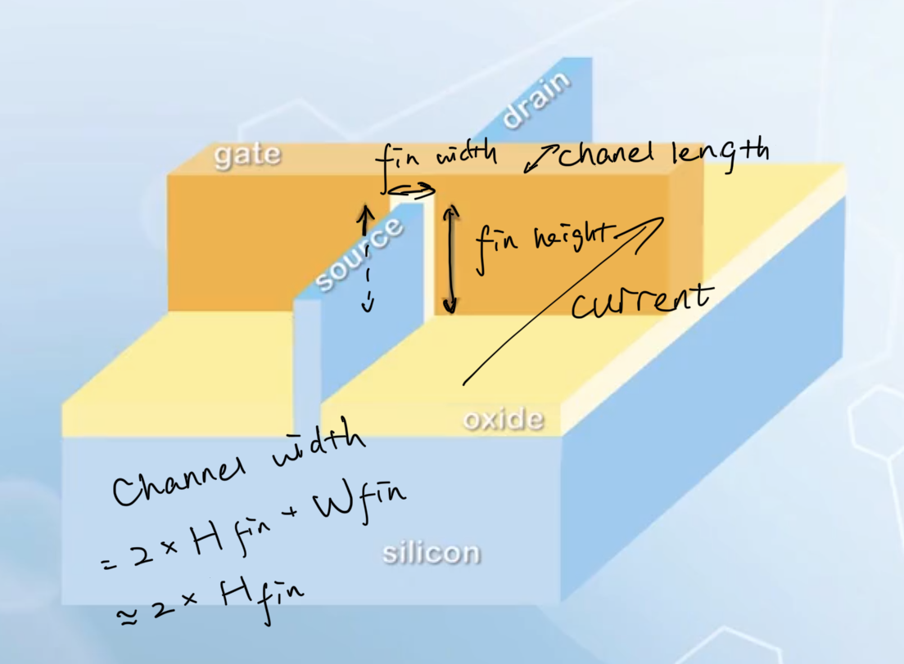

To scale the current of the FinFET using different channel widths, a number of channels can be placed side by side in parallel. So the FinFET causes a digitalization of the the channel width with a increment defined by two times the fin height.

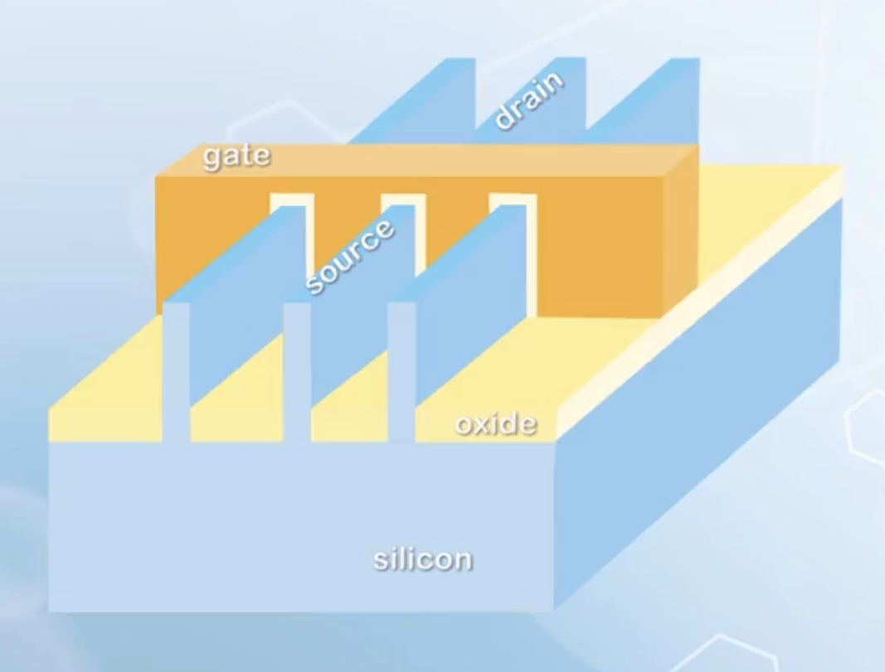

FinFET have two times the current density of a single gate MOSFET, and two times the gate capacitance. It is equivalent to two single gate MOSFETs with half the channel thickness folded together, but it consumes a smaller footprint than a single gate MOSFET with two times the channel width.

## Multi-gate MOSFETs

The development of FinFETs marks the use of 3D FET structures to replace the planar MOSFET structures. With channel region standing out from the substrate surface, it is possible to conduct current on more than one surface. In this case, more than two gates can be formed, and it comes the era of multi-gate MOSFETs.

The top region of FinFETs are too narrow to be used, thus they are considered double-gate MOSFETs. With a wider top surface used for conduction, a **tri-gate MOSFET** can be formed. It is probably the only production ready technology beyond the double-gate FinFETs.

Ultimately, the strongest gate control can be achieved by surrounding a rectangular channel with gates on all four sides, forming a **gate-all-around (GAA) MOSFET** structure.

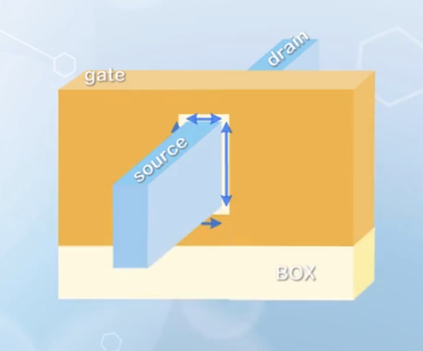

This structure is difficult to fabricate, as the bottom gate is covered by the channel, and cannot be etched together with the other three gates.

As a compromise between process complexity and better gate control, some structures extend the side wall gate below the supporting surface. The extended gate geometry provides capacitive coupling to the bottom surface for better gate control through the fringing electric field. This structure is called **π gate MOSFET**.

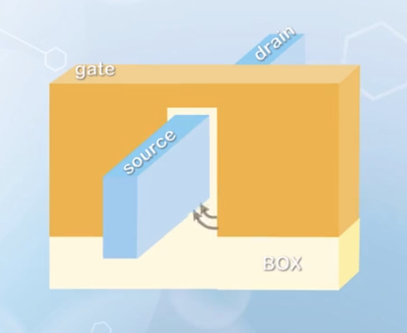

Some over etch can also be used to extend a little bit of the side wall gate to the bottom surface to increase the gate coupling, forming a **Ω gate MOSFET** structure.

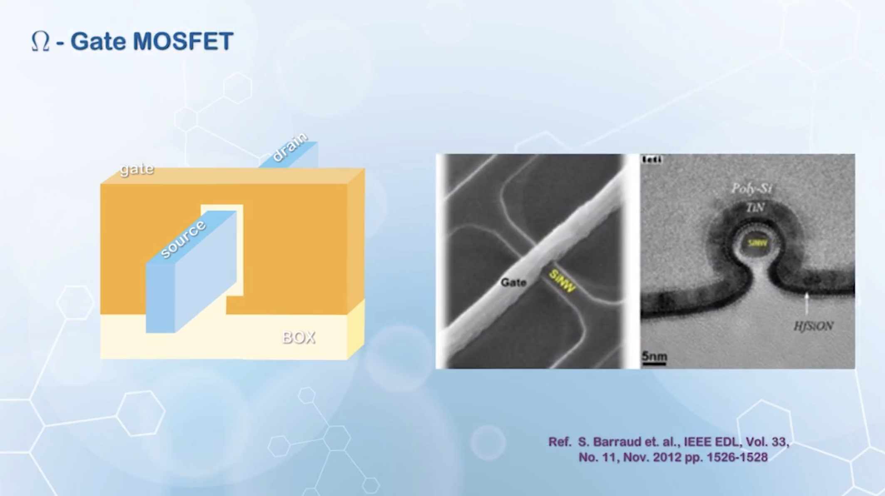

The problems with multi-gate structures formed with a rectangular channel cross section is the corner regions. The sharp corners cause high electric field concentration, leading to reliability issues. More advanced structures use a circular channel, with the gate wrapping around the channel. The diameter of the circular channel is usually very small, to avoid the center being too far away from the gate, which may lead to high off state leakage current. Such MOSFETs are called **nanowire transistors**.

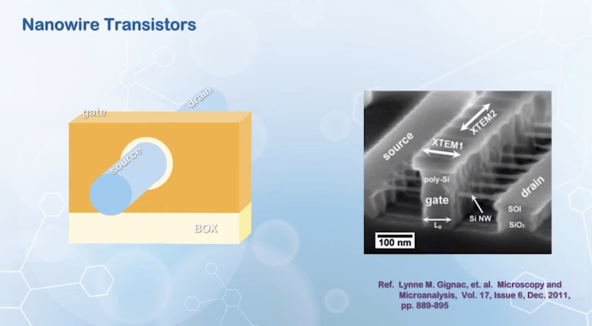

To calculate the $I-V$ relationship of the nanowire transistor, some parameters need to be modified:

- The width is given by the circumference of the nanowire cross section
  $$
  W_\text{NW} = 2 \pi R
  $$
  where $R$ is the radius of the nanowire
- The effective oxide thickness should be used to calculate gate capacitance, due to the non-planar gate geometry. It is given by
  $$
  t_{\text{di}_\text{eff}} = R \ln \left(1 + \frac{t_{\text{di}}}{R}\right)
  $$

The formation of gate-all-around nanowire transistors usually requires the use of a suspended wire, so that the gate can go underneath the channel. With suspended wires, it is possible to stack a few nanowires together to form a 3D array of nanowire transistors, allowing high drive current over a small footprint. But they are still in exploration stage, and very far away from production yet.

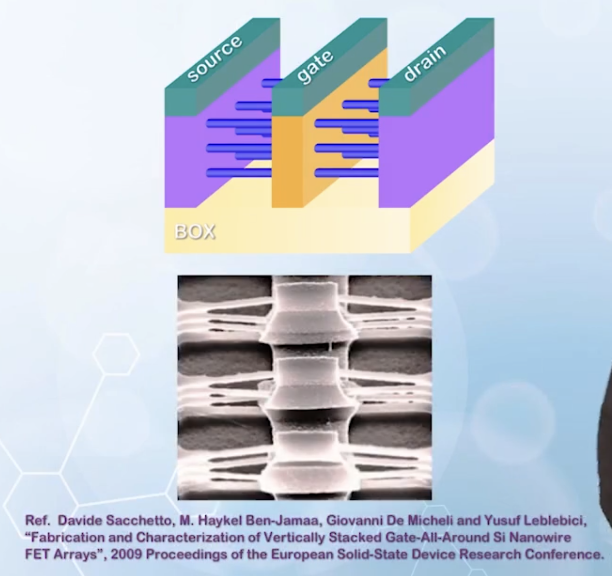

## Tunneling MOSFETs

To reduce the leakage current of MOSFETs, engineers have introduced many changes to the conventional CMOS technology, including new material systems and new device structures. Another approach to suppress the short channel effects is to change the physics.

The on-off state current ratio is dictated by the subthreshold swing, which is $60 \, \text{mV/dec}$ under room temperature in ideal case. This physical limit is due to the Fermi-Dirac statistics when PN junction is used to inject carriers from high concentration region to low concentration region, or the **thermionic emission** process. To overcome the limit, we may use **carrier tunneling** instead of thermionic emission to inject carriers.

The most important characteristics of a transistor is the exponential increase in current with applied gate voltage. In conventional MOSFETs, thermionic emission is the most common phenomenon used.

However, breakdown can also cause a very sharp turn-on, and the voltage to cause Zener breakdown of a metal-semiconductor contact can be adjusted to a low value. This is the principle of a **tunneling MOSFET (T-FET)**.

Early T-FETs use metal to form the source and drain with N type silicon substrate as the channel. When a positive gate voltage is applied, the barrier at the metal-semiconductor junction may become thin enough for electrons to tunnel through the barrier. The probability of electrons tunneling though the barrier can be modulated by the gate voltage.

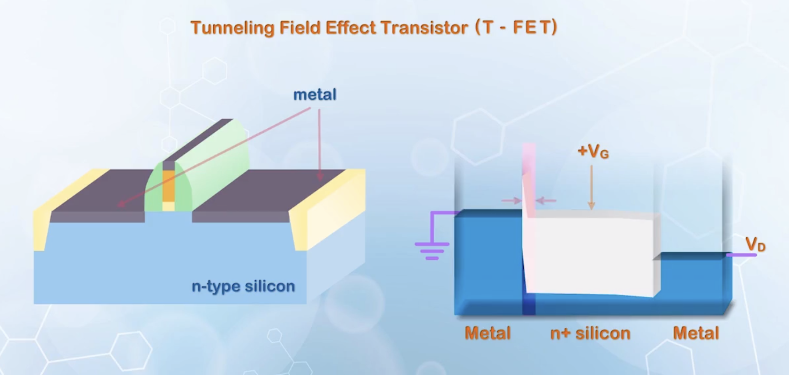

There is a specific point corresponding to the alignment of the metal Fermi level and the conduction band edge of the N silicon channel. Before this point, there is no state for electrons from the metal to tunnel to, unless given extra energy. The tunneling current is expected to be very small. Beyond this point, electrons will suddenly find available states to tunnel to, and a significant increase in current is expected. Measurements also show a very rapid turn-on, with subthreshold swing less than $60 \, \text{mV/dec}$ at room temperature. However, it only applies to a very small portion of the turn-on curve, and the turn-on rate drops quite rapidly outside the gate voltage range corresponding to the alignment point.

T-FETs has a barrier independent of the scaling process, thus are relatively easier to turn off, and do not have barrier lowering issues like DIBL. However, the problem shifts to the on state current, which is relatively low due to high contact resistance.

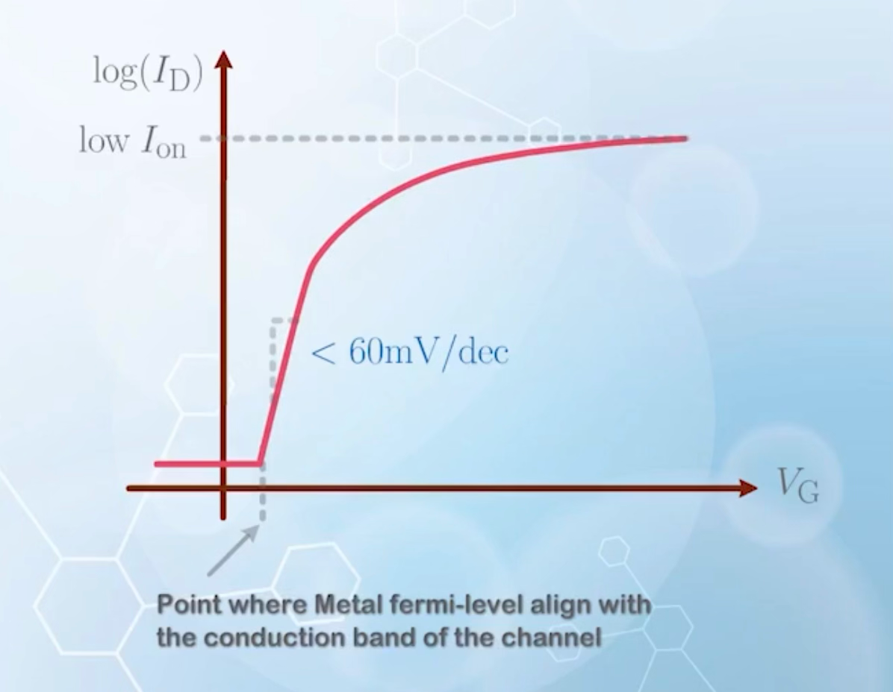

More recent implementations of T-FETs have switched from using metal source and drain to using semiconductor material. By properly biasing the gate, source and drain terminals, electrons from the valance band of the source can tunnel through to the conduction band of the channel, and collected by the drain.

By using semiconductor materials for both the source and body, the junction property can be more easily adjusted by doping.

To improve injection efficiency, some compound semiconductor material systems are used to form source and channel regions, and significant progress has been made to achieve a steep subthreshold slope with subthreshold swing smaller thant $60 \, \text{mV/dec}$ at room temperature over a wide range of gate voltages.

## Junctionless Transistors

The high on-off current ratio is the main design goal of nano scale transistors. Scaling down helps the on state current to increase linearly, but the off state current also increases exponentially. A simple solution is to use a longer channel MOSFET with higher $V_\text{T}$, but it increases capacitance loading and footprint. The strategy is: **increase the effective channel length without changing physical geometry**, leading to the idea of **junctionless transistors**.

For a junctionless transistor, the doping concentration for the channel, source and drain regions are the same, without physical boundaries for the channel. The work function of the gate material is carefully chosen to completely deplete the channel when $V_\text{G} = 0$. For example, if an N type semiconductor is used for the transistor, the gate material should have a large work function, so that its Fermi level is close to the valance band edge of the semiconductor channel. In this case, the gate material mimics a P+ gate, depleting the N type channel when put in contact.

Because the channel is physically boundary-less, the depletion region can extend outside the gate edges, into source and drain. The channel borrows some regions of the source and drain to effectively increase the channel length when the transistor is turned off.

When a positive voltage is applied to the gate, it is similar to forward biasing the channel PN junction, causing the depletion region to shrink. It restores the original carrier concentration in the channel, and conduction occurs. The positive voltage effectively eliminated the channel length.

The problem: this kind of device need extremely thin channel region, or a very small cross-sectional area. Otherwise, channel region far away from the gate will have a significant leakage current. With such small cross sectional area, the series resistance may be very high. Moreover, the highest doping concentration for the channel, source and drain is limited, as too high doping concentration will make it difficult to fully deplete the channel at $0 \, \text{V}$. This further increases the series resistance.

A compromise is to increase doping at two ends of the source and drain regions where contacts are made. But some part in the middle still needs to remain at lower doping concentration, despite not covered by the gate, otherwise the depletion region cannot expand beyond the gate edges. These less heavily doped regions still contribute to series resistance when the transistor is turned on.

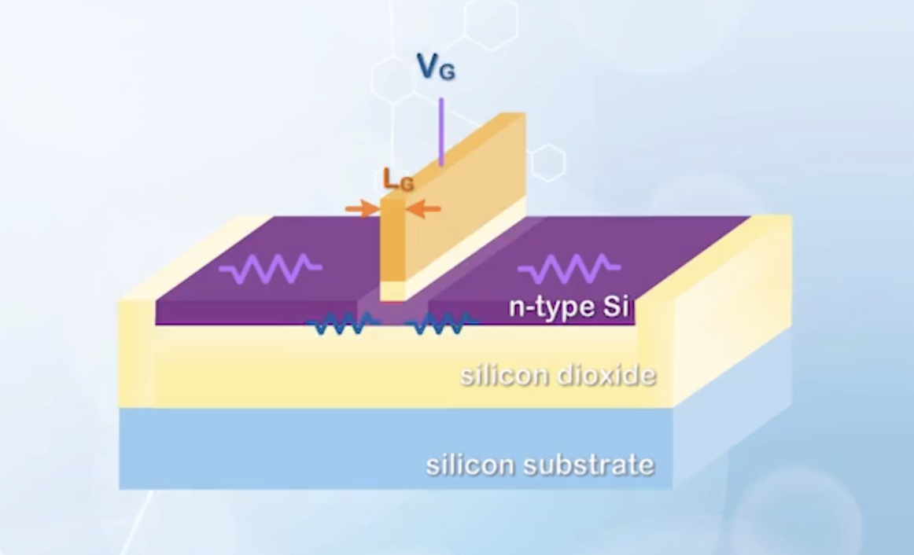

Although the increased series resistance reduced its competitiveness, its relatively simple structure without any junction makes it a good vehicle for concept demonstrations.

## 2D Transistors and Carbon Nanotube FETs

When discussing [SOI technology](#silicon-on-insulator-mosfets), advantages of ultra thin channel region to reduce short channel effects have been covered. Ultimately, we would like to have a single layer of atoms to form the channel region.

To make a single layer of atoms, we can use some 2D materials. Unlike silicon, a mature method to dope a 2D material to make it P or N type is not available, thus a junctionless transistor structure is usually used.

Among the 2D materials, graphene is most well understood. However, graphene behaves like a conductor, and is difficult to deplete with gate voltage. Therefore using graphene to fabricate 2D transistors is difficult, and it is more desirable to use a semiconductor material as the channel of the transistor. This includes:

- Molybdenum disulfide ($\ce{MoS2}$) for N channel devices
- Tungsten diselenide ($\ce{WSe2}$) for P channel devices

As the 2D materials cannot be doped, **very small separation** between the source, drain and gate is needed, to avoid the undoped high resistance regions.
Most experimentally demonstrated 2D transistors use the **bottom gate structure** to provide an overlap between the gate and source / drain contacts, eliminating the highly resistive undoped regions.

When gate voltage is applied, carriers are attracted by the gate to move downward from the metal contact, conduct through the bottom interface, then move up to the electrode.

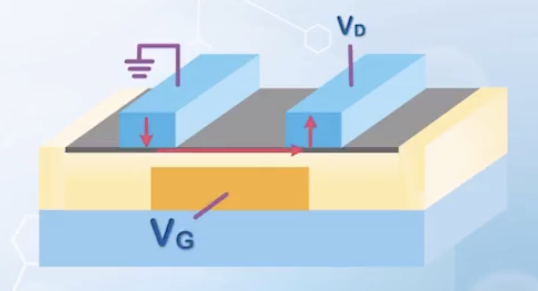

The contact between the metal electrode and the 2D material is another important issue, as contacts usually have the highest resistance in a heterogenous system. As the 2D material behaves like a semiconductor, the contact is expected to be a metal-semiconductor contact. Based on the work function of the metal, the mechanism for carrier injection can be either thermionic emission for linear ohmic contacts, or tunneling for Schottky contacts, with the latter expected to dominate.

Rolling up a 2D material forms a 1D tube. For example, rolling up a graphene sheet gives a **carbon nanotube (CNT)**. A graphene sheet can be rolled up in two different orientations, and depending on the rolling orientation, the CNT can be either metallic or semiconducting.

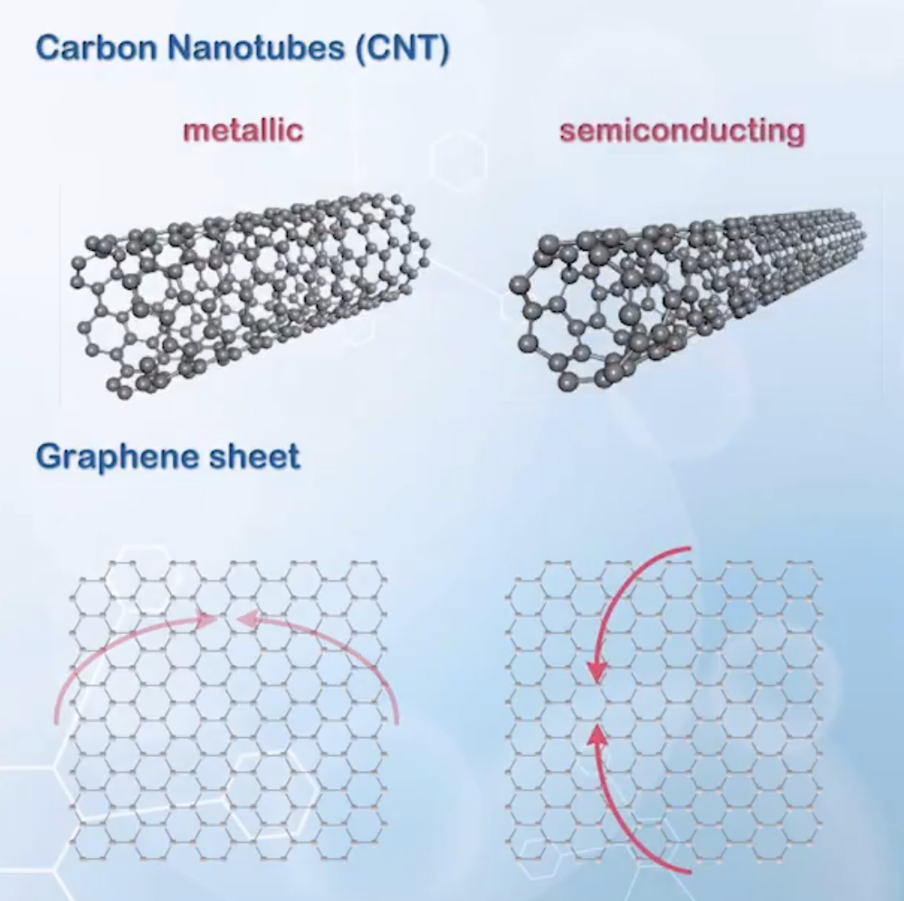

The most natural structure for a CNT transistor is the gate-all-around nanowire transistor structure. However, forming a gate-all-around structure with CNT is very difficult. Most carbon nanotube FETs demonstrated place CNTs side by side, which is similar to a planar transistor.

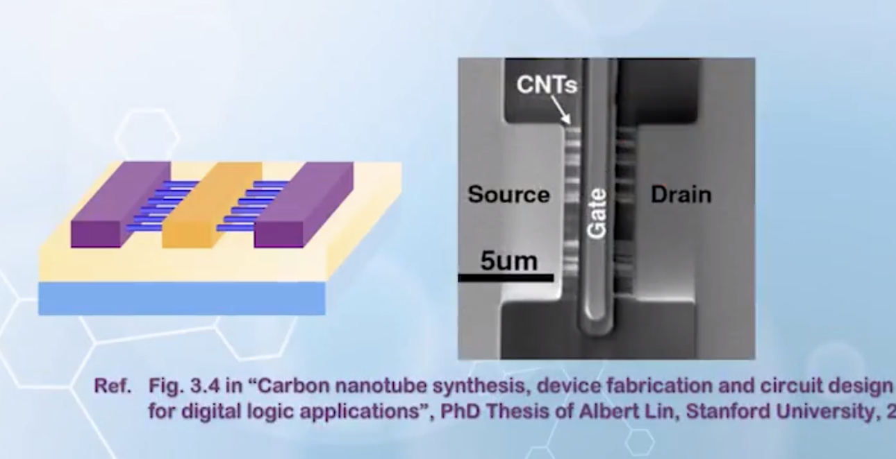

Another problem with carbon nanotubes is that synthesized CNTs usually contain a mixture of metallic and semiconducting CNTs, and they are hard to separate. If the channel is formed with a number of CNTs bundled together, it is likely that some metallic CNTs are included, shorting the source and drain. The remove the metallic CNTs, high current is usually passed through the transistor to burn out the metallic CNTs before the transistor is used. In the case of a single CNT transistor, having a metallic CNT can declare the transistor non-functional. Some redundancy or luck is required to get a working circuit made of CNT MOSFETs.

:::info Congratulations!
This is the end of the note series!

<ClientOnly>
  <ConfettiTrigger>
    

      Sadly, you have enabled reduced motion, so no confetti for you…
    

  </ConfettiTrigger>
</ClientOnly>

:::

