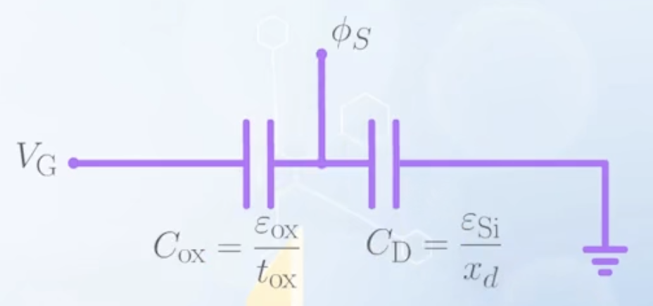
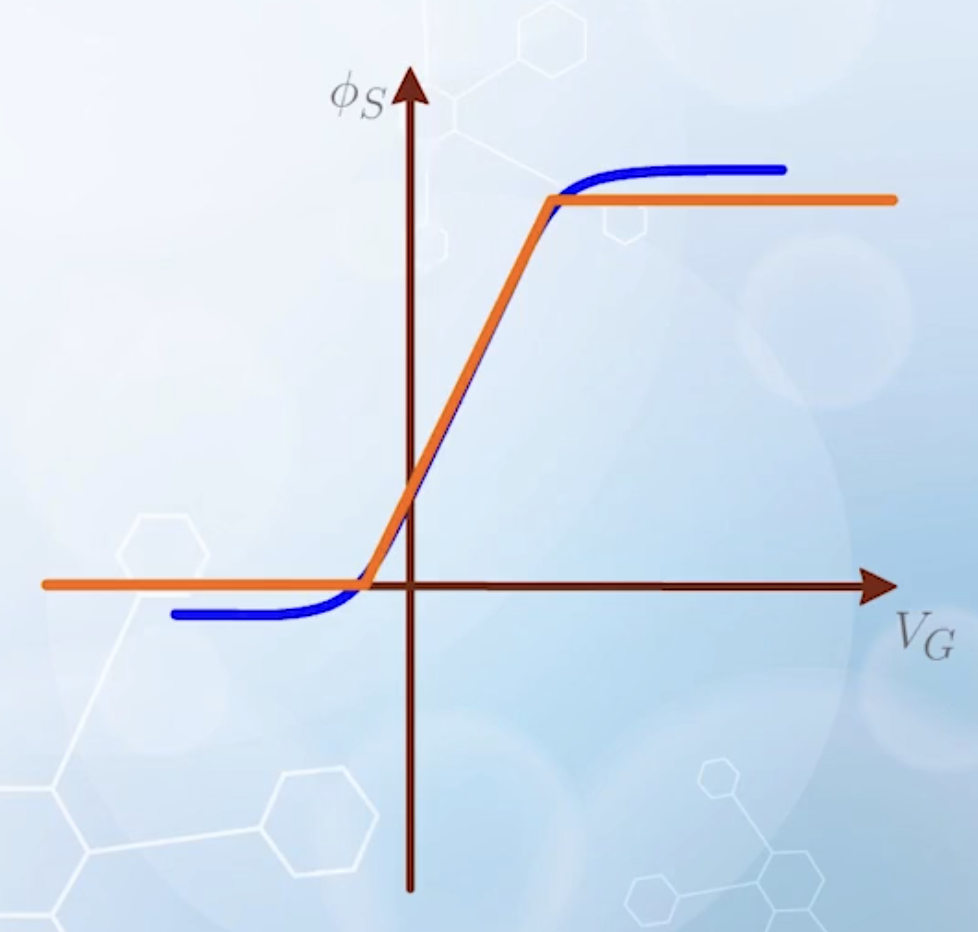
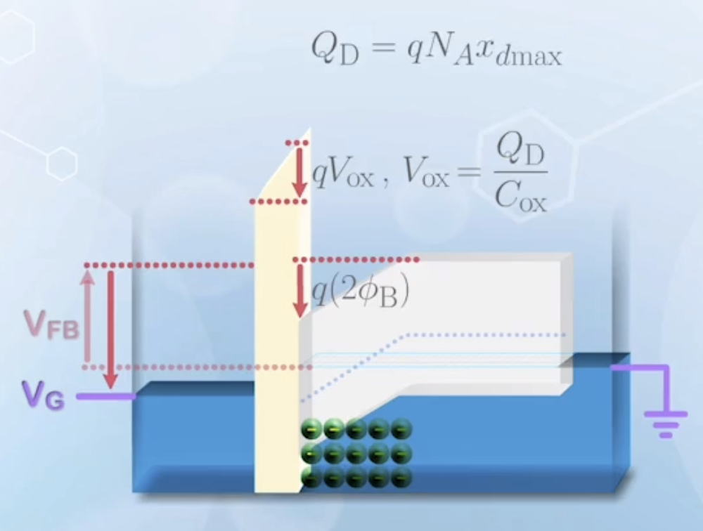
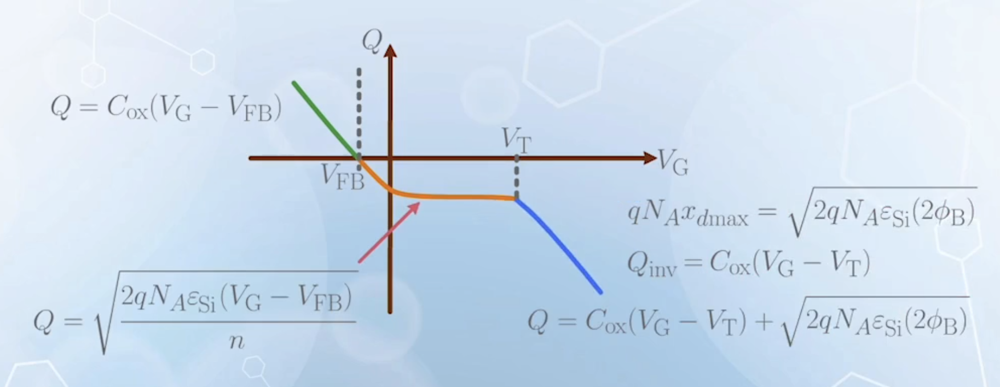
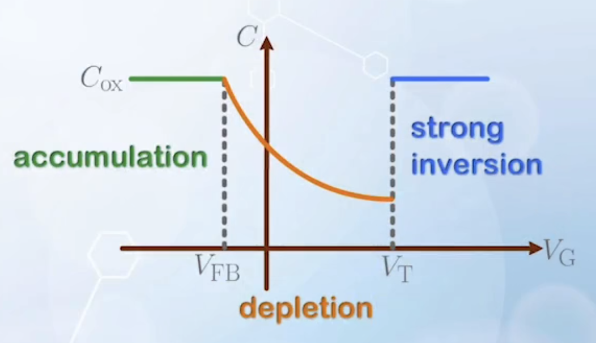

---

## Accumulation and Depletion Charge

- Under accumulation mode, the charge is composed of accumulated holes, and is given by:
  $$
    \begin{aligned}
    Q_\text{acc} &= C_{ox} (V_\text{G} - V_\text{FB}) && \text{for } V_\text{G} < V_\text{FB} \\
    C_{ox} &= \frac{\varepsilon_{ox}}{t_{ox}} \\
    \varepsilon_{ox} &= \varepsilon_0 \varepsilon_{r(ox)} && \varepsilon_{r(ox)} \approx 3.9
    \end{aligned}
  $$
  - Once the gate oxide thickness is given, $C_{ox}$ is known
  - $V_\text{FB}$ is similar to the built-in potential in a metal-semiconductor contact or in a PN junction
    - For metal oxide semiconductor
      $$
      V_\text{FB} = \psi_\text{M} - \psi_\text{Si}
      $$
    - For N+ polysilicon oxide semiconductor, assume the Fermi level of N+ silicon is very close to the conduction band edge
      $$
      \begin{aligned}
      -q V_\text{FB} &= \frac{E_G}{2} + q\phi_\text{B} \\
      V_\text{FB} &= - (0.55 \, \text{V} + \frac{kT}{q} \ln{\frac{N_A}{n_i}})
      \end{aligned}
      $$
      and is known once the doping concentration of the P substrate $N_A$ is given
- Under depletion mode, the charge is composed of ionized dopant atoms, and is given by:
  $$
  Q_\text{D} = q N_A x_d \quad \text{for } V_\text{FB} < V_\text{G} < V_\text{T}
  $$
  - To calculate $x_d$, it is similar to calculating the depletion width in a PN junction
  - Integrating the Poisson equation in the depletion region gives:
    $$
    \begin{aligned}
    E(x) &= -\frac{q N_A}{\varepsilon_\text{Si}} (x - x_0) \\
    \phi_s &= \frac{q N_A}{2 \varepsilon_\text{Si}} x_d^2
    \end{aligned}
    $$
  - Once $\phi_s$ is known, $x_d$ can be calculated as:
    $$
    x_d = \sqrt{\frac{2 \varepsilon_\text{Si} \phi_s}{q N_A}}
    $$
  - The calculation of $\phi_s$ is discussed [in the next section](#calculate-surface-band-bending)
- Under inversion mode, the charge is composed of both mobile electrons at the interface, and the ionized dopant atoms in the depletion region:
  $$
  Q_\text{total} = C_{ox} (V_\text{G} - V_\text{T}) + q N_A x_{d\text{max}} \quad \text{for } V_\text{G} > V_\text{T}
  $$

## Calculate Surface Band Bending

To solve the depletion charge, we need to find out what $\phi_\text{S}$ is.

- When an MOS capacitor is operating under depletion mode, the depletion region in the silicon substrate can be considered as another insulator
- The MOS capacitor can be considered as two capacitors connected in series
  - One is the oxide capacitor, with normalized capacitance
    $$
      C_{ox} = \frac{\varepsilon_{ox}}{t_{ox}}
    $$
  - The other one is the silicon depletion capacitor, with normalized capacitance
    $$
    C_\text{D} = \frac{\varepsilon_\text{Si}}{x_d}
    $$
  - When $V_\text{G}$ is applied to the $C_{ox}$ end, and the $C_\text{D}$ end is grounded, the voltage is divided between the two capacitors according to the capacitance values, and $\phi_\text{S}$ is the potential between the two capacitors
    
  - In the language of engineers, $\phi_\text{S}$ is usually called the **surface potential**
  - $\phi_\text{S}$ is given by
    $$
    \phi_\text{S} = \frac{C_{ox}}{C_{ox} + C_\text{D}} V_\text{G}
    $$
    and we also have
    $$
    C_\text{D} = \frac{\varepsilon_\text{Si}}{x_d}, \quad x_d = \sqrt{\frac{2 \varepsilon_\text{Si} \phi_s}{q N_A}}
    $$
  - With some magical algebraic manipulation, we can obtain an expression of $V_\text{G}$ as a function of $\phi_\text{S}$
    $$
    V_\text{GB} = \phi_\text{S} + \frac{\sqrt{2 q N_A \varepsilon_\text{Si}}}{C_{ox}} \sqrt{V_\text{th} e^{-\frac{\phi_\text{S}}{V_\text{th}}} + \phi_\text{S} - V_\text{th} + e^{-\frac{2 \phi_\text{B}}{V_\text{th}}} \left( V_\text{th} e^{\frac{\phi_\text{S}}{V_\text{th}}} - \phi_\text{S} - V_\text{th} \right)}
    $$
    but no close form expression can be obtained for $\phi_\text{S}$ as a function of $V_\text{G}$, because the given expression is a transcendental function with $\phi_\text{S}$ in both the exponential and polynomial terms
  - By plotting the above expression, and swapping the horizontal and vertical axes, we can obtain a graph of $\phi_\text{S}$ as a function of $V_\text{G}$, which can be approximated with three straight lines
    
  - From left to right
    - The first line segment corresponds to the accumulation mode, where $\phi_\text{S} \approx 0$, which represents no band bending
    - The second line segment corresponds to the depletion mode
    - The third line segment corresponds to the inversion mode
  - The two turning points
    - $A(V_\text{FB}, 0)$
    - $B(V_\text{T}, 2\phi_\text{B})$
  - In depletion mode, $\phi_\text{S}$ can be approximated with a straight line between points A and B:
    $$
    \phi_\text{S} = \frac{1}{n} (V_\text{G} - V_\text{FB})
    $$
    where $1/n$ is the slope of the graph
  - The slope can also be derived from the series capacitor model:
    $$
    \begin{aligned}
    \Delta \phi_\text{S} &= \frac{C_{ox}}{C_{ox} + C_\text{D}} \Delta V_\text{G} \\
    \Rightarrow \frac{1}{n} &= \frac{C_{ox}}{C_{ox} + C_\text{D}} \\
    \Rightarrow n &= 1 + \frac{C_\text{D}}{C_{ox}} && \text{ideality factor, usually } 1 < n < 2
    \end{aligned}
    $$
  - By approximating the slope to be a constant, we sort of assume $C_\text{D}$ to be bias-independent, taking up an average value
  - Ideally, $n = 1$, meaning the gate voltage can directly control $\phi_\text{S}$
    - Happens when $C_{ox}$ is infinitely large, or $C_\text{D}$ is very small
    - It is a very important value for MOSFETs
- Now back to $x_d$
  $$
  \begin{aligned}
  x_d &= \sqrt{\frac{2 \varepsilon_\text{Si} \phi_\text{S}}{q N_A}} \\
  &= \sqrt{\frac{2 \varepsilon_\text{Si}}{q N_A} \frac{(V_\text{G} - V_\text{FB})}{n}}
  \end{aligned}
  $$
- Finally the depletion charge can be calculated as:
  $$
  Q_\text{D} = q N_A x_d = \sqrt{2 q N_A \varepsilon_\text{Si} \frac{(V_\text{G} - V_\text{FB})}{n}} \quad \text{for } V_\text{FB} < V_\text{G} < V_\text{T}
  $$
  It shows that $Q_\text{D}$ has a square root dependence on $V_\text{G}$ in depletion mode.

## Threshold Voltage and Inversion Charge

In the depletion mode, charge is given by:

$$
  Q_\text{inv} = C_{ox} (V_\text{G} - V_\text{T}) + q N_A x_{d\text{max}} \quad \text{for } V_\text{G} > V_\text{T}
$$

$$
\begin{aligned}
  x_{d\text{max}} &= \sqrt{\frac{2 \varepsilon_\text{Si} (2 \phi_\text{B})}{q N_A}} \\
  \phi_\text{B} &= \frac{kT}{q} \ln{\frac{N_A}{n_i}} \\
  \Rightarrow q N_A x_{d\text{max}} &= \sqrt{4 q N_A \varepsilon_\text{Si} \phi_\text{B}}
\end{aligned}
$$

We have to obtain $V_\text{T}$ to calculate $Q_\text{inv}$.

1. We give $V_\text{G} = V_\text{FB}$ to achieve flat band condition
2. We apply additional gate voltage to reach $V_\text{T}$
3. The additional gate voltage is dropped across the oxide layer and the silicon depletion region
   - The voltage dropped across the oxide layer is
     $$
     V_{ox} = \frac{Q_{\text{D}\text{max}}}{C_{ox}} = \frac{\sqrt{4 q N_A \varepsilon_\text{Si} \phi_\text{B}}}{C_{ox}}
     $$
   - The voltage dropped across the silicon depletion region is
     $$
     \phi_\text{S} = 2 \phi_\text{B}
     $$
4. We now obtain the threshold voltage as
   $$
   \begin{aligned}
   V_\text{T} &= V_\text{FB} + V_{ox} + \phi_\text{S} \\
   &= V_\text{FB} + \frac{\sqrt{4 q N_A \varepsilon_\text{Si} \phi_\text{B}}}{C_{ox}} + 2 \phi_\text{B}
   \end{aligned}
   $$
   Note that $V_\text{FB}$ is negative for N+ polysilicon gate on P substrate, and the signs of $V_{ox}$ and $\phi_\text{S}$ is always the same

Now we can calculate the total charge in strong inversion mode as a function of $V_\text{G}$.

With the expression of $Q$ in all three modes, we can plot the charge-voltage characteristics of an MOS capacitor (charge polarity following the silicon side):

Or, to avoid the polarity, we can plot the absolute value of charge versus gate voltage.

On the gate side, the same amount of charge with opposite polarity is induced, following the dependence of charges in the silicon substrate. The distribution of the charge is assumed to be a sheet charge at the metal-oxide interface.

## Equilibrium Capacitance of a MOS Capacitor

The charge in the MOS capacitor generally has very non-linear behavior, thus we need to use the differential form to calculate the capacitance:

$$
C = \frac{\mathrm{d} Q}{\mathrm{d} V}
$$

To find out the capacitance, the task is to find out where the fluctuating charge $\delta Q$ appears, when a small varying voltage $\delta V$ is applied to the gate.

Once done, we can graphically determine the capacitance by treating the location of $\delta Q$ to be the two terminals of a linear capacitor.

- In accumulation mode
  $$
  \begin{aligned}
  Q &= C_{ox} (V_\text{G} - V_\text{FB}) \\
  C &= \frac{\mathrm{d} Q}{\mathrm{d} V_\text{G}} = C_{ox}
  \end{aligned}
  $$
  - Graphically, the small signal charge $\delta Q$ appears at the two sides of the oxide, thus the capacitance is simply $C_{ox}$
- In depletion mode
  $$
  \begin{aligned}
  Q &= \sqrt{2 q N_A \varepsilon_\text{Si} \frac{(V_\text{G} - V_\text{FB})}{n}} \\
  C &= \frac{\mathrm{d} Q}{\mathrm{d} V_\text{G}} = \sqrt{\frac{2 q N_A \varepsilon_\text{Si}}{n}} \frac{1}{2 \sqrt{V_\text{G} - V_\text{FB}}}
  \end{aligned}
  $$
  - Graphically, the small signal charge $\delta Q$ appears at the metal-oxide interface, and the edge of the depletion region in silicon
    - As the depletion width $x_d$ expands with higher biasing voltage $V_\text{G}$, the capacitance decreases
    - The shape is similar to the capacitance of a reverse-biased PN junction, but inversed horizontally because the voltage is applied on the gate side (N+ side)
      - They both come from the fact that the depletion width increases with higher biasing voltage
- In inversion mode
  $$
  \begin{aligned}
  Q &= C_{ox} (V_\text{G} - V_\text{T}) + \sqrt{4 q N_A \varepsilon_\text{Si} \phi_\text{B}} \\
  C &= \frac{\mathrm{d} Q}{\mathrm{d} V_\text{G}} = C_{ox}
  \end{aligned}
  $$
  - Graphically, the small signal charge $\delta Q$ appears at the two sides of the oxide again, thus the capacitance returns to $C_{ox}$

The capacitance-voltage characteristics of an MOS capacitor can be plotted as:

This is a simplified model. The actual $C-V$ characteristics is smoother, without abrupt transitions

## Dynamic Capacitance in the Inversion Region

The $C-V$ curve describes the expected behavior under voltage equilibrium condition. But the inversion capacitance can vary with the measurement setup.

- To measure the MOS capacitance, a DC ramp-up voltage is applied, to define the biasing conditions on the voltage axis of the graph
- A small AC signal is superimposed to the system to measure the capacitance
- The DC ramp-up voltage can be fast or slow, the same for the AC measurement signal frequency, so there are four possible measurement setups
- When both the DC and AC signals are slow, the measured capacitance is the equilibrium capacitance described above
- When the DC signal is slow, but the AC signal is fast
  - The capacitance remains the same after reaching the threshold voltage
- When both the DC and AC signals are fast
  - The capacitance continues to decrease after reaching the threshold voltage
- The condition with fast DC signal but slow AC signal does not make sense, because if the DC signal ramps up before the AC signal can finish a cycle, the AC signal is no longer considered AC

<!-- new paragraph -->

- The resistance is very high in the conduction band, electrons cannot be supplied from the conduction band. The electrons are supplied by thermal generation
  - When the holes are depleted by $V_\text{G}$, recombination rate decreases, but the generation rate remains the same
  - More electrons are generated, and holes are removed through the ground terminal connected to the substrate
  - The current path is though **thermal generations** and **majority carrier motions in the valence band**
- The thermal generation process is relatively slow, in range of milliseconds
- If measurement is performed using frequencies higher than $\text{kHz}$, generation may not be able to catch up
- If electrons cannot be generated fast enough, the depletion region will continue to expand beyond $x_{d\text{max}}$ to supply the charge
- When ramp-up stops, the system will stabilize, electrons will be generated, and depletion width will return to $x_{d\text{max}}$

<!-- new paragraph -->

- When the ramp-up is slow, the band diagram is allowed to stabilize, and depletion width is kept at $x_{d\text{max}}$ for $V_\text{G} > V_\text{T}$
  - When slow AC signal is applied, electrons can be generated or removed through thermal generation and recombination, the equilibrium capacitance $C_{ox}$ is measured
  - When fast AC signal is applied, there is no time for generation and recombination, thus more holes will be depleted or recovered at a distance of $x_{d\text{max}}$ from the interface, the measure capacitance will be the series combination of $C_{ox}$ and $C_\text{D}$ with a thickness of $x_{d\text{max}}$
- When the ramp-up is fast, the band diagram cannot stabilize, and depletion width continues to expand beyond $x_{d\text{max}}$ for $V_\text{G} > V_\text{T}$
  - The measured capacitance will be smaller thant the equilibrium capacitance in the threshold condition
  - The depletion width will increase with larger $V_\text{G}$, leading to smaller capacitance
  - Also called the **deep depletion** mode
- What is **high** frequency?
  - It depends on the thermal generation rate
  - For a good silicon crystal, it is in the $\text{kHz}$ range
  - Compared with modern electronics operating in $\text{MHz}$ and $\text{GHz}$ range, it is considered very slow
  - Additionally, we seldom do measurements at such low frequencies, as the result may be easily disrupted by physical noises such as vibration
  - Most measurements are done at a frequency of $100 \, \text{kHz}$ or higher, thus the most commonly observed capacitance is usually the case with slow DC ramp-up and fast AC measurement signal
  - The low frequency $C-V$ curve is very difficult to obtain in a MOS system with a silicon substrate, unless the substrate has lots of defects to enhance the generation-recombination rate
    
