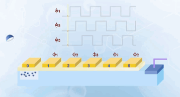
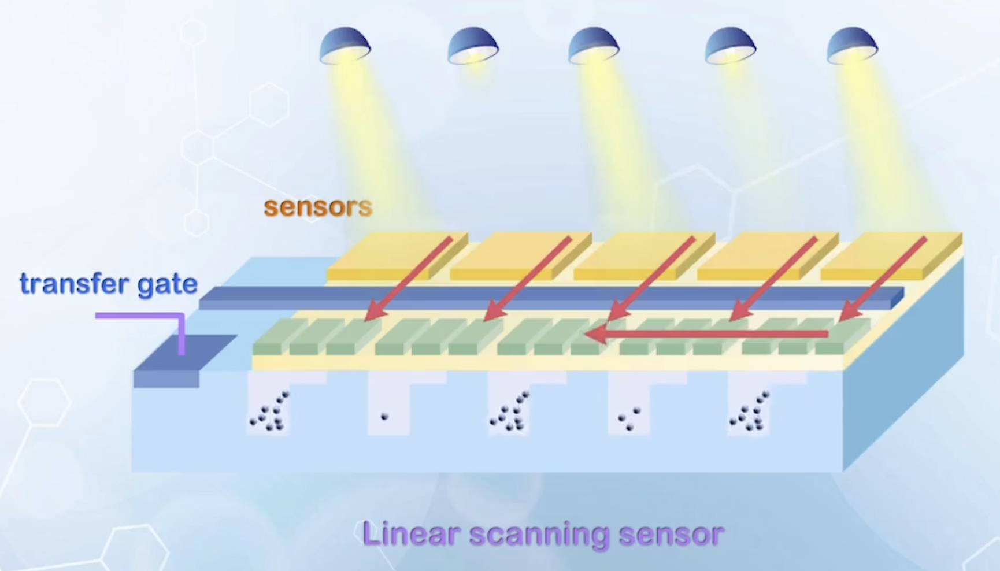
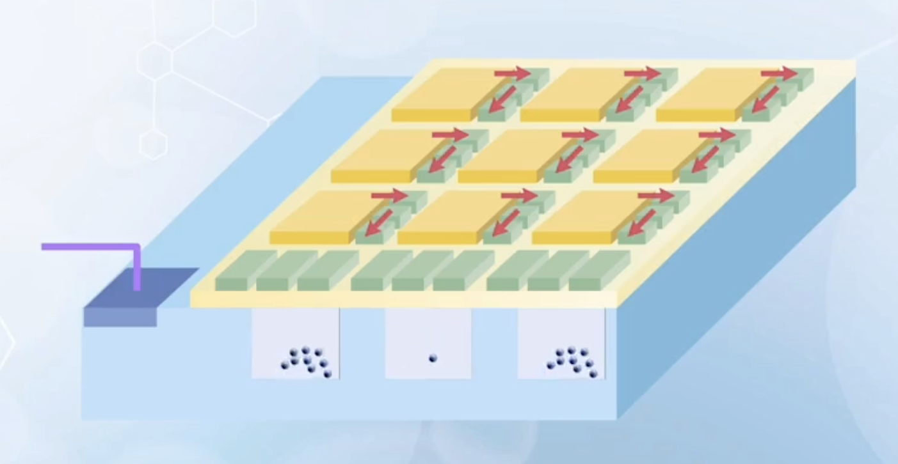
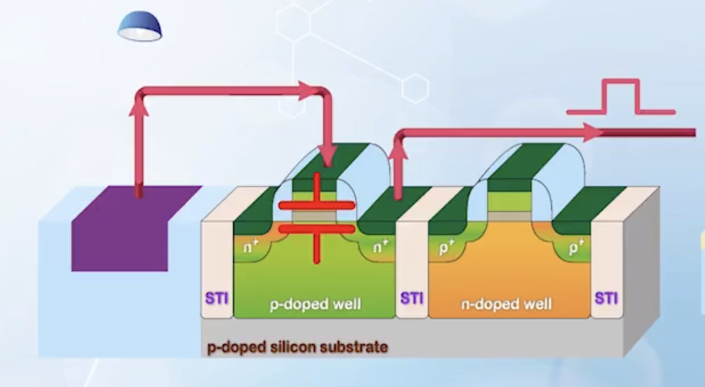
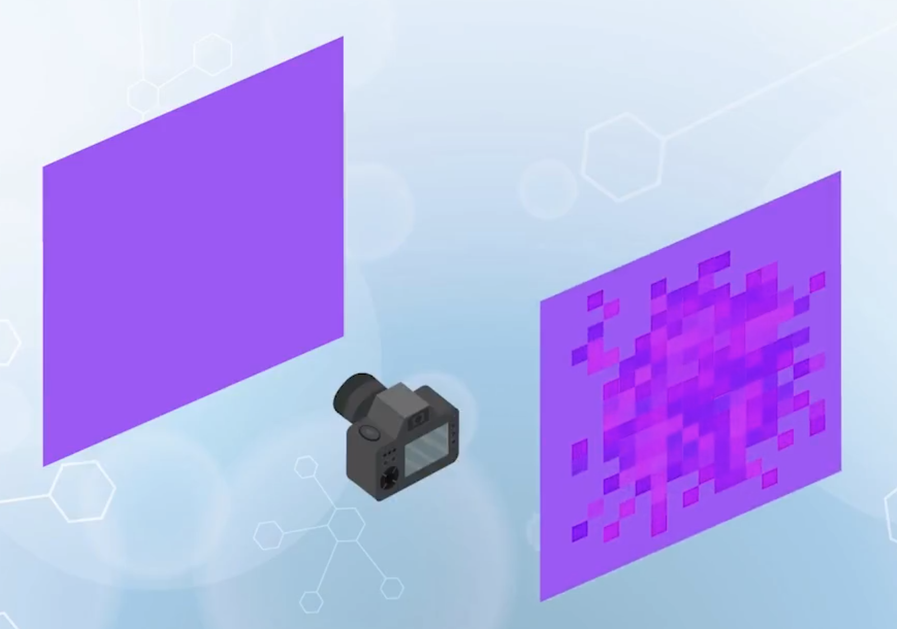

About charge coupled devices (CCDs), including its operation principle, architecture, design considerations, performance, and comparison with CMOS active pixel sensors (APS).

---

## CCD Operation Principle

When using PN junctions to detect optical signals, converting light into an instantaneous current is subject to noise and delay. For applications like digital cameras, the current is usually integrated over a short period of time, and collected charge is used to represent the light intensity. This can be achieved by connecting a capacitor to the PN junction.

$$
\Delta V = \frac{1}{C} \int_0^{\Delta t} I_\text{photo}
$$

The combination of a capacitor and a diode, in a more compact form, is just a MOS capacitor. Operating a MOS capacitor as a device to manipulate charges is called **Charge Coupled Device (CCD)**.

- CCD is just a MOS capacitor operated in **deep depletion** mode
- A fast pulse with $V_\text{G} > V_\text{T}$ is applied to the gate, electrons cannot be supplied quickly enough, and the depletion region expands beyond $x_{d\text{max}}$
  - The surface potential $\phi_s$ is given by the potential divider circuit between the **gate oxide capacitor** and the **silicon depletion capacitor**
  - After the pulse ends, electrons will be generated, the depletion region shrinks back to $x_{d\text{max}}$, and $\phi_S$ drops back to $2 \phi_\text{B}$ (all excess potential is dropped across the oxide, similar to accumulation mode)
- **Potential well / quantum well**: the difference between the initial surface potential and the final surface potential
  - Can be considered as a container of charges
  - When empty, the depth is $\phi_S - 2 \phi_\text{B}$, where $\phi_S$ is the surface potential right after the pulse
  - When electrons are generated, they will gradually fill the potential well, decreasing the clearance depth
  - When the well is full, $\phi_S$ returns to $2 \phi_\text{B}$, and the amount of charge stored is
    $$
    Q = C_{ox} (V_\text{G} - V_\text{T})
    $$
    or the equilibrium value of inversion electrons charge for a given $V_\text{G}$
- A short period of time after the pulse, say $20 \, \mu\text{s}$, the potential well can be considered empty, as the generation rate is in the $\text{ms}$ range
  - In this period, if a light is shone to the capacitor, electron-hole pairs will be generated, and electrons will be collected in the potential well by the electric field, and holes will be driven away to the ground at the body contact
  - Amount of electrons collected will be proportional to the light intensity and exposure time
  - By measuring the charge, we can find out the intensity of the light
  - This charge has to be measured quickly in $\mu\text{s}$ range, so that the thermal generation process does not add any generated electrons to it

## CCD Image Sensor Architecture

- Generated charges have to be transported to the edge of the sensor array to be processed
  - This can be achieved by putting multiple CCDs side by side
  - By applying some specific voltage patterns to the gates, they can be used to transport charges from one side to the other
    - Consider CCD on the leftmost side as the light sensor (C0), and the rest covered by metal to block light
    - To sense a optical light, a voltage is applied to C0 to create a quantum well
    - Once the sampling period is over, the light is cut off
    - To transfer the charge to the next CCD (C1), a higher voltage $V^+$ is applied to the gate of C1, creating a deeper quantum well
    - The voltage on C0 is reduces at the same time, forcing the electrons from the C0 to enter C1 (Or that the more positive voltage on C1 attracts the electrons from C0)
    - After all electrons are transferred to C1, and voltage on C0 reduce to 0, the same $V^+$ is applied to C2, so that the electrons will be shared by C1 and C2
    - The by reducing the voltage on C1 to 0, all electrons will be forced to C2
    - The process is repeated until the charges reach the edge of the array
    - The most common way to implement this is with a three-phase clock
    - 
  - Once the electrons are transported to the end of the array, the signal is read out by a charge-to voltage converter
  - From a logical point of view, this is a **shift register**, which shifts the zero or one from the optical sensor, from one end to the other
    - It carries more than just binary 0 and 1, but a continuous range of charge values from empty to the situation when the well is full
  - CCD shift register cells do not need to sense optical signals, thus can be made smaller to save space
    - Higher voltage is needed for the same electron storage capacity without overflowing the well
- Some applications
  - **Linear scanning sensor**
    - Sensors capture a single line of optical image
    - At the end of a sensing period, the signal is transferred to the bottom CCD shift register, then passed to the edge of array for processing
      
  - 2D array is needed to capture 2D image without mechanical scanning
    - Optical signals capture by the sensor are first transferred to vertical shift registers, then to horizontal shift registers at the edge of the array for processing
      
  - To construct a colored digital camera, two more features are needed
    - **Micro lens**: added on the top of each pixel to focus light onto the sensor
    - **Color filters**: RGB filters forming a Bayer pattern, only one color is sampled at each pixel. For each color, missing pixels are calculated by some weighing functions based on neighboring pixels, instead of direct measurements
      - Real resolution of a CCD is around one third of the image stored in the file

## CCD Design and Structural Optimization

To optimize the performance of CCD image sensors

- **Deep enough potential well** so that electrons will not overflow under strong light
  - A high gate voltage is needed, which may cause the gate oxide to break down
  - **Thick oxide** has to be used
  - The depth is determined by $\phi_S - 2 \phi_\text{B}$
    - $\phi_S$ is given by
      $$
        \phi_S = \frac{C_{ox}}{C_{ox} + C_\text{D}} (V_\text{G} - V_\text{FB})
      $$
    - To increase $\phi_S$, we can either increase $C_{ox}$ or reduce $C_\text{D}$
    - Increasing $C_{ox}$ means reducing oxide thickness, which is contradictory to the requirement of high breakdown voltage
    - Thus, we have to reduce $C_\text{D}$ by **light doping**
    - Another benefit of light doping is that the depletion region can extend deeper, ensuring all optical signals are absorbed

## CCD Image Sensor Performance

- Data in a CCD array is read out serially, or we cannot directly access information in a particular pixel, and the readout process is relatively slow
- Closely packed CCD sensors can potentially cause interference between pixels, creating ghost images and aliasing
  - **Ghost images** happen when a CCD camera is exposed to a bright scene, followed by a dark scene
    - Under strong light, some electron-hole pairs may be generated in the neutral region if the depletion region is not deep enough
    - These electron-hole pairs are not separated as in the depletion region, and moves around randomly
    - When the next dark scene is captured, the number of electron hole pair generated is relatively small, with density lower than the stray electrons.
    - Some stray electrons generated from the previous bright scene without recombining may be collected, so that a ghost image from the previous time frame remains in the current frame
  - **Aliasing** happens when a CCD array is exposed to a scene with high spacial contrast
    - At the bright side, some electrons are generated in the neutral region, and accidentally move to the next sensor, which is in the dark side
    - The bright side of a image may flood the dark side, causing aliasing
- Circuits are needed to control the device (e.g. three-phase clock), and encode images
  - All these are usually done by **low voltage** CMOS circuits
  - These devices are optimized with **thin gate oxide** and **heavy substrate doping**
  - But CCD sensors need to use **high voltage** to generate deep potential wells, and uses **thick oxide** and **light substrate doping**
  - Thus, CCD technology and its control circuits are difficult to be optimized together on a single chip
  - A CCD system is usually made up of **three chips**: CCD sensor array, control circuitry, and output formatting circuitry
  - Resulting **high cost** and **large form factor**

## CMOS Active Pixel Sensors

More recent digital image applications have migrated to the **CMOS active pixel sensor** technology, or **CMOS APS**.

Main problem of CCDs is its difficulty to integrate the image processing and control circuits together with the sensor array, due to different ways of optimization.

- CCD has the signal processing in the **charge domain**, so that the information is being processed in the same silicon substrate before being converted to the required data format
- In CMOS APS, the charge information is **converted to voltage immediately** after being sensed, and passed around through metal wires on top of the chip
  - Does not require a potential well to store the charge, and the charge can be moved immediately to a external capacitor and be converted to voltage
    
  - Main disadvantage
    - The loss during signal conversion
    - A large wire loading capacitance that the converted voltage has to drive
    - Thus an amplifier is needed at each charge to voltage conversion point
    - CMOS APS need an amplifier at each pixel, while CCDs only need one at the output
    - With continuous transistor size reduction, it is possible to add a few transistors in each pixel to form an amplifier
- Charge is read out at each pixel, so that individual pixel data can be accessed directly instead of serially in CCDs
- Raw image quality of CMOS APS is usually lower than CCDs
  - **Fill factor**: the portion of the sensing area in a pixel
    - CMOS APS has lower fill factor because more non-sensing area is needed to form the amplifier
  - The mismatch of the amplifiers and voltage conversion errors at each pixel may cause **fixed pattern noise** (the image generated due to pixel mismatch when capturing a blank image with uniform color)
    
- Recent development in image processing algorithms can effectively compensate the image quality, and all compensation circuitry can be integrated on the same chip, enabling CMOS APS to compete with CCDs in high-end imaging market
