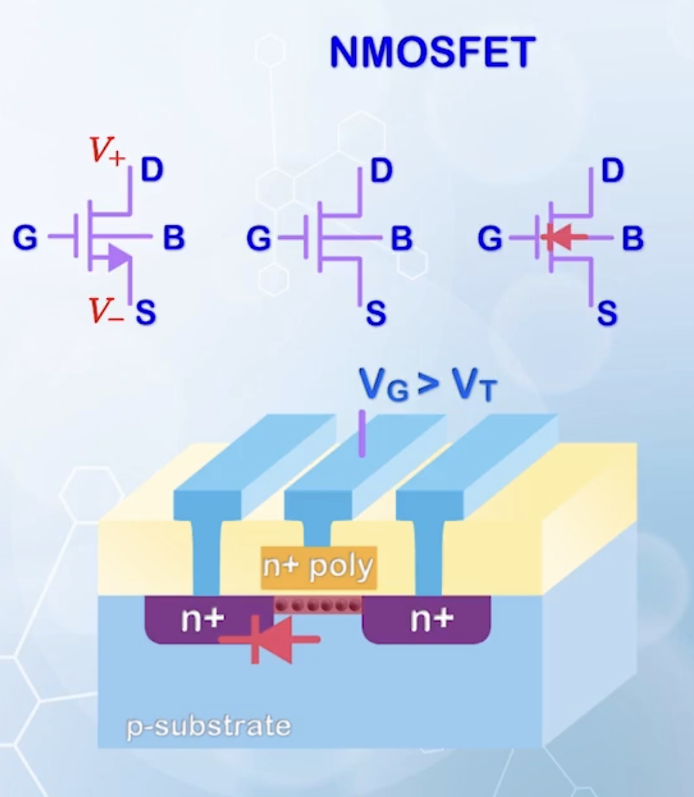
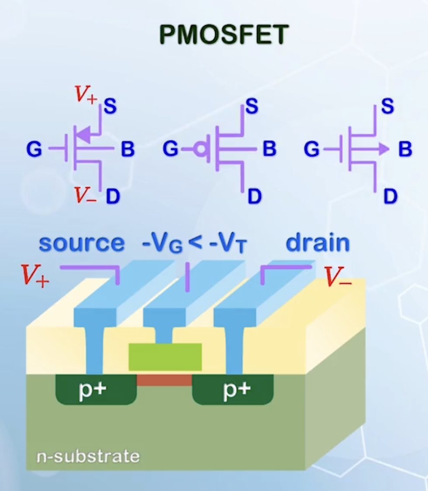
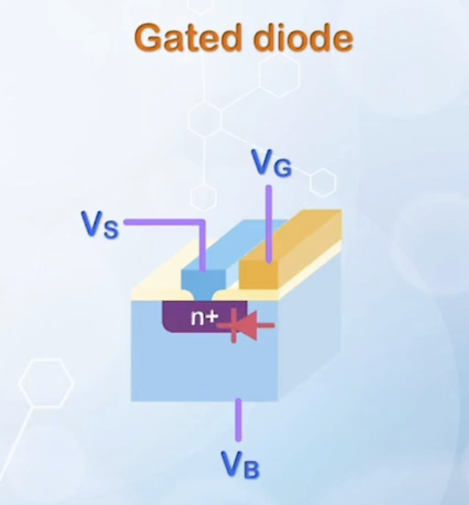
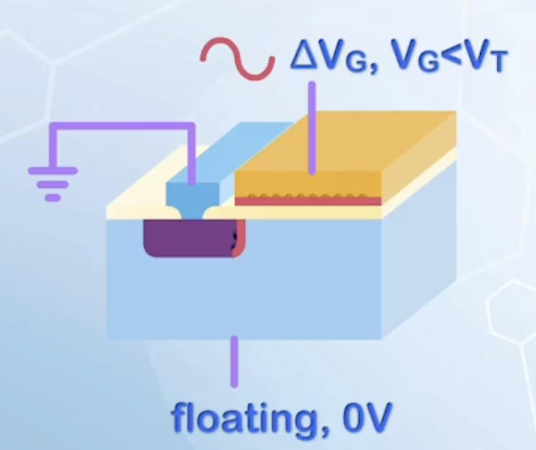
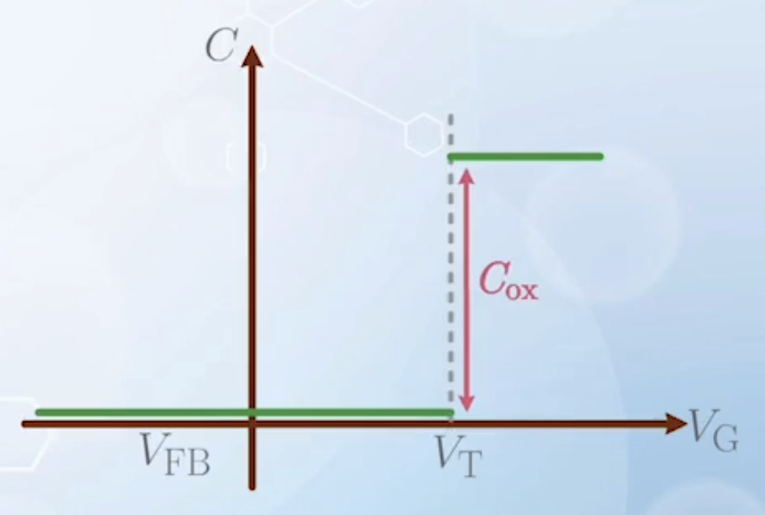
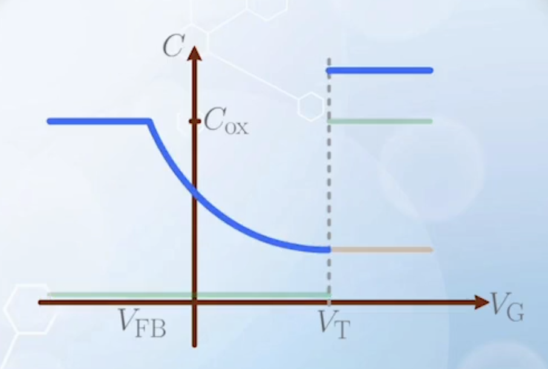
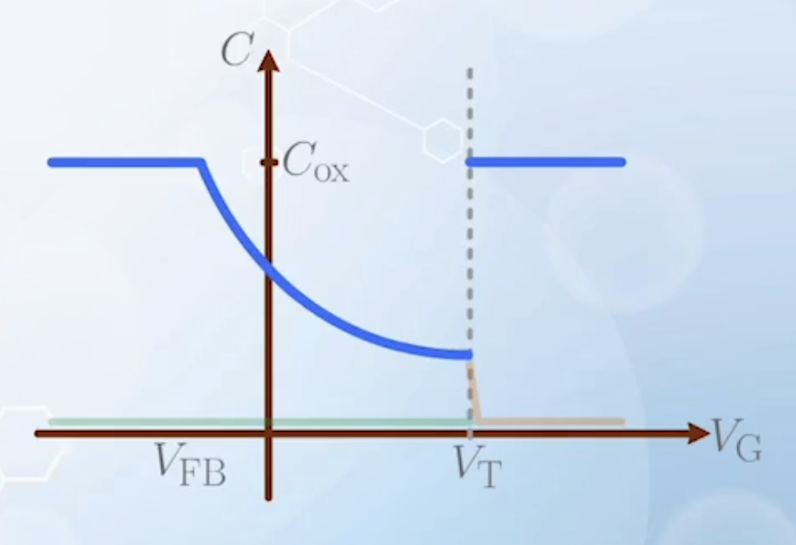
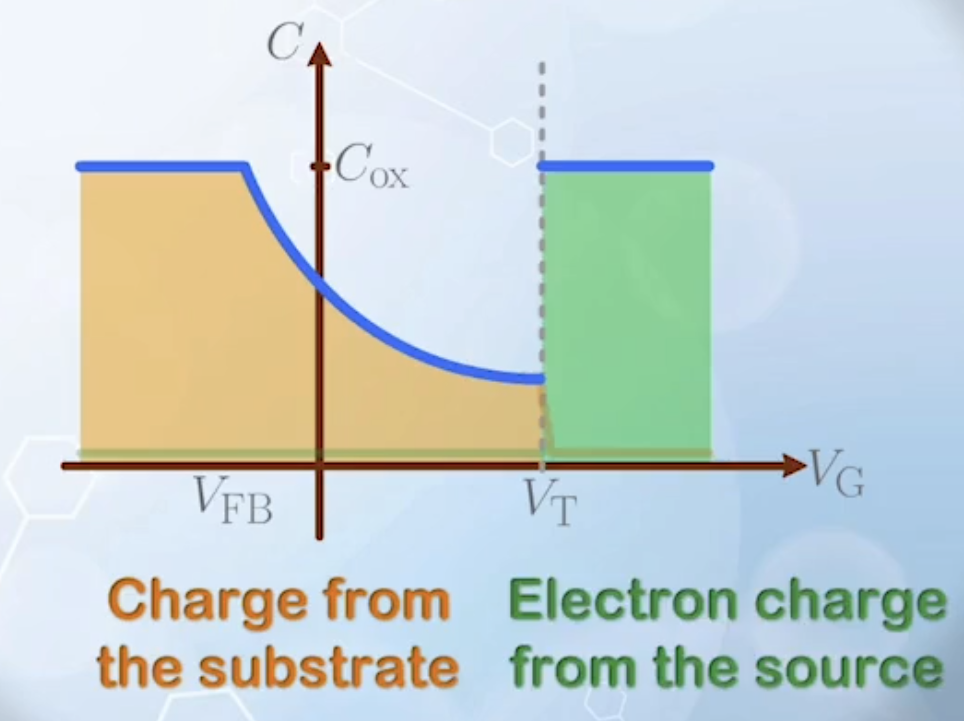
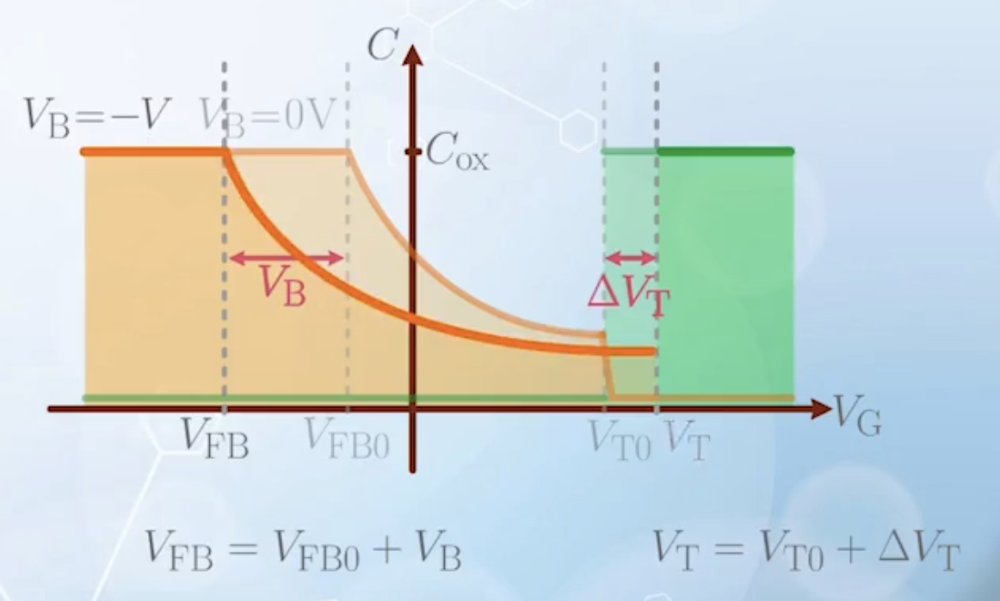
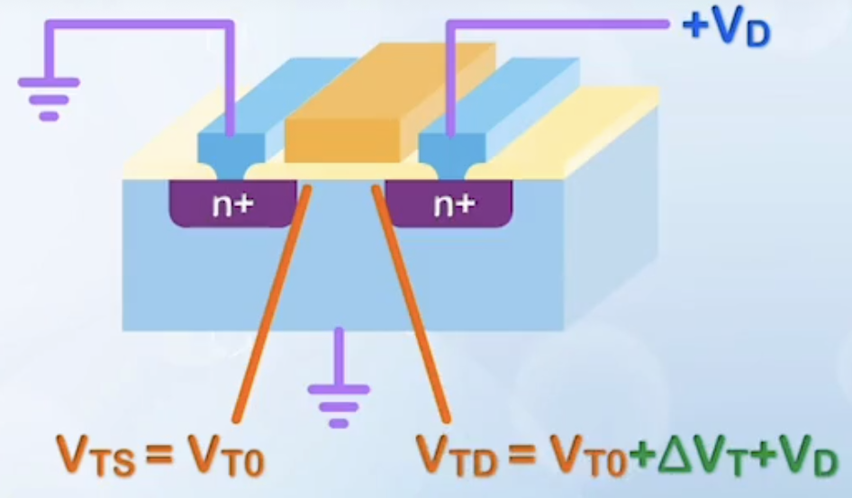

About CMOS technology, MOS capacitor with a source and its capacitance characteristics, and body effect.

---

## Introduction to CMOS Technology

- In contrast to vertically constructed BJTs, source and drain regions in MOSFETs are place horizontally
  - We do not need to worry about the carrier loss due to recombination in lateral BJTs, as the conduction only takes place in a thin layer near the oxide-silicon interface
  - **Channel**: the conduction layer in the MOSFET
  - It is relatively easy to place N channel devices and P channel devices on the same substrate
- For a **NMOSFET**
  - N+ silicon for source and drain
  - P type substrate
  - Usually N+ polysilicon gate
  - When $V_\text{G} > V_\text{T}$, a conductive electron path is formed underneath the oxide substrate interface, and the source and drain are connected
  - N in NMOSFET indicates the conducting carriers are electrons
  - Unlike BJT, MOSFETs have a symmetric structure
    - Drain and source can only be determined by relative voltage applied
    - **Source** is the terminal with the **more negative voltage**
    - If voltage is known, an arrow marks the source, following the polarity of PN junction (**from P pointing to N / the direction of current flow**)
    - Sometimes, source and drain may not be distinguishable, and some alternative symbols may be used
    - When the arrow is placed on the substrate terminal, it points to the gate, as the substrate is P type

  

- For a **PMOSFET**
  - P+ silicon for source and drain
  - N type substrate
  - When a voltage more negative than the threshold voltage is applied to the gate, a conductive hole path is formed underneath the oxide substrate interface, and the source and drain are connected
  - **Source** is the terminal with **more positive voltage** than the drain, as it is where the holes flow from
  - Early PMOSFET gates were also made up of N+ polysilicon due to process simplicity, but it will cause an un-optimized flat band voltage, resulting in undesired large negative threshold voltage
  - Before the use of multiple material gate stack, P+ polysilicon gates were used in most cases to provide symmetry between NMOSFETs and PMOSFETs

  

- To add a PMOSFET beside an NMOSFET on the same substrate (P type), certain regions must be converted to N type, forming a **well**
- NMOSFETs are faster and can provide higher current drive than PMOSFETs at the same size, NMOSFETs are used more frequently
  - NMOSFETs are usually constructed on the substrate to reduce the overhead of well formation
- More advanced processing may place both NMOSFETs and PMOSFETs in separated wells for better performance optimization, but with some chip area penalty
- To ensure proper operation, the P substrate is usually connected to ground, or the lowest potential in the circuit to prevent the turn-on of any junction between the substrate and the source / drain, as the source / drain voltage may change during operation
- Similarly, the N well is usually connected to the highest potential in the circuit, usually the power supply, for the same reason
- **Complementary MOSFET Technology (CMOS)**: the technology putting both NMOSFETs and PMOSFETs on the same wafer
  - Advantage: turn on a switch and turn off the other with the same voltage, allowing the implementation of very compact logic gates with very low standby power
  - BJT is popular for discrete devices due to high current drive
  - CMOS is dominant for integrated circuits due to low power consumption and high density

## MOS Capacitor With a Source

Now we add source and drain regions to the MOS capacitor structure discussed previously. To keep it simple for now, assume the source and the drain are connected together, and both can be labeled as source. By symmetry, it can be considered as a three terminal device, usually called a **gated diode**, as it comprises a gate and a diode.

To measure the capacitance of this structure

- When **source** is floating, we measure the capacitance between the gate and the substrate, which is the same as the [MOS capacitor](../2/) discussed previously, and the source region has no effect on the capacitance
  - Reminder: generation is slow, under normal measurement conditions, only **high frequency** $C-V$ characteristics can be measured
- When **substrate** is floating, we measure the capacitance between the gate and the source
  - Take source as the reference voltage and assume it to be grounded
  - Substrate will pick up the voltage of source, otherwise, a current flow will be established between the source and the substrate, which is not allowed by the floating substrate condition
  - Now we need to find out where the fluctuating charge $\delta Q$ appears
    - At the gate terminal, all charge appear at the gate-oxide interface
    - At the N+ source terminal, the carriers responsible for conduction are electrons
      - They cannot enter the substrate when $V_\text{G} < V_\text{T}$, because the substrate is considered to be an insulator to these electrons
        - The capacitance can be considered to be formed between the N+ source boundary and the gate electrode
        - There are almost no overlap between the location where $\delta Q$ appears at the gate and the source, so the capacitance is very small
          
      - When $V_\text{G} > V_\text{T}$, the channel region is inverted, and a conductive path is formed which connects the source and the substrate
        - $\delta Q$ can reach the silicon interface at the substrate
        - All of a sudden, an additional capacitance of $C_{ox}$ is added to the system when $V_\text{G}$ increases beyond $V_\text{T}$
        - There is a sudden jump in the capacitance value at $V_\text{T}$
          
- Connecting **source and substrate** as a single terminal, we measure the capacitance between the gate and the combined source / substrate terminal
  - The resulting capacitance is the sum of the capacitance measured with floating source and floating substrate
    
  - Two capacitors are assumed to have no interaction
  - In reality, when the inversion layer is formed and grounded, the connection from the substrate to the gate electrode is cut off, and the **gate to substrate capacitance** becomes zero
  - The resulting capacitance is like
    
    It is just the low-frequency $C-V$ characteristic of a MOS capacitor
    - This is because when a source is added to the MOS capacitor and grounded, it can supply electrons to the channel when necessary without the generation process, thus the low-frequency characteristics will always be observed
    - The curve shall be divided into two parts at $V_\text{T}$
      
      - Before $V_\text{T}$: the charge is provided by the substrate
      - After $V_\text{T}$: the charge is electrons provided by the source

## Effects of Body Voltage

- When the substrate and source are connected to different voltages, mainly about negative substrate voltage relative to the source in an NMOSFET, or positive substrate voltage relative to the source in a PMOSFET, otherwise, the substrate-source diode will be forward biased and conduct current, which is not controlled by the gate
- For NMOSFET, when source, drain, and substrate voltages are all zero
  - A flat band voltage $V_\text{G} = V_\text{FB0}$ is applied to the gate, all energy bands are flat, and the Fermi level in the silicon substrate aligns
  - When a voltage is applied to the gate, causing the energy band to bend by $2 \phi_\text{B}$, the threshold voltage is reached, gate voltage is $V_\text{T0}$
- Now we apply a negative voltage to the substrate, keeping the gate voltage at $V_\text{FB0}$
  - This $V_\text{B}$ raises the energy band at the P substrate, causing the Fermi level to break between the source and substrate
  - A band bending between the gate and the substrate also occurs because of the extra voltage difference, and the MOSFET is no longer at flat band condition
  - To bring the energy bands back to flat, a more negative voltage must be applied to the gate, and now the gate voltage is $V_\text{FB} = V_\text{FB0} + V_\text{B}$, where $V_\text{B}$ is negative
  - The voltage required to reach the **same band bending** ($2 \phi_\text{B}$) from the back to the front is now $V_\text{T0} + V_\text{B}$
    - However, previously at this band bending condition, the barrier between the source and the channel almost disappears, and electrons can easily flow from the source to the channel. But the negative $V_\text{B}$ raises the channel energy for electrons
    - Also, the electrons generated in the channel will be drained away, as the drain and source is connected to a higher voltage, and the inversion charge cannot be collected
    - The system remains at **depletion**
  - To match the **threshold condition** with the case when $V_\text{B} = 0$, an extra band bending of $V_\text{B}$ is required, in addition to the previous band bending of $2 \phi_\text{B}$, and the new threshold voltage is marked as $V_\text{T}$, with band bending of $2 \phi_\text{B} - V_\text{B}$ (minus sign as $V_\text{B}$ is negative)

## Threshold Voltage With a Substrate Bias

- To achieve threshold condition, more band bending from the substrate to the gate is required
- More band bending results in a larger depletion width, given by a new $x_d$, and $x_d > x_{d\text{max}}$
- Recall that
  $$
  V_\text{T} = V_\text{FB} + \phi_\text{S} + V_{ox}
  $$
- Now
  $$
  \begin{aligned}
    V_\text{FB} &= V_\text{FB0} + V_\text{B} \\
    \phi_\text{S} &= 2 \phi_\text{B} - V_\text{B} \\
  \end{aligned}
  $$
  - The sum of $V_\text{FB}$ and $\phi_\text{S}$ remains unchanged
- All difference comes from $V_{ox}$
  $$
  \begin{aligned}
    V_{ox} &= \frac{Q_\text{D}}{C_{ox}} \\
    Q_\text{D} &= q N_A x_d \\
    x_d &= \sqrt{\frac{2 \varepsilon_\text{Si}}{q N_A} (2 \phi_\text{B} - V_\text{B})} \\
    \Rightarrow Q_\text{D} &= \sqrt{2 q N_A \varepsilon_\text{Si} (2 \phi_\text{B} - V_\text{B})} \\
    \Rightarrow \Delta Q_\text{D} &= Q_\text{D} - Q_{\text{D}0} \\
    &= \sqrt{2 q N_A \varepsilon_\text{Si}} \left( \sqrt{2 \phi_\text{B} - V_\text{B}} - \sqrt{2 \phi_\text{B}} \right)
  \end{aligned}
  $$
- Putting all together
  $$
  \begin{aligned}
    V_\text{T} &= V_\text{T0} + \frac{\Delta Q_\text{D}}{C_{ox}} \\
    &= V_\text{T0} + \frac{\sqrt{2 q N_A \varepsilon_\text{Si}}}{C_{ox}} \left( \sqrt{2 \phi_\text{B} - V_\text{B}} - \sqrt{2 \phi_\text{B}} \right) \\
    &= V_\text{T0} + \gamma \left( \sqrt{2 \phi_\text{B} - V_\text{B}} - \sqrt{2 \phi_\text{B}} \right) \\
    \text{where} \quad \gamma &= \frac{\sqrt{2 q N_A \varepsilon_\text{Si}}}{C_{ox}} \quad \text{body factor}
  \end{aligned}
  $$
  heavy doping or smaller $C_{ox}$ will give rise to a higher body factor
- $2 \phi_\text{B}$ is usually approximately $0.7 \, \text{V}$ for doped silicon, similar to the turn-on voltage of silicon PN junctions and BJT
  $$
    V_\text{T} = V_\text{T0} + \gamma \left( \sqrt{0.7 - V_\text{B}} - \sqrt{0.7} \right)
  $$
  which shows that $V_\text{T}$ increases with the square root of the substrate bias magnitude $|V_\text{B}|$

## MOS Capacitor With a Body Bias

- When a negative body bias is applied to the substrate, the curve of the first part of the $C-V$ characteristics shifts left by $-V_\text{B}$
- When $x_d$ reaches $x_{d\text{max}}$, the inversion layer cannot be formed yet, the source and drain terminals will force the capacitor to enter the **deep depletion region**, the depletion region continues to expand, and the capacitance continues to decrease, until $V_\text{G}$ is the new threshold voltage $V_\text{T} = V_\text{T0} + \Delta V_\text{T}$
- After that, the inversion layer is formed, and the capacitance jumps back to $C_{ox}$
  
- If we add a positive voltage $V$ to the source, and the substrate is grounded, the $C-V$ curve will shift right by $V$ as a whole, and the new $V_\text{T}$ becomes $V_\text{T0} + |V| + \Delta V_\text{T}$
  - This (**grounded substrate and positive N+ terminal voltage**) is a more common setup in NMOSFET
  - Usually, $V_\text{TS} < V_\text{TD}$, as the source and substrate are usually grounded without any voltage difference, while the drain may have a positive voltage applied (the substrate is at a negative voltage relative to the drain)
    
  - This effect is usually ignored by approximating $V_\text{T}$ anywhere in the channel to be $V_\text{T0}$
