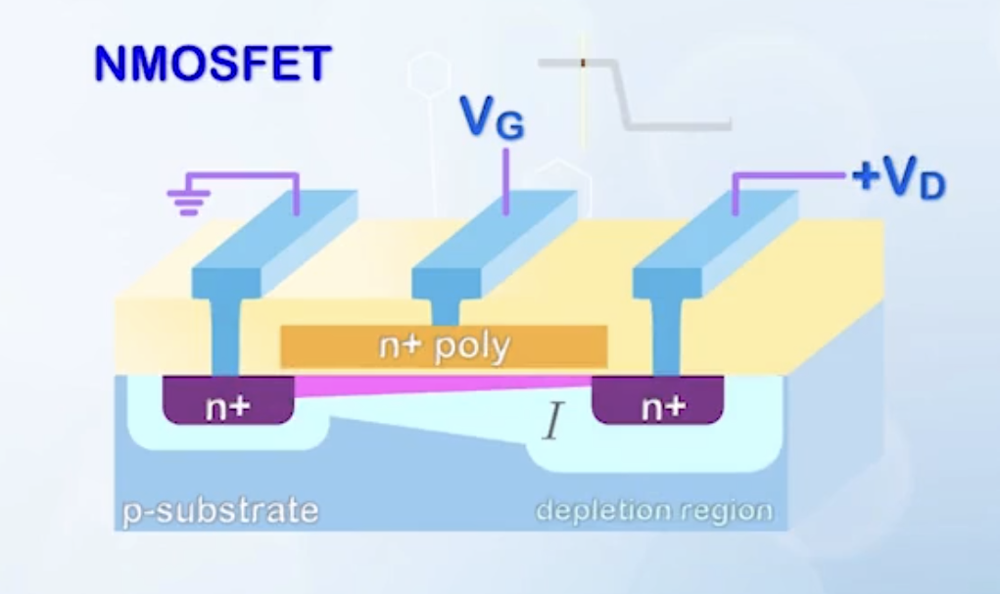
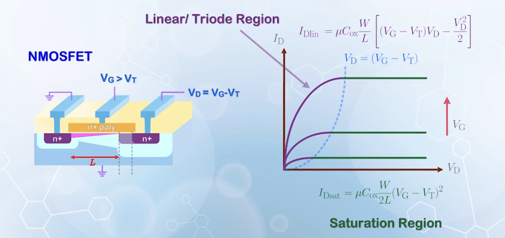
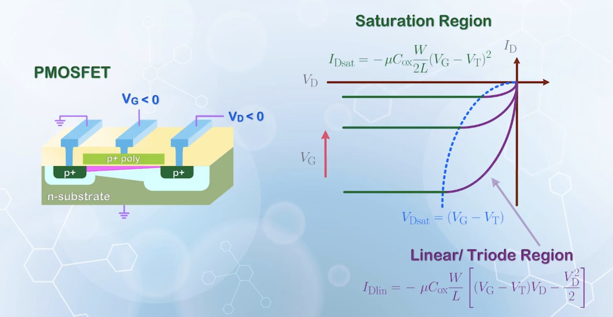

About how to calculate the current of a MOSFET when it is turned on, based on the classical pinchoff model, the channel length modulation effect, and some discussions about the inconsistencies and limitations of the model.

---

## Charge and Velocity of Channel Carriers

MOSFET is basically a switch controlled by gate. When $V_\text{G} < V_\text{T}$, electrons from the source cannot enter the channel, and no current flows. When $V_\text{G} > V_\text{T}$, electrons from the source can enter the channel, and a conduction path is formed. A current will flow if a positive $V_\text{G}$ is applied (NMOSFET).

Assume source and substrate are grounded

- As a switch, $I_\text{D}$ is mostly assumed to be $0$ when $V_\text{G} < V_\text{T}$
- When $V_\text{G} > V_\text{T}$, inversion electrons form in the channel, and electrons will be attracted from the source to drain by the positive $V_\text{D}$
  - The electric field is the main driving force, and the current is mainly **drift current**
  - The current depends on the **number of charge** available, and the **velocity of these charges**
  - The current at any location $y$ is
    $$
    I(y) = Q(y) v(y)
    $$
    where $Q(y)$ is the amount of charge at location $y$
  - Defining $y$ as the coordinate from the source to drain
  - There is no accumulation or removal of charges, the current flows remains constant along the channel
    - The region with more charges will have lower velocity, and vice versa
  - Starting from a small $V_\text{D}$ close to $0$
    - For a MOSFET with channel length $L$ and width $W$, total charge under the gate is
      $$
        C_{ox} W L (V_\text{G} - V_\text{T})
      $$
    - The charge per unit length is the above divided by $L$
      $$
        Q(y) = C_{ox} W (V_\text{G} - V_\text{T})
      $$
  - When $V_\text{D}$ increases, the voltage across the gate capacitor near the drain will be reduced to $V_\text{G} - V_\text{D}$, so the charge per unit length near the drain becomes
    $$
      Q(y) = C_{ox} W (V_\text{G} - V_\text{T} - V_\text{D})
    $$
    which means, the charge near the drain is less than that near the source
    - The voltage in the channel somewhere between source and drain is $V(y)$, so the charge per unit length at location $y$ is
      $$
        Q(y) = C_{ox} W (V_\text{G} - V_\text{T} - V(y))
      $$
      $V_\text{T}$ should be a function of $y$, as increasing $V(y)$ is similar to decreasing $V_\text{D}$, but the effect is ignored for now
  - The velocity of electrons are usually assumed to be proportional to the electric field
    $$
      v(y) = \mu E(y)
    $$
    where $\mu$ is the mobility of carriers. For electrons in silicon
    $$
    \mu_{e(b)} = 1400 \, \text{cm}^2 \text{V}^{-1} \text{s}^{-1}
    $$
    It is the mobility when electrons are moving **inside the bulk silicon**
    - When electrons are moving **near the silicon-oxide interface**, the mobility is lower due to more scattering
      $$
      \mu_{e(s)} = 600 \, \text{cm}^2 \text{V}^{-1} \text{s}^{-1}
      $$
    - For holes in silicon
      $$
      \begin{aligned}
      \mu_{h(b)} &= 450 \, \text{cm}^2 \text{V}^{-1} \text{s}^{-1} \\
      \mu_{h(s)} &= 250 \, \text{cm}^2 \text{V}^{-1} \text{s}^{-1}
      \end{aligned}
      $$
  - The current is given by
    $$
    I_\text{D} = C_{ox} W (V_\text{G} - V_\text{T} - V(y)) \mu E(y)
    $$

## Linear Region Current Equation

- The electric field is the negative gradient of voltage
  $$
  E(y) = \frac{\mathrm{d}V(y)}{\mathrm{d}y}
  $$
- Now the current equation becomes
  $$
  I_\text{D} \mathrm{d}y = C_{ox} W \mu (V_\text{G} - V_\text{T} - V(y)) \mathrm{d}V(y)
  $$
  There should be a negative sign in the equation, but let's focus on the magnitude for now
- Integrating both sides from source to drain

  $$
  \begin{aligned}
    \int_\text{source}^\text{drain} I_\text{D} \mathrm{d}y &= \int_\text{source}^\text{drain} C_{ox} W \mu (V_\text{G} - V_\text{T} - V) \mathrm{d}V \\

    \int_0^L I_\text{D} \mathrm{d}y &= \int_0^{V_\text{D}} C_{ox} W \mu (V_\text{G} - V_\text{T} - V) \mathrm{d}V \\
    I_\text{D} L &= C_{ox} W \mu \left[(V_\text{G} - V_\text{T}) V_\text{D} - \frac{V_\text{D}^2}{2} \right] \\
    I_\text{D} &= \mu C_{ox} \frac{W}{L} \left[(V_\text{G} - V_\text{T}) V_\text{D} - \frac{V_\text{D}^2}{2} \right]
  \end{aligned}
  $$

- A simpler approach is
  - The current is also given by
    $$
    I_\text{D} = Q_\text{avg} v_\text{avg}
    $$
  - The average charge per unit length is just the average of the charge at source and drain
    $$
    Q_\text{avg} = C_{ox} W \left(V_\text{G} - V_\text{T} - \frac{V_\text{D}}{2}\right)
    $$
  - As of the average velocity
    $$
    v_\text{avg} = \mu E_\text{avg}
    $$
  - If we assume the electric field is uniform along the channel
    $$
    E_\text{avg} = \frac{V_\text{D}}{L}
    $$
  - In reality, the electric field near the source is lower, and that near the drain is higher, as electrons move faster near the drain
  - However, integrating $E$ over the channel length must give $V_\text{D}$ still, so the average electric field is still $V_\text{D}/L$
  - Therefore,
    $$
    I_\text{D} = C_{ox} W \left(V_\text{G} - V_\text{T} - \frac{V_\text{D}}{2}\right) \mu \frac{V_\text{D}}{L}
    $$
    which is the same as the previous result

## Saturation Region Current Equation

As $V_\text{D}$ increases, $I_\text{D}$ will increase until $V_\text{D} = V_\text{G} - V_\text{T}$. If we still follow the previous current equation, when $V_\text{D}$ exceeds $V_\text{G} - V_\text{T}$, the current will start to decrease, and eventually become $0$. But from measurements, the current of a MOSFET eventually saturates and becomes a constant with a high enough $V_\text{D}$.

- For the inversion charge distribution

  $$
  C_{ox} W (V_\text{G} - V_\text{T} - V(y))
  $$

  to be valid, $V_\text{G} - V_\text{T} - V(y)$ must be positive. Otherwise, the channel will be depleted, and there will be no charge for conduction
  - This will happen at the drain when $V_\text{D}$ becomes larger than $V_\text{G} - V_\text{T}$
  - A **pinchoff region**, where the channel is depleted, will form near the drain
  - The channel can be separated into two different regions by the $V(y) = V_\text{G} - V_\text{T}$ point
    - **Gradual channel region**: the region where $V(y) < V_\text{G} - V_\text{T}$, inversion charge exists, and the channel behaves like a conductor
    - **Pinchoff region**: the region where $V(y) > V_\text{G} - V_\text{T}$, inversion charge is depleted, and the channel becomes an insulator
  - All drain voltage beyond $V_\text{G} - V_\text{T}$ will be dropped across the pinchoff region
  - :::error !!!INCONSISTENCY MENTIONED!!!
    In the **pinchoff region**, the channel is depleted, and $Q(y) = 0$. Meanwhile, the current is given by $I_\text{D} = Q(y) v(y)$. How can there be a current if there is no charge?

    This inconsistency will be resolved later, and for now, we just forget about the pinchoff region, and assume the drain is moved to the $V_\text{G} - V_\text{T}$ point, with $V_\text{D}$ picking up the value of $V_\text{G} - V_\text{T}$.
    :::

  - Assuming the pinchoff region is very small compared to the channel length, and the length of the gradual channel region can be approximated as $L$
  - Then, the current in the pinchoff condition is calculated with the same equation as before, but with $V_\text{D}$ replaced by $V_\text{G} - V_\text{T}$
    $$
    \begin{aligned}
    I_\text{Dsat} &= \mu C_{ox} \frac{W}{L} \left[(V_\text{G} - V_\text{T})(V_\text{G} - V_\text{T}) - \frac{(V_\text{G} - V_\text{T})^2}{2}\right] \\
    &= \frac{1}{2} \mu C_{ox} \frac{W}{L} (V_\text{G} - V_\text{T})^2
    \end{aligned}
    $$
    Any $V_\text{D}$ beyond $V_\text{G} - V_\text{T}$ will be dropped across the pinchoff region, and will not affect the current

- Therefore, the final current equation is

  $$
  \begin{aligned}
    I_\text{Dlin} &= \mu C_{ox} \frac{W}{L} \left[(V_\text{G} - V_\text{T}) V_\text{D} - \frac{V_\text{D}^2}{2} \right] & V_\text{D} < V_\text{G} - V_\text{T} \\
    I_\text{Dsat} &= \frac{1}{2} \mu C_{ox} \frac{W}{L} (V_\text{G} - V_\text{T})^2 & V_\text{D} \geq V_\text{G} - V_\text{T}
  \end{aligned}
  $$
  - The first region is called the **linear region** or **triode region**, and the second region is called the **(current) saturation region**
  - The separation between the two regions is
    $$
    V_\text{Dsat} = V_\text{G} - V_\text{T}
    $$

  

- Same applies to PMOSFET, with voltages and currents become negative relative to the source
  - Negative sign is added to the current, as the current in PMOSFET flows out of the drain

  

## Channel Length Modulation

Previously, we assumed the drain voltage beyond $V_\text{Dsat}$ does not affect $I_\text{D}$. However, in reality, increasing $V_\text{D}$ beyond $V_\text{Dsat}$ will extend the pinchoff region further into the channel, and the length of the gradual channel region will be reduced. As a result, $I_\text{D}$ will increase. This is the **channel length modulation** effect, describing how $V_\text{D}$ affects $I_\text{D}$ by changing the effective channel length.

- In saturation region, the current is given by
  $$
  I_\text{Dsat} = \frac{1}{2} \mu C_{ox} \frac{W}{L_\text{ch}} (V_\text{G} - V_\text{T})^2
  $$
  where $L_\text{ch}$ is the length of the region where the channel voltage increases from $0$ to $V_\text{Dsat}$
- Replacing $L_\text{ch}$ with $L - \Delta L$, and perform some mathematical magic, we have
  $$
  \begin{aligned}
  I_\text{Dsat} &= \frac{1}{2} \mu C_{ox} \frac{W}{L - \Delta L} (V_\text{G} - V_\text{T})^2 \\
  &= \frac{1}{2} \mu C_{ox} \frac{W}{L} \frac{1}{1 - \frac{\Delta L}{L}} (V_\text{G} - V_\text{T})^2 \\
  &= I_\text{Dsat0} \frac{1}{1 - \frac{\Delta L}{L}} \\
  &= I_\text{Dsat0} \left(1 + \frac{\Delta L}{L} + \left(\frac{\Delta L}{L}\right)^2 + \cdots \right) \\
  &\approx I_\text{Dsat0} \left(1 + \frac{\Delta L}{L}\right) \quad \Delta L \text{ is assumed to be very small}
  \end{aligned}
  $$
- To calculate $\Delta L$, we use Poisson's equation
  - In the pinchoff region, there are only the depleted charge from the dopant ions
  - Therefore, the charge density is
    $$
    \rho = q N_A
    $$
  - Integrate twice to get the voltage difference across the pinchoff region
    $$
    V = \frac{q N_A}{2 \varepsilon_\text{Si}} (\Delta L)^2
    $$
  - The voltage across the pinchoff region is $V_\text{D} - V_\text{Dsat}$
  - Thus,
    $$
    \Delta L = \sqrt{\frac{2 \varepsilon_\text{Si}}{q N_A} (V_\text{D} - V_\text{Dsat})}
    $$
  - Putting it back
    $$
    I_\text{Dsat} = I_\text{Dsat0} \left(1 + \frac{1}{L} \sqrt{\frac{2 \varepsilon_\text{Si}}{q N_A} (V_\text{D} - V_\text{Dsat})}\right)
    $$
  - :::error !!!INCONSISTENCY BACK AGAIN!!!
    For the same reason mentioned before, $\Delta L$ given here is physically incorrect, as assuming the pinchoff region only contains depleted charge is physically incorrect.
    :::
- $I_\text{Dsat}$ has a square root dependence on $V_\text{D}$ beyond $V_\text{Dsat}$
- As the range of $V_\text{D}$ is limited, we can linearize the equation
  $$
    I_\text{Dsat} \approx I_\text{Dsat0} (1 + \lambda V_\text{D})
  $$
  where $\lambda$ is the **channel length modulation parameter**
- The slope in the $I_\text{D} - V_\text{D}$ curve is then given by $I_\text{Dsat} \lambda$, and the output resistance is
  $$
  r_\text{o} = \frac{1}{\lambda I_\text{Dsat0}}
  $$
  which is similar to the output resistance of a BJT, which is given by
  $$
  r_\text{o} = \frac{V_A}{I_\text{C}}
  $$
  with $V_A$ replaced by $1/\lambda$ and $I_\text{C}$ replaced by $I_\text{Dsat0}$
  - Therefore, $1/\lambda$ is sometimes called the $V_A$ of a MOSFET, and the unified output resistance equation is
    $$
    r_\text{o} = \frac{V_A + V_\text{D}}{I_\text{Dsat}} \approx \frac{V_A}{I_\text{Dsat}}
    $$
    assuming $V_A \gg V_\text{D}$

## Inconsistencies in the Pinchoff Model

We have derived different equations for the MOSFET current in linear and saturation regions based on the pinchoff model.

- For $V_\text{D} < V_\text{G} - V_\text{T}$
  $$
  I_\text{Dlin} = \mu C_{ox} \frac{W}{L} \left[(V_\text{G} - V_\text{T}) V_\text{D} - \frac{V_\text{D}^2}{2} \right]
  $$
- For $V_\text{D} > V_\text{G} - V_\text{T}$
  $$
  I_\text{Dsat} = \frac{1}{2} \mu C_{ox} \frac{W}{L} (V_\text{G} - V_\text{T})^2 (1 + \lambda V_\text{D})
  $$
- There are some inconsistencies
  - **Mathematical inconsistencies**: using the two equations, the current at $V_\text{D} = V_\text{G} - V_\text{T}$ is not continuous
    - Actually, the equation given for the saturation region is only used to illustrate the effect of $V_\text{D}$ on $I_\text{D}$, and is never used to calculate $I_\text{Dsat}$ besides finding the slope after differentiation
    - The simplest way to correct for the discontinuity is just substitute $V_\text{D}$ with $V_\text{D} - V_\text{Dsat}$, but **who cares?**
    - We just assume the channel length modulation effect is very small, and use $I_\text{Dsat0}$ to approximate $I_\text{Dsat}$
  - **Physical inconsistencies**: according to the pinchoff model, $Q(y) = 0$ for $y$ in the pinchoff region. To obtain a finite current, $v(y)$ must be infinite. However, based on the knowledge of relativity theory, the speed of light is the limit of all measurable speed, so the velocity of electrons cannot be infinite
- However, it is still a good approximation to reality in some special cases
- These are the limitations of the pinchoff model, more accurate models will be discussed later