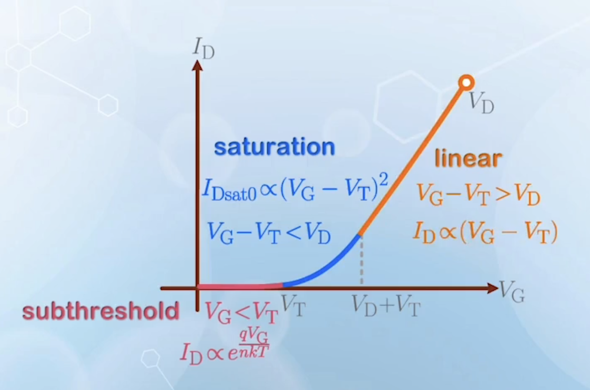
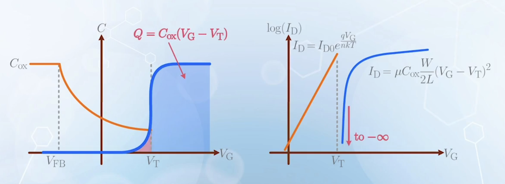
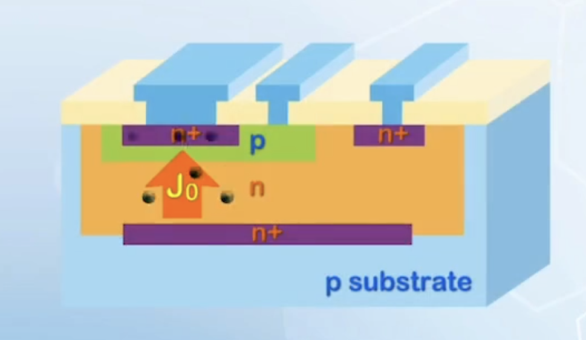
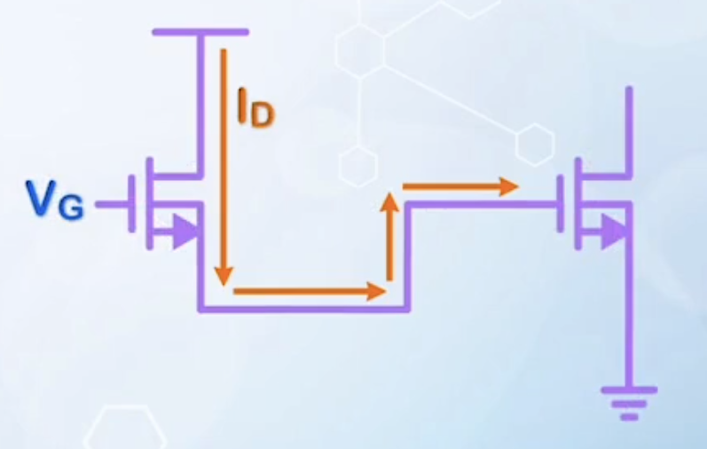
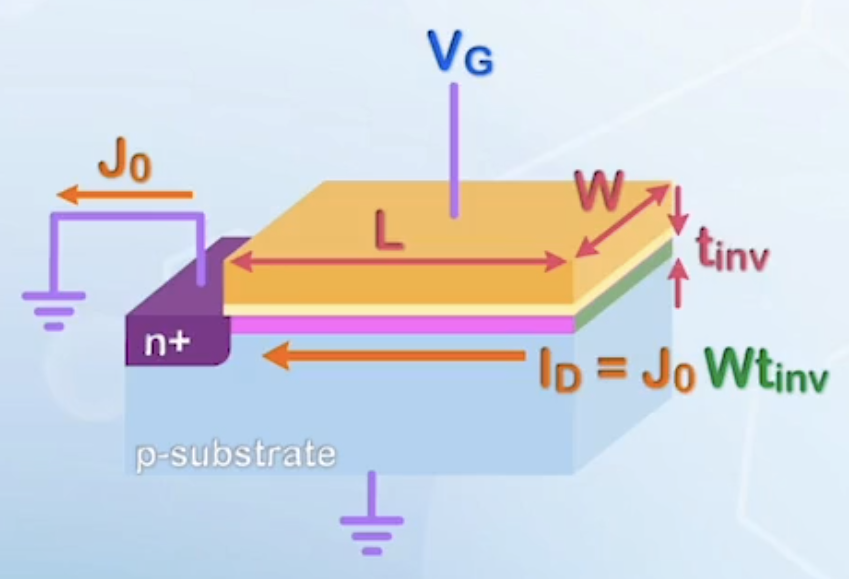
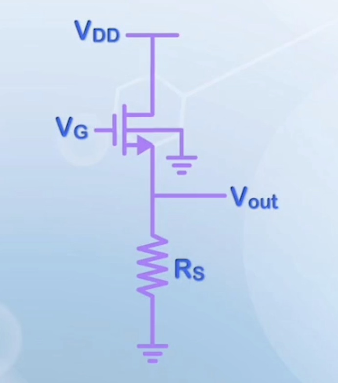
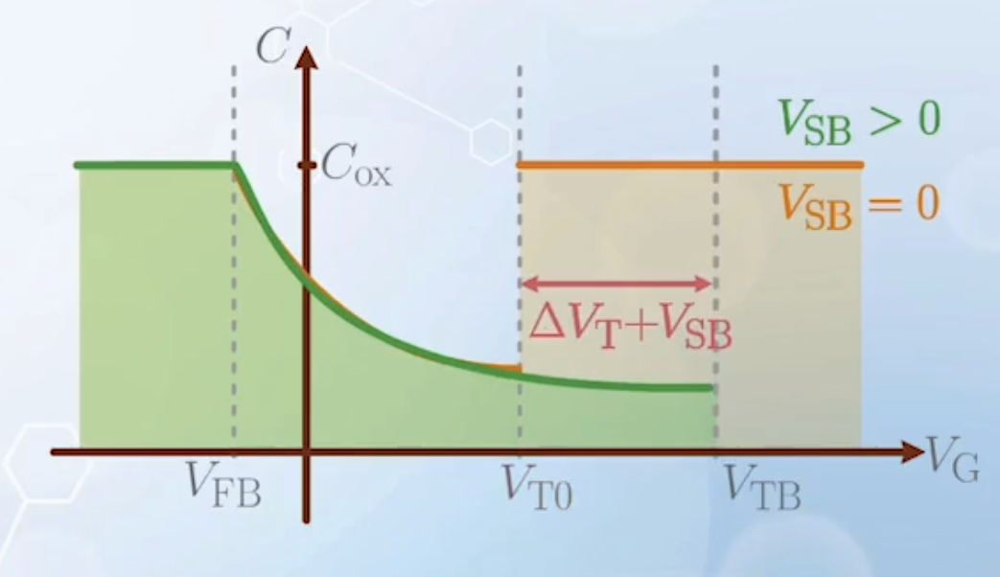
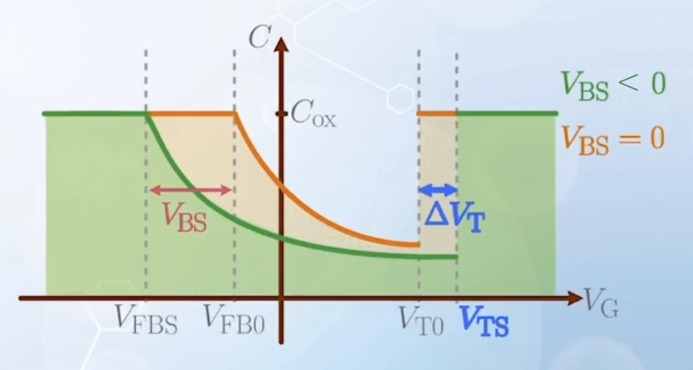
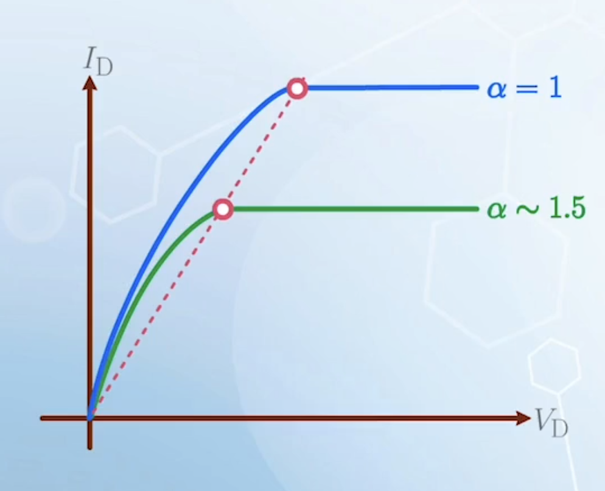

About the subthreshold behaviors of MOSFETs, the turn-on characteristics, comparison between MOSFETs and BJTs, and the effect of body bias and substrate depletion charge on MOSFET I-V characteristics.

---

## MOSFET Subthreshold Region

For a properly designed MOSFET, the $V_\text{T}$ is usually positive for N MOSFET, and negative for P MOSFET. We will assume it is the case for the rest of this section, even though there are some exceptions.

We have derive the current equation for MOSFET when $V_\text{G} > V_\text{T}$. Consider NMOSFETs. When $0 < V_\text{G} < V_\text{T}$, we usually say that the MOSFET is operating in the **subthreshold region**. Many people assumes the current in this region is zero, but it is not true. In fact, the subthreshold current is very important, and determines how well a MOSFET can be turned off in modern electronic circuits.

- Consider the potential barrier $V_\text{bi}$ between the source-body junction
- When $V_\text{G} = V_\text{T}$, the potential barrier almost disappears, and the MOSFET turns on
- Before the MOSFET turns on, it is similar to a BJT, with $V_\text{G}$ changing the barrier height, and the change of barrier height is determined by the surface band bending $\phi_\text{s}$
- In a BJT, the collector current under forward active mode is given by
  $$
  I_\text{C} = I_\text{C0} e^{\frac{q V_\text{BE}}{kT}}
  $$
- Similarly, the subthreshold current of a MOSFET can be expressed as
  $$
  I_\text{D} = I_{\text{D}0} e^{\frac{q \phi_\text{s}}{kT}}
  $$
  where $I_{\text{D}0}$ is a constant, and is usually measured instead of calculated
- When $V_\text{G} > V_\text{T}$, $I_\text{D}$ is limited by the resistance of the channel, instead of the source to body potential barrier
- From [previous section](../2/#calculate-surface-band-bending), we know that in depletion region,
  $$
  \phi_\text{S} = \frac{1}{n} (V_\text{G} - V_\text{FB})
  $$
- The subthreshold region also operates in depletion region, as we have $0 < V_\text{G} < V_\text{T}$, so we can substitute $\phi_\text{S}$ into the equation of $I_\text{D}$, and get
  $$
  I_\text{D} = I_{\text{D}0} e^{\frac{q (V_\text{G} - V_\text{FB})}{n k T}}
  $$
- $V_\text{FB}$ is also a bias independent constant for a given MOSFET, it can be lumped into $I_{\text{D}0}$, and we can finally get
  $$
  I_\text{D} = I_{\text{D}0} e^{\frac{q V_\text{G}}{n k T}}
  $$

## Turn-on Characteristics

We have now obtained all the equations for drain current of a MOSFET from subthreshold to strong inversion, we can now study the characteristics of a MOSFET when it is turned on or off with $V_\text{G}$.

Plotting the $I_\text{D} - V_\text{G}$ characteristics of a NMOSFET in linear scale:

- Before $V_\text{G}$ reaches $V_\text{T}$, the MOSFET is in subthreshold region, and $I_\text{D}$ increases exponentially with $V_\text{G}$
  - Because the current is relatively small in this region, it is difficult to observe its characteristics in a linear scale
- After $V_\text{G}$ exceeds $V_\text{T}$, but before it reaches $V_\text{D} + V_\text{T}$, the MOSFET is in the saturation region, and $I_\text{D}$ has a square dependence on $V_\text{G}$
- After $V_\text{G}$ exceeds $V_\text{D} + V_\text{T}$, the MOSFET is in the linear region, and $I_\text{D}$ increases linearly with $V_\text{G}$
- When measured with a larger $V_\text{D}$
  - The curve remains more or less the same in subthreshold and saturation region, because $V_\text{D}$ has no effect on $I_\text{Dsat}$ besides insignificant contributions of channel length modulation effect
  - The linear region extends further, as the transition point $V_\text{G} = V_\text{D2} + V_\text{T}$ shifts right
- There are some similarities between this graph, and the $I-V$ characteristics of BJTs and PN junctions
  - The turn-on voltage for silicon junctions is assumed to be $0.7 \, \text{V}$

<!-- new paragraph -->

- To observe the subthreshold characteristics more clearly, we can plot the same data in a semi-log scale
- The subthreshold region now becomes a straight line, showing the exponential dependence of $I_\text{D}$ on $V_\text{G}$
- It is similar to the BJT Gummel Plot, or the $\log I_\text{C} - V_\text{BE}$ graph of a BJT
  - The part beyond $V_\text{on}$ of a BJT **cannot** be used, as it will cause a large current flowing through the base
  - In MOSFET, we **can** use this region, as the gate blocks the current with the insulating oxide
- The slope of the subthreshold region is
  $$
  \text{slope} = \frac{q}{n k T} \log(e)
  $$
  It measures how abrupt a MOSFET can be turned on, but the swing is more commonly used
  $$
  \text{Subthreshold Swing} = \frac{1}{\text{slope}} = \frac{n k T}{q} \ln(10) \, (\text{mV/dec})
  $$
  - At room temperature, the subthreshold swing is approximately $60 n \, \text{mV/dec}$, where $n$ is the ideality factor given by
    $$
    n = 1 + \frac{C_\text{D}}{C_{ox}}
    $$

## Subthreshold Swing

The subthreshold swing indicates the ratio between the on state current and off state current of a MOSFET. This is because once $V_\text{T}$ is fixed, the leakage current at $V_\text{G} = 0$ is determined by how fast $V_\text{G}$ can turn off the current, controlled by the subthreshold swing.

- For example, $S = 80 \, \text{mV/dec}$, and $V_\text{T} = 0.8 \, \text{V}$
  - This means for every $80 \, \text{mV}$ decrease in $V_\text{G}$, $I_\text{D}$ decreases by a factor of 10
  - From $V_\text{G} = 0.8 \, \text{V}$ to $V_\text{G} = 0 \, \text{V}$, there are $10$ such steps, so the current decreases by a factor of $10^{10}$
  - If $V_\text{T}$ is reduced to $0.4 \, \text{V}$, the current will only decrease by a factor of $10^5$, $10^5$ times larger than before, which is significant
- The actual leakage current may be larger than the predicted value due to other effects
  - The leakage current from the drain to substrate may define the lowest bound of the leakage current
    - This current is independent of $V_\text{G}$, and appears to be flat in the $\log I_\text{D} - V_\text{G}$ plot
- As $S = 60n \, \text{mV/dec}$, we need to minimize $n$ to build a good switch
  - $n$ is given by
    $$
    n = 1 + \frac{C_D}{C_{ox}}
    $$
  - This can be done by maximizing $C_{ox}$ and minimizing $C_D$
    - Reducing $C_\text{D}$ by lowering the substrate doping concentration is limited by another constraint, which will be discussed later
    - It is more common to increase $C_{ox}$ by using a thinner oxide layer
- The best achievable subthreshold swing at room temperature is approximately $60 \, \text{mV/dec}$, when $n = 1$, just the case of BJTs

Similar to the linear plot, $I_\text{D}$ measured under different $V_\text{D}$ overlaps in the subthreshold and saturation region, and start to separate in the linear region.

## Current at the Threshold Voltage

Combining the subthreshold current equation and the strong inversion equations, we will observe a discontinuity at $V_\text{G} = V_\text{T}$, as the strong inversion current equation predicts $I_\text{D} = 0$ at $V_\text{T}$.

This discontinuity occurs because we used $Q = C_{ox}{V_\text{G} - V_\text{T}}$ to calculate the inversion charges at the channel near the source end, which means the inversion charge below threshold is zero, and abruptly appears when $V_\text{G}$ exceeds $V_\text{T}$.

In reality, the inversion charge appears before threshold, as there are always electrons in the conduction band to prevent the current at $V_\text{T}$ from going to $0$.

Handling the current at $V_\text{T}$ requires tedious mathematics to solve the surface potential, and there are some other more advanced courses that deal with the formulation of a continuous current voltage equations from the subthreshold to the strong inversion regions.

The main takeaway of this section is that there is a small region around $V_\text{T}$ that we do not know how to calculate the current.

## MOSFET v.s. BJT

BJTs and MOSFETs are usually considered very different devices operating with different principles. However, are actually very similar. They are both comprised of the sam PNP / NPN structure, and MOSFETs in subthreshold region operates very similarly to BJTs.

When considering the performance of a device, we not only consider its output, but also the loading device introduced to operate it. More specifically, the speed of a device is determined by the speed to charge the input capacitance of similar devices to the required voltage through its current.

If input capacitance is $C$, and has to be charged to voltage $V$ with a driving current $I$ to achieve transition, the delay is given by

$$
\text {delay} = \frac{C V}{I}
$$

Or the speed can be characterized by $\frac{I}{C}$ for given power supply.

- Consider a BJT driving itself
  
  - Assume a specific current density $J_0$ through the BJT
  - The size of a BJT is mainly determined by the emitter area given by $W$ and $L$
  - The current flows vertically, and is given by
    $$
    I = J_0 W L
    $$
    
  - The input capacitance is mainly determined by the base-emitter junction capacitance $C_\pi$
  - The capacitance is given by
    $$
    C = C_{\pi0} W L
    $$
    where $C_{\pi0}$ is the normalized base-emitter capacitance per unit area
  - The speed:
    $$
    \text{speed} \sim \frac{I}{C} = \frac{J_0 W L}{C_{\pi0} W L} = \frac{J_0}{C_{\pi0}}
    $$
  - Reducing the size of the BJT does not affect its speed, as both current and capacitance scale with area
- Consider a MOSFET driving itself
  
  - Assume it has the same current density $J_0$
  - The input capacitance is $C_{ox} WL$
  - However, the current flows horizontally through the channel, with a cross-sectional area of $W t_\text{inv}$, where $t_\text{inv}$ is the thickness of the inversion layer
  - The current is given by
    $$
    I = J_0 W t_\text{inv}
    $$
    
  - The speed:
    $$
    \text{speed} \sim \frac{I}{C} = \frac{J_0 W t_\text{inv}}{C_{ox} W L} = \frac{J_0 t_\text{inv}}{C_{ox} L}
    $$
  - Because $t_\text{inv}$ is in the order of a few nanometers, which is much smaller than $L$, it makes a MOSFET very slow to drive itself
  - To increase the speed, we have to either increase the current drive, or decrease the loading capacitance
    - This is why we operate MOSFETs at a higher $V_\text{G}$ to provide more current flow
  - Early day MOSFETs operating in **subthreshold** region have such a low driving current that they are considered not usable for any meaningful applications
  - When we scale down the MOSFET, $L$ decreases, decreasing the capacitance and increasing the speed, making size reduction advantageous for MOSFETs
  - In SOTA MOSFETs, $L$ and $t_\text{inv}$ are getting very close, enabling MOSFET circuits to be used in subthreshold region
  - The increase in speed when scaling down is mainly contributed by the reduction of loading capacitance, instead of the increase in current, making MOSFETs suitable for integrated circuits with closely packed transistors and small parasitic capacitive loading
  - When driving external elements with high capacitive load, BJTs with large cross-sectional area is still more desirable
    - This is why BJTs are more popular as a discrete element to function as a driver for large external loads

## I-V Characteristics with Substrate Bias

Up to now, we have assumed that the source and substrate of a MOSFET are connected together and grounded. However, in some applications, like source follower circuits, source voltage may be higher than the substrate voltage, or effectively a negative substrate bias is applied to the MOSFET.

- When source and body voltages are different, we need to pick a reference
  - In the source follower circuit, we can pick the source voltage as reference, and $V_\text{T}$ is labeled as $V_\text{TB}$ with respect to the body voltage
    - $V_\text{G}$, $V_\text{D}$, and $V_\text{S}$ are also labeled as $V_\text{GB}$, $V_\text{DB}$, and $V_\text{SB}$ respectively, to indicate they are measured with respect to the body voltage
    - The $C-V$ characteristics now is
      
      $$
      \Delta V_\text{T} = \gamma \left( \sqrt{2 \phi_\text{B} + V_\text{SB}} - \sqrt{2 \phi_\text{B}} \right)
      $$
  - Or we can pick the source voltage as reference
    - Label $V_\text{T}$ $V_\text{G}$, $V_\text{D}$, and $V_\text{B}$ as $V_\text{TS}$, $V_\text{GS}$, $V_\text{DS}$, and $V_\text{BS}$
    - In MOSFETs, we are more interested in the inversion electrons in the channel, and these electrons come from the source, thus this reference is more commonly used
    - The $C-V$ characteristics now is
      
      Its effect is mainly the change in $V_\text{T}$
    - The $I-V$ and $\log I - V$ graph will be shifted right by $\Delta V_\text{T}$
      
    - As the capacitance with body bias in the depletion mode is smaller compared to no body bias, and the capacitance is a series of $C_{ox}$ and $C_D$, thus $C_D$ decreases (because the body voltage increases the depletion width at the same gate voltage). $n = 1 + C_\text{D}/C_{ox}$, thus $n$ decreases, and the subthreshold slope becomes steeper with negative body bias, but the lower limit of $I_\text{D}$ may still be subjective to the drain junction leakage

## Substrate Depletion Charge Effect

When deriving the current equations of MOSFETs, we have assumed $V_\text{T}$ to be constant along the channel.

$$
\begin{aligned}
I_\text{D} &= Q(y) v(y) \\
Q(y) &= C_{ox} W (V_\text{G} - V_\text{T} - V(y))
\end{aligned}
$$

However, this is not true, and $V_\text{T}$ is a function of the channel voltage. We may also consider the body effect:

$$
\begin{aligned}
V_\text{T}(V(y)) &= V_\text{FB0} + 2\phi_\text{B} + \gamma \sqrt{2 \phi_\text{B} + V(y) - V_\text{B}} \\
\gamma &= \frac{\sqrt{2 q N_A \varepsilon_{\text{Si}}}}{C_{ox}}
\end{aligned}
$$

Putting it back to $I_\text{D}$, and follow the previous derivation steps, we have

$$
\begin{aligned}
\int_0^L I_\text{D} \mathrm{d}y &= \int_0^{V_\text{D}} C_{ox} W \left( V_\text{G} - \left( V_\text{FB0} + 2\phi_\text{B} + \gamma \sqrt{2 \phi_\text{B} + V(y) - V_\text{B}} \right) - V(y) \right) \mu \mathrm{d}V \\
I_\text{D} &= \mu C_{ox} \frac{W}{L} \left( (V_\text{G} - V_\text{FB0} - 2\phi_\text{B}) V_\text{D} - \frac{V_\text{D}^2}{2} - \frac{2}{3} \gamma \left( (2 \phi_\text{B} - V_\text{B} + V_\text{D})^{3/2} - (2 \phi_\text{B} - V_\text{B})^{3/2} \right) \right)
\end{aligned}
$$

Again, we assume the range of $V(y)$ is limited, and we can approximate $V_\text{T}(V(y))$ as

$$
\begin{aligned}
V_\text{T}(V(y)) &\approx V_\text{FB0} + 2\phi_\text{B} + \gamma \sqrt{2 \phi_\text{B} - V_\text{B}} + \frac{\gamma}{2 \sqrt{2 \phi_\text{B} - V_\text{B}}} V(y) \\
&= V_\text{TS} + \frac{\gamma V(y)}{2 \sqrt{2\phi_\text{B} - V_\text{B}}} \\
\end{aligned}
$$

and

$$
\begin{aligned}
Q(y) &= C_{ox} W \left( V_\text{G} - V_\text{TS} - \left( 1 + \frac{\gamma}{2 \sqrt{2\phi_\text{B} - V_\text{B}}} \right) V(y) \right) \\
&= C_{ox} W (V_\text{G} - V_\text{TS} - \alpha V(y)) \\
\text{where } \alpha &= 1 + \frac{\gamma}{2 \sqrt{2\phi_\text{B} - V_\text{B}}} \\
\end{aligned}
$$

Following the previous derivation steps, we can get

$$
I_\text{D} = \mu C_{ox} \frac{W}{L} \left( (V_\text{G} - V_\text{T}) V_\text{D} - \frac{\alpha V_\text{D}^2}{2} \right)
$$

Usually, $1 < \alpha < 2$, and is called the **substrate / bulk charge factor**, which determines how strong $V_\text{T}$ varies along the channel.

$$
\begin{aligned}
I_\text{D} &= \mu C_{ox} \frac{W}{L} \left( (V_\text{G} - V_\text{T}) V_\text{D} - \frac{\alpha V_\text{D}^2}{2} \right) \\
&= \mu C_{ox} \frac{W}{L} \left( V_\text{G} - (V_\text{T} + \frac{\alpha - 1}{2} V_\text{D}) - \frac{V_\text{D}}{2} \right) V_\text{D} \\
&= \mu C_{ox} \frac{W}{L} \left( V_\text{G} - V_\text{T(new)} - \frac{V_\text{D}}{2} \right) V_\text{D} \\
&\text{where } V_\text{T(new)} = V_\text{T} + \frac{\alpha - 1}{2} V_\text{D} \\
\end{aligned}
$$

which means the equation assumes $V_\text{T}$ increases linearly with $V_\text{D}$.

After modifying the linear region, we also need to modify the saturation region, just by finding the peek of the quadratic equation.

$$
I_\text{Dsat} = \frac{1}{2\alpha}\mu C_{ox} \frac{W}{L} (V_\text{G} - V_\text{T})^2
$$

$$
V_\text{Dsat} = \frac{V_\text{G} - V_\text{T}}{\alpha}
$$

In traditional long channel transistors, $\alpha \approx 1.5$. By ignoring the $V_\text{T}$ variations along the channel, we may overestimate the current by $50\%$

No matter the value of $\alpha$, the point $(V_\text{Dsat}, I_\text{Dsat})$ lies on the same straight line joining the origin and the point when $\alpha = 1$, because $V_\text{Dsat}$ and $I_\text{Dsat}$ are both scaled down by $\alpha$.

The change in $V_\text{T}$ only affects the current calculations, but not the turn-on characteristics, as they are determined by the $V_\text{T}$ at the source.
