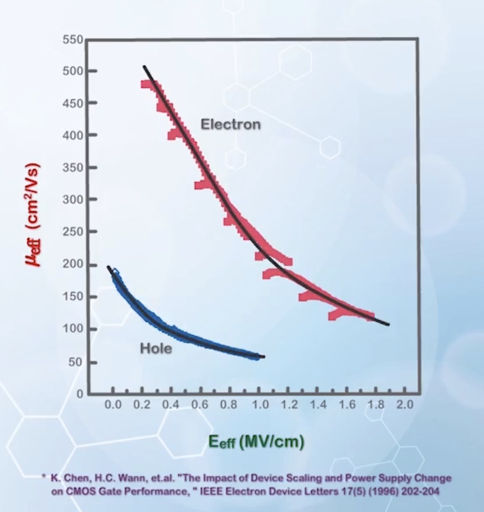
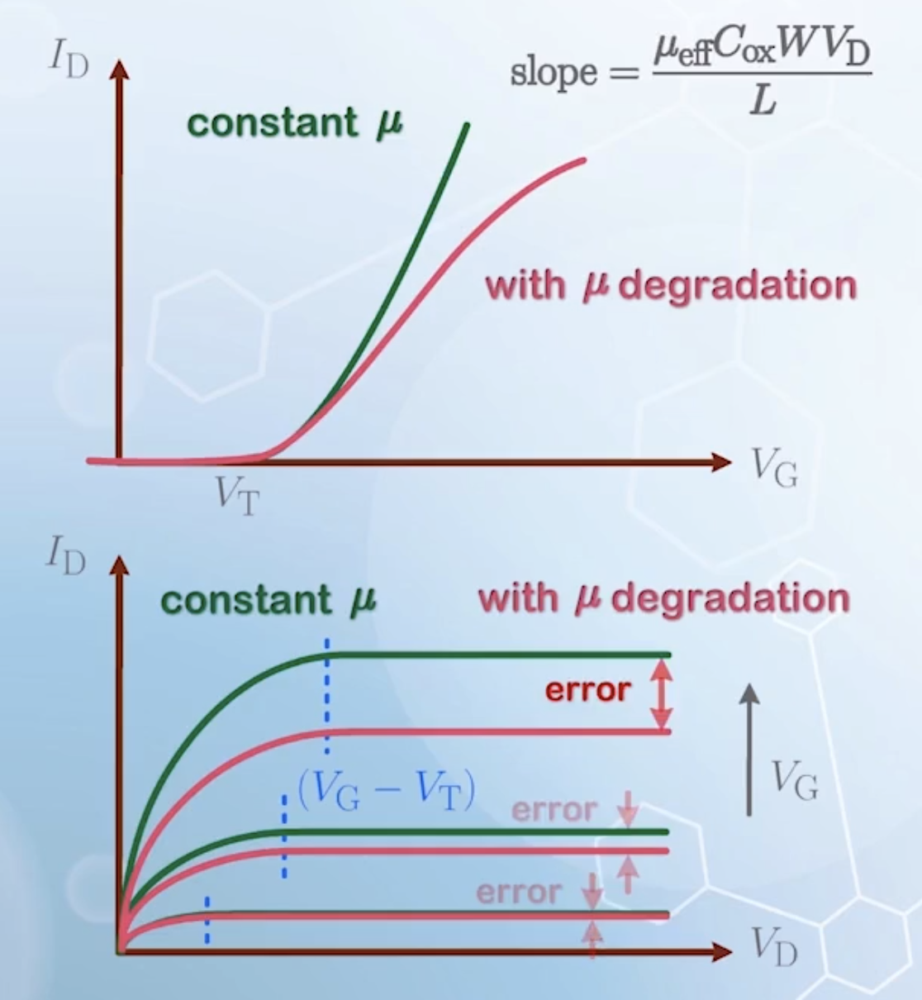
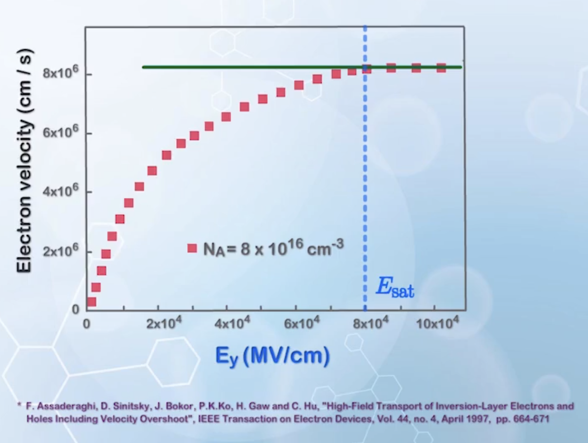

About mobility degradation in MOSFETs, and the carrier velocity saturation model.

---

## Effect of Gate Voltage on Carrier Motion

The previous given equations to calculate $I_\text{D}$ have assumed that the carrier mobility $\mu$ is a constant and bias independent. However, for carriers moving near the interface between the bulk silicon and the gate oxide.

Electrons moving in the channel are under the influence of two electric fields: the vertical field from the gate, attracting it to move vertically towards the gate oxide, and lateral field from the drain, attracting it to move laterally towards the drain.

The electron will bounce off the silicon and oxide interface a few times before reaching the drain. If the vertical field is strong, electrons will bounce more times off the surface. The collision between the electron and the interface is inelastic, causing energy loss and reducing the velocity of the electron. Therefore, it will take longer time for electrons to reach the drain.

Thus, the mobility $\mu$ is not a constant, and decreases with an increasing vertical field, or increasing $V_\text{G}$. This is the **mobility degradation** due to vertical electric field.

To correct for this effect, $\mu$ need to be modified as $\mu(V_\text{G})$.

## The Effective Vertical Electric Field

To quantify the variation of $\mu$ caused by $V_\text{G}$, we need to calculate the vertical electric field.

Electrons at different distance from the interface will experience different vertical electric field. To simplify the problem, the average electric field is used, assuming it to be the electric field experienced by all electrons.

- $x$: the distance from the interface into the bulk silicon, in the vertical direction
- $n(x)$: the electron concentration at location $x$
- $Ex(x)$: the vertical electric field component $E_x$ at location $x$
- The average vertical electric field is
  $$
  \begin{aligned}
  E_\text{eff} &= \frac{\int n(x) E_x(x) \mathrm{d}x}{\int n(x) \mathrm{d}x} \\
  &= \frac{Q_\text{inv}}{2 \varepsilon_\text{Si}} + \frac{Q_\text{B}}{\varepsilon_\text{Si}} \\
  \end{aligned}
  $$
  where $Q_\text{inv}$ is the inversion charge density, and $Q_\text{B}$ is the depletion charge density, relabeled from $Q_\text{D}$ in the MOSFET capacitance section to avoid confusion with the drain charge
  - An intuitive derivation of this equation:
  - The average electric field can be considered the electric field experienced by an average electron
  - **The average electron** is the one with half of the electrons in the channel above it, and half below it
  - The electric field starts at a positive charge at the game, and terminates at a negative charge at the substrate
  - Electric field terminating above the average electron will not be experienced by the average electron
  - Therefore, only the electric field terminating **below** the average electron will be experienced by the average electron
  - Once the charge $Q$ terminating the electric field below the average electron is known, the electric field can be calculated as $E = \frac{Q}{\varepsilon_\text{Si}}$
  - The charge $Q$ is comprised of two parts:
    - **Half of the inversion charge** $Q_\text{inv}$, since only half of the electrons are below the average electron
    - The **entire depletion charge** $Q_\text{B}$, since the inversion layer is very thin compared to the depletion region
  - Thus the equation is obtained
- We need to further express $E_\text{eff}$ as a function of $V_\text{G}$
  - The inversion charge density is
    $$
    Q_\text{inv} = C_\text{ox} (V_\text{G} - V_\text{T})
    $$
  - The depletion charge can be calculated with the following equation
    $$
    V_\text{T} = V_\text{FB} + 2\phi_\text{B} + \frac{Q_\text{B}}{C_\text{ox}}
    $$
    as the threshold voltage $V_\text{T}$ can be obtained from measurements rather than calculation
    $$
    \begin{aligned}
    Q_\text{B} &= C_\text{ox}(V_\text{T} - (V_\text{FB} + 2\phi_\text{B})) \\
    \text{approximating } \phi_\text{B} &= 0.35 \, \text{V} \\
    \text{and } V_\text{FB} &= -(0.55 \, \text{V} + \phi_\text{B}) \\
    \Rightarrow V_\text{FB} + 2\phi_\text{B} &= -0.2 \, \text{V} = - V_\text{a} \\
    Q_\text{B} &=C_{ox}(V_\text{T} + V_\text{a}) \\
    \end{aligned}
    $$
    $V_\text{a}$ is dependent of gate material and substrate doping
  - The effective vertical electric field can now be expressed as
    $$
    \begin{aligned}
    E_\text{eff} &= \frac{C_{ox} (V_\text{G} - V_\text{T})}{2 \varepsilon_\text{Si}} + \frac{C_{ox}(V_\text{T} + V_\text{a})}{\varepsilon_\text{Si}} \\
    &= \frac{\varepsilon_{ox} (V_\text{G} - V_\text{T})}{2 \varepsilon_\text{Si} t_{ox}} + \frac{\varepsilon_{ox} (V_\text{T} + V_\text{a})}{\varepsilon_\text{Si} t_{ox}} \\
    \text{approx. } \varepsilon_\text{Si} &= 11.9 \varepsilon_0 \approx 3 \varepsilon_{ox} = 3 \times 3.9 \varepsilon_0 \\
    \Rightarrow E_\text{eff} &= \frac{(V_\text{G} - V_\text{T})}{6 t_{ox}} + \frac{(V_\text{T} + V_\text{a})}{3 t_{ox}} \\
    \end{aligned}
    $$
    where $V_\text{a} = 0.2 \, \text{V}$
  - Once $V_\text{G}$, $V_\text{T}$ and $t_{ox}$ is known, the effective vertical electric field can be calculated

## Calculating Effective Mobility

We still need to obtain the relation between $\mu_\text{eff}$ and $E_\text{eff}$.

There are many theories predicting the effective mobility based on the microscopic effects, but none of them fit the experimental data well.

In practice, engineers rely on experimental calibration to obtain the effective mobility. Experimental data are collected are plotted:

Regardless of the gate oxide thickness and the substrate doping concentrations, they all fall onto a single curve.

As the results are very consistent, an empirical equation is more practical to use, rather than complex theoretical models.

The empirical equation is given as

$$
\mu_\text{eff} = \frac{\mu_0}{1 + (E_\text{eff}/E_0)^\nu}
$$

and a widely used set of parameters for this model is

|                                                     | Electrons | Holes |
| :-------------------------------------------------- | :-------: | :---: |
| $\mu_0 \quad (\text{cm}^2/(\text{V}\cdot\text{s}))$ |   $670$   | $160$ |
| $E_0 \quad (\text{MV}/\text{cm})$                   |  $0.67$   | $0.7$ |
| $\nu$                                               |   $1.6$   | $1.0$ |

Some other sets of parameters are also used, due to variations in the fabrication process and the physical structure.

This is the **universal mobility model**, as it can fit different sets of data very well.

The relationship between $\mu_\text{eff}$ and $V_\text{G} - V_\text{T}$ can be expressed as

$$
\mu_\text{eff} = \frac{\mu_0}{1 + \left(\frac{(V_\text{G} - V_\text{T})}{6 E_0 t_{ox}} + \frac{(V_\text{T} + V_\text{a})}{3 E_0 t_{ox}}\right)^\nu}
$$

Now we can plot $\mu_\text{eff}$ versus $V_\text{G}$ for different oxide thicknesses:

Note that the model may not be accurate for $V_\text{G}$ close to $V_\text{T}$, as we use $C_\text{ox} (V_\text{G} - V_\text{T})$ to approximate the inversion charge, giving 0 at $V_\text{G} = V_\text{T}$, which is not true, as discussed in [previous sections](../6/#current-at-the-threshold-voltage). But for most of the part, it is valid.

From the graph, we can see that when $t_{ox}$ is large, assuming $\mu$ to be a constant won't introduce significant error. But when $t_{ox}$ is small, using a constant $\mu$ will introduce an error of more than 50% at high or low $V_\text{G}$ values. This is because for a given power supply voltage $V_\text{dd}$, the range of $V_\text{G}$ is fixed, and according to the equation of $E_\text{eff}$

$$
E_\text{eff} = \frac{(V_\text{G} - V_\text{T})}{6 t_{ox}} + \frac{(V_\text{T} + V_\text{a})}{3 t_{ox}}
$$

thinner oxide thickness will lead to larger $E_\text{eff}$ variation for the same $V_\text{G}$ variation, causing larger $\mu_\text{eff}$ variation.

Therefore, the mobility degradation effect may not be important for older MOSFETs with thick oxide, but it is very important for modern MOSFETs with thin oxide.

The $I_\text{D}-V_\text{G}$ and $I_\text{D}-V_\text{D}$ characteristics considering mobility degradation is shown below:

Compared to constant $\mu$, mobile degradation will cause a downward bending in the $I_\text{D}-V_\text{G}$ curve, as opposed to the linear increase in the constant $\mu$ case. And in the $I_\text{D}-V_\text{D}$ curve, all current will be overestimated if mobility degradation is not considered, with larger error at higher $V_\text{G}$.

## Carrier Velocity Saturation Model

Up to now, we have linearly related the carrier velocity $v$ to the electric field $E$

$$
v = \mu_\text{eff} E
$$

$E$ is given by $\frac{V_\text{D}}{d}$, and can be very large when $d$ is small enough, without a theoretical limit. The maximum achievable electric field is determined practically by the strength of the medium, and a discharge will occur if the medium cannot withstand the electric field. However, the speed of carriers is bounded by the speed of light, according to the theory of relativity. Therefore, the linearity between $v$ and $E$ cannot hold forever, and the velocity will saturate with a high enough $E$. This is **carrier velocity saturation**.

From measurements, carrier velocity saturates at a certain electric field $E_\text{sat}$, and the saturated velocity for electrons and holes are approximately

$$
\begin{aligned}
\text{electrons} \quad & v_\text{sat} &\approx 8 \times 10^6 \, \text{cm/s} \\
\text{holes} \quad & v_\text{sat} &\approx 6 \times 10^6 \, \text{cm/s} \\
\end{aligned}
$$

To include this effect in drain current calculation, we need to derive a new expression for carrier velocity $v = f(E_\text{y})$ with respect to the lateral electric field $E_\text{y}$.

The easiest way is to use a straight line to connect the two known points: (0,0) and $(E_\text{sat}, v_\text{sat})$, giving

$$
v = \begin{cases}
\mu E_y & E_y < E_\text{sat} \\
v_\text{sat} & E_y \geq E_\text{sat} \\
\end{cases}
$$

To be more accurate, the slope of the curve, or mobility, should decrease when the lateral electric field increases, so a better expression would be

$$
v = \begin{cases}
\frac{\mu_\text{eff}}{1 + \frac{E_y}{E_\text{sat}}} E_y & E_y < E_\text{sat} \\
v_\text{sat} & E_y \geq E_\text{sat} \\
\end{cases}
$$

The slope will be decreasing with increasing $E_y$

$$
\begin{aligned}
\text{slope} &= \frac{\mathrm{d}v}{\mathrm{d}E_y} \\
&= \frac{\mu_\text{eff} E_\text{sat}^2}{(E_\text{sat} + E_y)^2} \\
\text{slope}|_{E_y = 0} &= \mu_\text{eff} \\
\text{slope}|_{E_y = E_\text{sat}} &= \frac{\mu_\text{eff}}{4} \\
\end{aligned}
$$

providing better fitting for the data.

We have the measured $v_\text{sat}$, so $E_\text{sat}$ can be calculated as

$$
\begin{aligned}
v_\text{sat} = \frac{\mu_\text{eff}}{2}E_\text{sat} \\
\Rightarrow E_\text{sat} = \frac{2 v_\text{sat}}{\mu_\text{eff}} \\
\end{aligned}
$$

where $\mu_\text{eff}$ is given by

$$
\mu_\text{eff} = \frac{\mu_0}{1 + (E_\text{eff}/E_0)^\nu}
$$

To derive the new drain current equation considering velocity saturation

$$
\begin{aligned}
I_\text{D} &= Q(y) v(y) \\
&= C_{ox} W (V_\text{G} - V_\text{T} - V(y)) \frac{\mu_\text{eff}}{1 + \frac{\mathrm{d}V/\mathrm{d}y}{E_\text{sat}}} \frac{\mathrm{d}V}{\mathrm{d}y} \\
I_\text{D} \mathrm{d}y &= \left( \mu_\text{eff} C_{ox} W (V_\text{G} - V_\text{T} - V(y) - \frac{I_\text{D}}{E_\text{sat}} \right) \mathrm{d}V \\
\int_{0}^{L} I_\text{D} \mathrm{d}y &= \int_{V_\text{S}}^{V_\text{D}} \left( \mu_\text{eff} C_{ox} W (V_\text{G} - V_\text{T} - V(y) - \frac{I_\text{D}}{E_\text{sat}} \right) \mathrm{d}V \\
I_\text{D} L &= \mu_\text{eff} C_{ox} W \left[ (V_\text{G} - V_\text{T}) V_\text{D} - \frac{1}{2} V_\text{D}^2 \right] - \frac{I_\text{D}}{E_\text{sat}} V_\text{D} \\
I_\text{Dlin} &= \frac{\mu_\text{eff} C_{ox} \frac{W}{L} \left[ (V_\text{G} - V_\text{T}) V_\text{D} - \frac{1}{2} V_\text{D}^2 \right]}{1 + \frac{V_\text{D}}{E_\text{sat} L}}
\end{aligned}
$$

Compared to the classical model, there is just an additional factor of $\frac{1}{1 + \frac{V_\text{D}}{E_\text{sat} L}}$.

As for the saturation region, we define $V_\text{Dsat}$ as the drain voltage that causes the lateral electric field near the drain to reach $E_\text{sat}$

$$
\begin{aligned}
I_\text{Dsat} &= W C_{ox} (V_\text{G} - V_\text{T} - V_\text{Dsat}) v_\text{sat} \\
\end{aligned}
$$

$V_\text{Dsat}$ is the point where $I_\text{Dlin} = I_\text{Dsat}$

$$
\begin{aligned}
\frac{\mu_\text{eff} C_{ox} \frac{W}{L} \left[ (V_\text{G} - V_\text{T}) V_\text{Dsat} - \frac{1}{2} V_\text{Dsat}^2 \right]}{1 + \frac{V_\text{Dsat}}{E_\text{sat} L}} &=W C_{ox} (V_\text{G} - V_\text{T} - V_\text{Dsat}) v_\text{sat} \\
\mu_\text{eff} E_\text{sat} \left[ (V_\text{G} - V_\text{T}) V_\text{Dsat} - \frac{1}{2} V_\text{Dsat}^2 \right] &= (L E_\text{sat} + V_\text{Dsat}) (V_\text{G} - V_\text{T} - V_\text{Dsat}) v_\text{sat} \\
\mu_\text{eff} E_\text{sat} \left[ (V_\text{G} - V_\text{T}) V_\text{Dsat} - \frac{1}{2} V_\text{Dsat}^2 \right] &= (L E_\text{sat} + V_\text{Dsat}) (V_\text{G} - V_\text{T} - V_\text{Dsat}) \frac{\mu_\text{eff} E_\text{sat}}{2} \\
2 (V_\text{G} - V_\text{T}) V_\text{Dsat} &= L E_\text{sat} (V_\text{G} - V_\text{T}) + V_\text{Dsat} (V_\text{G} - V_\text{T} - LE_\text{sat}) \\
\Rightarrow V_\text{Dsat} &= \frac{(V_\text{G} - V_\text{T}) L E_\text{sat}}{V_\text{G} - V_\text{T} + L E_\text{sat}} \\

\end{aligned}
$$

## Carrier Velocity Saturation v.s. Pinchoff

Comparing the two set of equations

- The pinchoff model
  $$
  \begin{aligned}
  I_\text{Dlin} &= \mu_\text{eff} C_{ox} \frac{W}{L} \left[ (V_\text{G} - V_\text{T}) V_\text{D} - \frac{V_\text{D}^2}{2} \right] \\
  I_\text{Dsat} &= \frac{1}{2} \mu_\text{eff} C_{ox} \frac{W}{L} (V_\text{G} - V_\text{T})^2 \\
  V_\text{Dsat} &= V_\text{G} - V_\text{T} \\
  \end{aligned}
  $$
- The carrier velocity saturation model
  $$
  \begin{aligned}
  I_\text{Dlin} &= \frac{\mu_\text{eff} C_{ox} \frac{W}{L} \left[ (V_\text{G} - V_\text{T}) V_\text{D} - \frac{V_\text{D}^2}{2} \right]}{1 + \frac{V_\text{D}}{E_\text{sat} L}} \\
  I_\text{Dsat} &= W C_{ox} (V_\text{G} - V_\text{T} - V_\text{Dsat}) v_\text{sat} \\
  V_\text{Dsat} &= \frac{(V_\text{G} - V_\text{T}) L E_\text{sat}}{V_\text{G} - V_\text{T} + L E_\text{sat}} \\
  \end{aligned}
  $$
- In the **linear region**, the two models are very similar, with just an additional factor in the carrier velocity saturation model that reduces the increase in $I_\text{D}$ in the linear region
- The new $V_\text{Dsat}$ is similar to have two resistors of $L E_\text{sat}$ and $V_\text{G} - V_\text{T}$ in parallel, which will be smaller than both of them
  - Carrier velocity saturation will kick in before pinchoff occurs, preventing pinchoff from happening
  - This is because the carrier velocity saturation limits the maximum carrier velocity, preventing the carrier density from reaching zero at the drain end, as $I_\text{D} = Q v$ is a constant
  - This removes the inconsistency in the pinchoff model that requires infinite carrier velocity

The problem of the pinchoff model is that it does not provide a clear physical image for the ending of the gradual channel region, and we arbitrarily picked $V_\text{G} - V_\text{T}$ as the pinchoff point.

By providing a more physical definition for the end of the gradual channel region, the carrier velocity saturation model avoids reaching the pinchoff condition, and thus solved the problem.

Also, the saturation current in the carrier velocity saturation model is also physically derived, instead of extending the flat portion of the linear region equation of the drain current, and $I_\text{Dsat}$ predicted by the carrier velocity saturation model is always smaller than that predicted by the pinchoff model.

The same substrate charge factor $\alpha$ that considers the effect of $V_\text{T}$ along the channel, can also be added to the equations from the velocity saturation model, giving

$$
\begin{aligned}
  I_\text{Dlin} &= \frac{\mu_\text{eff} C_{ox} \frac{W}{L} \left[ (V_\text{G} - V_\text{T}) V_\text{D} - \frac{{\color{orange} \alpha} V_\text{D}^2}{2} \right]}{1 + \frac{V_\text{D}}{E_\text{sat} L}} \\
  I_\text{Dsat} &= W C_{ox} (V_\text{G} - V_\text{T} - {\color{orange} \alpha} V_\text{Dsat}) v_\text{sat} \\
  V_\text{Dsat} &= \frac{(V_\text{G} - V_\text{T}) L E_\text{sat}}{V_\text{G} - V_\text{T} + {\color{orange} \alpha} L E_\text{sat}} \\
\end{aligned}
$$
