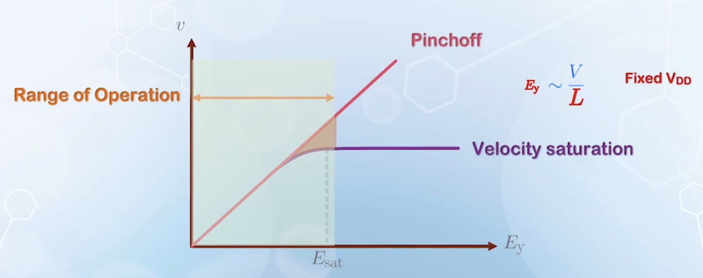
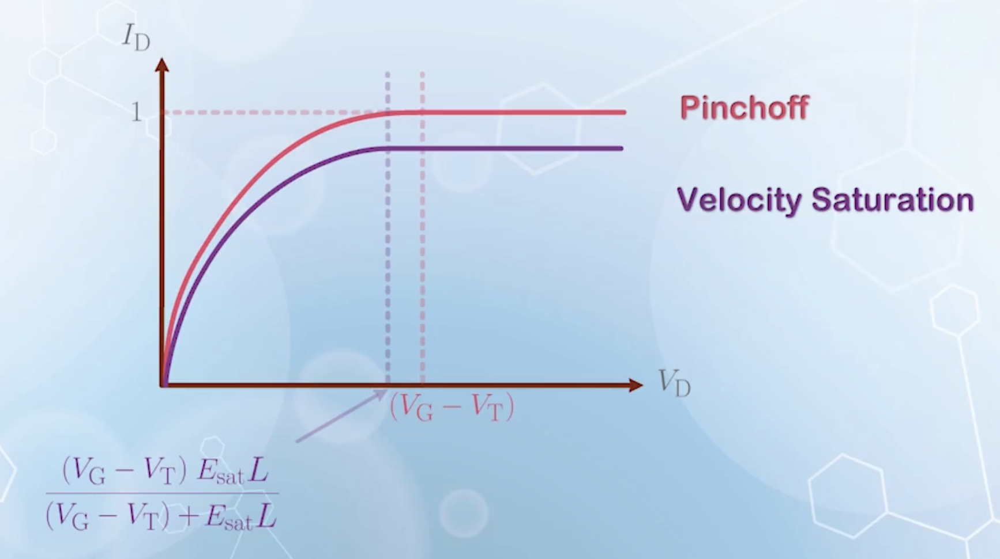
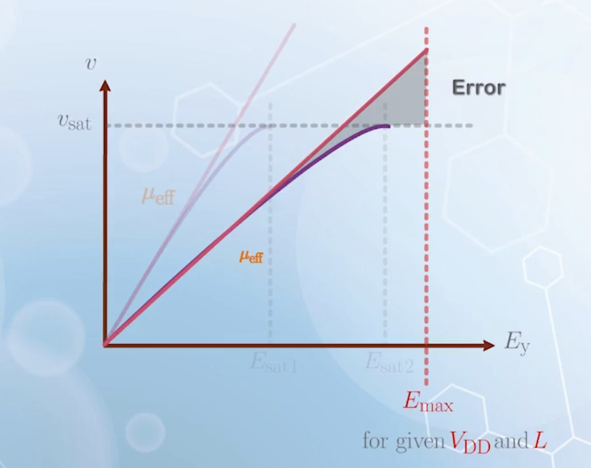
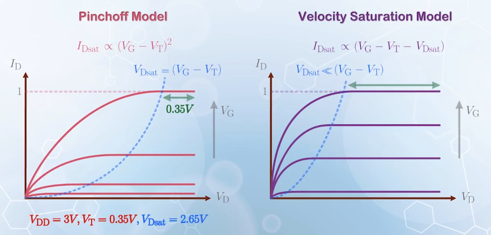
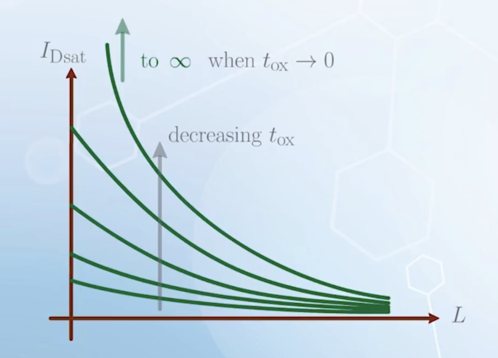

About the comparisons between the pinchoff model and the carrier velocity saturation model for MOSFET I-V characteristics, with varying channel length, gate voltage, and gate oxide thickness.

---

## Carrier Velocity Saturation in Long Channel MOSFET

The carrier velocity saturation model is more accurate in terms of physics, but the pinchoff model is equivalent to the velocity saturation model under special circumstances, and the velocity saturation model can also be converted to the pinchoff model when the channel is very long.

- In the linear region, consider the carrier velocity saturation model:
  $$
  I_\text{Dlin} = \frac{\mu_\text{eff} C_{ox} \frac{W}{L} \left[ (V_\text{G} - V_\text{T}) V_\text{D} - \frac{V_\text{D}^2}{2} \right]}{1 + \frac{V_\text{D}}{E_\text{sat} L}}
  $$
  When $L$ is very large, the $\frac{V_\text{D}}{E_\text{sat}L}$ term can be ignored, and the equation reduces to the pinchoff model in the linear region
- Same thing applies to $V_\text{Dsat}$. With carrier velocity saturation model:
  $$
  V_\text{Dsat} = \frac{(V_\text{G} - V_\text{T}) E_\text{sat} L}{(V_\text{G} - V_\text{T}) + E_\text{sat} L}
  $$
  This is the parallel combination of $(V_\text{G} - V_\text{T})$ and $E_\text{sat} L$. When $L$ is very large, $E_\text{sat} L$ becomes very large, and $V_\text{Dsat}$ approaches $(V_\text{G} - V_\text{T})$, which is the same as the pinchoff model.
- In the saturation region, consider the carrier velocity saturation model:
  $$
  \begin{aligned}
  I_\text{Dsat} &= W C_{ox} (V_\text{G} - V_\text{T} - V_\text{Dsat}) v_\text{sat} \\
  &= W C_{ox} v_\text{sat} (V_\text{G} - V_\text{T} - \frac{(V_\text{G} - V_\text{T}) E_\text{sat} L}{(V_\text{G} - V_\text{T}) + E_\text{sat} L}) \\
  &= W C_{ox} v_\text{sat} \frac{(V_\text{G} - V_\text{T})^2}{(V_\text{G} - V_\text{T}) + E_\text{sat} L}
  \end{aligned}
  $$
  When $L$ is very large, $E_\text{sat} L$ becomes very large, and the equation reduces to
  $$
  I_\text{Dsat} = W C_{ox} v_\text{sat} \frac{(V_\text{G} - V_\text{T})^2}{E_\text{sat} L}
  $$
  also, we have
  $$
  v_\text{sat} = \frac{\mu_\text{eff} E_\text{sat}}{2}
  $$
  therefore,
  $$
  I_\text{Dsat} = \frac{\mu_\text{eff} C_{ox} \frac{W}{L} (V_\text{G} - V_\text{T})^2}{2}
  $$
  This is the same of the pinchoff model in the saturation region.

Why this happens? Consider the $v-E_y$ characteristics of the two models. In the region where $v$ is almost proportional to $E_y$, the two models are very similar. Errors only occur when $E_y$ is large enough to make $v$ approach $v_\text{sat}$.

As $E_y$ is given by $\frac{V}{L}$, the range of operation of a MOSFET is limited to the region with a smaller $E_y$ for a longer $L$. Then the errors caused by the difference between the two models are limited.

Now consider the $I_\text{D} - V_\text{D}$ characteristics. When $E_\text{sat} L$ is small, $V_\text{Dsat}$ is determined by the $E_\text{Dsat}$ term in the parallel model, which will be very small. When $L$ increases, $V_\text{Dsat}$ increases, and the current can further increase before entering saturation. When $L \to \infty$, the two curves are the same.

## Characteristics With Size Reduction

To determine whether $L$ can be considered long enough to use the pinchoff model, we need to consider $L$ as well as the range of operation voltages.

The $L$ term always appears with $E_\text{sat}$ as $E_\text{sat} L$. Thus the behavior of the equations does not only depend on $L$, but the combination of $L$ and $E_\text{sat}$, or, its relative magnitude to $V_\text{G} - V_\text{T}$.

When $E_\text{sat} L$ is small enough, $V_\text{Dsat}$ is basically dominated by the $E_\text{sat} L$ term, and $I_\text{Dsat}$ term is now

$$
\begin{aligned}
I_\text{Dsat} &= W C_{ox} v_\text{sat} (V_\text{G} - V_\text{T} - E_\text{sat} L) \\
&\approx W C_{ox} v_\text{sat} (V_\text{G} - V_\text{T})
\end{aligned}
$$

if we further ignore the $E_\text{sat} L$ term.

These are the characteristics of the MOSFETs are becoming, with the reduction of dimensions in the state of art technologies.

But there will always a region where $V_\text{G} - V_\text{T} \ll E_\text{sat} L$, and pinch off model is applicable. This will happen if $V_\text{G}$ is just above $V_\text{T}$, making $V_\text{G} - V_\text{T}$ very small, by limiting the power supply voltage.

Also, because $E_\text{sat}$ always appear with $L$, making $E_\text{sat}$ large will allow the use of pinchoff model even for small $L$.

$$
E_\text{sat} = \frac{2 v_\text{sat}}{\mu_\text{eff}}
$$

$E_\text{sat}$ can be made large by making $\mu_\text{eff}$ small. For a same voltage, this can be achieved by using a thin gate oxide to increase vertical electric field. Thus the pinchoff model can also be used with a relatively short channel if the gate oxide is thin enough.

## MOSFET Current With Gate Voltage

The pinchoff model predicts that in the saturation region, the MOSFET current varies with the square of $(V_\text{G} - V_\text{T})$.

$$
I_\text{Dsat} = \frac{\mu_\text{eff} C_{ox} \frac{W}{L} (V_\text{G} - V_\text{T})^2}{2} \propto (V_\text{G} - V_\text{T})^2
$$

Increasing $V_\text{G}$ with an equal step will increase the spacing between the $I_\text{Dsat}$ curves.

But with carrier velocity saturation model

$$
\begin{aligned}
I_\text{Dsat} &= W C_{ox} v_\text{sat} (V_\text{G} - V_\text{T} - V_\text{Dsat}) \\
&= W C_{ox} v_\text{sat} \frac{(V_\text{G} - V_\text{T})^2}{(V_\text{G} - V_\text{T}) + E_\text{sat} L} \\
&\propto (V_\text{G} - V_\text{T} - V_\text{Dsat})
\end{aligned}
$$

This will give a more uniform spacing between the $I_\text{Dsat}$ curves when $V_\text{G}$ is increased with an equal step.

As pinchoff model is an approximation of the carrier velocity saturation model with long channel length, it means $I_\text{Dsat}$ for long channel MOSFETs has a quadratic dependence on $V_\text{G}$, but this dependence becomes more linear as the channel length is reduced, which is the case we observe in most state of the art devices.

Also, consider the span of saturation region, which is determined by $V_\text{Dsat}$.

For example, with a $3 \, \text{V}$ power supply, and a $0.35 \, \text{V}$ threshold voltage, $V_\text{Dsat}$ predicted by the pinchoff model is $2.65 \, \text{V}$, giving a saturation region of $0.35 \, \text{V}$. Practically, we see a much larger saturation region, as the carrier velocity saturation model predicts a much smaller $V_\text{Dsat}$.

## MOSFET Current Dependence on Channel Length

With the pinchoff model, $I_\text{Dsat} \propto \frac{1}{L}$. When $L \to 0$, $I_\text{Dsat} \to \infty$. But with the carrier velocity saturation model, $I_\text{Dsat}$ has no explicit dependence on $L$, which only implicitly affects $I_\text{Dsat}$ through $V_\text{Dsat}$.

When $L = 0$,

$$
V_\text{Dsat} = \frac{(V_\text{G} - V_\text{T}) E_\text{sat} L}{(V_\text{G} - V_\text{T}) + E_\text{sat} L} = 0
$$

$$
I_\text{Dsat} = W C_{ox} v_\text{sat} (V_\text{G} - V_\text{T} - V_\text{Dsat}) = W C_{ox} v_\text{sat} (V_\text{G} - V_\text{T})
$$

Which one is more correct?

The $\infty$ current predicted by the pinchoff model comes from the calculation of $E$ given by $\frac{V}{L}$. Also, the pinchoff model assumes that the carrier velocity is proportional to $E$. So when $L \to 0$, $E \to \infty$, and thus $v \to \infty$, leading to an infinite current. This is not true, as discussed with the carrier velocity saturation model, which is more physically consistent.

The increase in the saturation current by reducing channel length is smaller according to the carrier velocity saturation model, and the maximum achievable current is limited by $W C_{ox} v_\text{sat} (V_\text{G} - V_\text{T})$ when $L \to 0$.

Also, base on the pinchoff model, scaling $W$ and $L$ together will not affect $I_\text{Dsat}$, as the $\frac{W}{L}$ term remains constant. This assumption may be valid for long channel MOSFETs, but not in general. When $W$ is halved, $I_\text{Dsat}$ will be halved, but when $L$ is halved, $I_\text{Dsat}$ cannot be doubled, thus the overall current will be reduced.

## MOSFET Current Dependence on Gate Oxide Thickness

Reducing the gate oxide thickness $t_{ox}$ increases $C_{ox}$, thus increases $I_\text{Dsat}$ in both models.

But in the carrier velocity saturation model, reducing $t_{ox}$ also decreases $\mu_\text{eff}$ due to mobility degradation, thus increases $E_\text{sat}$, which increases $V_\text{Dsat}$, and further decreases $I_\text{Dsat}$. This counteracts the increase in $I_\text{Dsat}$, making the increase smaller than that predicted by the pinchoff model.

This effect will be reduced when $L$ is decreased, and when $L \to 0$, $I_\text{Dsat} \propto \frac{1}{t_{ox}}$

When $L$ is large, decreasing $t_{ox}$ does not significantly increase $I_\text{Dsat}$ due to the counteracting effect of increasing $E_\text{sat}$. But when $L$ is small, decreasing $t_{ox}$ significantly increases $I_\text{Dsat}$.

When $t_{ox}$ is very large, reducing $L$ has very small head room to increase the current. But reducing $t_{ox}$ creates more head room for $I_\text{Dsat}$ to increase with reducing $L$.

Theoretically, the current can be infinity if $t_{ox} \to 0$, or $C_{ox} \to \infty$.

**$t_{ox}$ and $L$ should be reduced together to achieve the maximum $I_\text{Dsat}$ with the size reduction.**

## The Physical Effect of Channel Length

The current is given by

$$
I = Q(y) v(y)
$$

In the pinchoff model, reducing $L$ mainly increases $\mu \frac{V_\text{D}}{L}$, which can be considered as increasing $v(y)$.

In the carrier velocity saturation model, the carrier velocity $v(y)$ is limited by $v_\text{sat}$, which is independent of $L$. $L$ only appears implicitly in $V_\text{Dsat}$, which belongs to the $Q(y)$ part.

The saturation current is mainly determined by the charge density near the drain. When $L$ is reduced, required $V_\text{Dsat}$ to increase the channel electric field to reach $E_\text{sat}$ is also reduced. Therefore, more charges can move with the velocity of $v_\text{sat}$, increasing the current. In extreme case with $L = 0$, a very small $V_\text{Dsat} \to 0$ will cause the electric field to reach $E_\text{sat}$, and all the channel charges coming out of the source can move with the velocity of $v_\text{sat}$. This gives the maximum current achievable with the reduction of channel length

$$
I_\text{Dsat} = W C_{ox} v_\text{sat} (V_\text{G} - V_\text{T})
$$

## I-V Calculation Example

Given the following parameters:

$$
\begin{aligned}
t_{ox} &= 7 \, \text{nm} \\
W &= 1 \, \mu\text{m} \\
L &= 0.35 \, \mu\text{m} \\
V_\text{G} &= 3 \, \text{V} \\
V_\text{D} &= 1.5 \, \text{V} \\
V_\text{T} &= 0.4 \, \text{V} \\
v_\text{sat} &= 8 \times 10^6 \, \text{cm}/\text{s} \\
\end{aligned}
$$

Calculate $I_\text{D}$.

The universal mobility model gives

$$
\mu_\text{eff} = \frac{\mu_0}{1 + (E_\text{eff}/E_0)^\nu}
$$

|                                                     | Electrons | Holes |
| :-------------------------------------------------- | :-------: | :---: |
| $\mu_0 \quad (\text{cm}^2/(\text{V}\cdot\text{s}))$ |   $670$   | $160$ |
| $E_0 \quad (\text{MV}/\text{cm})$                   |  $0.67$   | $0.7$ |
| $\nu$                                               |   $1.6$   | $1.0$ |

and $E_\text{eff}$ is given by

$$
E_\text{eff} = \frac{(V_\text{G} - V_\text{T})}{6 t_{ox}} + \frac{(V_\text{T} + V_\text{a})}{3 t_{ox}}
$$

We now have

$$
\mu_\text{eff} = 256 \, \text{cm}^2/(\text{V}\cdot\text{s})
$$

Then, $E_\text{sat}$ is given by

$$
\begin{aligned}
E_\text{sat} &= \frac{2 v_\text{sat}}{\mu_\text{eff}} \\
&= 0.625 \, \text{MV}/\text{cm}
\end{aligned}
$$

Now $V_\text{Dsat}$ is given by

$$
\begin{aligned}
V_\text{Dsat} &= \frac{(V_\text{G} - V_\text{T}) E_\text{sat} L}{(V_\text{G} - V_\text{T}) + E_\text{sat} L} \\
&= 1.19 \, \text{V} \\
&< 1.5 \, \text{V} = V_\text{D} \\
\end{aligned}
$$

The device is in saturation region.

Finally, $I_\text{Dsat}$ is given by

$$
\begin{aligned}
I_\text{Dsat} &= W C_{ox} v_\text{sat} (V_\text{G} - V_\text{T} - V_\text{Dsat}) \\
&= 557 \, \mu\text{A} \\
\end{aligned}
$$

With the pinchoff model, the device would still be in linear region, and the calculated current would be $1 \, \text{mA}$.
