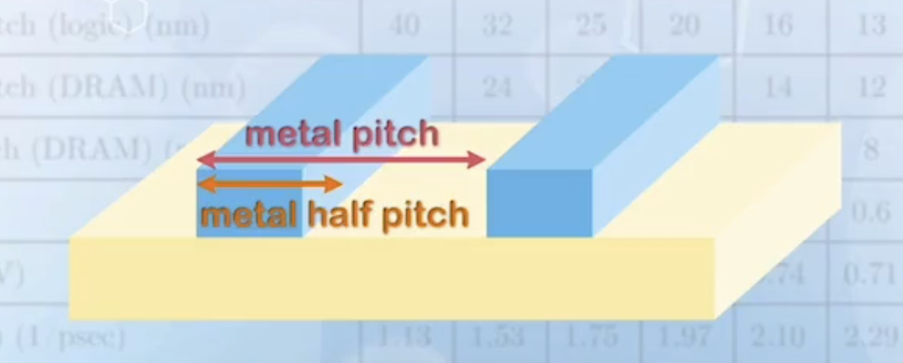
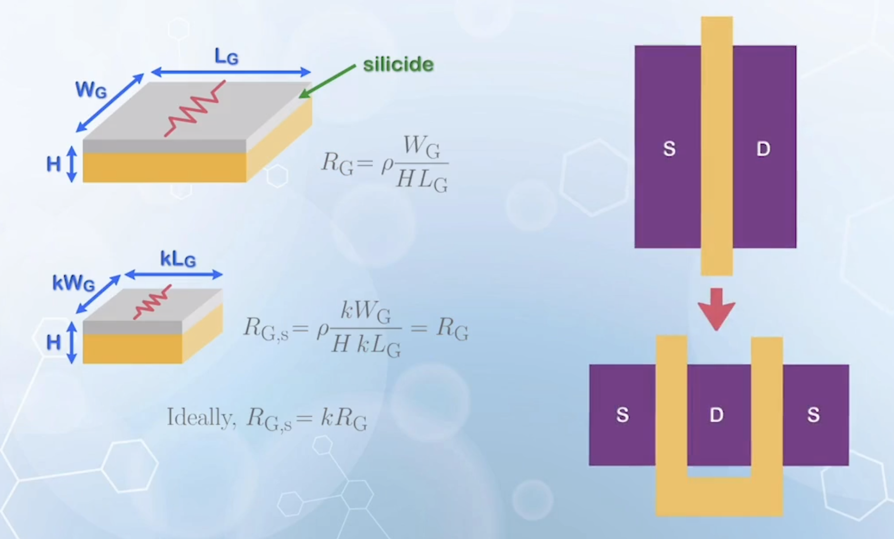
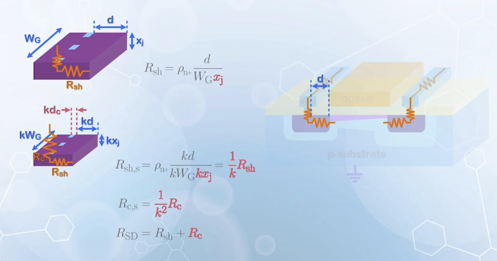
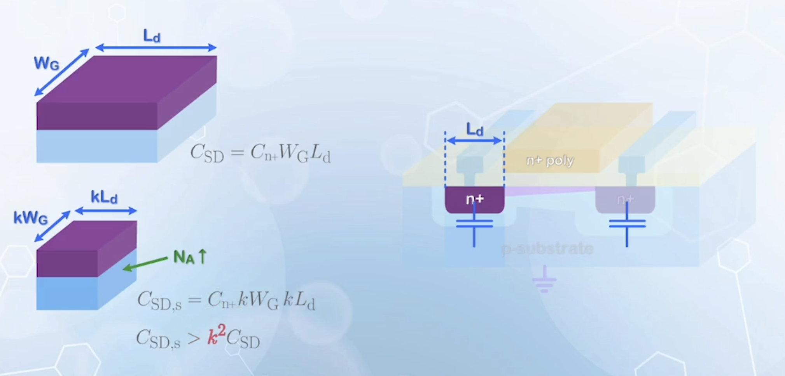
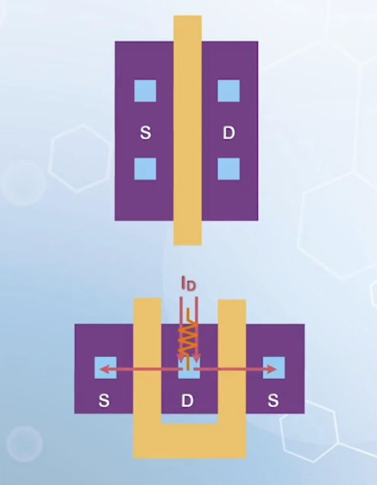

About the scaling of MOSFETs, including Moore's law, scaling rules, ITRS, economic considerations, scaling limits, and effects of scaling on parasitics.

---

## The Moore's Law

> There is plenty of room at the bottom.
> -- Richard Feynman, 1959

By making transistors smaller, they can be placed closer, electrons carrying information needs to travel shorter distances, which makes the circuit faster. The power required to move these electrons is also reduced, due to smaller loading, leading to the reduction of power consumption. Furthermore, the cost can be reduced, as the entire system can be implemented in a smaller area of an IC. The process of transistor size reductions is often called **technology scaling**. It is a rare situation that brings about benefits without any drawbacks.

Gordon Moore, the co-founder of Intel, predicted in 1965 that the number of transistors in an integrated circuit would double for every year. This phenomenon is often referred to as **Moore's Law**. In 1975, he revised his prediction to a doubling every two years. The exact number does not matter, it just predicts that the number of components increases exponentially with time.

So far, the increase in the number of transistors over the past years follows the Moore's law quite closely, but it may not due to the correctness of Gordon Moore's prediction. As people believe that if they cannot keep up 😨, someone else will 🤣👉. Therefore, engineers are working hard to make it happen. The correctness of Moore's law can be considered as a self-fulfilling prophecy.

## The Scaling Rule

What parameters can be scaled in the scaling process? Reducing the dimensions in an arbitrary way may not maintain the transistor characteristics, and the performance may not be optimized. A set of scaling rules is needed to guide the scaling process.

In 1974, Robert Dennard from IBM proposed a set of scaling rules.

As carrier motion is mainly determined by the electric field, Robert Dennard proposed that the scaling process should keep the electric field unchanged. To achieve this, geometric dimensions, voltages, and sometimes doping concentrations need to be scaled together.

Suppose the geometric dimensions are scaled down by a factor of $k < 1$. To achieve the same electric field, the main parameters that need to be scaled are:

- Gate length $L_\text{G} \to k L_\text{G}$
- Gate width $W_\text{G} \to k W_\text{G}$
- Gate oxide thickness $t_\text{ox} \to k t_\text{ox}$
- Power supply voltage $V_\text{DD} \to k V_\text{DD}$

Then the performance after the scaling is (velocity saturation model is used, as scaling concerns small devices):

| Parameter                                           | Scaling Result                                                                                            |
| --------------------------------------------------- | --------------------------------------------------------------------------------------------------------- |
| $L_\text{G}$, $W_\text{G}$, $t_{ox}$, $V_\text{DD}$ | $k$                                                                                                       |
| $I_\text{Dsat}$                                     | $W_\text{G} C_{ox} (V_\text{G} - V_\text{T}) v_\text{sat} \to kk^{-1}k = k$                                 |
| $I_\text{Dsat} / W_\text{G}$                        | 1                                                                                                         |
| $C_\text{G}$                                        | $\varepsilon_{ox} W_\text{G} L_\text{G} / t_{ox} \to kk/k = k$                                            |
| Switch delay $\tau$                                 | $C_\text{G} V_\text{DD} / I_\text{D} \to kk/k = k$                                                        |
| Clock $f$                                           | $1/\tau \to 1/k$                                                                                          |
| Chip area                                           | not directly resulting from scaling measured by another factor $\alpha > 1$ for most cases in the past |
| # Transistor $N$ (number per chip)                  | $\alpha / k^2$                                                                                            |
| Power / chip                                        | $N C_\text{G} V_\text{DD}^2 f \to \alpha / k^2 k k^2 \cdot 1/k = \alpha k$                                |

Some notes:

- $I_\text{Dsat}$ is **decreased** when scaling down
  - The performance improvements mainly comes from the reduction in loading, rather than higher current drive
- The power dissipation per chip is composed of leakage power and dynamic power
  - $N C_\text{G} V_\text{DD}^2 f$ gives the dynamic power to charge and discharge the load capacitance
  - In the early days, the leakage power is not very serious, and only dynamic power is considered

## The International Technology Roadmap for Semiconductors (ITRS)

Moore law has become the consensus of the semiconductor industry. Some people even predict that beating Moore law may result in new products that the market cannot absorb, and hence causing engineers to lose their jobs, and falling behind the Moore law will lead to nothing to buy and shrink the distribution chain. No matter what, sustaining Moore law is an important target for many companies.

The International Technology Roadmap for Semiconductors (ITRS) is introduced to guide the semiconductor technology development. But it did not provide the solution.

The smallest dimension of the MOSFET is usually the gate length. In some applications with regular patterns, such as memory arrays, the spacing between the MOSFET may be better represented by the metal line spacing, and the technology node may also refer to the metal half pitch (half the distance
between two metal lines with minimum line width, separated by the minimum distance).

However, the actual implementation of the technology varies among different companies, and the technology nodes
have no direct relationship with the gate length or metal pitch. In fact, they may not correspond to any physical dimension of the MOSFET. The technology node only represents the technology generation over time, like an agreed version number among different companies.

The dimension of the gate length was smaller than the technology node before the 22 nanometer technology node. Starting around the 16 nanometer technology node, the gate length has become larger than the number given by the technology node. The dimension of each technology node is reduced to about 70% of the previous technology.

The EOT stands for equivalent oxide thickness. As multiple materials are used to form the gate dielectric, it specifies the equivalent oxide thickness when the gate dielectric is composed of pure Silicon dioxide to achieve the same gate capacitance. **For the same dielectric material thickness, a material with a higher dielectric constant will give a smaller EOT**. The EOT reduction is slowed down due to the difficulties in finding a thin material that can still behave as an insulator

The power supply voltage $V_\text{DD}$ reduction also more or less stops due to the noise margins and other issues that are difficult to overcome at low supply voltages.

With more transistors packed on the chip of the same area, more connections are needed. In order to allow more metal lines to be laid on the chip and not increasing the area, the number of interconnect layers also increases with the technology scaling.

The ITRS also specifies some performance related parameters, such as the current density.

By predicting the performance of the MOSFETs, IC designers and application engineers will be able to start planning for the system before the technology of a specific node is available.

With the success of the ITRS to guide the technology over the past 20 years, the ITRS issued a final roadmap in 2016 because following Moore law has become very difficult. Different kinds of roadmaps, such as the International Roadmap for Devices and Systems (IRDS) are proposed to succeed the ITRS.

## The Economy of Scaling

With the scaling process, the computational cost to customers is reduced, but the cost to follow the Moore's law is increasing, which includes manufacturing, testing, researching and development costs. The exponential increase in capital costs has offset the benefits of the scaling process, such that only very few companies desires to continue the scaling process.

To calculate the cost:

- The number of dice per wafer is given by
  $$
  N_\text{die} = \frac{\pi (\frac{D}{2})^2}{A_\text{die}} - \frac{\pi D}{\sqrt{2 A_\text{die}}}
  $$
  where $D$ is the diameter of the wafer, and $A_\text{die}$ is the area of each die.
- The die cost is given by
  $$
  C_\text{die} = \frac{C_\text{wafer}}{N_\text{die} \times Y_\text{die}}
  $$
  where $C_\text{wafer}$ is the cost per wafer, and $Y_\text{die}$ is the yield.
  - The wafer cost increase due to the use of more advanced technology is relatively small, and can be well compensated with the increase in the number of of available dice
- The final chip cost including test and packaging is given by
  $$
  C_\text{var} = \frac{C_\text{die} + C_\text{test} + C_\text{pkg}}{Y_\text{test}}
  $$
  as some chips may be lost due to testing and packaging.
  - This is the **variable cost**, as the total production cost changes with the number of chips produced
- There is also a **fixed cost** for producing the chips, which is a one-time investment, independent of the number of chips produced.
  - Mostly the cost of the mask to transfer the patterns from design to wafer
  - To include this to the individual chip cost, it has to be divided by the number of chips produced $N$

The number of chips per wafer is a very important factor for cost reduction. The wafer size is getting bigger over the years to accommodate a larger number of chips per wafer. The wafer size has increased from 1 inch ($25 \, \text{mm}$) to 12 inches ($300 \, \text{mm}$). The $450 \, \text{mm}$ wafer has been proposed, but there is still quite resistance due to the potentially insufficient return.

## The Scaling Limit

The scaling process is still being pursued, but it cannot continue forever. Ultimately, it will be limited to atom size. But before reaching that limit, more macroscopic problems may slow down the process.

Consider the $5 \, \text{nm}$ technology node. This may not represent the actual dimension, but we can use it just as a reference.

As the lattice constant of silicon is around $0.5 \, \text{nm}$, there are only 10 silicon atoms in the lateral dimension of a $5 \, \text{nm}$ MOSFET. Furthermore, the equivalent thickness of the gate dielectric material is around $1 \, \text{nm}$, containing only 2–3 atom layers of silicon dioxide atoms. This is why further scaling using silicon dioxide as the gate dielectric seems to be almost impossible.

Even we can make such devices, many physical limitations will be manifest at such small dimensions.

In a volume of $5 \, \text{nm} \times 5 \, \text{nm} \times 5 \, \text{nm}$ cube, there are only a few thousand of silicon atoms. Even doping the silicon to $1 \times 10^{19} \, \text{cm}^{-3}$, the number of dopant atoms in the volume is still a single digit. The assumption of uniform dopant distribution may no longer hold. If one or two dopant atoms are missing, the percentage error is huge, causing significant device to device variations, and making the performance unpredictable.

Besides the dopant variation, any small error such as edge roughness or other geometrical imperfections will be significantly amplified, causing significant variations.

In terms of processing, **photolithography** is the most critical step in defining the small geometries. It basically uses a beam of light to transfer a computer-drawn pattern to a photosensitive material on the wafer through a mask.

In this process, the feature size defined cannot be smaller than the half of the wavelength of the light used. To define very small features, extreme ultraviolet light is used, which has many other problems itself, such as loss through the lens, low penetration depth, and large diffraction angle that causes a less precise geometry.

To pattern small dimensions without using light with ultra short wavelengths, engineers are using a technique called **immersion lithography**, which fills the space between the lens and the wafer with a liquid medium, so that the wavelength of the light is compressed. But such systems are very expensive.

Further development of lithography systems for dimensions beyond $5 \, \text{nm}$ will cause significant capital investment, and the return is becoming uncertain.

## Effects of Scaling on Parasitics

A MOSFET comes with some parasitic components.

- The gate resistance
  - Assume the height of the gate $H$ is more or less constant during scaling
    - In real process, it is sort of achieved by the use of silicide, a semi-metallic material, to increase the conductivity
  - With $W_\text{G}$ and $L_\text{G}$ scaled down by $k$, the gate resistance $R_\text{G}$ is given by
    $$
    \begin{aligned}
      R_\text{G} &= \rho \frac{W_\text{G}}{H L_\text{G}} \\
      R_\text{G,s} &= \rho \frac{k W_\text{G}}{H k L_\text{G}} = R_\text{G}
    \end{aligned}
    $$
    It remains more or less a constant during scaling
  - Ideally, it should scale by $k$ to achieve better reduction in loading
  - To reduce the resistance, a parallel layout is used for wide MOSFETs
    
- The gate capacitance
  - It is given by
    $$
    C_\text{G} = \frac{\varepsilon_{ox} W_\text{G} L_\text{G}}{t_{ox}}
    $$
  - After scaling, it becomes $k C_\text{G}$
  - The RC delay at the input is scaled by a factor of $k$
    $$
    R_\text{G,s} C_\text{G,s} = k R_\text{G} C_\text{G}
    $$
  - Using parallel layout can decrease the gate resistance, but may increase the gate capacitance, if not carefully handled
- The source and drain resistance
  - The sheet resistance component due to N+ doping is given by
    $$
      R_\text{sh} = \rho_\text{n+} \frac{d}{W_\text{G} x_\text{j}}
    $$
  - The metal resistance is considered to be very small and can be ignored
  - Assuming the junction depth $x_\text{j}$ remains unchanged after scaling, the sheet resistance remains unchanged
  - But when a shallower junction is used, the series resistance increases
  - The contact size is also reduced, leading to higher contact resistance $R_\text{c}$
    $$
    R_\text{SD} = R_\text{sh} + R_\text{c}
    $$
    It has become the major component in the source and drain series resistances, which will keep increasing with the scaling process
  - The increase in the source and drain resistance has the most adverse effect in the scaling process, as it significantly offsets the advantage of lower resistance in the MOSFET due to channel length reduction

  

- The source and drain capacitance
  - It is given by
    $$
      C_\text{SD} = C_\text{n+} W_\text{G} L_\text{d}
    $$
  - When the lateral dimension of a MOSFET is reduced by $k$, the capacitance becomes
    $$
      C_\text{SD,s} = C_\text{n+} k W_\text{G} k L_\text{d} = k^2 C_\text{SD}
    $$
  - But the substrate doping usually increases with scaling
    - Recall that the [reverse PN junction capacitance](../../part-1/8/#reverse-bias-junction-capacitance) increases with higher doping on the lightly doped side
    - The increase in the substrate doping will cause an increase in the junction capacitance, offsetting some of the reduction of the source and drain parasitic capacitance due to scaling

    

  - The parasitic source and drain capacitance can be reduced by using the parallel layout, as the drain region can be shielded by two transistors
    - Also increases the effective resistance through the source or drain, as the two MOSFETs share the same contact vias
    - The effect of drain contact will be amplified, as the amount of current flowing through it will be doubled

    
